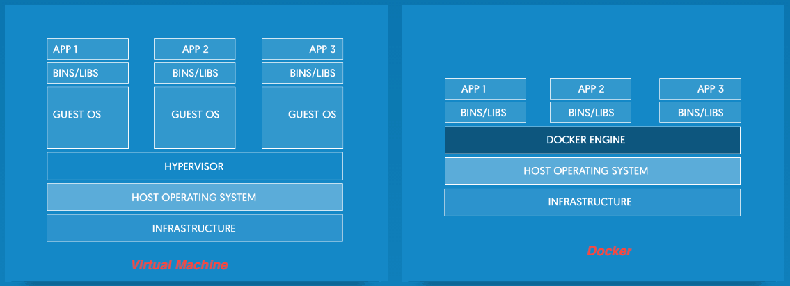
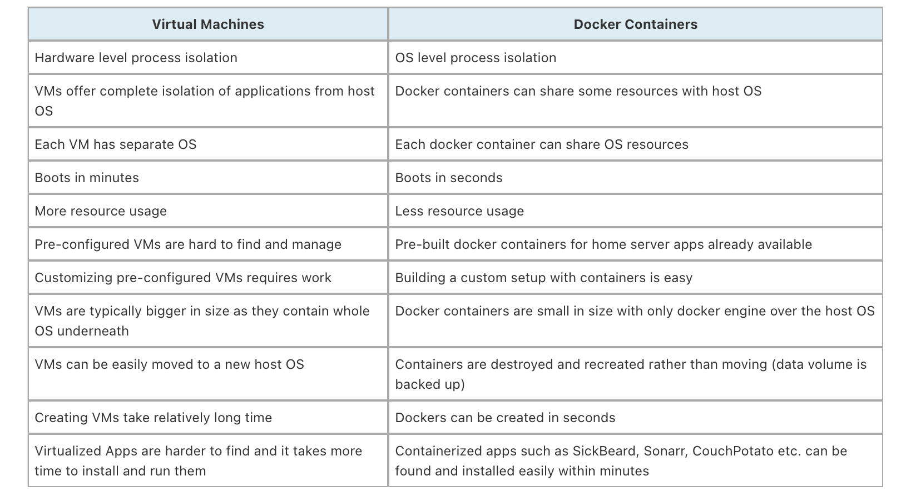
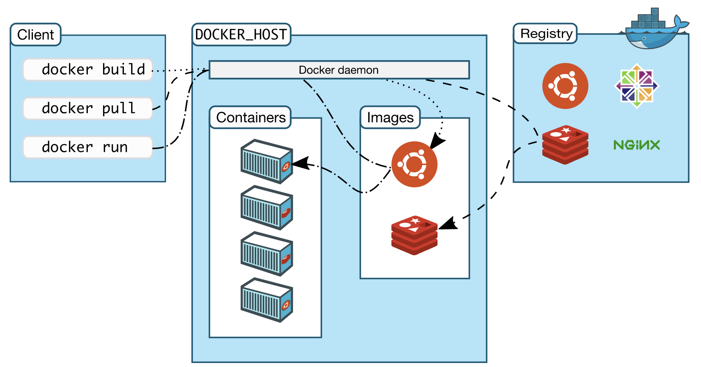
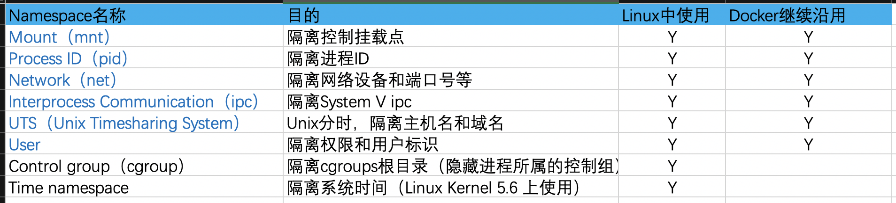
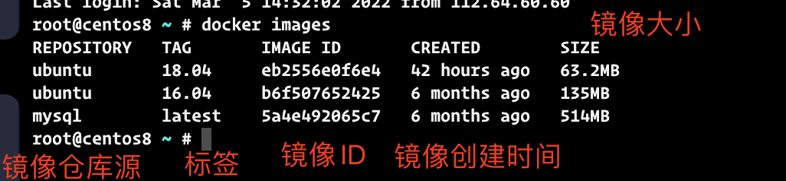

<h1><center> Docker 学习笔记</center></h1>

## 0. 内容说明
- 参考资源
    - https://docs.docker.com/
    - http://mirrors.ustc.edu.cn/help/index.html
    - https://docs.docker.com/engine/reference/builder/
    - https://docs.docker.com/compose/compose-file/
- 平台
    - centos
    - ubuntu
- 多平台多架构构建工具
    - docker buildx

- 个人说明
    - 参考官方资源并记录笔记，有自己的知识体系，帮助自己在后续场景中遇到可以直接使用，而不是还要查google再次重新开始。还要核对准确性。
    - 如果内容不符合你的需求，建议直接查看官网，毕竟官网内容比我写的更全面。
    - 平台只更新两个主要的平台，别的平台暂时未进行使用。
    - 暂时只更新自己使用过的基本情况，搭建harbor等还未使用，暂时不更新。

## 1. Docker概述
Docker使用google公司的Go语言实现的应用容器引擎，是dotCloud公司早期的一个业余项目。后来加入Linux基金会，并在GitHub上维护项目代码。

Docker项目的优点：
- 实现轻量级的OS虚拟化。
- 用户无需关心容器的管理（类似和虚拟机一样的操作管理）
- 操作简便
- 可移植性强
- 迁移、封装、部署和运行方便
- 减少运维成本，快速恢复服务
- 减少编写代码和生产环境运行之间的延迟差异

Docker基于Linux的LXC技术，进一步封装。

## 2. Docker和虚拟机的区别
参考文章和图片来源：[What is Docker: Docker vs VirtualBox, Home Server with Docker](https://www.smarthomebeginner.com/what-is-docker-docker-vs-virtualbox/#:~:text=VirtualBox%20and%20VMWare%20are%20virtualization,container%20is%20a%20hotel%20room.)

- 架构上的优势

    

    - 容器
        - 主要包含了应用程序及其相应的依赖。
        - 和其他容器共享Host OS内核
        - 但Host OS上用户是独立进程运行
    - 虚拟机
        - 包含应用程序和OS自带的依赖库和二进制文件
        - 不和别的用户共享OS，独立完整的计算机OS
        - 需要的资源更多（与Docker container相比较）

- 特点上的优势

    


## 3. Docker的基本架构及概念
Docker使用C/S架构模式。Docker Client和daemon之间使用API，通过UNIX Socket或者网络接口来进行通信。

Docker Compose的客户端允许使用一组容器组成的应用程序。



- Client（客户端）
    - 多个docker用户与docker交互的主要方式。

    - 只要执行docker run 命令，cleint就会发送命令到docker执行.

    - Docker client允许与多个docker daemon进程通信。

- images（镜像）
    - 镜像是包含创建Docker container说明的只读模板。
    - 镜像可自制或者使用公共Hub圆源

        - 自制镜像：使用dockerfile来进行构建。
        - 公共镜像：例如mysql或者nginx镜像源。

    - 类似DVD光盘

- container（容器）
    - 镜像的可运行实例。
    - 独立运行的应用或者应用群
    - 使用Docker API或CLI进行创建、启动、停止、移动或者删除容器的操作。

- registry（服务器仓库）
    - 存储docker镜像，类似github中的代码仓库。
    - Docker Hub是任何人都可使用的公共仓库。
    - 有多个仓库，每个仓库有不同的标签（tag）

        - 每个tag对应一个镜像或一个版本的镜像。
        - 一般格式：`<仓库名>:<标签>` 来指定镜像的版本。如果没有标签（tag），则会默认使用latest作为标签。

    - 可以搭建私有的registry
    - 使用 `docker pull` 或者 `docker run` 即可拉取需要的镜像
    - 使用 `docker push` 将自制的镜像推送到 Hub中保存。

## 4. Docker应用场景
- Web应用的自动化打包和发布
- 自动化测试
- CI/CD交付
- 开发编译环境

## 5. namespace和Cgroup
namespace和cgroup是Linux内核中的一项功能特性。

参考资源：
- https://en.wikipedia.org/wiki/Linux_namespaces
- https://en.wikipedia.org/wiki/Cgroups

### 5.1 namespace
Linux 从内核2.4.19内核开始挂载命名空间类型。

功能：对内核资源进行分区，以便于各自进程看到各自的资源，保证容器之间彼此不受影响。

多个docker容器的运行，公用同一个Host OS内核，每个容器都有自己的独立的命名空间，运行的应用程序也就像一个全新的OS一样，每个docker容器使用Host OS的用户空间。

目前，Linux中根据内核版本不同，提供了8种类型的namespace：



- 容器之间是不能跨容器访问数据。

- 在Linux系统中，有一个pid 1的进程（init/systemd）是其他所有进程的父进程，在容器中也是类似方式，通过父进程来管理其下所属的子进程。

### 5.2 cgroup
主要是限制一个进程可以使用的资源上限，包括CPU、内存、磁盘、网络带宽等。例如在编译C代码时，可以对共享内存进行设置处理，从而使得编译需求的内存足够。

Linux内核中，是默认开启cgroups。

cgroups细节实现 ------------> 待后续Linux内核部分结束后来补充。

## 6. Docker环境准备
在Mac OSX 和 Windows中安装docker的方式请参考官网手册：https://docs.docker.com/

Docker现目前分为两个版本：
- Docker CE：社区免费版
- Docker EE：企业版，需付费使用，安全性高

### 6.1 OpenEuler、Redhat、Kylin OS、Tencent OS、Centos 安装docker
演示系统版本为 Centos8 ，所以安装方式略有差异。尽量使用Centos6以上的版本，如果硬要在Centos6上部署使用，可以通过下载rpm包的方式进行安装使用。

- 如果有存在老版本的docker，卸载老版本
    ```sh
    yum remove docker \
                  docker-client \
                  docker-client-latest \
                  docker-common \
                  docker-latest \
                  docker-latest-logrotate \
                  docker-logrotate \
                  docker-engine
    ```

- 安装一些主要的依赖源
    ```sh
    yum install yum-utils device-mapper-persistent-data lvm2 -y
    ```
- 添加软件源
    ```sh
    sudo yum-config-manager --add-repo https://mirrors.ustc.edu.cn/docker-ce/linux/centos/docker-ce.repo
    # 修改 download.docker.com 为 mirrors.ustc.edu.cn/docker-ce
    sed -i "s#download.docker.com#mirrors.ustc.edu.cn/docker-ce#g" /etc/yum.repos.d/docker-ce.repo
    ```
- 更新缓存源
    ```sh
    # 清除缓存
    sudo yum clean all
    # 重新生成缓存
    sudo yum makecache fast
    ```
- 查找repo源支持的docker-ce版本
    ```sh
    yum list docker-ce --showduplicates | sort -r
    ```
- 安装docker-ce
    ```sh
    # centos8 中的安装方式，可以使用centos7中的container.io 文件
    dnf -y install https://mirrors.ustc.edu.cn/docker-ce/linux/centos/7/x86_64/stable/Packages/containerd.io-1.2.6-3.3.el7.x86_64.rpm
    dnf -y  install docker-ce docker-ce-cli --nobest

    # 其他OS的安装方式
    yum install docker-ce docker-ce-cli containerd.io

    # 如果要安装指定版本，则使用如下方式
    yum install docker-ce-<VERSION_STRING> docker-ce-cli-<VERSION_STRING> containerd.io
    ```
- 重启docker
    ```sh
    systemctl restart docker
    ```
- 设置开机docker自启
    ```sh
    systemctl enable docker
    systemctl start docker
    ```
- 查看docker版本
    ```sh
    docker version # docker -V
    ```

- 配置镜像加速源
    ```sh
    # 打开docker配置文件
    vim /etc/docker/daemon.json
    # 在文件中添加要使用的镜像源，如下
    {
        "registry-mirrors": ["https://docker.mirrors.ustc.edu.cn"], # 设置镜像加速
        "insecure-registries" : ["mirrors.ustc.edu.cn"], # 设置私有仓库地址可以设为http
        "data-root": "/home/", # Docker运行时使用的根路径，默认/var/lib/docker
        "max-concurrent-downloads":3, #设置每个请求的最大并发下载量（默认为3）
        "max-concurrent-uploads":5, #设置每次推送的最大同时上传数（默认为5）
    }
    # 配置完成后，重新启动daemon进程和重启docker服务
    sudo systemctl daemon-reload
    systemctl restart  docker
    sudo service docker restart
    ```

- 一些error信息及对应的解决方案
    - 版本依赖关系
        ```sh
        Last metadata expiration check: 0:02:24 ago on Sat 05 Mar 2022 12:46:41 PM CST.
        Error: 
        Problem 1: cannot install the best candidate for the job
        - nothing provides libcgroup needed by docker-ce-3:20.10.12-3.el8.x86_64
        - nothing provides container-selinux >= 2:2.74 needed by docker-ce-3:20.10.12-3.el8.x86_64
        Problem 2: cannot install the best candidate for the job
        - nothing provides container-selinux >= 2:2.74 needed by containerd.io-1.4.12-3.1.el8.x86_64
        (try to add '--skip-broken' to skip uninstallable packages or '--nobest' to use not only best candidate packages)
        ```
    - 解放方案
        ```sh
        # 安装缺少的两个依赖libcgroup 和 container-selinux
        dnf -y install https://rpmfind.net/linux/centos/8-stream/BaseOS/x86_64/os/Packages/libcgroup-0.41-19.el8.x86_64.rpm
        dnf -y install https://rpmfind.net/linux/centos/8-stream/AppStream/x86_64/os/Packages/container-selinux-2.167.0-1.module_el8.6.0+926+8bef8ae7.noarch.rpm
        ```

### 6.2 ubuntu、Debian、UOS 安装docker
- 安装一些必要的依赖
    ```sh
    apt-get install apt-transport-https ca-certificates \
                    curl gnupg-agent software-properties-common -y
    ```
- 备份原来的sources文件，如果不进行备份，直接使用下一行命令
    ```sh
    sudo cp /etc/apt/sources.list /etc/apt/sources.list_backup
    ```
- 使用sed进行替换文件内容
    ```sh
    sudo sed -i "s#archive.ubuntu.com#mirrors.ustc.edu.cn#g" /etc/apt/sources.list
    ```
- 更新源
    ```sh
    sudo apt-get update
    ```

- 查找repo源支持的docker-ce版本
    ```sh
    apt-cache madison docker-ce
    ```
- 安装docker-ce

    ```sh
    apt-get install docker-ce docker-ce-cli containerd.io
    # 如果要安装指定版本，使用如下方式
    apt-get install docker-ce-<VERSION> docker-ce-cli-<VERSION> containerd.io
    ```
- 重启docker
    ```sh
    systemctl restart docker
    ```

- 设置开机docker自启
    ```sh
    systemctl enable docker
    systemctl start docker
    ```

- 查看docker版本
    ```sh
    docker version # docker -V
    ```

- 配置镜像加速源
    ```sh
    # 打开docker配置文件
    vim /etc/docker/daemon.json
    # 在文件中添加要使用的镜像源，如下
    {
        "registry-mirrors": ["https://docker.mirrors.ustc.edu.cn"], # 设置镜像加速
        "insecure-registries" : ["mirrors.ustc.edu.cn"], # 设置私有仓库地址可以设为http
        "data-root": "/home/", # Docker运行时使用的根路径，默认/var/lib/docker
        "max-concurrent-downloads":3, #设置每个请求的最大并发下载量（默认为3）
        "max-concurrent-uploads":5, #设置每次推送的最大同时上传数（默认为5）
    }
    # 配置完成后，重新启动daemon进程和重启docker服务
    sudo systemctl daemon-reload
    systemctl restart  docker
    sudo service docker restart
    ```

## 7. Docker info说明
```sh
# 待补充更新
```


## 8. Docker常用命令
Docker引擎使用的是overlay2

### 8.1 docker镜像基本命令
主要的docker格式：
```sh
docker image COMMAND
```

- 查看所有镜像

    ```sh
    # 方式1
    docker image ls [OPTION]
    # 方式2
    docker images [OPTION]
    ```
    
    
    - OPTION常用：
        - `-all , -a`：显示所有的镜像
        - `--digests`：显示SHA256的信息
        - `-q`：显示所有的镜像ID

- 查找镜像
    ```sh
    docker search NAME:[TAG]
    ```
    建议直接使用官网查询：https://hub.docker.com/ 查看信息相对比较友好。

- 获取镜像（下载镜像）
    ```sh
    # 方式1
    docker image pull
    # 方式2
    docker pull
    ```

- 上传镜像
    ```sh
    # 方式1
    docker image push
    # 方式2
    docker push
    ```

- 提交镜像
    ```sh
    # 方式1
    docker image commit
    # 方式2
    docker commit
    ```

- 保存镜像到本地（导出镜像）
    ```sh
    dokcer save -o <SELF_NAME>.tar.gz NAME:[TAG]
    # 导出镜像存放到特定的目录中
    docker save NAME:[TAG] > /tmp/<SELF_NAME>.tar.gz
    ```

- 构建镜像
    ```sh
    # 具体使用方式在dockerfile中细节使用
    docker build --tag NAMES:[TAG] --file Dockerfile .
    ```


- 删除镜像
    ```sh
    # 如果容器在后台正在运行，需停止容器后才能删除

    docker rmi IMAGE_ID # 直接通过镜像ID来进行删除

    docker rmi [OPTION] NAME:[TAG] # 通过repository:tag方式进行删除
    ```

- 修改镜像标签
    ```sh
    docker tag source_IMAGE_ID target_name:[TAG]
    docker tag source_name:[TAG] target_name:[tag]
    ```

- 删除TAG为<none> 的镜像
    ```sh
    # 如果要直接删除后台正在运行的docker，直接使用 --force，谨慎使用，会kill别人使用的image
    docker rmi $(docker images | grep "none" | awk '{print $3}') 
    ```

### 8.2 Docker容器基本命令
- 容器使用的命令格式：
    ```sh
    docker run [OPTION] [IMAGE:TAG or IMAGE_ID] [COMMAND] [ARG...]
    # 示例
    docker run -it ubuntu:16.04 /bin/bash
    ```
    - 选项一定要紧跟在run的后面。一些信息说明：
        - `interactive,-i`：以交互模式运行容器，通常是和 `-t` 同时使用。
        - `--tty,-t`：为容器重新分配一个伪输入终端，通常是和 `-i` 一起使用
        - `--detach,-d`：后台运行容器，会返回一个容器ID
        - `--publish,-p`：小写，指定端口映射，格式：主机（宿主）端口:容器对口
        - `--publish-all,-P`：大写，随机端口映射，容器内部端口随机映射到主机的端口
        - `--name`：为容器指定一个名称，方便使用 exec 时直接进入容器
        - `--net`：指定容器的网络连接类型，支持 bridge/host/none/container:四种类型；
        - `--network`： 一般使用 `--network host`，使用和host一样的网络。
        - `--volume,-v`：映射一个目录卷
        - `--shm-size`：设置docker共享内存的大小，docker默认是64M，如果要扩大，则可使用 `--shm-size=1g` 类似格式。
        - `--privileged`：使用 `--privileged=true` 给docker内用户赋予了和host 主机一样的root用户权限，谨慎使用，否则docker的所有操作在容器外部一样生效。
        - `--user, -u `：用户名
        - `--rm`：exit 容器就会删除自动容器所有的文件系统，但一般不和 `-d` 使用。
        - `device`：直接映射host上的设备，例如映射gpu设备：`--device=/dev/device0:/dev/device0`，但是gpus有专属方式：`--gpus`。

- 启动容器
    ```sh
    # 直接进入docker -i -t
    docker run -it 镜像ID /bin/bash
    # 后台启动docker，通过exec或者其他方式进入docker，使用 -d
    docker run -it -d 镜像ID /bin/bash # 会返回一个容器ID
    ```

- 显示正在运行的容器
    ```sh
    # 仅显示 STATUS 为 Up的容器
    docker ps
    ```

- 显示所有容器
    ```sh
    # 包括 正在运行 和 exited 容器
    docker ps -a
    ```

- 删除容器
    ```sh
    docker rm 容器ID/容器NAMES
    # 如果要删除的容器正在运行，有两种方式参考
    docker stop 容器ID/容器NAMES  # 先停止容器后再删除
    docker rm 容器ID/容器NAMES --force # 谨慎操作，除非确定该容器不使用
    ```

- 映射端口
    ```sh
    # 随机映射端口
    docker run -it -P 容器ID/容器NAMES /bin/bash
    # 指定端口映射
    docker run -it -p 127.0.0.1:80:8080 容器ID/容器NAMES /bin/bash
    ```


- 自定义容器名称
    ```sh
    # --name 后面写一个名字，会在后台看到一个容器NAMES的名字是自己创建的
    docker run -it -d --name my_start_docker 镜像ID /bin/bash
    ```


- 停止容器
    ```sh
    docker stop 容器ID/容器NAMES
    ```


- 进入正在运行的容器
    - attach
    - exec
    - nsenter
    

- 映射使用的目录卷
    ```sh
    docker run -it -v /home:/home -v /data:/data/ 容器ID/容器NAMES /bin/bash
    ```

🚩 小Tips：末尾的 `/bin/bash` 写成 `bash` 也可以使用。

## 9. Dockerfile语法指南
参考资源：https://docs.docker.com/engine/reference/builder/

Dockerfile用于创建和运行镜像所需的步骤。Dockerfile文本文件中的每条指令都会在镜像中创建一个层。

使用 docker build 来创建一个连续执行多个命令行指令的自动构建。

### 9.1 常用语法的指令说明
- `FROM` 指令

    FROM 使用官方定制的基础镜像，如ubuntu:18.04。
    ```sh
    FROM <image>[:<tag>]
    FROM [--platform=<platform>] <image> [AS <name>]
    FROM [--platform=<platform>] <image>[:<tag>] [AS <name>]
    ```
    - `--platform`：指定平台，例如linux/arm64、linux/amd64等，一般使用在交叉编译到某个特定的目标平台使用。


- `RUN` 指令
    
    直接执行后面的指令
    ```sh
    RUN <命令行指令（也就是shell指令）>
    # 示例
    RUN apt-get update -y && apt-get install wget
    RUN yum install -y wget
    ```

- `ENV` 指令

    设置环境变量，类似Linux系统中的 `export`。
    ```sh
    ENV <环境变量Key> <环境变量Value>
    ENV <环境变量Key>=<环境变量Value>
    # 示例，等价于 export LD_LIBRARY_PATH=/usr/bin:/usr/lib:/usr/lib64/:$LD_LIBRARY_PATH
    ENV LD_LIBRARY_PATH=/usr/bin:/usr/lib:/usr/lib64/:$LD_LIBRARY_PATH 
    ```


- `ARG` 指令

    - 构建参数
        - 和ENV一样，但作用域不一样。
    - ARG变量
        - 指定变量，类似其它语言中的变量。
    ```sh
    ARG <name>[=<default value>]
    ```

- `MAINTAINER` 指令

    生产镜像的作者字段，目前已经弃用，所以建议使用 `LABEL` 指令。
    ```sh
    MAINTAINER <name>
    ```

- `USER` 指令

    指定后续命令的用户或者用户组
    ```sh
    USER <user>[:<group>]
    # 示例
    USER root
    ```

- `LABEL` 指令

    一个键值对，一个镜像可以使用多个LABEL。
    ```sh
    LABEL <key>=<value> <key>=<value> <key>=<value> ...
    ```

- `ADD` 指令
    
    和COPY指令功能类似。
    ```sh
    ADD source_file dest_path
    # 示例，拷贝脚本到 /tmp 目录中，并会自动解压到特定目录，dest_path 地址可以是相对路径或者绝对路径
    ADD my_container.tar.gz /tmp
    ```

- `COPY` 指令

    - 将文件复制到容器内的指定路径，如果路径不存在则会自动创建。
    - COPY指令不会解压文件，需要使用解压命令
    ```sh
    COPY source_file dest_path
    # 示例，拷贝脚本到 /tmp 目录中，dest_path 地址可以是相对路径或者绝对路径
    ADD my_container.sh /tmp
    ```

- `EXPOSE` 指令

    只用来声明镜像服务的守护端口
    ```sh
    EXPOSE 端口
    # 示例
    EXPOSE 3777
    ```

- `WORKDIR` 指令

    进入到指定目录，类似Linux命令中的cd 命令。
    ```sh
    WORKDIR <工作目录路径>
    # 示例
    WORKDIR /home
    ```

- `CMD` 指令

    - 类似RUN指令，用于运行程序。运行时间点不同：

        - CMD 在 `docker run` 
        - RUN 在 `docker build` 
    ```sh
    CMD ['shell命令']
    # 示例
    CMD ['bash +x script.sh']
    CMD ["service restart ssh"]
    ```

- `ENTRYPOINT` 指令

    - 和CMD指令类似，都是指定容器启动程序及参数，但 **ENTRYPOINT 在运行时会被替代** 。
    - ENTRYPOINT 需要通过 `docker run` 的参数 `--entrypoint` 来指定。
    ```sh
    ENTRYPOINT ["executable", "param1", "param2"]
    ```

- `VOLUME` 指令

    定义使用数据卷
    ```sh
    VOLUME <路径>
    # 示例
    VOLUME /data:/data
    ```

### 9.2 Dockerfile 实战模板
暂时只使用三个OS版本作为示例，别的OS的支持很差或者已经停止更新。

主要是为了编译或者开发环境使用docker，所以可以随意选择：

- x86_64
    - Ubuntu18.04 [](./Dockerfile.1804_x86)
    - Ubuntu20.04 [](./Dockerfile.2004_x86)
    - Centos7.9
    - OpenEuler（华为）

- aarch64（俗称 ARM64 ）
    - Ubuntu18.04 [](./Dockerfile.1804_aarch64)
    - Ubuntu20.04 [](./Dockerfile.2004_aarch64)
    - Centos7.9 
    - OpenEuler（华为）

## 10. Docker存储
待更新

## 11. Docker网络知识
待更新

## 12. Docker compose
待更新

## 13. Docker swarm
待更新

## 14. Docker的多架构支持
参考资源：https://docs.docker.com/buildx/working-with-buildx/

使用 docker 官方开发的 buildx buildKit

### 14.1 配置docker buildx 工具

```sh

```

后续待更新


