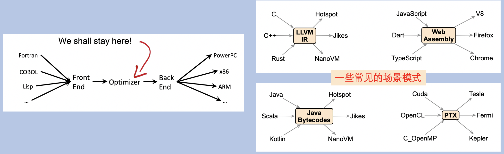

# dcc888 lecture01 Introduction 学习笔记

- [dcc888 lecture01 Introduction 学习笔记](#dcc888-lecture01-introduction-学习笔记)
  - [1. 编译器的目标](#1-编译器的目标)
  - [2. 课程目标](#2-课程目标)
    - [3.1 衡量程序性能的因素](#31-衡量程序性能的因素)
    - [3.2 程序优化](#32-程序优化)
  - [3. 课程内容](#3-课程内容)
  - [4. 为什么学习compiler？](#4-为什么学习compiler)
  - [5. 编译器的应用场景](#5-编译器的应用场景)
  - [6. 编译器涉及的东西](#6-编译器涉及的东西)
  - [7. 静态和动态分析](#7-静态和动态分析)
    - [7.1 静态分析](#71-静态分析)
    - [7.2 动态分析](#72-动态分析)
  - [8. 编译器的发展历史](#8-编译器的发展历史)
  - [9. compiler目前的挑战](#9-compiler目前的挑战)
  - [10. 参考资源](#10-参考资源)

## 1. 编译器的目标
编译器的目标：成为软件和硬件之间的桥梁。可让程序员更加高效。

但是编译器在技术的发展下变得更加有挑战赛性。例如：
- 软件层追求抽象具体化。
- 硬件层追求效率。

正是由于两者的差距，使得编程语言和机器之间的差距变大。

## 2. 课程目标
- 程序优化
- 找到bug

### 3.1 衡量程序性能的因素
- runtime
- memory space
- Energy consumption

对于编译器优化改进，并没有真正满足摩尔定律。从优化提升来说，软件层的提升会比硬件层表现的更加明显。

### 3.2 程序优化
通过静态分析技术来对理解程序，也是代码优化的关键手段。

对于优化程序来说，有很多不同的方式：
- Copy elimination	
- Constant propagation	
- Lazy Code Motion	
- Register Allocation	
- Loop Unrolling	
- Value	Numbering	
- Strength Reduction	

## 3. 课程内容
对于编译器来说，主要分为3个部分：
- **`前端`**：主要是一些解析处理高级语言的部分：词法解析、语法解析、语义解析等。
- **`中端`**：优化和代码分析，主要包括：中间代码等。
- **`后端`**：生成机器代码，主要是处理机器语言、汇编语言等低级语言。

而本课程的主要重点是`中端部分`。

对于编译器来说
- 完美优化的编译器并不存在。
- 编译器开发者，总是有很多的角度去优化，使得在现有编译器的基础上优化出更加贴合实际场景的优化。

## 4. 为什么学习compiler？
- 了解编译技术，可以帮助成为一个更好的程序员
- 有编译器背景，可以获得更好的工作机会。
- 能够更好地去了解计算机科学。

工业级的编译器是一个大而复杂的系统，编译器靠近操作系统，需要花费很多的编程技巧去写。

在编译器中不仅包括了很多计算机科学的理论知识。也包含了类型系统、解析系统、图形学、代数、算法、定点计算等。

由于有多种计算机体系结构，所以必须为每一个语言或者工具制作一个编译器，使得硬件和软件之间能够连接起来。

- 了解编译器，可以帮助开发者fix一些错误

## 5. 编译器的应用场景
- 汽车行业
  - 硬件驱动
- 嵌入式
- IoT
- 视频游戏行业
  - 特殊的硬件处理
- 高性能数据中心
- AI

每个公司都有自己的编译器场景，比较常见的：
- apple：llvm、clang
- NVIDIA：nvcc
- Jetbrains

对于一些小公司也有一些专门从事编译器和静态代码检查。通过独立的编译器或者错误查找工具来实现。
- Coverity
- PathScale
- CodePlay

## 6. 编译器涉及的东西
编译器设计知识面有很多，类似于计算机科学的缩影版。
- 算法：图、联合查找、动态规划编程等
- AI：机器学习等。
- 自动机理论：用于扫描的DFAs，解析器、生成器、上下文无关语法。
- 代数：lattices, fixed point theory, Galois Connections, Type Systems
- 计算机体系结构：pipeline management, memory	hierarchy,instruction sets
- 组合优化：运筹学、负载均衡、打包、调度等。

## 7. 静态和动态分析
编译器理解程序的两种方式：
- 静态分析
- 动态分析

### 7.1 静态分析
静态分析在不运行程序的情况下发现有关程序的信息。

静态分析也是本课程的主要关注点。

静态分析主要关注三种：
- DataFlow analysis
  - 根据元素之间的依赖关系来传递信息
  - 这些依赖关系由程序语法给出。

- Constraint-Based Analysis
  - 从程序中获取约束条件
  - 约束条件不是由程序语法显式来确定的。

- Type Analysis
  - 通过类型注释的方式来传递信息
  - 信息证明程序的属性。

### 7.2 动态分析
动态分析包括执行程序。
- profiling：执行程序，并记录在运行时发生的事件。
  - gprof
- Test Generation：通过一些test来覆盖更多的程序问题，或者产生一些事件。
  - Klee
- Emulation：在虚拟机中执行程序，负责收集和分析数据
  - valgrind 和 CFGGrind
- Instrumentation：使用元程序来扩展程序，监控其行为。
  - AddressSanitizer

## 8. 编译器的发展历史
- 第一个文件编译器实现
  - 1951年，Grace Hopper发明了A-0系统

- 第一个编译器出现
  - Fortran作者实现
  - Fortran是最早由编译器编译的编程语言之一
  - 但是Fortran编译器需要解决两个问题：
    - 解析
    - 代码寄存器的分配

- 早期的代码优化
  - 由IBM的Frances E.Allen 单独或者互相合作，引入很多优化概念：
    - **`控制流图（Control flow graphs）`**
    - **`数据流分析（dataflow anaylysis）`**
    - 不同程序优化的描述
    - **`过程间数据流分析（Interprocedural dataflow anaylysis）`**
    - worklist algorithms

- **`The Dataflow Monotone Framework`**
  - 发明者：Gary Kildall，同时也是BIOS System的发明者
  - 目前使用的大多数编译器理论和技术都是基于此概念。
    - Propagation of information	
    - Iterative	algorithms	
    - Termination of fixed point computations	
    - The meet over	all	paths solution to dataflow problems	

- 抽象解释出现
  - Cousot的论文为抽象解释技术提供了起源

- `寄存器分配`
  - 寄存器分配是早期编译器优化的重点之一。
  - 在1981年，Gregory Chaitin提出了通过 `graph-coloring` 来进行寄存器分配的方法。
  - 在1999年，Poletto 和 Sarkar 引入了`linear scan`，通常是JIT编译器使用的寄存器分配算法。
  - `graph-coloring` 和 `linear scan`两种方法在目前大多数现代编译器中都存在。

- **`Static Single	Assignment`**
    - 一种程序表示，其中的每个变量只有一个definition site。
    - 在1981年，由在IBM的Cytron提出了`SSA形式`。

- **`Constraint-Based Analyses`**
  - 由 Olin	Shivers 引入
  - 指针分析之父

- Type Theory 加强

## 9. compiler目前的挑战
- 并行性
- 动态语言出现
- 正确性
- 安全性

## 10. 参考资源
- [DCC888](https://homepages.dcc.ufmg.br/~fernando/classes/dcc888/ementa/)

