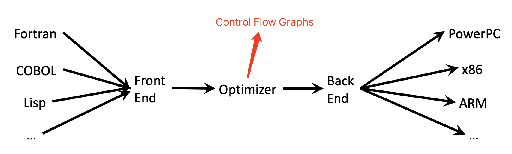
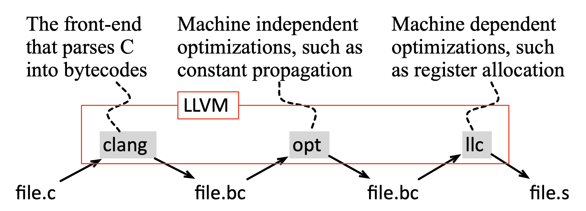
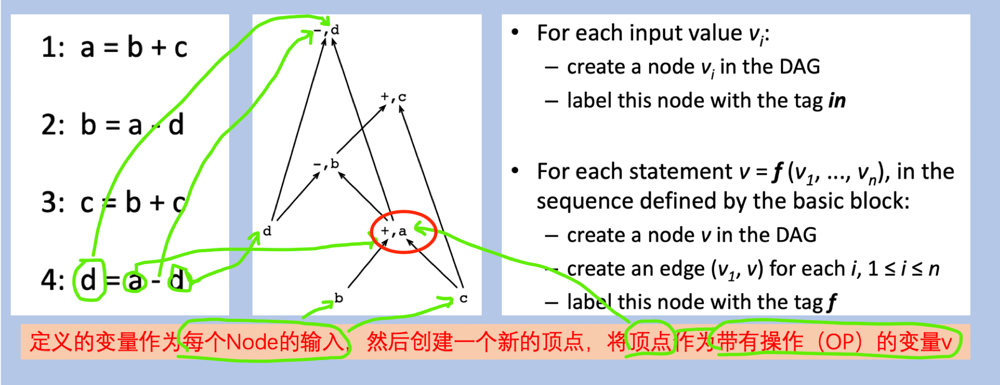
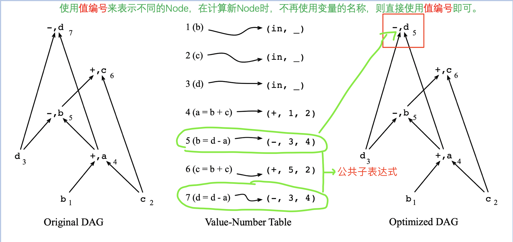
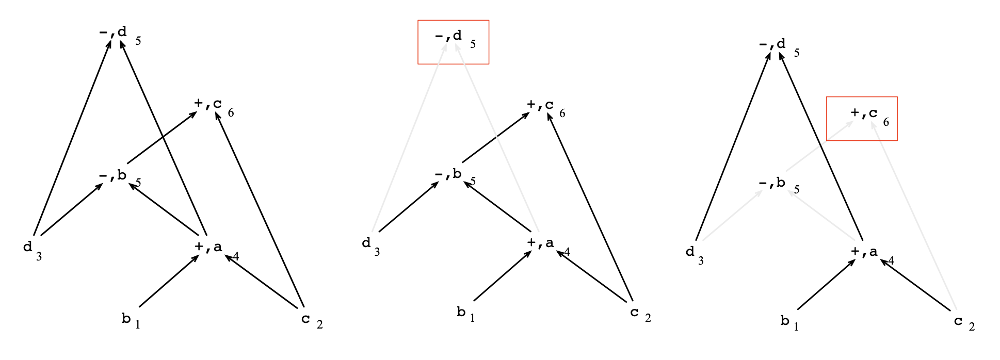
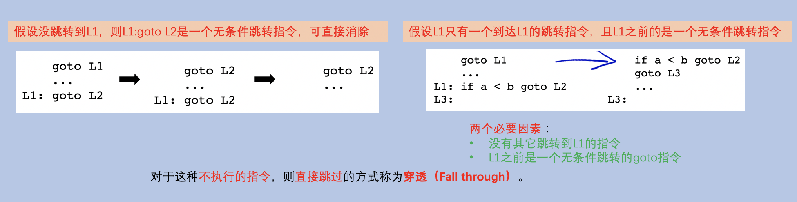
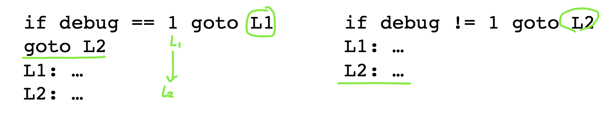
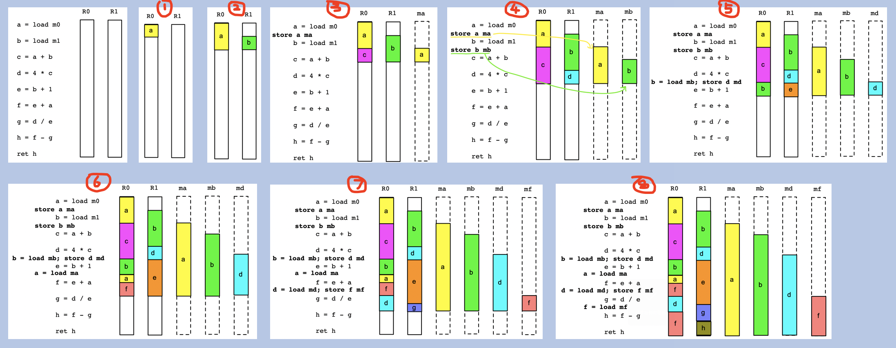

<h1 align="center">📔 dcc888 lecture02 Control Flow Graphs 课程学习笔记</h1>

- [1. Intermediate Program Representation](#1-intermediate-program-representation)
  - [1.1 Control Flow Graphs](#11-control-flow-graphs)
  - [1.2 Basic Block（基本块）](#12-basic-block基本块)
  - [1.3 LLVM概述](#13-llvm概述)
  - [1.4 三种优化技术](#14-三种优化技术)
- [2. Local Optimization](#2-local-optimization)
  - [2.1 DAG-based Optimizations](#21-dag-based-optimizations)
  - [2.2 寻找局部公共子表达式](#22-寻找局部公共子表达式)
  - [2.3 Value Numbers](#23-value-numbers)
  - [2.4 Dead Code Elimination](#24-dead-code-elimination)
- [3. `Peephole optimizations（窥孔优化）`](#3-peephole-optimizations窥孔优化)
  - [3.1 消除冗余加载和保存指令](#31-消除冗余加载和保存指令)
  - [3.2 控制流优化](#32-控制流优化)
  - [3.3 消除级联跳转指令](#33-消除级联跳转指令)
  - [3.4 代数化简和强度消减](#34-代数化简和强度消减)
  - [3.5 使用机器习语](#35-使用机器习语)
- [4. `Local Register Allocation`](#4-local-register-allocation)
  - [4.1 Spilling](#41-spilling)
  - [4.2 Belady 算法](#42-belady-算法)
  - [4.3 寄存器分配示例](#43-寄存器分配示例)
- [参考资源](#参考资源)

## 1. Intermediate Program Representation
程序优化中有一个最重要的程序表示 ---- **`控制流图（Control Flow Graph，简称CFG）`**。

在计算机机器的角度看到的程序，和程序员看到的编程语言程序文本是不同的。但是机器为了处理程序文本，则编译器将程序文本转换为数据结构，数据结构中的表示也就是程序表示。



### 1.1 Control Flow Graphs
**`Control Flow Graph`** 就是一个 **`有向图（Directed Graph）`**。
- `Node`就是 `basic Blocks`
- `边线`就是程序`执行流的方向（执行流程）`。例如：B1 -----> B2 就表示执行方式 B1 到 B2。

**编译使用CFG作为中间端的原因**：编译器将源代码文件翻译成抽象语法树的数据结构，然后通过数据pipe将抽象语法树转换为更接近机器代码的 `control flow Graph`。
- 抽象语法是人类视角
- control flow graph可以属于机器视角

### 1.2 Basic Block（基本块）
在中间表示中，一般使用 Control Flow Graphs，而CFG中使用`Basic Blocks`来进行程序的中间表示。

**`Basic Blocks`**：始终连续执行的指令序列。

一般只在一个基本块的结尾有一个分支，控制流也只能通过一个块的第一个指令进入Basic  Blocks。

**`构造基本块的目的`**：*`优化代码`*。一般情况下，只要一个中断发生，则要么直接被控制返回到引起中断大指令，要么程序直接终止并报错。

对于 `Basic Blocks`的标注，一般将` basic Blocks`的`第一条指令`称为 `Leader`。

对于如何识别 Leader，可以通过3种方式来判断：
- `中间代码的第一条指令`就是Leader
- `有条件或者无条件判断跳转的任何指令` 都是 Leader
- `紧跟在有条件或者无条件跳转的指令` 都是 Leader。

一旦找到最基本的 Leader，那么就可以判断出 `Basic Blocks`（leader和leader之间的指令就是一个basic blocks）。

Basic Blocks的特点：
- 执行指令必须从第一条开始进入Basic Blocks，不能从中途直接进入某个指令。
- 完整的一个Basic Block执行顺序是从第一条指令进入，到最后一行表示结束。不能中途直接跳出某个指令。

### 1.3 LLVM概述
**`LLVM（The Low Level Virtual Machine）`**

课程使用 llvm 来编译 **`Control Flow Graph`**。也是目前编译器研究中常用的工具之一。

llvm也被用在一些目前AI领域常见的开源项目中。例如：TensorFlow、PyTorch、TVM等项目。

对于llvm的架构设计，也是满足任何典型的编译器。它在中间端实现一个叫opt的工具。



- opt是实现分析和优化的工具

使用llvm来可视化一个CFG，可以使用 clang编译器 或 gcc编译器 来编译设置一些参数选项。例如：

```sh
clang -c -emit-llvm identity.c -o identity.bc # 编译器的前端部分处理
opt -view-cfg identity
```
对于 clang 或者 gcc的安装（如果在使用过程中缺依赖，自行配置）：

```sh
# rpm 系 
yum install clang gcc gcc-c++ -y
# deb 系
apt-get install clang gcc -y
```

一般情况下，可以将CFG中的表示形式视为汇编语言格式。

### 1.4 三种优化技术
在 `Basic Blocks`作用域内执行的 **`代码优化`** 技术称为 **`局部优化（local optimization）`**。有三种优化方式：
- **`DAG based Optimizations`**
- **`Peephole optimizations`**
- **`Local Register Allocation`**

## 2. Local Optimization
代码优化技术是需要直接`分析一整个程序的CFG`，所以也叫做 **`Global optimizations`**。所以一般不怎么使用DAG的方式来进行数据结构的优化。

### 2.1 DAG-based Optimizations
另一种`程序表示`的方法来构成`Basic Blocks`：**`有向无环图（Directed Acyclic Graph，简称DAG）`**。

使用 DAGs作为核心数据结构来进行优化实现。

DAG的构造如下：
- 对于出现在 `Basic Block` 的每个输入值，在DAG中都有一个Node。
- 在Basic blocks，每条指令都有一个关联Node
  - `节点`表示`位置`
  - `边`表示`依赖关系`。
- 如果语句$S_1$使用了语句$S_1 ... S_n$定义的变量，则分别有边从$S_1 ... S_n$指向$S_1$
- 如果在 Basic Blocks 中定义了一个变量，但是不使用，则将其标识为输出值。



### 2.2 寻找局部公共子表达式
通过优化来对程序进行优化，其实就是删除一些不必要或者冗余Node的指令。

在代码运行过程中，可能有的程序语句使用某一个公共的表达式，为了高效的计算，可以将公共的表达式提取出来，一次计算，多次使用。这种方式称为 **`寻找局部公共子表达式`**。
```c
a = b + c;
b = a - d;
c = b + c; // b + c 表达式第二次出现，但是b 的值是 a - b生成的。和原来的 a = b + c的值计算不一样
d = a - d; // a - d 是 公共子表达式，第二次出现，可以直接使用 d = b
```
所以在构建和检查DAG时，如果DAG中已经包含了`顶点Node（v）`和`相同的Label（操作`及对应相同输入边的`子Node（v_1 ... v_n）`，则可以认为是公共子表达式。

### 2.3 Value Numbers
在寻找相同输入边的子Node时，需要证明两个父Node相等，此时就需要著名的 **`Value Numbers`**来帮助解决问题。

在DAG中，使用 signature$(lb,v_1,...,v_n)$ 来将每个Node连接起来。
- lb是Node 的Label
- $(v_1,...,v_n)$ 表示子Node。

通过使用 **`hash函数`** 作为 signature，从而确保每个节点都有相同的操作标签、相同的输入边列表和具有相同的Hash Node。



总的来说，在构建DAG的每一条语句的Node时，如果语句之前未出现过，则构建新的Node，如果是出现过相同Hash的Node，则直接将新的Node指向之前那个相同Hash的Node。

### 2.4 Dead Code Elimination
Dead Code Elimination（死代码消除）

满足消除Node的条件：
- Node中没有`后继Node`，例如：`root Node`
- 该Node没有被标记为 `output Node`。
- 要么有`Output Node`，要么有`后继Node`

此时就可以使用迭代方式将其移除，直到没有可移除的Node。



## 3. `Peephole optimizations（窥孔优化）`
>**`参考内容：《编译原理》龙书 8.7 P353 ～ P355`**

**`Peephole优化`** 在几乎编译器实现中均有广泛的应用。属于 **`局部优化（local Optimization）`** 技术。

窥孔是程序上存在一个小的滑动窗口。


优化原理：优化器分析指令序列，每次只分析指令窗口内的代码，当窗口通过此代码时，一旦发现同样的patern，则直接会被调用优化。

对于窥孔优化，也有很多的方法例子：
- 冗余指令消除
- 控制流优化
- 代数化简
- 机器特有指令的使用

### 3.1 消除冗余加载和保存指令
```asm
LOAD  R0, m
STORE m,  R0
```
可以直接移除保存指令，`LOAD指令`已经将a的值加载到寄存器R0中，而且`STORE指令`的执行时间未知，也没有改变内存的状态。而且寄存器分配器会信任窥孔优化器，将这部分不良的代码指令会直接优化掉。

### 3.2 控制流优化
中间代码生成算法经常会生成目标为如下情况：
- 无条件跳转指令的无条件跳转指令 -----> 条件跳转指令的无条件挑战指令
- 无条件跳转指令的无条件跳转指令 -----> 无条件跳转指令的条件跳转指令



一般这种无意义的跳转指令，则可以通过窥孔优化技术在中间代码或者目标代码阶段优化删除掉。

### 3.3 消除级联跳转指令
消除不必要的重复指令，不管 debug的值是什么，都是属于不可达的指令，所以窥孔优化器会直接优化处理该指令。



### 3.4 代数化简和强度消减
代数恒等式可以简化DAG，同时也可以被窥孔优化器用于消除一些语句。
```c
x = x + 0;
x = x + 1;
```

**`强度消减`**：把`代价较高的运算`替换为`目标机器上代价较小`的`等价运算`。例如：
- `除数为常数的浮点除法`替换为`常量倒数的乘法`。
- `幂函数`可以替换为`移位运算符`。

### 3.5 使用机器习语
许多计算机体系结构中，都有一些常见操作的有效指令，使用机器特有的指令可以显著减少运行时间。例如自增或自减指令。

```asm

add1 $1, %edi
;可以替换为 ----- 注释部分
inc1 %edi
```

## 4. `Local Register Allocation`
寄存器是存取时间非常快的存储器位置。但是寄存器的数量是有限的。例如：32位x86机器有8个可见寄存器。

寄存器运算分量要比内存运算分量的指令运行得要快很多。在现代处理器上，处理器的速度要比内存速度快一个数量级以上。

**`优化方式`**：将程序中最常用的变量直接映射到寄存器中。

这种方式通常编译器需要看到整个函数（或者整个程序）才能进行良好的寄存器分配。

### 4.1 Spilling
一个 **`变量映射到内存`** 中的过程叫 **`Spilling`**。

主要目的：缓解寄存器的压力。因为本身寄存器的数量较少，不能保证每个变量都可以在寄存器上操作。

### 4.2 Belady 算法
在分配虚拟内存时，发生缺page时置换算法采用FIFO算法，如果对一个进程未分配它所需的全部Pages，就会出现分配的page越多反而造成缺page率也提高的异常现象。

参考论文：http://users.informatik.uni-halle.de/~hinnebur/Lehre/Web_DBIIb/uebung3_belady_opt_buffer.pdf

> **后续补充论文研读细节**

Belady算法可以决定将某个page放逐到虚拟内存系统中的磁盘上，操作系统也使用该策略方式。

在局部寄存器分配时，需要关注一个变量会在一个Basic Blocks之后使用，因为一个basic并不能包含一整个函数。

### 4.3 寄存器分配示例
假设一个只有两个寄存器的简单架构（看图请放大）:

 

## 参考资源
- [DCC888](https://homepages.dcc.ufmg.br/~fernando/classes/dcc888/ementa/)