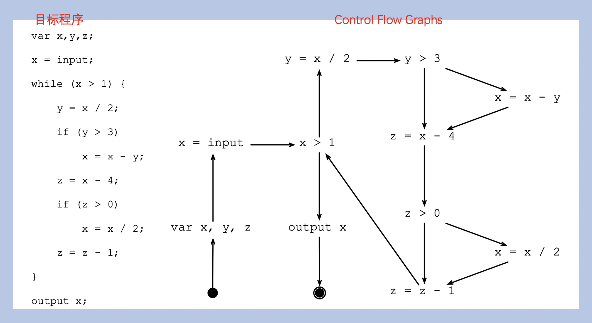
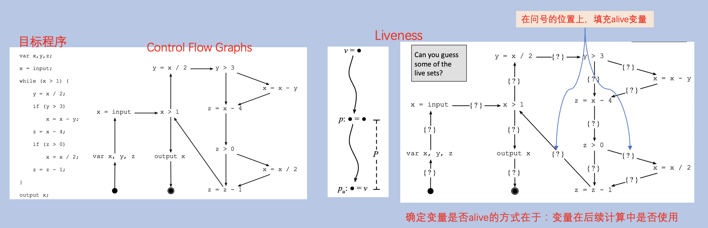
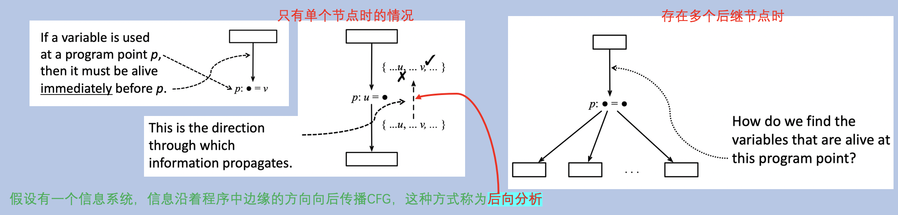
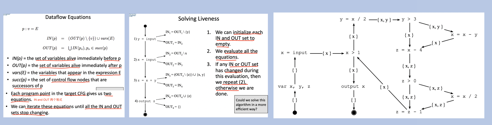

<h1 align="center">📔 dcc888 lecture03 DataFlow Analysis 课程学习笔记</h1>

- [1. DataFlow概述](#1-dataflow概述)
- [2. Liveness Analysis](#2-liveness-analysis)
  - [2.1 `propagation` of Information](#21-propagation-of-information)
  - [2.2 `IN and OUT Sets` and dataflow `equations`](#22-in-and-out-sets-and-dataflow-equations)
  - [2.3 declarative program 和 Prolog工具](#23-declarative-program-和-prolog工具)
- [3. Available Expressions](#3-available-expressions)
  - [3.1 Propagation of information](#31-propagation-of-information)
  - [3.2](#32)
- [4. Very Busy Expressions Analysis](#4-very-busy-expressions-analysis)
- [5. Reaching Definitions Analysis](#5-reaching-definitions-analysis)
- [4.](#4)
- [参考资源](#参考资源)

## 1. DataFlow概述
数据流分析是编译器中最常用的静态分析方法。

对于经典的数据流分析，是一个从CFG和一个有限高度的Lattice L开始的 **`monotone framework`**。

- lattice对于所有程序来说，可能是固定的，也可能对给定程序的进行参数化。

并不一定非得使用`CFG来`运行`数据流分析`，可以直接使用`指令语法`来完成。

## 2. Liveness Analysis
通过CFG表示程序的例子，需要思考几个问题：
- 需要多少个寄存器才能在其它程序中编译这个程序？

通过寄存器的信息来进行数据分析的过程称为 **Liveness 分析**。

假设提供的寄存器无限，则变量v应该在程序点p的寄存器中：

- 从每一条路径p到另一个程序点$p_u$
- 路径p不需要对v进行任何重新定义。

这两个条件决定了变量v在程序点p上什么时候是活的。如果变量是alive，在程序点p，则变量必须驻留在寄存器或内存中。

### 2.1 `propagation` of Information

- 程序点p是单个node时：
  - 一个变量在程序点p之前是alive，当且仅当：
    - 它在p之后会被立即alive
    - 在p处没重新定义又或者p被使用过。

- 但是当程序点p存在多个后继节点的情况时，又该如何在多个程序点中找出alive变量呢？
  - 如果变量v在p之前的任何前驱操作是alive，那它在p之后一定是alive的。

### 2.2 `IN and OUT Sets` and dataflow `equations`
为了解决活性分析问题，会将信息存储到某个位置，将程序点与一组alive变量映射在一起。

我们将每个程序点p的两个`集合`相互连接起来：
- `IN`：紧接在 `p之前`的一组变量。
- `OUT`：紧接在 `p之后`的一组变量。

一般情况下，可以定义集合为多个方程组成。

### 2.3 declarative program 和 Prolog工具

不做文章内容的更新，会单独更新一篇prolog工具使用的文章进行学习笔记记录。

## 3. Available Expressions

### 3.1 Propagation of information

### 3.2 

## 4. Very Busy Expressions Analysis

## 5. Reaching Definitions Analysis

## 4. 

## 参考资源
- [DCC888](https://homepages.dcc.ufmg.br/~fernando/classes/dcc888/ementa/)
- https://lara.epfl.ch/w/_media/sav08:schwartzbach.pdf
- 《编译原理》Chapter09 机器代码优化

