<h1 align="center">📔 Lecture01 关系模型 课程笔记</h1>


## 1. 数据库的例子
一般情况下，可以在应用程序上实现和管理最简单的数据库，即可以用它来存储数据和一堆用逗号分隔的值文件或CSV文件。

假设数据库中有两个实体（Artist和Album），以及对应的属性。

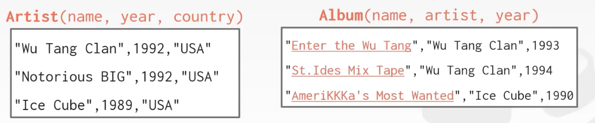

如果要存储在CSV文件中，会在每个属性上用引号标注，然后用逗号分隔。

假设需要查找“Ice Cube” 的出道年份，通过Python方式来实现。

```python
for line in file:
    record = parse(line)
    if "Ice Cube" == record[0]:
        print(int(record[1]))
```

但是这种方式并不是最好的，存在一些问题。

- 数据完整性
    - 如何确保每个专辑条目的艺术家都是相同的？
    - 如果有人用无效字符串覆盖专辑年份怎么办？
    - 如何存储一张专辑中有多个艺术家？
- 实现
    - 你如何找到一个特定的记录？
    - 如果我们现在想要创建一个使用相同数据库的新应用程序怎么办？
    - 如果两个线程同时尝试写入同一个文件怎么办？
- 持久性
    - 如果在程序更新记录时机器崩溃了怎么办？
    - 如果想在多台机器上复制数据库以获得高可用性怎么办？

基于以上问题，就出现了数据库管理系统（DBMS）来对数据进行管理操作。

数据库管理软件是一种专业的软件，允许程序在无须底层实现的情况下，对数据库中的信息进行存储和分析，是一种能够被多种应用所复用的软件。避免重复造轮子的问题。


## 2. 数据库发展史

### 2.1 早期数据库
第一个数据库是 1965 年由通用电气制造。

缺点：
- 数据库应用程序难建立和维护。
- 逻辑层和物理层之间的紧密耦合。
- 在部署数据库之前，你需要大致知道你所要执行的查询操作。

### 2.2 关系模型出现
1970年被Ted Codd提出并发表论文，引发了关系数据模型革命的原始论文。

通过数据库抽象的方式避免维护问题：
- 将关系转化为简单的数据结构存入数据库。
- 通过高级语言访问数据。
- 物理存储取决于数据库管理系统的实现。

### 2.3 数据模型
`data model（数据模型）`:用于描述数据库中的数据的`概念的集合`。

`schema（模式）`: 使用给定数据模型对特定`数据集合的描述`。

常见的关系数据模型
- Relational
    - MySQL、PostgreSQL、Oracle、DB2、SQL server、SQLite等
- NoSQL
    - Key/Value
    - Graph
    - Document
    - Column-family
- Array/Matrix
    - 主要应用在机器学习中，是一个矩阵数据模型的例子。

数据库优势并不能一概而论，在某些应用领域中，一些数据模型比关系型数据模型能够更好地描述数据。

## 3. 关系型数据模型的三个要素
- 关系结构（structure）：关系的定义及其结构的内容。
- 完整性（Integrity）：确保数据库的内容满足限制。
- 操纵性（manipulation）：如何访问和修改数据库的内容。

## 4. 一些概念词

`关系`：数据的一个列，是一个实体的属性之一。

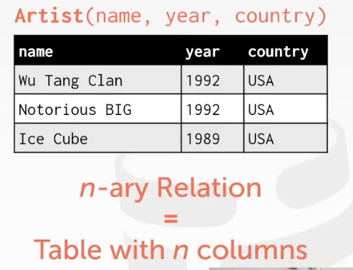

`主键（Primary Keys）`：某一个唯一属性或一个属性组能够唯一标识一条记录。称其属性或属性组为主键。
> - 由于无法控制无法重名，所以引入id来进行唯一索引。
> - 如果不指定主键，有些DB会增加一个隐式的主键。

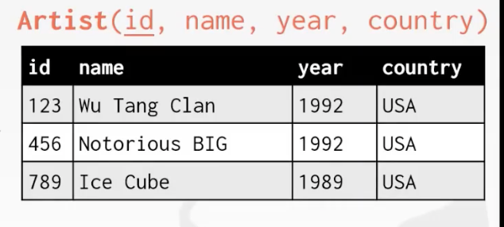

`外键（Foreign Keys）`：用于指定一张表中的属性必须存在于另一张表中。

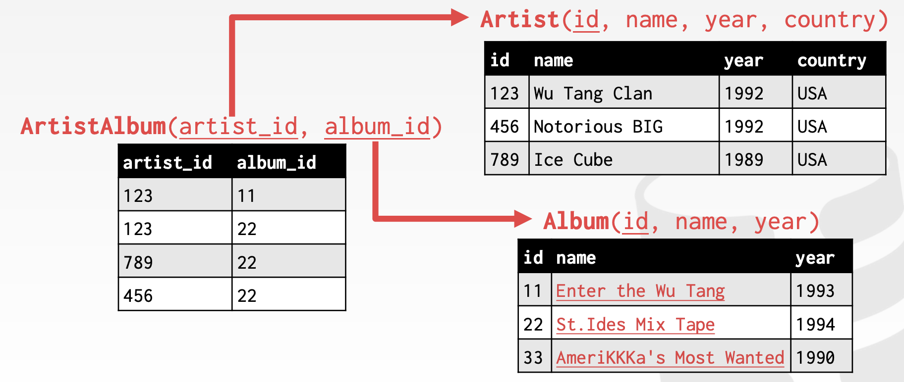


## 5. 数据操纵语言（DML）

**数据操纵语言（Data Manipulation Language, DML）**：负责对数据库对象运行数据访问工作的指令集。DML有两种方式

### 5.1 过程性（经典例子：`关系代数`）
Ted Codd 提出在关系代数中的7种最核心的关系运算符
#### 5.1.1 Select
>  查询复合条件的tuple的一个子集。

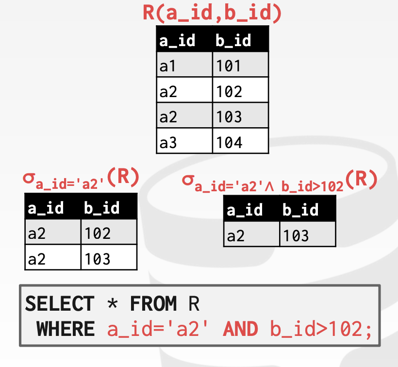
#### 5.1.2 Projection
> 生成一个新的输出关系，厘米包含一个给定输入关系中的指定属性。

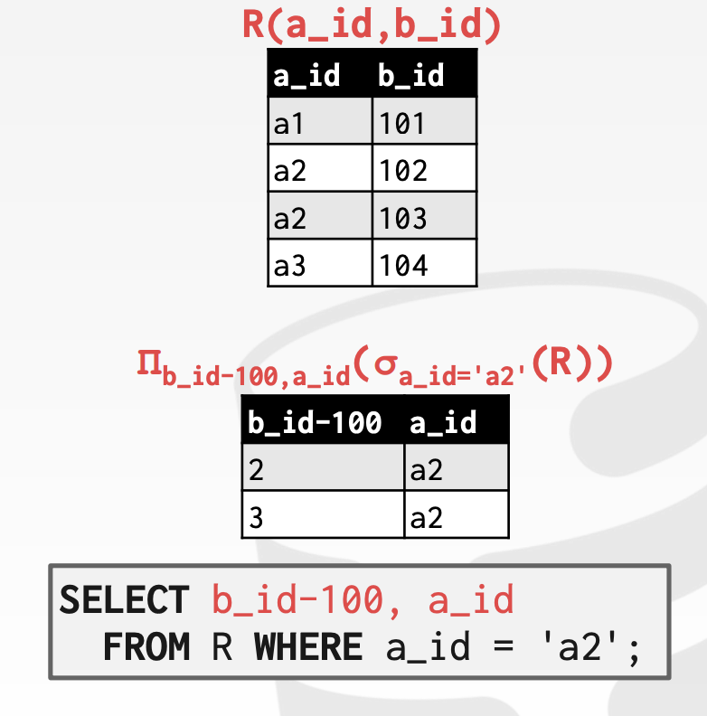
#### 5.1.3 Union
> 将两个关系组合成一个新的关系。（`并集`）

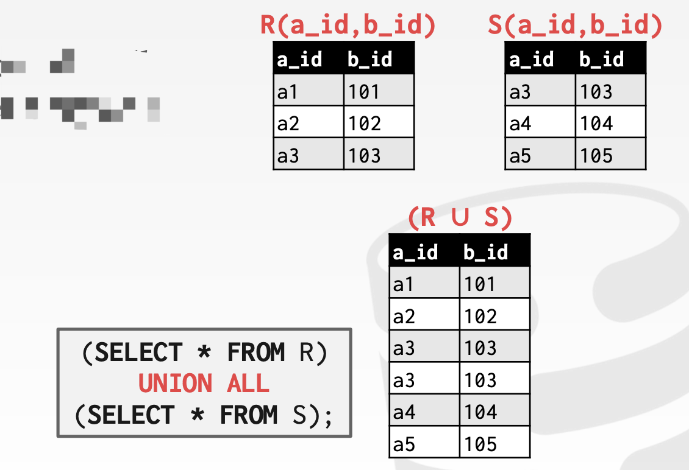
#### 5.1.4 Intersection
> 两个关系表里共同的部分。（`交集`）

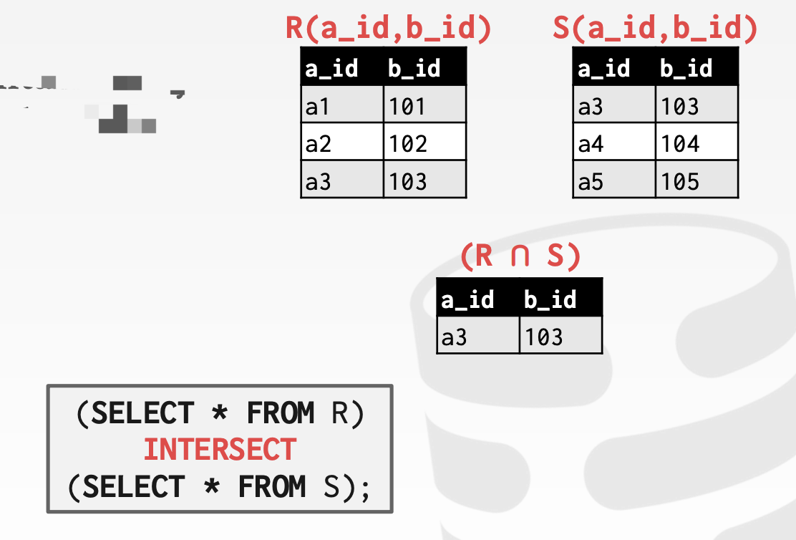
#### 5.1.5 Difference
> 从第一个元素集中将第二个元素集中出现的元素过滤掉。（`差集`）

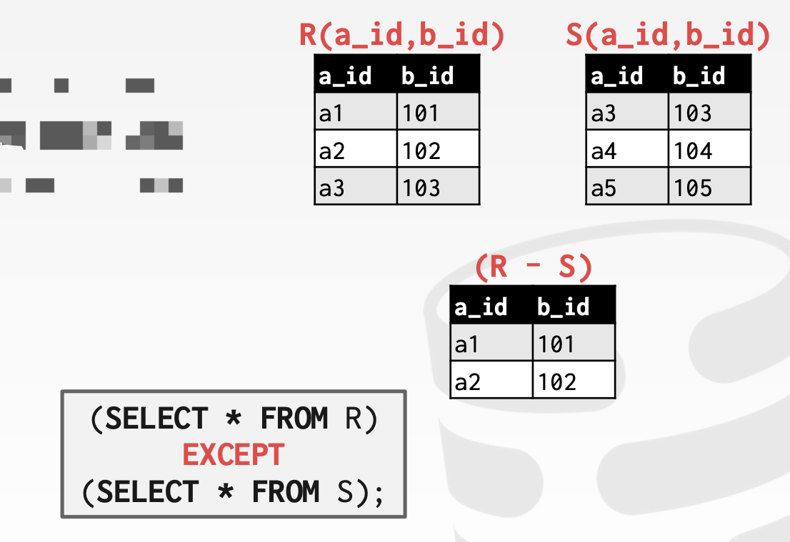
#### 5.1.6 Product
> `笛卡尔积`。所有可能性不重复的组合。

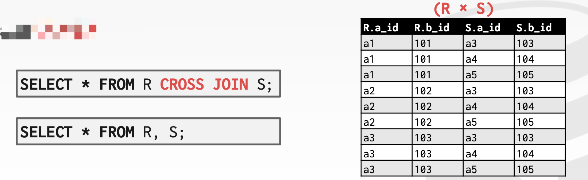
#### 5.1.7 Join
> 自然链接。

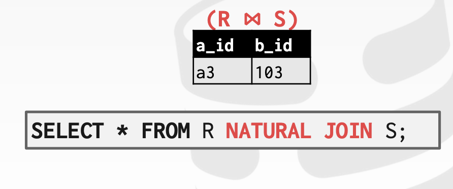

后续增加的关系代数
- Rename
- Assignment
- Duplicate Elimination
- Aggregation
- Sorting
- Division

### 5.2 非程序性或声明式（经典例子：`关系演算`）


## 6. 书籍阅读笔记
> 参考内容：《Database system concepts》 chapter01 and chapter02

### 6.1 chapter01
***数据库管理系统（DataBase-Management System，DBMS）*** 是一个`互相关联的数据的集合`和一组用以`访问数据的程序`组成。

数据集合称为`数据库（Database）`。
#### 6.1.1 数据库系统的应用
数据库的应用广泛，代表性的应用有：
- 企业信息
    - 销售
    - 会计
    - 人力资源
    - 生产制造
    - 联机零售
- 银行和金融
    - 银行业
    - 信用卡交易
    - 金融业
- 大学
- 航空业
- 电信业

#### 6.1.2 数据库系统的目标
文件处理系统是传统的操作系统所支持的。存在的弊端如下——
- 数据的冗余和不一致。
    > 冗余会导致存储和访问开销增大，也会导致数据不一致性。
- 数据访问困难。
- 完整性问题
    > 数据库中所存储数据的值必须满足某些特定的一致性约束。
- 原子性问题
- 并发访问异常
- 安全性问题

#### 6.1.3 数据视图
数据库系统的一个目的：给用户提供数据的抽象视图。

- 数据抽象
系统开发人员通过如下层次上抽象来对用户屏蔽复杂性，以简化用户与系统的交互：
    - 物理层：最低层次的抽象
        > 描述数据如何存储
    - 逻辑层：比物理层稍高的抽象。
        > 描述数据库中存储什么数据及这些数据间存在什么关系。
    - 视图层：最高层次的抽象。
        > 描述整个数据库的某个部分。

- 实例和模式
存储在数据库中的`信息的集合`称作数据库的一个 **`实例（instance）`**。

数据库系统的几个模式：`物理模式（在物理层描述数据库的设计）`、`逻辑模式（在逻辑层描述数据库的设计）`。

**`子模式`**：描述数据库的不同视图。

- 数据模型（四类）
    - 关系模型：表的集合来表示数据和数据间的关系。
    - 实体-联系模型（E-R模型）
    - 基于对象的数据模型
    - 半结构化数据模型：一般使用XML广泛用于此。

#### 6.1.4 数据库语言
- 数据定义语言（Data-definition language，DDL）
定义数据库模式。

数据库系统实现遵循的完整性约束：

```
域约束
参照完整性
断言
授权
```
- 数据操纵语言（data- manipulation language，DML）
表达数据库的查询和更新。
    - **国产化（procedural DML）**：用户指定需要什么数据以及如何获得数据。
    - **声明式（declarative DML，也叫非过程化DML）**：要求用户指定需要什么数据，而不是指明如何获得这些数据。

### 6.2 关系模型介绍
笔记暂无，参考课程笔记
