<h1 align="center">📔 Lecture02 高级SQL 课程笔记</h1>

## 1. SQL历史
`SQL：结构化查询语言`，所以早期IBM将其称为“SEQUEL”。

早期IBM用于System R项目的一部分，也是第一个尝试构建的关系型数据库系统。

在1983年，IBM开发出了DB2，同时也是支持SQL标准。

早期的Ted Codd的发表的论文，设计了`关系代数`以及`关系模型`，但并没有定义任何能够用来编写查询语句的编程语言。

1986年颁布ANSI标准，1987年颁布ISO标准，此后都简称为 ***`结构化查询语言（SQL）`*** 。

SQL不是一成不变，一般会有数据库厂商会遵循标准，从而在一定程序上进行独有扩展。
> SQL-92 标准是DBMS必须支持的最低版本

## 2. SQL命令
从技术层面来说，SQL并不是一门单一语言，而是`DML、DDL和DCL命令的集合`。
- `数据操作语言（Data Manipulation Language，DML）`：包括insert、update、delete、select等命令。
- `数据定义语言（Data Definition Language，DDL）`：通过schemas来创建表存储数据的方式。
- `数据控制语言（Data Control Language，DCL）`：安全性授权，访问控制等。

此外，还包含视图定义、完整性定义和参照限制以及事务等。

假设数据库中存在的几个表如下：

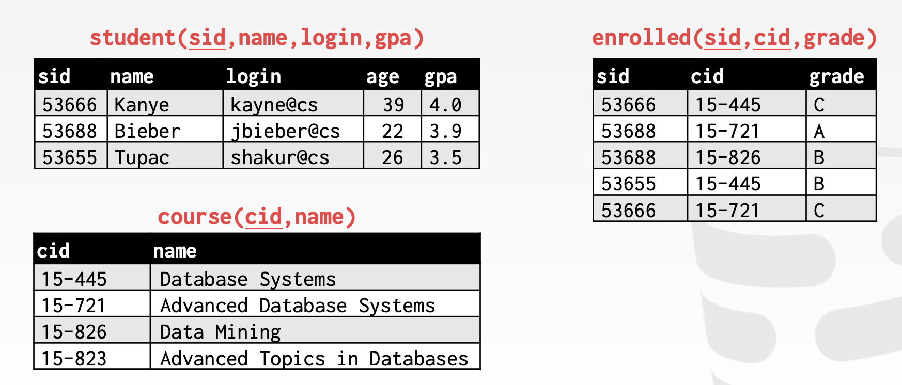
> 接下来的语句讨论均以该表进行。
## 3. 聚合

常见的几个聚合函数：
- `AVG(col)` -----> Return the average col value.
- `MIN(col)` -----> Return minimum col value.
- `MAX(col)` -----> Return maximum col value.
- `SUM(col)` -----> Return sum of values in col.
- `COUNT(col)` -----> Return # of values for col.
> 进行多个tuple值输入，但是通过计算某种聚合之后的返回值为单个。

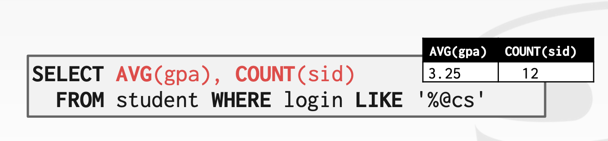

`COUNT()`, `SUM()`, `AVG()` 支持 `DISTINCT`。
> `DISTINCT` 的作用：获取不重复的属性值。

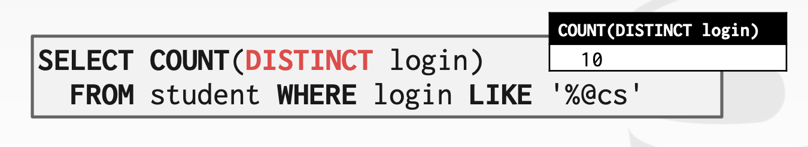

对于未定义的属性输出，老版本的MySQL允许进行不合规的操作，这种运行模式称为传统模式。

```sql
SELECT AVG(s.gpa), e.cid
FROM enrolled AS e, student AS s
WHERE e.sid = s.sid;
```

**`GROUP BY`子句**

将元组投影到子集并针对每个子集计算聚合。

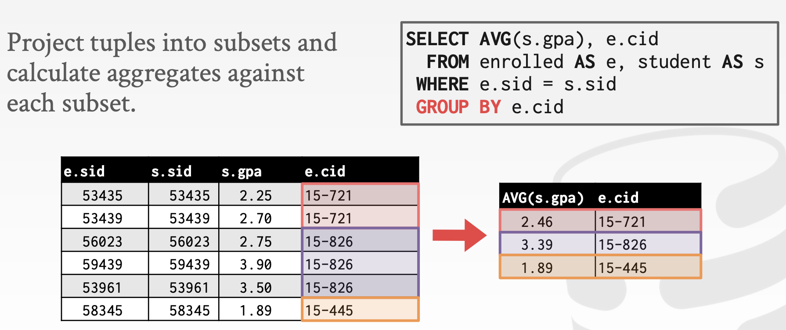

> SELECT 输出子句中的非聚合值必须出现在 `GROUP BY` 子句中。

**`HAVING`子句 ----> 过滤**

在GROUP BY基础上聚合计算`过滤`结果。 类似 `GROUP BY` 的 `WHERE 子句`

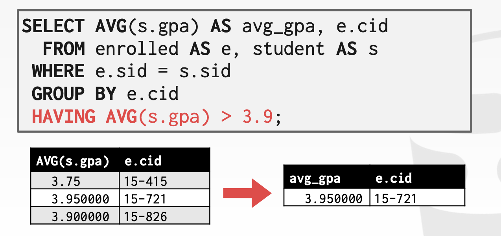

## 4. String操作

SQL 标准规定字符串 ***区分大小写***，并且只能使用单引号。 有一些函数可以操作可以在查询的任何部分使用的字符串。
> - SQLite大小写敏感。而MySQL是不区分大小写。

***模式匹配***：`LIKE` 关键字用于谓词中的`字符串匹配`。

- `“%”`匹配任何子字符串（包括空）。
- `“_”` 匹配任何一个字符。

***连接*** ：两个竖线`（“||”）`将两个或多个字符串`连接`成一个字符串

## 5. DATE/TIME操作
操作和修改日期/时间属性的操作。

可用于输出和谓词。 支持/语法变化很大。
## 6. 输出重定向

将查询结果存储在另一个表中的条件：
- 表必须尚未定义。
- 表将具有与输入相同类型的相同列数。

将查询中的元组插入到另一个表中的条件：
- 内部 SELECT 必须生成与目标表相同的列。
- DBMS 在处理完整性违规（例如，无效重复项）方面有不同的选项/语法。

## 7. 输出控制

```sql
ORDER BY <column*> [ASC|DESC]
```
> 按照输出元组的一列或多列中的值对输出元组进行排序。

- 若结果 SQL 是`无序`的，必须使用 `ORDER BY` 子句对元组进行排序

    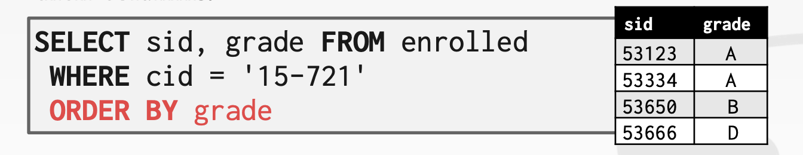

- 使用多个 `ORDER BY` 子句来打破关系或进行更复杂的`排序`：

    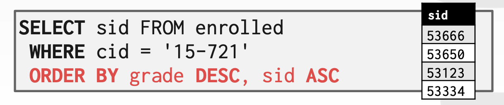

- 可以在 ORDER BY 子句中使用`任意表达式`：

    ```sql
    SELECT sid FROM enrolled WHERE cid = '15-721'
    ORDER BY UPPER(grade) DESC, sid + 1 ASC;
    ```

- 默认情况下，DBMS 将返回查询生成的所有元组。 可以使用 `LIMIT` 子句来限制结果元组的数量,也可以提供偏移量以在结果中返回一个范围：

    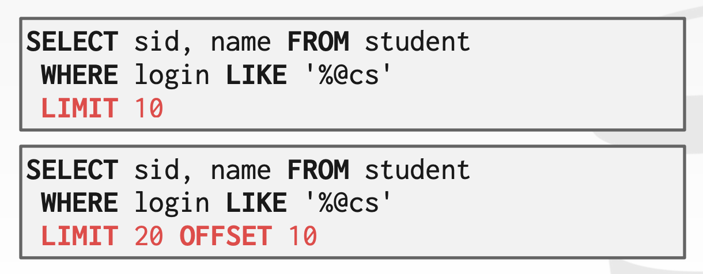

## 8. 嵌套查询
在其他查询中调用查询以在单个查询中执行更复杂的逻辑。 外部查询的范围包含在内部查询中（即内部查询可以从外部查询访问属性），但反过来不行。

***内部查询几乎可以出现在查询的任何部分***

常见的嵌套查询的操作符有：
- `ALL`：必须满足子查询中`所有行`的表达式。
- `ANY`：必须满足子查询中`至少一行`的表达式。
- `IN`：相当于 `'=ANY()'` 。
- `EXISTS`：至少返回一行。
- `NOT EXISTS`:返回不存在查询属性之外的结果。

## 9. Window 函数
跨元组执行“移动”计算。类似聚合，但它仍然返回`原始元组`。
> 可以通过增量方式或移动方式进行操作。

函数：窗口函数可以是任何聚合函数。 还有一些特殊的窗口函数.

语法格式：

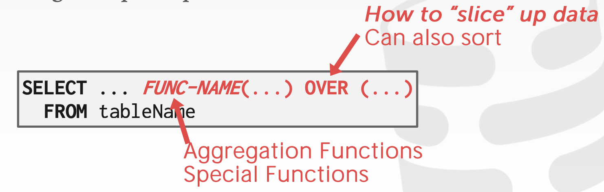
> - OVER子句：表示如何切分数据。


特殊的窗口函数：
- `ROW_NUMBER()`：当前行的 `顺序#`。
- `RANK()`：当前行的排序位置。


分组：`OVER` 关键字指定在计算窗口函数时如何将元组`组合`在一起。使用 `PARTITION BY` 指定组。

```sql
SELECT cid, sid, ROW_NUMBER() OVER (PARTITION BY cid)
FROM enrolled ORDER BY cid;
```

也可以在 `OVER 中`放置一个 `ORDER BY` 以确保结果的`确定性排序`，即使数据库在内部发生更改。

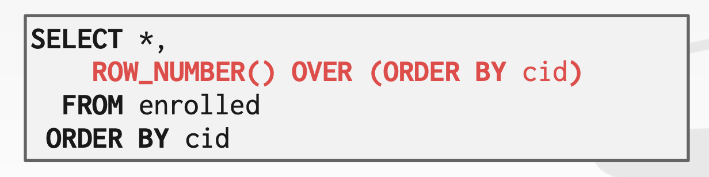

假设要获取成绩第2高的

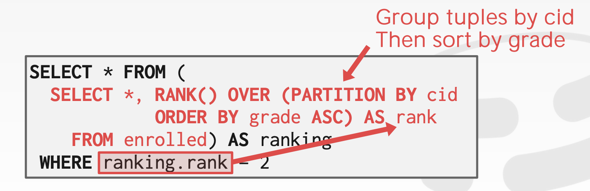

## 10. 公用表表达式CTE

`通用表表达式 (CTE) `提供一种编写辅助语句以用于更大查询的方法。想象成一个只用于一个查询的临时表。替代嵌套查询和视图。

`WITH 子句`将内部查询的输出绑定到具有该名称的临时结果。

示例：生成一个名为 cteName 的 CTE，它包含单个属性设置为“1”的单个元组。 然后底部的查询只返回 cteName 中的所有属性。

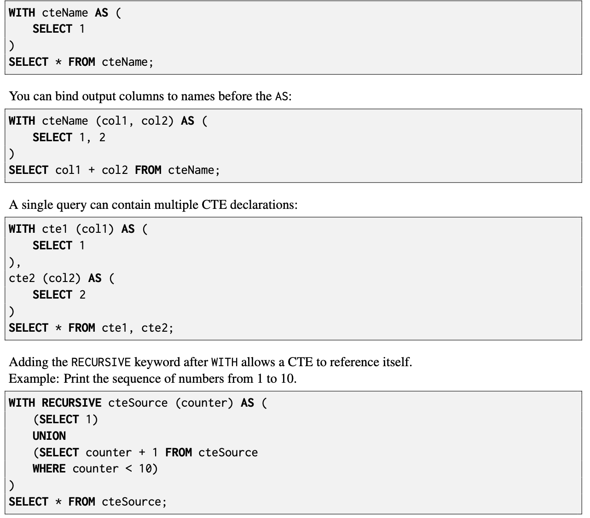

## 11. 书籍阅读笔记
### chapter03 SQL
#### 11.1 SQL查询语言
SQL语言包含的几部分：
- 数据定义语言（Data-Definition Language ,DDL）
- 数据操纵语言（Data-Manipulation Language，DML）
- 完整性（integrity）
- 视图定义（view definition）
- 事务控制
- 嵌入式SQL和动态SQL
- 授权

#### 11.2 聚合函数
聚合函数：以值的一个集合（集或多重集）为输入，返回单个值的函数。
- 平均值：AVG()
- 最小值：MIN()
- 最大值：MAX()
- 总和：sum()
- 计数：count()
### chapter04 中级SQL
#### 11.3 连接表达式
自然连接运算作用于两个关系，并产生一个关系作为结果。

`外连接`：与连接运算类似，通过在结果中包含空值元组的方式，保留了在连接中丢失的元祖。

三种外连接形式：
- `左外连接`：只保留出现在左外连接运算之前（左边）的关系中的元组。
- `右外连接`：只保留出现在右外连接运算之后（右边）的关系中的元组。
- `全外连接`：保留出现在两个东西中的元组。
> 右外连接和左外连接是`对称`的。`全外连接`是左外连接和右外连接的`组合`。

`内连接`：不保留未匹配元组的连接运算。
#### 11.4 完整性约束
完整性约束保证授权用户对数据库所做的修改不会破坏数据的一致性。

目的：防止对数据的意外破坏。

除了主键约束外，还有如下约束：

- 单个关系上的约束

- not null约束

- unique约束

- check子句

参照完整性：保证一个关系中给定属性集上的取值也在另一个关系的特定属性集的取值中出现。
#### 11.5 授权
- 权限授予grant

SQL数据定义语言包括授权和收回权限的命令。grant语句用来授予权限。语句的基本形式：

```sql
grant <权限列表>
on <关系名或视图名>
to <用户/角色列表>
```
> SQL标准包括`select、insert、update和delete`权限。

- 权限收回revoke

```sql
revoke <权限列表>
on <关系名或视图名>
to <用户/角色列表>
```

- 模式授权
SQL标准为数据库模式指定一种基本的授权机制：只有模式的拥有者才能执行对模式的任何修改。

SQL提供一种reference权限，允许用户在创建关系时声明外码。

### chapter05 高级SQL
#### 11.6 触发器
触发器是一条语句，当对数据库作修改时，自动被系统执行。要设置触发器机制，必须满足两个条件：
- 指明什么条件下执行触发器。被分解为一个引起触发器被检测的事件和一个触发器执行必须满足的条件。

- 指明触发器执行时的动作。

**触发器的需求**
触发器可以用来实现未被SQL约束机制指定的某些完整性约束，主要用来满足特定条件时对用户发警报或自动开始执行某项任务。

触发器系统通常不能执行数据库以外的更新。
#### 11.7 OLAP
`联机分析处理（OLAP）`系统是`交互式`系统，允许分析人员查看多维数据的不同种类的`汇总数据`。

- 能够模式化为维属性和度量属性的数据称为`多维数据`。

- 数据立方体以不同方式汇总的多维数据构成。预先计算数据立方体有助于提供汇总数据的查询速度。

- 交叉表的显示允许用户一次查看多维数据的两个维及其汇总数据。

- `下钻、上卷、切片和切块`是用户使用OLAP工具时执行的一些操作。

