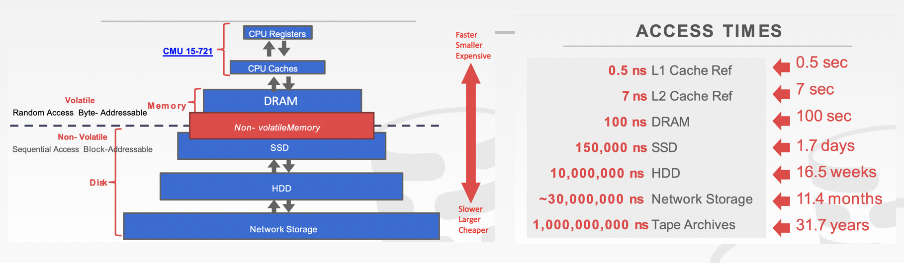
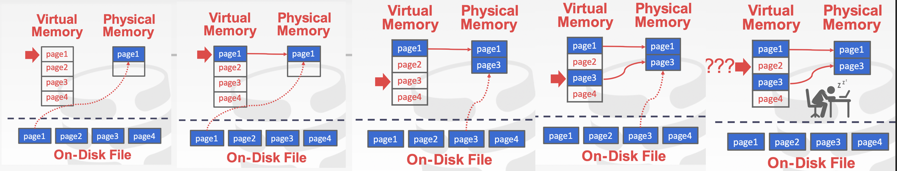
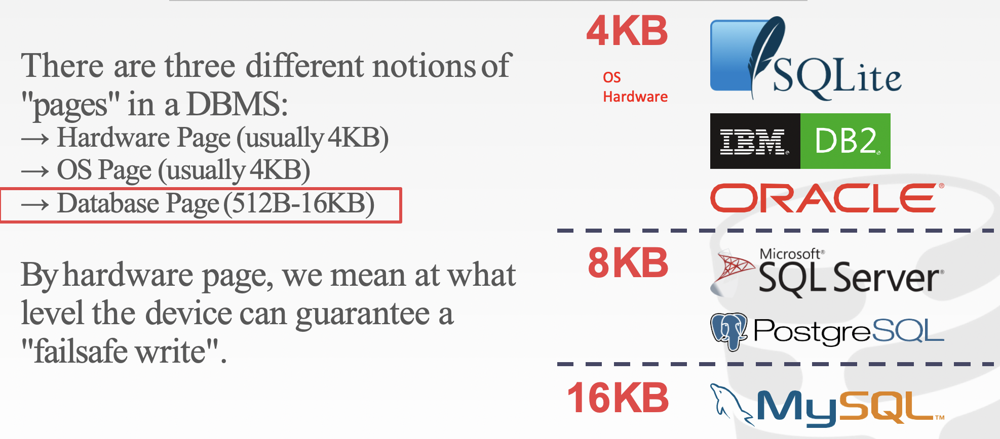
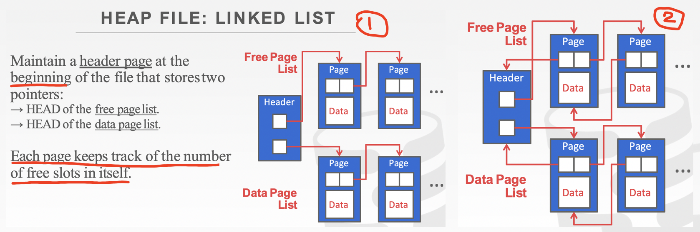
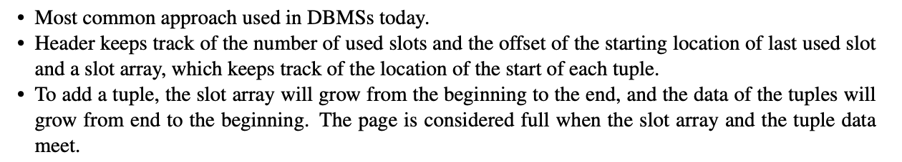
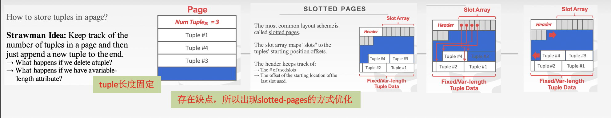
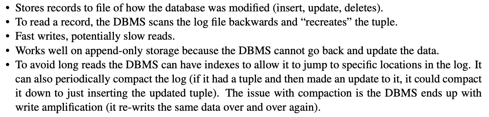

<h1 align="center">📔 Lecture03 database storage 课程笔记</h1>

## 内容和截图来源说明
> 关于 `存储设备` 相关细节内容，可阅读「[csapp ch06 中的存储器层次](../../main_ability/csapp/Ch06_note.md)」 章节知识点。
- CMU 15-445 课程PPT 及其pdf Notes
- 《数据库系统概念》帆书

## 1. Disk Manager概述
假设数据库的存储位置都放在磁盘中，传统数据库软件的DBMS架构是基于 `disk-oriented architecture`。所以在DBMS中都会有专门存储的的磁盘管理模块，主要管理数据从`非易失性存储`到`易失性存储`的移动。

关于非易失性存储系统，参考书籍：https://www.morganclaypool.com/doi/10.2200/S00891ED1V01Y201812DTM055

为了对数据库进行操作，DBMS需要将数据放入内存中，通过缓冲池来管理磁盘和内存之间的来回移动。

数据库系统有一个执行引擎来执行查询。执行引擎会向缓冲池请求一个特定页，缓冲池管理奖该页带入内存并向执行引擎指向内存中的页指针。

### 1.1 计算机中存储设备的层次结构

在存储器结构图中的最接近CPU的顶部存储设备，设备的速度非常快且昂贵，但存储容量较小。

存储设备分为两类：`非易失性存储` 和 `易失性存储`。

- 易失性存储设备：需要稳定的外部因素来维持它所存储的东西。
    - 易失性意味着当`机器断电`时，数据会丢失。
    - 支持具有`字节可寻址`位置的`快速随机访问`，意味着可以快速跳转到该设备的任意位置处从而获取相应的数据。
    - 易失性存储属于`字节可寻址`方式。

- 非易失性存储设备：不需要连续供电，也可以持久存储其中的所有内容。
    - 非易失性存储属于`块/页可寻址`方式。需要读取特定偏移量处的值，程序首先必须将4KB页面加载到保存程序想要读取的值的内存中。
    - 传统上比较擅长顺序访问（同一时间可读取多个数据块）。
    - 一般不对磁盘进行区分SSD或HDD（常见的光盘）。

- ⚠️注意点
    - 允许DBMS管理超出可用内存量的数据库。
    - 对磁盘的读/写开销大，因此必须谨慎管理以避免大停顿和性能下降。
### 1.2 为什么不直接调用OS中的mmap？

在OS中，虚拟内存称为`内存映射模块`，在`POSIX`中，称为`mmap`。

本质：从磁盘中获取内容，告知OS将文件页映射到进程的地址空间中，最后再对内存地址进行读写操作。

OS负责`移动数据`，以便将文件页移入和移出内存。

如果通过mmap将文件保存到某个进程的地址空间，无须自己控制数据库和关注背后的事情，直接让OS进行处理。但如果只读取数据，可使用系统调用来处理问题。

**问题的解决方案**：
- `madvice`：告知OS希望如何阅读某些页。
- `mlock`：告知OS内存范围不能被分页。
- `msync`：告知OS将内存范围刷新到磁盘。

## 2. File Storage
DBMS将数据库作为一个或多个文件永久存储在磁盘上。文件由底层的OS来维护，但OS只当他们是普通文件（一堆二进制数据），不知道如何解读，所以需要特定的软件来进行读取。
> 一个文件在逻辑上组织成为记录的一个序列。

每个文件在逻辑上被分成`定长`的存储单元称为`块`。块是`存储分配`和`数据传输`的基本单元。大多数数据库默认使用 `4 ～ 8KB`的大小。

1980年代的早期数据库系统在原始存储上使用自定义的文件系统（直接用新硬盘，而不是使用前将它格式化并将它的格式设置为NTFS等）。但现代DBMS一般不会自己造一个专属的文件系统。具体原因如下：
- `自制文件系统`可在性能上提升10%左右，但是管理文件系统又是一个坑，使得`可移植性大大降低`。

综合多个角度分析，这种方式不值得考虑。

### 2.1 Storage manager
`存储管理器（也叫存储引擎）`是数据库系统中的一个组件，专门`维护在磁盘上的数据库文件`，改善页的空间和时间局部性，将文件组织为一个page的集合。
- 可跟踪要在page上执行的所有读取/写入操作。
- 便于跟踪可用空间。

通常一个page是一个`固定大小`的`数据块`。一个文件可保存任何内容，包括数据库里面的`tuple、元数据、索引、日志记录`等。一般情况下，大多数DBMS不会将`不同类型数据混合存储在同一个page`上。

> 有些数据库系统会要求page是`self-contained`的。

每一个page都有一个内部唯一标识符，DBMS使用`indirection layer`的方式将page ID映射到某个集合中一个文件中的某个物理位置。不同类型的page占用的大小也不一样。

不同的DBMS管理磁盘上文件中的页有不同的方式。
- Heap File Organization
- Sequential / Sorted File Organization
- Hashing File Organization

在存储管理器最底层的级别中，不需要了解页面内部的任何内容，就可以对page进行read或delete操作。

### 2.2 Database Heap
数据库中的`heap文件`是一个`无序`的page集合（即可随机顺序把tuple数据保存在里面，也必须支持遍历所有pages）。需要元数据来跟踪哪些page存在以及哪些page有可用空间。

在内部，通过不同的方式来表示heap文件，例如：
- `Linked List`
    - free page list
    - data page list

    

一个链表中，header page维护两个page指针列表。

- `Page Directory`
DBMS维护特殊page，用于跟踪数据库文件中数据页面的位置。DBMS 必须确保目录页与数据页保持同步。

### 2.3 Page Layout
每个page都包含 `header` 和 `data`。header用于记录有关page`内容的元数据`：
- Page Size
- Checksum
- DBMS Version
- Transaction Visibility
- Compression Information

一些系统要求page是`self-contained`的（例如，Oracle）。

### 2.4 data Layout
data主要记录实际存储的数据。记录数据的形式有2种：
- Tuple-oriented：记录数据本身
- Log-structured策略：记录操作日志
#### 2.4.1 Tuple-oriented
`strawman approach`：跟踪DBMS在page中存储了多少元组，然后每次添加一个新元组，都会附加到末尾。然而，需要删除一个元组或当元组具有可变长度时就会出现问题。

但是这种方法存在缺点：
- 会出现不是固定长度tuple，可能会出现没有足够的空间去保存tuple。
- 当需要删除tuple时，也需要去维护顶部的元数据。当要插入data时，就需要对page进行循序遍历一遍，找到要插入的位置。

slot数组是将一个特定的slot映射到page上的某个偏移量。常见的方式：一条记录的位置是由page id 和 slot number一起共同确定tuple的位置。

一般不在数据库中存储视频文件，因为单个page会存储不足。必须通过一些额外的元数据和指针来表示所要查找的剩余部分的数据的page所在位置。

#### 2.4.2 Log-structured file
DBMS不存储元组，而是存储操作日志记录。系统会将日志记录附加到数据库修改方式的文件中。

### 2.5 Tuple Layout
元组本质上是一个`字节序列`。DBMS职责：将`字节`解释为`属性类型`和`值`。

每个元组都有一个包含元数据的header作为前缀。
- DBMS并发控制协议的可见性信息（即关于哪个事务创建/修改了该元组的信息）。
- NULL值的位图

不需要存储关于数据库架构模式的元数据。

元组数据：属性的实际数据。
- 属性通常是按照在创建表时制定的顺序存储。
- 大多数DBMS不允许元组超过page的大小。

唯一标识符：
- 数据库中的每个元组都分配有唯一标识符。
- 最常见：page id + 偏移量或槽位
- 应用程序不能依赖这些id来表示任何含义。

非规范化元组数据：如果两个表相关，DBMS可以预链接两个表，让两个表最终位于同一个page上。使得读取速度更快，因为DBMS加载一个page而不是单独的page，但会使得更新成本更高，因为DBMS需要为每个tuple提供更多的空间。

 ## 3. 数据表示
元组的数据本质上只是`字节数组`。由DBM知道如何解释这些字节以及导出属性值。

数据表示方案是DBMS如何存储值的字节。在元组中存储的四种数据类型：整数、可变精度数、定点精度数
可变长数据。
### 3.1 整数
大多数 DBMS 使用 IEEE-754 标准指定原生C/C++ 类型存储整数。这些值是`固定长度`的。

示例：INTEGER、BIGINT、SMALLINT、TINYINT。

### 3.2 变长数据
使用IEEE-754 标准指定的原生C/C++ 类型的不精确、精度可变的数字类型。值也是固定长度的。

可变精度数比任意精度数的计算速度更快，因为 CPU 可以直接对它们执行指令。

示例：FLOAT, REAL.。

### 3.3 定长数据

