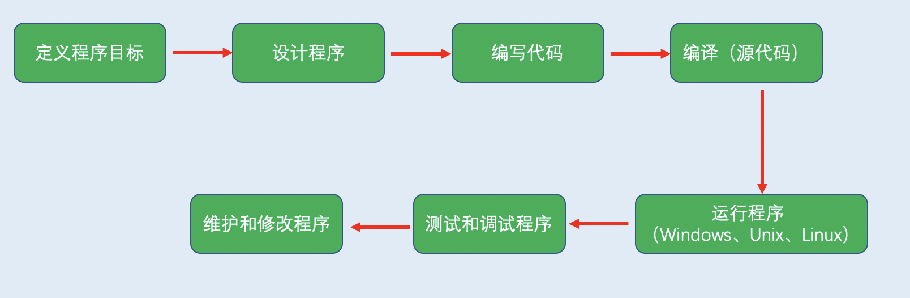
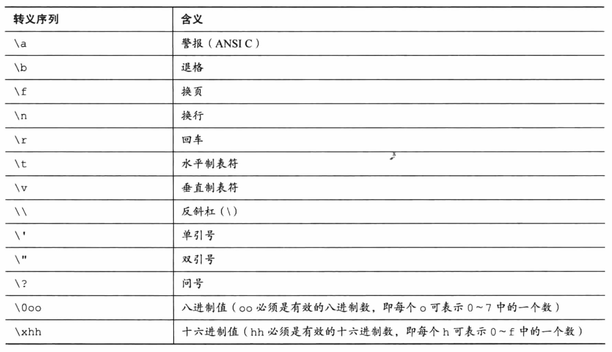
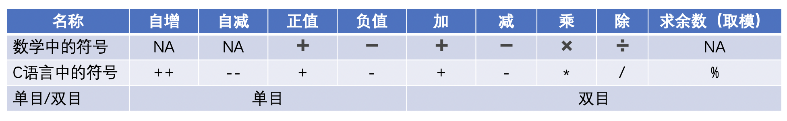
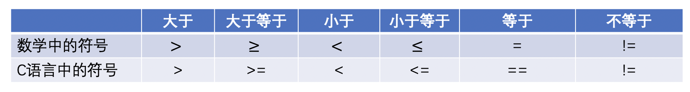
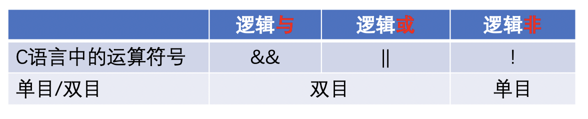
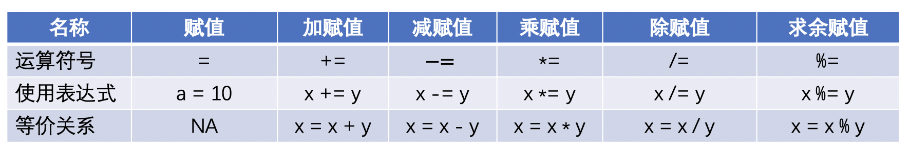
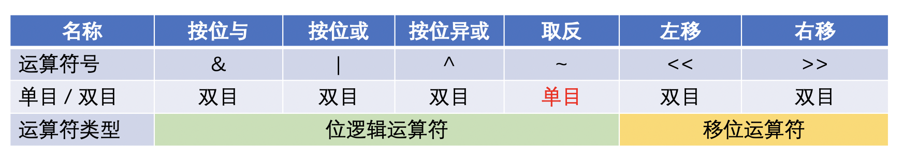
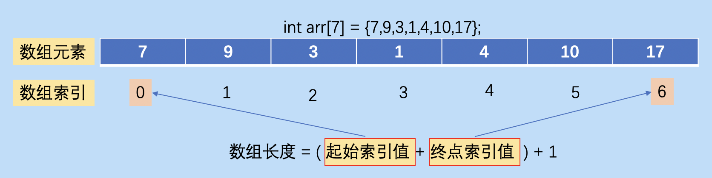

<h1 align = "center">📔 C语言 学习笔记总结 </h1>


- [00. 内容说明](#00-内容说明)
- [01. C语言概述](#01-c语言概述)
  - [1.1 C语言起源](#11-c语言起源)
  - [1.2 C语言应用场景](#12-c语言应用场景)
  - [1.3 C语言的优缺点](#13-c语言的优缺点)
  - [1.4 C语言的7个步骤](#14-c语言的7个步骤)
  - [1.5 C语言的标准](#15-c语言的标准)
- [02. 环境准备](#02-环境准备)
- [03. 程序设计语言的语法](#03-程序设计语言的语法)
  - [3.1 一个程序的基本结构](#31-一个程序的基本结构)
  - [3.2 基本一些语法要素](#32-基本一些语法要素)
- [4. 数据类型](#4-数据类型)
  - [4.1 变量和常量](#41-变量和常量)
  - [4.2 存储单位](#42-存储单位)
  - [4.3 int类型](#43-int类型)
  - [4.4 char类型](#44-char类型)
  - [4.5 布尔类型](#45-布尔类型)
  - [4.6 浮点型](#46-浮点型)
  - [4.7 void类型](#47-void类型)
- [5. 运算符与表达式](#5-运算符与表达式)
  - [5.1 运算符](#51-运算符)
  - [5.2 表达式](#52-表达式)
- [6. 循环控制语句](#6-循环控制语句)
  - [6.1 while语句](#61-while语句)
  - [6.2 for循环](#62-for循环)
  - [6.3 do...while语句](#63-dowhile语句)
  - [6.4 循环的小总结](#64-循环的小总结)
  - [6.5 break语句](#65-break语句)
  - [6.6 continue语句](#66-continue语句)
  - [6.7 goto语句](#67-goto语句)
- [7. 分支判断语句](#7-分支判断语句)
  - [7.1 if、if...else语句](#71-ififelse语句)
  - [7.2 switch语句](#72-switch语句)
- [8. 函数](#8-函数)
  - [8.1 函数相关的概念](#81-函数相关的概念)
  - [8.2 为什么需要函数？](#82-为什么需要函数)
  - [8.3 函数分类](#83-函数分类)
    - [8.3.1 库函数](#831-库函数)
    - [8.3.2 自定义函数](#832-自定义函数)
  - [8.4 函数原型的声明](#84-函数原型的声明)
  - [8.5 函数参数](#85-函数参数)
  - [8.6 函数调用](#86-函数调用)
  - [8.6 作用域问题](#86-作用域问题)
  - [8.7 栈帧的概念](#87-栈帧的概念)
  - [8.8 递归函数](#88-递归函数)
  - [8.9 递归的经典例子](#89-递归的经典例子)
  - [8.10 带参数的main() 函数](#810-带参数的main-函数)
- [9. 数组](#9-数组)
  - [9.1 声明数组](#91-声明数组)
  - [9.2 初始化数组](#92-初始化数组)
    - [9.2.1 给所有元素赋值](#921-给所有元素赋值)
    - [9.2.2 给部分元素赋值](#922-给部分元素赋值)
    - [9.2.3 实例](#923-实例)
    - [9.2.4 数组的一些性质](#924-数组的一些性质)
  - [9.3 访问数组元素](#93-访问数组元素)
  - [9.4 为什么需要数组？](#94-为什么需要数组)
  - [9.5 数组的优缺点](#95-数组的优缺点)
  - [9.6 数组的注意点](#96-数组的注意点)
  - [9.7 二维数组](#97-二维数组)
    - [9.7.1 多维数组](#971-多维数组)
    - [9.7.2 二维数组](#972-二维数组)
    - [9.7.3 二维数组的元素访问](#973-二维数组的元素访问)
  - [9.7.4 三维数组](#974-三维数组)
  - [9.7 数组实例：冒泡排序](#97-数组实例冒泡排序)
    - [9.7.1 实现原理](#971-实现原理)
    - [9.7.2 冒泡排序代码实现](#972-冒泡排序代码实现)
    - [9.7.3 冒泡排序的优化方案](#973-冒泡排序的优化方案)
- [10. 指针](#10-指针)
  - [10.1 内存地址](#101-内存地址)
  - [10.2 指针定义与使用](#102-指针定义与使用)
  - [10.3 `左值`和`右值`](#103-左值和右值)
  - [10.4 野指针](#104-野指针)
  - [10.5 空指针](#105-空指针)
  - [10.5 万能指针/泛型指针](#105-万能指针泛型指针)
  - [10.6 指针与函数](#106-指针与函数)
    - [10.6.1 指针函数 --- 返回指针的函数](#1061-指针函数-----返回指针的函数)
    - [10.6.2 函数指针 --- 指向函数的指针](#1062-函数指针-----指向函数的指针)
  - [10.7 指针与数组](#107-指针与数组)
    - [10.7.1 指针数组 --- 指针变量组成的数组](#1071-指针数组-----指针变量组成的数组)
    - [10.7.2 数组指针 --- 指向数组的指针](#1072-数组指针-----指向数组的指针)
    - [10.7.3 指针和数组的差异](#1073-指针和数组的差异)
  - [10.8 指针运算](#108-指针运算)
    - [10.8.1 指针自增++](#1081-指针自增)
  - [10.9 const修饰指针的特性](#109-const修饰指针的特性)
  - [10.10 指针的指针](#1010-指针的指针)
- [11. 字符串](#11-字符串)
  - [11.1 字符串的操作函数](#111-字符串的操作函数)
    - [11.1.1 字符串`比较` -- `strcmp()` 和 `strncmp()`](#1111-字符串比较----strcmp-和-strncmp)
    - [11.1.2 字符串拷贝 `strcpy()` 和 `strncpy()`](#1112-字符串拷贝-strcpy-和-strncpy)
    - [11.1.3 查找子串第一次出现的位置和统计子串出现的次数](#1113-查找子串第一次出现的位置和统计子串出现的次数)
    - [11.1.4 字符串拼接：`strcat()` 和 `strncat()`](#1114-字符串拼接strcat-和-strncat)
    - [11.1.5 字符串`格式化输入sscanf()`、`输出sprintf()`](#1115-字符串格式化输入sscanf输出sprintf)
    - [11.1.6 字符串中查找字符](#1116-字符串中查找字符)
    - [11.1.7 字符串分割：`strtok()`](#1117-字符串分割strtok)
    - [11.1.8 字符串长度：`strlen()`](#1118-字符串长度strlen)
    - [11.1.9 字符串逆置](#1119-字符串逆置)
    - [11.1.10 判断回文字符串](#11110-判断回文字符串)
- [12. 结构体、共用体和其它类型](#12-结构体共用体和其它类型)
- [13. 声明](#13-声明)
- [14. 文件操作](#14-文件操作)
- [15. 预处理命令](#15-预处理命令)
- [16. 强制类型转换](#16-强制类型转换)
- [17. 存储类别和内存管理](#17-存储类别和内存管理)
- [18. 命令行参数](#18-命令行参数)
- [19. 错误调试或处理](#19-错误调试或处理)
- [20. 指针进阶](#20-指针进阶)
- [21. C语言风格规范](#21-c语言风格规范)
- [资源参考](#资源参考)

## 00. 内容说明
主要以自我归纳总结的笔记为主。

图片来源很多以《C Primer Plus》作为参考，直接使用。

在使用学习该内容时，建议查看内容 【[计算机科学导论](./../../main_ability/computer_science/)】部分学习基础必备的知识点。如果看过或者不需要的直接略过。


## 01. C语言概述
### 1.1 C语言起源
- 时间：1972年
- 地点：贝尔实验室
- 创始人：丹尼斯.里奇（Dennis Ritch）和肯·汤姆逊（Ken Thompson ） 
- 起因：在开发UNIX操作系统时设计了C语言。在B语言基础上进行设计，起源于B语言。

### 1.2 C语言应用场景
- 驱动设备
- Linux驱动设备
- 嵌入式
- IoT
- PC开发
- 操作系统
- 机器人系统
- 微处理器开发
    - 自动驾驶、相机
    - 无人机
    - 打印机
- 编译器、解释器等
- 数据库mysql
### 1.3 C语言的优缺点
- 优点
    - 运行效率高
    - 处理能力强
    - 可移植性强
    - 强大而灵活
    - 可与硬件直接交互
    - 面向过程的结构化编程语言
- 缺点
    - 指针问题是硬伤，难以被及时发现

### 1.4 C语言的7个步骤


- 定义程序的目标
- 设计程序
- 编写代码
- 编译（源代码）
- 运行程序
    - 常见的环境（Windows、UNIX终端模式和Linux终端模式）
- 测试和调试程序
- 维护和修改程序

### 1.5 C语言的标准
- 第一个ANSI/ISO C标准

    - 时间：1989年正式公布
    - 该标准（ANSI）定义了C语言和C标准库
    - 国际标准化组织于1990采用这套标准和ANSI C是完全相同的标准。

- C99 标准
    - 1994年修订了C标准，最终发布了C99标准。

- C11标准
    - 2007年承诺C标准的下一个版本是CIX。2011年发布了C11标准。

## 02. 环境准备
详细查看一些博主的  博客内容，本内容不属于内容重点。

## 03. 程序设计语言的语法

### 3.1 一个程序的基本结构

```c
#include<stdio.h> // 包含另一个文件，C编译器软件包的标准部分，提供键盘输入和屏幕输出的支持。
/**#include 指令和头文件
 * 是一条C预处理器指令（preprocessor directive），C编译器在编译前会对源代码做一些准备，即预处理（preprocessing）。
 *
 * stdio.h 文件的含义是标准输入/输出头文件。通常，在C程序顶部的信息集合被称为头文件（header）。
 */

int main(void) /*一个简单的C程序*/
/** main()函数
 * C程序一定要从main()函数开始执行，除了main()函数，可以任意命名其他函数。圆括号是用于识别main()是一个函数。
 */
{
/** 花括号、函数体和块
 * {
 *  ...
 * }
 * 
 * 所有的C函数都使用花括号标记函数体的开始和结束。
 * 不能省略
 */
    int num; 
    /**声明一个名为num的变量，int是C语言的一个关键字（keyword），表示一种基本的C语言数据类型，
     * num是一个标识符（identifier），也就是一个变量、函数或其他实体的名称。
     * 
     */
    num = 7; /*为num赋一个值*/

    printf("I'm a simple "); /*使用printf()函数打印信息*/
    printf("Computer .\n");
    printf("My favorite number is %d . \n",num); /*换行符是一个转义序列，转义序列用于代码难以表示或无法输入的字符，如 \t 代表 Tab键*/

    return 0; 
} //结束
```
> 程序由一个或多个函数组成，必须有main() 函数。
>
>函数由 函数头 和 函数体 组成。
>    - 函数头包含函数名、传入函数的信息类型和函数的返回类型。
>    - 函数体被花括号括起来，由一系列语句、声明组成。


### 3.2 基本一些语法要素
- 标识符
    
    在C语言中，***`标识符的规则：字母、数字和下划线组成，其中第一个字母不能是数字`*** 。
    - 关键字（保留字）
        - 有特定含义和专用的标识符
        - 类型相关：int、char、float、double、long、enum、typedef等
        - 语句相关：if、else、while、for、do-while、break、continue、goto等
    - 用户自定义字符
        - 主要用来定义 ***`变量名、函数名、数据类型名和符号常量名`*** 。
        - 一般名字要 **`读其名而知其意`**（为了可读性考虑）

- 变量和常量
    - 变量：程序执行过程中会`发生变化`或者被赋值。
        ```c
        // 变量定义的基本格式：
        // 类型名 变量名;
        int num;
        num = 10;
        ```
    - 常量：程序执行过程中不会变化。

- 分隔符
    - `[]`、`()`、`#`、`;`等。

- 运算符
    - 对各种数据类型的对象的运算。
    - 分为三种类型
        - 单目运算符
        - 双目运算符
        - 三目运算符

- 表达式
    - 运算符与运算对象的组合构成了表达式。

- 程序语句
    - 分支语句
    - 循环语句
    - 复合语句    

- 函数
    
    函数：完成特定任务（功能）的独立模块
    - 函数的定义的包含两个部分：
        - 函数头
        - 函数体

- 输入/输出
    - C语言中~~没有输入/输出语句~~，直接使用`系统标准库（stdio.h`）函数中的函数。例如
        - `scanf()`：输入函数
        - `printf()`：输出函数

基本的程序结构都会包含这些要素，细节会在后面一一展开。


## 4. 数据类型
数据：承载信息的数字和字符。

C语言的数据类型关键字：int、long、short、char、float、double、void、signed、unsigned、_Bool。

- int表示整数类型
- char用于指定字母或其它字符，也可表示较小整数。
- float和double表示小数点的数
- _Bool类型表示布尔值（true和false）


### 4.1 变量和常量

- 常量（constant）：程序执行过程中不发生变化。
    - 常量数据：编译器一般通过用户书写的形式来识别类型。

- 变量（variable）：程序执行期间会发生变化或者被赋值。
    ```c
    // 变量定义的基本格式：
    // 类型名 变量名;
    // 定义变量，再进行初始化
    int num;   // 变量声明定义
    num = 10; // 给变量赋值

    // 定义变量的同时进行初始化
    int digit = 77;

    // 如果要声明多个同类型的变量，直接使用 分号 直接分隔开即可
    int a,b,c,d;
    ```
### 4.2 存储单位
- 位、字节和字是描述计算机数据单元或存储单元的术语。

- 最小的存储单元 ----> 位(bit)，可存储0或1，也是计算机内存的基本构建块。

- 常用的存储单位 ----> 字节（byte）,1 字节 = 8 bit（位）

- 设计计算机时给定的自然存储单位 ----> 字（word）1字长 = 8位。
### 4.3 int类型
int类型是有符号整型，即int类型的值必须是整数（正整数、负整数或零）。其取值范围取决于计算机系统。

> 一般情况下，存储一个int占用一个机器字长。

- int ----> 系统给定的基本整数类型，C语言规定int类型不小于16位。
- short 和 short int ----> 最大的short类型整数小于或等于最大的int类型整数。C语言规定short类型至少占16位。
- long或long int ----> 可表示整数大于或等于最大的int类型整数。C语言规定long类型至少占32位。
- long long 或 long long int ----> 可表示的整数大于或等于最大的long类型整数。Long long类型至少占64位。

无符号整型只能表示零和正整数。在整数类型前加上 unsigned关键字 表明变量为无符号整型。
> 无符号整型可表示的正整数比有符号整型的大。

```c
// 方式1：整型声明
int years,month,week,days;
// 方式2：整型声明定义
int years = 1;
int month = 12;
int weeks = 52;
int days = 365;
```
初始化变量 初始化变量：为变量赋一个初始值（在变量后面加上赋值运算符（=）和待赋给变量的值即可）。

⚠️ 注意：最好不要把初始化的变量和未初始化的变量放在同一条声明中。

👉 总结：声明为变量创建和标记存储空间，并为其指定初始值。


### 4.4 char类型
char 类型用于存储字符（如字母或标点符号）。

> 技术角度，char是整数类型（实际上存储的是整数而不是字符）。

计算机用ASCII编码来处理字符，即特定的整数表示特定的字符。

char类型被定义为8位（1字节）的存储单元。

- 声明和初始化

    ```c
    char grade0 = 'A';
    char grade1 = A;
    char grade2 = "A";
    ```
    - 如果使用`单引号`括起来的单个字符，称为`字符常量`。
    - 如果使用`双引号`括起来，则认为是`字符串`。

- 非打印字符

    单引号只适用于字符、数字和标点符号。但表示特殊行为的符号序列。则只能通过转义序列来打印。常见
的转义序列及其含义如下：

    

    ⚠️注意：在使用ASCII码时，注意数字和数字字符的区别。

### 4.5 布尔类型
布尔值表示true和false。C语言用1表示true，0表示false。

_Bool ----> 布尔类型的关键字。布尔类型是无符号int类型，所占用的空间只能存储0或1即可。

### 4.6 浮点型
实浮点类型可表示 `单精度浮点型` 和 `双精度浮点型`。

- float ----> 单精度浮点型，系统的基本浮点类型，可精确到至少6位有效数字。
- double ----> 双精度浮点型，存储范围更大，能表示至少10位有效数字和更大的指数。

### 4.7 void类型
void类型指定没有可用的值。一般会有三种情况：
- 函数返回为空
    - C中各种`函数返回值为空`。

- 函数参数为空
    - 函数中`不接受任何参数`。不带任何参数的函数可以接受一个void。

- 指针指向void
    - 类型为 `void*` 的指针代表对象的地址，而不是类型。

## 5. 运算符与表达式

运算符的大类划分为三类：
- 单目运算符：只需要一个操作数
- 双目运算符：需要两个操作数
- 三目运算符：三个表达式组成一个条件表达式。


### 5.1 运算符
- 算术运算符

    - 有两类：
        - 单目运算符
        - 双目运算符
    
    
    - 自增/自减运算符的总结
        - 都等价于 `n = n + 1` 或 `n = n - 1`，但执行方式上有区别。
        - 前缀方式`（++n/--n）`：先执行 `n = n + 1(n = n - 1)`，再将n的值作为表达式 ++n/--n的值。
        - 后缀方式`（n++/n--）`：先将n的值作为表达式`n++/n--`的值，再执行`n = n + 1(n = n - 1)`。
        - 运算对象只能是变量，不能是常量或表达式。

- 关系运算符

    - 双目运算符
    - 测试条件的状态，

    

- 逻辑运算符

    
    - 总结：
        - `&&` ： 两个为真，则为真
        - `||`：其中之一为真，则为真。
        - `!`：真则假，假则真。

- 赋值运算符

    - C语言中，= 不意味着 “ 相等 ”，而是一种赋值运算符。
    - 赋值表达式的一般格式为：
    ```c
    // 变量 赋值运算符 表达式
    int x,y,z;
    x *= y - 7 * z; // 等价于 x = x * (y - 7 * z)， 注意后面是一个整体，需要加个括号
    ```

    

- 条件表达式

    C语言中的`唯一一个三目运算符`。三个表达式连接在一起。基本形式及示例：
    ```c
    // 表达式1 ? 表达式2 : 表达式3
    int x,y,z;
    x > y ? x : y;
    // if...else 语句后续会细述
    // 上述语句等价于
    if (x > y)
        z = x;
    else
        z = y
    ```
    - 说明：如果表达式1为True，则结果为表达式2，否则结果为表达式3。

- 位运算符

    - 二进制位的运算。分为两类：
        - 位逻辑运算符
        - 移位运算符：以 `二进制位` 为单位进行左移或者右移。

    

    - 使用注意事项：
        - 操作数只能是`整型`或者`字符型的数据`以及对应的变体。
        - 位逻辑运算符的使用规则：将操作数（int或char类型）转换为二进制，然后进行按位运算。
        - 移位运算符的小Tips（一般情况下）：
            - 右移1位相当于除以2，右移2位则除以4。
            - 左移1位相当于乘以2，左移2位则乘以4。


- sizeof() 运算符
    - 单目运算符
    - 用途：返回变量或数据类型的字节字节。
    - 好处：增强程序代码的可移植性。

- 指针相关运算符
    - `*` ：间接访问运算符
    - `&` ：取地址运算符

### 5.2 表达式
表达式：运算符和运算对象组成的有意义的式子。

C语言中，有很多对应的运算符都有对应的表达式：
- 算术表达式
- 赋值表达式
- 关系表达式
- 逻辑表达式
- 条件表达式

## 6. 循环控制语句
用于执行某些语句，如果某些条件满足语句，则重复执行循环语句。

- 循环语句分为三种类型：
    - while循环语句
    - for循环语句
    - do...while循环语句
- 循环控制语句
    - break语句
    - continue语句
    - goto语句

### 6.1 while语句
语法格式：
```c
while (condition) // condition 是一个表达式，一般是判断表达式
{
    statements;
}
```

只要 condition 为 True，则直接执行 statement 部分的语句，如果为 False，则直接终止while循环，执行下一个语句。

示例：打印 1 ～ 10 之间的数字
```c
#include <stdio.h>

int main(void)
{
    int num = 1;
    while (num <= 10) // 循环入口，如果循环满足就进入循环
    {
        // 如果数字小于等于10，则重复执行括号内的语句
        printf("# %d\n",num);
        num++
    }
    return 0;
}
```

### 6.2 for循环
一般语法格式：
```c
for(initialize;test_expression;update) // 在 test_expression 为假或者是0之前，重复执行statement操作部分。
    statement;
```
语法格式的说明：

- initialize 表达式在执行for语句之前只执行一次
- 对test表达式求值，如果表达式为真（或非零）执行循环一次。
- 对update表达式进行求值，并再次对test表达式进行检查。

for循环是一个入口条件循环，在执行循环之前判断表达式是否执行。和while循环类似，判断条件为真，则继续执行循环语句。

for循环嵌套的规则：**`外层循环控制行，内层循环控制列`**。

示例：求 1 ～ 100的和。
```c
#include <stdio.h>

int main(void)
{
    int sum = 0;
    for (int num = 1; num <= 100; num++)
    {
        sum += num;
        num++;
    }
    printf("The Sum is %d \n",sum);
    return 0;
}
```

### 6.3 do...while语句
- do...while循环在执行玩循环体后才执行测试条件，至少执行循环体一次。
- 是一个 `出口条件` 循环。

一般的语法格式：
```c
do
{
    // 循环体
    statement;
}while (expression) //如果判断为true，则继续执行循环体
```

### 6.4 循环的小总结
- 一般原则是在执行循环之前测试条件比较好
- 测试放在循环的开头，程序的可读性更高。

当循环涉及到初始化和更新变量时，用for 循环比较合适，而在其他的情况下使用while循环更好。

### 6.5 break语句
一般用在两种情况：
- 直接终止循环，让程序执行循环外的下一条语句。
- 用在switch语句（会在分支控制语句中分析）中，终止case语句。

### 6.6 continue语句
直接跳过本次循环的其它部分，重新开始新的循环迭代。

continue有时也做占位符。

### 6.7 goto语句
使得程序直接跳转至相应的标签语句

- 语法格式
```c
goto label; // label为标签名，遵循变量名的命名规则
        .
        .
        .
label:statement //使用冒号来分隔标签名和标签语句
```

一般情况下，不建议使用goto，或者直接不使用。因为标签的位置错误会导致程序出现未知的问题。

## 7. 分支判断语句
判断结构，一般是通过`条件判断`的结果选择所要执行的`程序分支`。其中的条件判断使用 `表达式` 来描述。

在C语言中，一般将 `非零值` 和 `非空值` 假定为 `True`，把 `零` 或 `null` 假定为 `False`。

### 7.1 if、if...else语句


### 7.2 switch语句
- 功能；主要处理多种分支选择的情况。

- 一般使用的语法格式：
    ```c
    switch (expression){
        case 常量表达式1 :
            程序语句1;
            break; // 可选
        case 常量表达式2 :
            程序语句2;
            break; // 可选
        case 常量表达式3 :
            程序语句3;
            break; // 可选
        case 常量表达式4 :
            程序语句4;
            break; // 可选
        default: // 可有可无，根据情况选择
            程序语句
    }
    ```

- switch 使用注意事项
    - expression必须是一个整型或枚举类型。
    - 在case后面使用的是 冒号，不是分号
    - 常量表达式：必须是常量和字面量，和expression中的变量是相同的数据类型。
    - break语句可选，如果使用break，则会直接终止switch语句；不使用则会每一个case语句都执行。
    - default语句：可选，但如果没有，则case都为false时，就不做任何执行。

## 8. 函数

### 8.1 函数相关的概念

`函数原型（function prototype）`：告诉编译器函数的类型。

`调用函数(function call)`：执行函数。

`定义函数（function definition）`：明确函数要做什么。

使用函数之前，要用ANSI C形式声明函数原型。当函数接受参数时，函数原型用逗号分隔的列表指明参数的数量和类型。

用符号常量作为参数，实际参数（actual argument）简称`实参`。

形式参数（formal argument）简称`形参`。属于局部变量。

和定义在函数中变量一样，`形式参数`也是`局部变量`，属该函数私有。

在ANSI C要求在每个变量前都要声明其类型。

圆括号中只有`参数名列表`，而参数的类型在后面声明。

注意点：普通的局部变量在`左花括号`之后声明。

函数的使用遵循一个原则：**`先定义后再使用`**。

### 8.2 为什么需要函数？
- 代码组织结构不清晰，可读性较差
- 代码冗余严重
- 可维护性和可扩展性较差

### 8.3 函数分类
函数由一个函数头和一个函数体组成。

C语言中函数的分类：
- 库函数
- 自定义函数

#### 8.3.1 库函数
把一些常用到的自定义函数放到库里，直接调用即可使用。

例如：
```c
#include <stdio.h>
#include <stdlib.h>
#include <math.h>
```
#### 8.3.2 自定义函数
自定义函数和库函数一样，`有函数名`和`函数参数`。

`自定义`函数是程序员`自己设计`实现。语法格式：

```c
result_type function_name(param1,param2,param2,...)
{
    statement;// 函数体
}
```

- 函数格式组成部分的说明
  - **返回值类型（result_type）**：函数执行后的返回结果的类型
      - 一般是`return`语句中`表达式`中的`类型一致`。
      - 如果函数只是`执行操作`，但是`没有返回值`，则使用 `void 类型`。
  - **函数名称（function_name）**：函数的名称，函数名的定义遵循和变量名的定义规则一样。
      - 函数名的命名尽量做到 **`见名知其意`**。
  - **参数列表（param）**：函数需要的条件，通过变量的方式给出。
      - 可有可无
      - 可有多个参数，但是每个形参的`类型都必须写明`，中间用`分号隔开`。
      - 不能使用多个变量定义的方式，使用分号隔开。
  - **函数主体**：函数的执行语句

### 8.4 函数原型的声明
C语言中要求函数是`先定义再使用`的原则。

声明函数的类型和参数，`没有函数体`。保证程序在编译时可以判断函数调用的准确性。

- 函数声明的一般格式：

    ```c
    返回值的类型 函数名 (形参列表...); // 注意末尾以分号作为结束，没有函数体
    ```

- 需要函数声明的原因：
    - 将所有的函数原型写在一个 `.h` 文件中进行管理，提高程序的可扩展性和可维护性。
    - 可以让编译器在使用函数时捕捉到可能出现的错误。

### 8.5 函数参数
- **`实际参数（实参）`**

  真实传给函数的参数，叫`实参`，`实参`可以是`常量`、`变量`、`表达式`或者`函数`等。

  无论是什么类型的量，在进行函数调用时，都必须有对应确定的值，以便于将这些值传送给形参。

- **`形式参数（形参）`**

  指函数名括号中的变量。形式参数只有在函数被调用的过程中才会 **`实例化（分配内存）`**，所以叫做 **`形式参数`**。

  形式参数当函数调用结束后就会自动销毁，所以形式函数只在函数中有效。

  对于形参实例化相当于实参的一份临时拷贝。

### 8.6 函数调用
函数调用：使用定义过的函数。

- 函数调用的一般格式：
    ```c
    函数名(实参数列表...); // 实参列表和形参列表一一对应。中间使用分号分开。
    ```
- 主调函数和被调用函数

  ```c
  int sum(int num)
  {
      int result = 0;
      for (int i = 1; i <= num; num++)
      {
          // 计算求和
          result += i;
      }
      return result;
  }
  int main() // 主调函数（主函数）
  {
      // printf() 函数调用了 sum() 函数，所以printf() 是sum() 函数的主调函数。
      printf("1～100之间的总和：%d \n",sum(100)); // sum是被使用的函数（被调函数）
      return 0;
  }
  ```
  - 函数的调用关系：`main() ------> printf() ------> sum()`

### 8.6 作用域问题
- 局部变量
    - 主要出现在函数块或者语句块的内部。
    - 只能被函数内或者语句块内可使用。在函数外部不可用。

- 全局变量
    - 定义在函数的外部或程序的顶部。
    - 整个程序中可用。如果要在外部中使用，则需要

- 形式参数
  - 局部变量
  - 当前函数可用

全局变量和局部变量可以使用相同的变量名，但局部变量会覆盖外部的全局变量。

在不同的函数模块中使用相同名字的变量名，不会互相影响。


### 8.7 栈帧的概念
- 当函数调用时，系统会自动在栈（stack）空间上申请一块内存区域，提供给函数使用。主要存放函数的形参和局部变量。
- 函数调用结束时，对应的栈空间上的内存区域也会被自动释放。

### 8.8 递归函数

- 什么是递归？

    函数自己调用自己。

- 递归函数的基本原理
    - 每级函数调用都有自己的变量。
    - 每次函数调用都会返回一次
    - 递归函数中位于递归调用之前的语句，均按被调函数的顺序执行。
    - 递归函数只能位于递归调用之后的语句，均按被调函数相反的顺序执行。
    - 递归函数必须包含能让递归调用停止的语句。

递归的两个必要条件
- 存在限制条件，当满足限制条件时，递归不再继续。
- 每次递归调用之后越来越接近这个限制条件。

递归示例代码

```c
// 使用递归的方式求n! 阶乘（factorial）
#include <stdio.h>
double fact(int n); // 函数声明
int main(void)
{
    int n;
    scanf("%d",&n);
    printf("%f",fact(n)); // 函数调用
    return 0;
}
double fact(int n) // 函数定义
{
    double result;
    if(n == 1 || n == 0) // 递归出口
        result = 1;
    else
        result = n * fact(n - 1); // 使用递归函数
    
    return result;
}
```

- 尾递归
  - 递归的`调用在函数末尾`，即正好在 `return` 语句之前。这种类型的递归称为 **`尾递归`**。

- 递归的优缺点
  - 优点
      - 为某些编程问题提供了最简单的解决方案。
  - 缺点
      - 会快速消耗计算机的内存资源。从而出现常见的错误：Stack Overflow（栈溢出）
      - 不方便阅读和维护。

### 8.9 递归的经典例子
- 斐波那契数列
- 汉诺塔问题
- 青蛙跳台阶问题

### 8.10 带参数的main() 函数
语法格式为：
```c
// 两种方式是等价的，而且指针数组的本质就是二级指针，所以 *argv[] == *argv
int main(int argc, char *argv[]) { /* 函数体 */ }
int main(int argc, char **argv) { /* 函数体 */}
```
参数说明：
- `argc` ：给main函数传递的参数总个数
- `*argv[]` ：一个`数组`，数组中的每一个元素都是`指针类型`的字符串` char *`。

`可执行文件名`是数组参数的一个参数，也就是 `argv[0]`。
## 9. 数组
数组由 `数据类型相同` 且 `大小固定` 的一组元素的顺序集合。

同一个数组所有的成员都是相同的数据类型，同时所有的成员在内存中的地址是连续的。

- 数组属于构造数据类型。

- 对于数组来说，各个元素的地址是连续的。

- 数组名是地址，也是数组首元素的地址。

### 9.1 声明数组

一维数组的声明格式：

```c
dataType arrayName[arraySize];
```

- 数组大小必须是`整型`或者`常量表达式`，否则编译器的不同，会导致直接报错。

实例：

```c
// 先定义数组再赋值
int scores[5];   // 定义长度为 5 的整型数组
float weight[5]; // 定义长度为 5 的浮点型数组
```

### 9.2 初始化数组
初始化数组的方式有多种，目前常用的方式有：

#### 9.2.1 给所有元素赋值

```c
// 定义数组的同时进行赋值
// 使用大括号，数组元素之间使用 , 分隔开
int arr[7] = {7,9,3,1,4,10,17}; // 写明长度
// 上述等价于
int arr[] = {7,9,3,1,4,10,17}; // 可以不写数组大小（数组的长度）
```



#### 9.2.2 给部分元素赋值

```c
int score[5] = {87,98,67};
```
- 当`元素个数少于数组指定的数量`时，则从`0`开始赋值，遍历完元素个数之后，后续的部分元素则`自动 0` 来补全。
- 补全注意点：char类型的补全是`\0`。浮点型的补全是 `0.0`。

#### 9.2.3 实例
  ```c
  #include <stdio.h>
  #define SIZE 10
  int main()
  {
      int num[SIZE];

      // 初始化数组元素，并进行赋值操作
      for (int i = 1;i <= 20; i++){
          num [i] = i + 2;
      }
      // 打印每个元素的值
      for (int j = 0 ;i < SIZE;i++){
          printf("Element[%d]= %d \n",j,num[j]);
      }
      return 0;
  }
  ```

#### 9.2.4 数组的一些性质
```c
printf("数组大小为： %u \n",sizeof(arr))    // 求整个数组的所有元素和的大小

printf("数组元素的大小： %u \n",sizeof(arr[0])) // 求每个元素的大小

printf("元素的个数：%d\你",sizeof(arr) / sizeof(arr[0])); // 求出数组中元素的个数
```

### 9.3 访问数组元素
通过 `数组名` 和 `下标索引` 来访问特定的元素。

```c
int score[] = {77,89,67,98,55};
int score3 = score[2]; // 下标从0开始，所以第三个值的下标为2，对应的值为 67
```

### 9.4 为什么需要数组？
- 普通变量无法存储大量实例，管理困难。例如：矩阵、统计学生信息等。
- 通过指定类型和大小声明数组来存储大量实例。

### 9.5 数组的优缺点
- 优点
  - 利用数组索引来随机访问所有元素
  - 减少代码行，增加可读性
  - 可以单个循环遍历数组
  - 排序方便

- 缺点
  - 元素的`插入`和`删除复杂度高`，一般需要根据新的内存分配来管理
  - `声明`时确定`固定元素的数量`
  - C语言中数组没有越界检查机制，所以在使用时要注意。

### 9.6 数组的注意点
- 数组中的元素的`数据类型必须相同`。
- `{}` 内元素的个数不可以超过数组指定的大小。
- 访问数组元素时，数组索引是从 0 开始。访问范围：`0 <= index < arraySize`。超过范围直接越界溢出，出现`segment fault` 错误。
- `数组名称`也是指向`数组第一个元素的指针`。
- C语言中数组`没有越界检查机制`，所以在使用时要`防止数组下标超出边界`（数组大小）。
- 数组内存是`连续`的。

### 9.7 二维数组

#### 9.7.1 多维数组
多维数组声明的一般语法格式为：
```c
dataType arrayName[SIZE_1][SIZE_2]...[SIZE_N];
```
二维数组就是最简单的多维数组之一。

#### 9.7.2 二维数组
- 多维数组的最简单形式。
- 类似矩阵
- 声明格式及其说明
  ```c
  dataType arrayName[row][column];
  ```
- 具体实例
  ```c
  // 第一种形式：按分段赋值
  int num[2][4] = {
      {1,3,5,7}, // 下标索引为 0 的行
      {2,4,6,8}  // 下标索引为 1 的行
  };
  // 第二种形式： 按行连续复制
  int num[2][4] = {1,3,5,7,2,4,6,8}; // 内嵌的括号可选，但是不推荐使用，代码可读性会比上一种差
  ```

  - 数组大小：`sizeof(arr)`
  - 数组中的一行大小：`sizeof(arr[0])`，二维数组的一行，就是一个一维数组。
  - 一个元素大小：`sizeof(arr[0][0])`
  - 行数 = 总大小 / 一行的大小：`sizeof(arr) / sizeof(arr[0])`
  - 列数 = 一行的行数 / 一个元素的大小：`sizeof(arr[0]) / sizeof(arr[0][0])`
  - 在二维数组中，取地址的使用方式为：`%arr[0][0]` 或者 `arr`，其中的地址可合二为一。
  - 总结：**`数组的首地址 == 数组的首元素地址 == 数组的首行地址`**

  ```c
  printf("%p\n",arr); // 方式1
  printf("%p\n",arr[0][0]); // 方式2

  printf("%p\n",arr[0]); // 方式3
  ```

#### 9.7.3 二维数组的元素访问
- 使用for循环嵌套来进行遍历访问各个元素。
- 二层for循环嵌套的规则：**`外层控制行，内层控制列`**。
  ```c
  #include<stdio.h>
  #define ROW 2
  #define COLUMN 4
  int main()
  {
      // 定义数组并初始化
  int num[ROW][COLUMN] = {
      {1,3,5,7}, // 下标索引为 0 的行
      {2,4,6,8}  // 下标索引为 1 的行
  };
  // 遍历访问数组
  for(int i = 0; i < ROW;i++){
      for(int j = 0; i < COLUMN; j++)
      {
          printf("num[ROW][COLUMN] = %d \n",i,j,num[i][j]);
      }
  }
  return 0;
  }
  ```

### 9.7.4 三维数组
三维数组：`[层][行][列]`

```c
int arr[2][2][2] = {
  {
    {1,2},
    {3,4}
  },// 第一层
  {
    {3,5},
    {6,9}
  } // 第二层
}
```

### 9.7 数组实例：冒泡排序
一种最简单的排序算法。

参考书籍：`《图解算法》`

#### 9.7.1 实现原理
从左往右比较，**`相邻元素之间比较`**。每次比较一轮，保证这一轮中的值在序列中是最大或者最小，使得这个元素值在最末尾。当比较完了一轮，则元素就会减少一个（相对应比较次数也会少一次），到最后一个元素。

根据交换的条件不一样，所以有两种排序方式：
- 从大到小
  - 左边值 `<` 右边值时，则进行`交换`操作
- 从小到大
  - 左边值 `>` 右边值时，则进行`交换`操作


#### 9.7.2 冒泡排序代码实现
```c
#include <stdio.h>

int main()
{
    int arr[] = {5,4,8,2,6,1,7,3,9};
    int len = sizeof(arr) / sizeof(arr[0]);
    int temp = 0;
    // 打印冒泡排序前
    printf("冒泡排序前：\n");
    for (size_t i = 0; i < len; i++)
    {
        printf("%d ",arr[i]);
    }
    // 可以考虑和网上的方式，实现过一个函数来进行封装
    for(size_t i = 0; i < len - 1;i++) // 外层控制行
    {
        for (size_t j = 0; j < len - 1 - i ; j++) // 内层控制列
        {
            if ( arr[j] > arr[j+1])
            {
                temp = arr[j];
                arr[j] = arr[j+1];
                arr[j+1] = temp;
            }
        }
    }
    // 打印冒泡排序后的数组
    printf("\n冒泡排序后：\n");
    for (size_t i = 0; i < len; i++)
    {
        printf("%d ",arr[i]);
    }
    printf("\n");
    return 0;
}
```

#### 9.7.3 冒泡排序的优化方案
- 设置一个`标志位`
  - 主要是用来记录上一次的排序是否交换，如果没有交换，则直接提前结束。
- 设置一个`结束边界`
  - 记录上一次最后交换的位置，作为下一次循环的结束边界。

## 10. 指针
对于指针来说，指针就是内存资源中的地址值。

C语言中则使用`地址运算符（&）`来获取指定`变量地址`。语法为：`&变量名`。

### 10.1 内存地址
计算机中的内存是由`位(bit)`来组成，每个位可容纳的值是0或1。一个内存单元的大小是一个字节。
> 一个字节是8个bit。

内存中的每个位置都是包含一些值，`每个字节`通过`地址`来`标识`。

**`两个重要的点`**：
- 内存中的每个`位`都由一个`独一无二`的`地址标识`。
- 内存中的每个`位置`都包含`一个值`。

在高级程序语言中，使用`变量名`而不是`地址`来访问`内存位置`。
> 名字和内存位置之间的关联不是硬件提供，而是编译器实现的。所以在硬件中，仍可以通过地址访问内存位置。

### 10.2 指针定义与使用
指针变量，简称为指针。是C语言中的一种特殊变量，用来存储变量的地址。

声明指针变量的语法格式为：

```c
数据类型 *指针变量名;
// 数据类型 是指针所指向变量的类型
// 同类型时，指针变量名之间用分号隔开，并注意要给每个变量加上 *

int *p1, p2; // 定义一个指针变量p1，一个int类型变量p2
char *ch01, *ch02; // 定义了两个指针变量ch01 和 ch02
```
- `*ch01` ：将变量ch01变量的内容取出当地址，找到地址对应的内存空间。

通过一个指针来访问它所`指向的地址`的过程称为 **`间接访问`** 或者 **`解引用指针`**。
> 执行`间接访问`的操作符是 `*`。

- 指针的大小
  - 任意指针的`大小`与`类型`无关，只与当前使用的`平台架构（32位或者64位）`有关。

### 10.3 `左值`和`右值`
在C语言中，左右值不是语言特性，是 **`表达式的属性`**。

- 左值
  - 一般是`变量名称`，用来指明一个`对象的表达式`。
  - `左值`表示一个`对象`，可出现在`赋值运算符`的`左边`。
  - 存储内容到空间中。

- 右值
  - 表示`一个值`但`不指明一个对象`。
  - 可出现在`赋值`运算符`右边`而不是左边的表达式。如：算术表达式
  - 取出空间中的内容

可修改的左值，其类型`不可以`被声明为限定符`const`，且可修改的`左值`不能是`数组`类型。

如果可修改的`左值的对象`是`结构体`或者`联合`类型，则元素`不能声明const`类型。

> 详细内容请查阅 C99标准文档。

### 10.4 野指针
- 指针变量中的值是非法内存地址。

  ```c
  int *p; // 会默认初始化为随机数地址
  *p = 7; // 将7赋值给了随机数地址空间
  ```
- `野指针`不是`空指针`。
- 变量有一个值，指针指向的内存不可用，访问权限会受到限制。

  ```c
  int *p = 7;
  *p = 10;
  ```

- `野指针`的危害：造成`内存越界`、`fault segment`等问题。

对于`野指针`的问题，会出现的情况以及对应的解决方案：

- 局部指针变量`未初始化`
  - 任何指针变量刚创建时是不会自动成为NULL指针。所以要么`初始化`，要么将指针设置为`NULL`。使其成为`合法指针`。
  - 不返回局部变量或者局部数组的地址。

- 指针所指向的变量在指针之前被销毁

- 使用已经释放过的指针。
  - 不使用已经free或者delete后的指针变量

- 错误的指针运算
  - 防止内存越界

**因为在C语言中无法判断一个指针所保存的地址是否合法，所以`杜绝使用野指针`**。

### 10.5 空指针
在C语言中，如果一个`指针不指向任何数据`，则称为`空指针`。使用`NULL`来表示。

```c
int *p = NULL;
```
只要设置了`NULL`，此时*p使用时，p所对应的存储空间一定是一个`无效访问区域`。

NULL的定义说明：
```c
// 包含在头文件 stdio.h 中
#ifndef NULL
    #ifdef __cplusplus
        #define NULL 0
    #else
        #define NULL ((void *)0) // 将整型0强制转换为 void * 指针类型
    #endif
#endif
```
NULL是一个标准规定的`宏定义`，用来表示`空指针变量`。

⚠️注意：`NULL`和`0`是`不等价`的。指针如果没有指向，则地址是随机值。

判断指针变量不是空指针的方式：

```c
if (p != 0)
if (p != '\0')
if (p != NULL) // 注意该方式，需要包含 stdio.h头文件
```

空指针常量是一个值为`0`的`常量表达式`，或者是`void*`类型。

在使用指针时，会将指针置为`NULL`，从而出现`避免野指针`的出现。一般在`malloc`和`free`情况下需要注意使用。

### 10.5 万能指针/泛型指针
在C语言中，void是 **`无类型`**。对应的指针称为 **`无类型指针`**。

`void *` 指针也叫做 **`万能指针`** 或者 **`泛型指针`**。

```c
int a = 7;
void *p;
p = &a;
printf("打印：",*((int *)p)); // 打印时要注意强制类型转换，不会出现精度缺失，因为类型是一致的。

// 第二种
int *b = 17;
void *p;
p = b;
```

void的常见的两种情况：
- `不需要返回值`时
- `函数不需要传参`时

在`指针`中，`void指针`可以是任意类型的数据。在`函数`中，如果`传参`是`void *`类型，则可以接受`任意类型的指针`。

在接受任意变量地址时，则需要借助强制类型转换来进行。

两个典型的内存操作函数中也是使用`void指针`：

```c
void *memcpy(void *dest, const void *src, size_t len);
void *memset(void *buffer, int c, size_t num);
```

但有时`void`也称为`抽象数据类型`。

### 10.6 指针与函数
指针的用途：
- 定义变量
- 用作函数参数类型和函数返回值的类型
- 可指向函数

`指针变量`作为函数参数传递，实际传递的是`地址值`，这种方式传递方式也叫做`地址传递`或`引用传递`。

#### 10.6.1 指针函数 --- 返回指针的函数
函数的`返回类型`是`特定类型的指针`，本质还是一个函数。所以一般指针函数的函数原型定义为：

```c
返回类型 * 函数名(参数列表)

// 示例
int *getMax(int a, int b) // 返回值为 int *，是一个存储返回值的地址值
{
    return (*a < *b ? a : b);
}
// 也可以讲 * 靠类型，这样子可以说明返回值的类型是一个int类型的指针。
```

一般情况下，直接`返回一个地址`给`调用函数`。

#### 10.6.2 函数指针 --- 指向函数的指针
**`函数指针`**：本质是指针变量，但指针指向的是函数本身，而不是类型或者对象。

函数指针变量的语法格式为：

```c
返回类型 (* 函数名) (参数列表); // 函数名这里应该叫做指针的变量名

// 示例
int (* max) (int, int); // 声明函数指针，指向返回值类型int，两个参数int类型的茶水
gmax = getMax; // 函数指针gmax指向求最大值的函数 getMax（将getMax函数的首地址赋给指针gmax）
int max = (*gmax) (3,7);
```
函数指针的返回值也可以是指针。
### 10.7 指针与数组

#### 10.7.1 指针数组 --- 指针变量组成的数组
具有`指针类型`元素的数组叫做 **`指针数组（pointer array）`**。也就是说，一个数组中的元素都是`指针类型`，相当于`每个元素`都是一个`指针变量`。

存储指针的数组，本质上依然是`数组`。所以数组中占用多少个字节由`数组本身`决定。

一维指针数组的语法格式为：
```c
// [] 优先级比 *优先级高，所以先组成数组形式后，再与*组合成为指针类型
类型名 *数组名[数组长度];

// 示例：定义一个指针数组
int *p[7]; // 表示数组中包含了7个指针类型的变量
```

`指针数组`的本质就是`二级指针`。

一般主要用在字符串处理过程中。

#### 10.7.2 数组指针 --- 指向数组的指针
数组指针本质上是一个指针，并指向了一个数组。指针的大小由平台架构在决定，至于指向的数组的大小无法确定。

数组指针的语法格式：
```c
// p先与*组成指针，然后指向特定长度类型的数组
类型名 (* 变量名) [数组长度]; // 变量名也可以叫做指针名

// 示例
int (* ptr)[5]; 
```

#### 10.7.3 指针和数组的差异
对于指针和数组来说：
- `指针`是`常量`，而`数组名`是一个`常量`。
  - 变量可修改，而常量则不可修改。

- sizeof
  - 在指针中，则返回`4`或者`8`，取决于`平台架构`。
  - 在数组中，则返回`数组的实际字节数`。

对于数组名来说，数组名就是地址常量，不可以被修改。
### 10.8 指针运算
指针中专用的运算符（均只需要一个操作数，作用不同）
- `间接寻址`运算符 `*`：返回`操作数地址中存储的值`。
  - 可以通过地址来间接存取目标。
- `地址`操作符 `&`：返回`操作数的地址`。

在指针运算中，可以进行的操作：
- 利用指针读取和修改对象
- 修改指针
- 遍历数组中的每个内存地址。


在数组中，取出数组元素的方式：
```c
int arr[] = {1,3,5,6,7};
int *p = arr;

// 通过解引用的方式取出元素
arr[0] == *(arr+0)  == p[0] === *(p+0)
```

#### 10.8.1 指针自增++
```c
int main()
{
  int arr[] = {1,2,3,4,5,6,7};
  int *p = arr;
  
  for (size_t i=0;i < n; i++)
  {
    printf("%d ",*p);
    p++; // p = p + 1 每一次增加4个字节，也就是一个int的大小 == 一个元素
  }
  // 在使用完之后，p指向一块无效的地址空间（会变成野指针）
}
```


### 10.9 const修饰指针的特性
const在修饰指针时，因位置的不同，则对应的意义也不同。
- `const int *p` 和 `int const *p`
  - 可以修改p的值，但不可以修改*p

- `int * const p`
  - 可以修改*p的值，但不可以修改p的值。

- `const int *const p`
  - p和*p都不可以修改。

总结：
- const向右修饰，被修饰的变量变成只读。

### 10.10 指针的指针
指向指针的指针变量：一个指针变量存放的是另一个指针变量的地址。

语法格式为：

```c
类型说明符 **指针变量名;

// 示例
int i = 10;
int *p = &i; // 一级指针 ---- 变量的地址
int **pp = &p; // 二级指针 ---- 一级指针的地址
```
二级指针变量用来保存一个变量的地址，一般使用取地址运算符，将一级指针变量的地址保存到变量中。

多级指针之间，不可以跳跃定义，需要一级一级的定义。

## 11. 字符串
在C语言中，没有专门的字符串变量，没有string类型，所以使用`字符数组`来存放一个`字符串`。

- 字符数组：存放字符的数组。

所以在C语言中，将字符串直接赋值给字符数组。

字符串的定义形式有：

```c
char ch[] = {'h','e','l','l','o','\0'}; // 以 \0 作为字符串的结尾

// 字符数组 ----- 字符串可以被修改内容
char str00[] = "solerho"; // 默认自带 \0 作为结束符
char str01[] = {"hello", "world"};

// 字符指针 ----- 字符指针表示的数组不能被修改内容
char *str02 = "hello"; // 字符串指针常量是不可以更改的，而且存储的值是字符串常量中的首个字符的地址
```
⚠️注意点：
- 一般将一个字符串一次性赋值，而不是多次单个字符赋值。
- 字符串数组一旦在定义完后，只能单个字符进行赋值。
- 字符串是使用`空字符 \0` 来作为字符数组的`结尾`。`\0`表示字符串的`结束`。
- `字符数组`存储的区域叫做`栈区`。`字符串常量`存储的区域叫做`常量区`。
  - `栈区`的数据`可修改`，而`常量区`的数据`不可被修改`。
- 字符数组（字符串）用作函数参数时，无需提供两个参数。

由于字符串是一种特殊的数组，所以使用指针来处理字符串时，可以当作数组操作的方式来进行。

```c
int main()
{
  char ch[] = "hello";
  char *p = ch;
  printf("%s",p); // 直接字符串的首地址，可以读取整个字符串
  return 0;
}
```
所以一般字符指针（首地址）来代表整个字符串。

### 11.1 字符串的操作函数
字符串操作函数的头文件：`#include <stdio.h>`。
#### 11.1.1 字符串`比较` -- `strcmp()` 和 `strncmp()`
比较两个字符串，如果`相同返回0`，`不同`则一次比较ASCII码对应的值，如果`str1 > str2` ，返回`1`，否则`返回-1`。

两个函数原型表示：

```c
// strcmp() 函数原型
int strcmp(const char *str01, const char *str02);

// strncmp() 函数原型
int strncmp(const char *str01, const char *str02, size_t n);
```

对于 `strncmp()`函数只比较`前n个`字符。

- `strcmp()` 函数实现

  ```c
  // 数组方式实现
  int arr_strcmp(char *str01, char *str02)
  {
      int i = 0;
      while (str01[i] == str02[i])
      {
          if (str01[i] == '\0')
          {
              return 0;
          }
          i++;
      }
      return str01[i] > str02[i] ? 1 : -1;
  }

  // 指针方式实现
  int ptr_strcmp(char *str01, char *str02)
  {
      while (*str01 == *str02)
      {
          if (*str01 == '\0')
          {
              return 0;
          }
          str01++;
          str02++;
      }
      return *str01 > *str02 ? 1 : -1;
  }
  ```

#### 11.1.2 字符串拷贝 `strcpy()` 和 `strncpy()`
两种拷贝方式，但是存在细微的差异：
- `strcpy()`：拷贝空间不足时，会造成缓冲区溢出，而且安全性不足。
  ```c
  // 函数原型
  char *strcpy(char *dest, const char *src); // 将src指向的字符串拷贝到dest指向的字符串中，包括 \0。
  ```
- `strncpy()`：n是指需要拷贝字符串中字符的个数
  ```c
  char *strncpy(char *dest, const char *src, size_t n); // 将src中的前n个字符拷贝到dest中。不一定包含\0，具体看拷贝的n是否包含\0。
  ```

函数实现如下：
- `strcpy()` 函数实现

  ```c

  // 数组方式实现
  void arr_strcpy(char *src, char *dst)
  {
    // src : 源
    // dst : 目标
    int i = 0;
    while (src[i] != '\0')
    {
      dst[i] = src[i];
      i++;
    }
    dst[i] = '\0';
  }
  // 指针方式实现
  void ptr_strcpy(char *src, char *dst)
  {
    // src : 源
    // dst : 目标
    while (*src != '\0')
    {
      *dst = *src;
      src++;
      dst++;
    }
    *dst = '\0';
  }
  ```

#### 11.1.3 查找子串第一次出现的位置和统计子串出现的次数
`strstr()` 函数：在str中查找`第一次出现substr`的`位置`，不包括`终止符\0`。

函数原型为：

```c
char *strstr(const char *str, const char *substr)
// 参数说明：
// 参数1: 原字符串
// 参数2: 需要查找的子字符串
```

如果需要统计子字符串出现的次数，则实现如下：

```c
int substr_times(char * str, char *substr)
{
  char *p = strstr(str, substr);
  while (*p != NULL)
  {
    count++;
    p += strlen(substr);
    p = strstr(p,substr);
  }
  return 0;
}
int main() 
{
  char str[] = "Solerhohohohoho";
  char substr = "ho";

  int times = substr_times(str, substr);
  return 0;
}
```

#### 11.1.4 字符串拼接：`strcat()` 和 `strncat()`
拼接在一个字符串的后面。
- `strcat()`
  ```c
  char *strcpy(char *dest, const char *src);
  ``` 

- `strncat()`
  ```c
  char *strncpy(char *dest, const char *src, size_t n);
  ```

#### 11.1.5 字符串`格式化输入sscanf()`、`输出sprintf()`

- 格式化`输入sscanf()`
  - 从 const_buffer 中获取对应的输入的值。
  ```c
  // 函数原型
  int sscanf(const char *const_buffer, const char *const_format, ...);

  ```

- 格式化`输出sprintf()`
  - 将格式化输出的结果保存到str所指向的字符串中。
  ```c
  // 函数原型
  int sprintf(char *str, const char *format, ...);
  // 示例
  sprintf(str, "%d %c %d = %d",7,'+', 17,7 + 17);
  puts(str); // 会默认添加换行符
  ```

#### 11.1.6 字符串中查找字符
在字符串中，找出字符出现出现的位置，返回字符在字符串中的地址。

两种方式来查找字符串中的字符：
- `strchr()`
  - 默认是自左向右查找。
- `strrchr()`
  - 自右向左查找，但是显示的字符是第一个字符后的字符串。

#### 11.1.7 字符串分割：`strtok()`
函数原型：
```c
char *strtok(char *str, const char *delim);
// 参数说明
// str 参数：指向要分割的字符串。参数不能是const，因为不可写、不可读，就不能对其进行操作
// delim 参数：包含分割符的C字符串
// 返回值 ： 返回下一个分割后的字符串指针，如果无法分割则直接返回NULL。
```

`strtok()` 只要`str字符串`中发现`分割字符`时，会将其改为 `\0` 字符。

#### 11.1.8 字符串长度：`strlen()`
函数原型：
```c
size_t strlen(const char *str)
// str 参数：需要计算长度的字符串。不包含空结束符
```

函数实现的方式：
```c
size_t strlen(const char *str)
{
    char *p = str;
    while (*p != '\0')
    {
      p++;
    }
    return p - str;
}
```

#### 11.1.9 字符串逆置
字符串的逆置，和数组中的元素逆置思想是类似的。

```c
void str_inverse(char *str)
{
    char *start = str; // 首元素地址
    char *end   = str + strlen(str) - 1; // 最后一个元素地址
    char temp;
    while (start < end)
    {
        temp = *start;
        *start = *end;
        *end = temp;
        start++; // 首元素地址后移
        end--; // 尾元素地址前移
    }
}
```

#### 11.1.10 判断回文字符串
**`回文（palindrome）`**：正反读都是一样的字符串。例如：abcba。

```c
int isPalindrome(char *str)
{
    char *start = str;
    char *end   = str + strlen(str) - 1;
    while (start < end)
    {
        if (*start != *end) // 如果是 *start == *end，则可以直接start++，end--
        {
            return 0; // 返回0表示非回文，返回1表示是回文
        }
    }
    return 1;
}
```

## 12. 结构体、共用体和其它类型
  

## 13. 声明
      
## 14. 文件操作


## 15. 预处理命令


## 16. 强制类型转换


## 17. 存储类别和内存管理


## 18. 命令行参数


## 19. 错误调试或处理


## 20. 指针进阶


## 21. C语言风格规范
- 华为C语言规范：https://ilcc.gitbooks.io/wiki/content/StyleGuide/Huawei-C/index.html
- https://google.github.io/styleguide/cppguide.html


## 资源参考
- 《C Primer Plus》第6版
- 《C程序设计语言》K&R版 https://book.douban.com/subject/1139336/
- 《C和指针》
- 《C陷阱与缺陷》
- 《C专家编程》
- W3Cschool ：https://www.w3cschool.cn/c/
- https://ilcc.gitbooks.io/wiki/content/StyleGuide/Huawei-C/index.html


