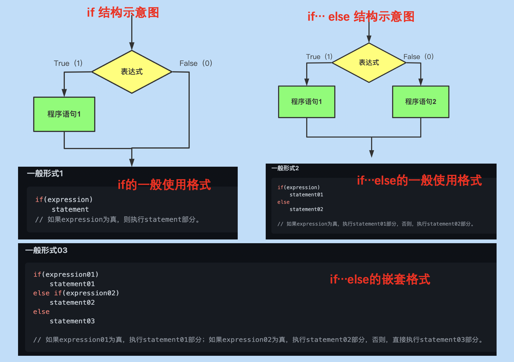

<h1 align = "center">📔 C语言 学习笔记总结 </h1>


- [00. 内容说明](#00-内容说明)
- [01. C语言概述](#01-c语言概述)
  - [1.1 C语言起源](#11-c语言起源)
  - [1.2 C语言应用场景](#12-c语言应用场景)
  - [1.3 C语言的优缺点](#13-c语言的优缺点)
  - [1.4 C语言的7个步骤](#14-c语言的7个步骤)
  - [1.5 C语言的标准](#15-c语言的标准)
- [02. 环境准备](#02-环境准备)
- [03. 程序设计语言的语法](#03-程序设计语言的语法)
  - [3.1 一个程序的基本结构](#31-一个程序的基本结构)
  - [3.2 基本一些语法要素](#32-基本一些语法要素)
- [4. 数据类型](#4-数据类型)
  - [4.1 变量和常量](#41-变量和常量)
  - [4.2 存储单位](#42-存储单位)
  - [4.3 int类型](#43-int类型)
  - [4.4 char类型](#44-char类型)
  - [4.5 布尔类型](#45-布尔类型)
  - [4.6 浮点型](#46-浮点型)
  - [4.7 void类型](#47-void类型)
- [5. 运算符与表达式](#5-运算符与表达式)
  - [5.1 运算符](#51-运算符)
  - [5.2 表达式](#52-表达式)
- [6. 循环控制语句](#6-循环控制语句)
  - [6.1 while语句](#61-while语句)
  - [6.2 for循环](#62-for循环)
  - [6.3 do...while语句](#63-dowhile语句)
  - [6.4 循环的小总结](#64-循环的小总结)
  - [6.5 break语句](#65-break语句)
  - [6.6 continue语句](#66-continue语句)
  - [6.7 goto语句](#67-goto语句)
- [7. 分支判断语句](#7-分支判断语句)
  - [7.1 if、if...else语句](#71-ififelse语句)
  - [7.2 switch语句](#72-switch语句)
- [8. 函数](#8-函数)
  - [8.1 函数相关的概念](#81-函数相关的概念)
  - [8.2 为什么需要函数？](#82-为什么需要函数)
  - [8.2 定义函数](#82-定义函数)
  - [8.3 函数原型的声明](#83-函数原型的声明)
  - [8.4 函数调用](#84-函数调用)
  - [8.5 作用域问题](#85-作用域问题)
  - [8.6 函数经典案例：递归](#86-函数经典案例递归)
- [9. 数组](#9-数组)
  - [9.1 声明数组](#91-声明数组)
  - [9.2 初始化数组](#92-初始化数组)
  - [9.3 访问数组元素](#93-访问数组元素)
  - [9.4 为什么需要数组？](#94-为什么需要数组)
  - [9.5 数组的优缺点](#95-数组的优缺点)
  - [9.6 数组的注意点](#96-数组的注意点)
  - [9.6 多维数组](#96-多维数组)
  - [9.7 数组实例：冒泡排序](#97-数组实例冒泡排序)
- [10. 指针](#10-指针)
- [11. 字符串](#11-字符串)
- [12. 结构和其他数据形式](#12-结构和其他数据形式)
- [13. C预处理器和C库](#13-c预处理器和c库)
- [14. 文件操作](#14-文件操作)
- [15. 强制类型转换](#15-强制类型转换)
- [16. 存储类别和内存管理](#16-存储类别和内存管理)
- [17. 命令行参数](#17-命令行参数)
- [18. 错误处理](#18-错误处理)
- [19. 指针进阶](#19-指针进阶)
- [20. 常见相关面试题的总结](#20-常见相关面试题的总结)
  - [20.1 `const`](#201-const)
  - [20.2 `static`](#202-static)
  - [20.3 `extern`](#203-extern)
  - [20.4 `#define`](#204-define)
  - [20.5 `volatile`](#205-volatile)
  - [20.6 `指针`](#206-指针)
  - [20.7 内存管理](#207-内存管理)
  - [20.8 结构体](#208-结构体)
- [21. C语言风格规范](#21-c语言风格规范)
- [资源参考](#资源参考)

## 00. 内容说明
主要以自我归纳总结的笔记为主。

图片来源很多以《C Primer Plus》作为参考，直接使用。

在使用学习该内容时，建议查看内容 【[计算机科学导论](./../../main_ability/computer_science/)】部分学习基础必备的知识点。如果看过或者不需要的直接略过。


## 01. C语言概述
### 1.1 C语言起源
- 时间：1972年
- 地点：贝尔实验室
- 创始人：丹尼斯.里奇（Dennis Ritch）和肯·汤姆逊（Ken Thompson ） 
- 起因：在开发UNIX操作系统时设计了C语言。在B语言基础上进行设计，起源于B语言。

### 1.2 C语言应用场景
- 驱动设备
- Linux驱动设备
- 嵌入式
- IoT
- PC开发
- 操作系统
- 机器人系统
- 微处理器开发
    - 自动驾驶、相机
    - 无人机
    - 打印机
- 编译器、解释器等
- 数据库mysql
### 1.3 C语言的优缺点
- 优点
    - 运行效率高
    - 处理能力强
    - 可移植性强
    - 强大而灵活
    - 可与硬件直接交互
    - 面向过程的结构化编程语言
- 缺点
    - 指针问题是硬伤，难以被及时发现

### 1.4 C语言的7个步骤


- 定义程序的目标
- 设计程序
- 编写代码
- 编译（源代码）
- 运行程序
    - 常见的环境（Windows、UNIX终端模式和Linux终端模式）
- 测试和调试程序
- 维护和修改程序

### 1.5 C语言的标准
- 第一个ANSI/ISO C标准

    - 时间：1989年正式公布
    - 该标准（ANSI）定义了C语言和C标准库
    - 国际标准化组织于1990采用这套标准和ANSI C是完全相同的标准。

- C99 标准
    - 1994年修订了C标准，最终发布了C99标准。

- C11标准
    - 2007年承诺C标准的下一个版本是CIX。2011年发布了C11标准。

## 02. 环境准备
详细查看一些博主的  博客内容，本内容不属于内容重点。

## 03. 程序设计语言的语法

### 3.1 一个程序的基本结构

```c
#include<stdio.h> // 包含另一个文件，C编译器软件包的标准部分，提供键盘输入和屏幕输出的支持。
/**#include 指令和头文件
 * 是一条C预处理器指令（preprocessor directive），C编译器在编译前会对源代码做一些准备，即预处理（preprocessing）。
 *
 * stdio.h 文件的含义是标准输入/输出头文件。通常，在C程序顶部的信息集合被称为头文件（header）。
 */

int main(void) /*一个简单的C程序*/
/** main()函数
 * C程序一定要从main()函数开始执行，除了main()函数，可以任意命名其他函数。圆括号是用于识别main()是一个函数。
 */
{
/** 花括号、函数体和块
 * {
 *  ...
 * }
 * 
 * 所有的C函数都使用花括号标记函数体的开始和结束。
 * 不能省略
 */
    int num; 
    /**声明一个名为num的变量，int是C语言的一个关键字（keyword），表示一种基本的C语言数据类型，
     * num是一个标识符（identifier），也就是一个变量、函数或其他实体的名称。
     * 
     */
    num = 7; /*为num赋一个值*/

    printf("I'm a simple "); /*使用printf()函数打印信息*/
    printf("Computer .\n");
    printf("My favorite number is %d . \n",num); /*换行符是一个转义序列，转义序列用于代码难以表示或无法输入的字符，如 \t 代表 Tab键*/

    return 0; 
} //结束
```
> 程序由一个或多个函数组成，必须有main() 函数。
>
>函数由 函数头 和 函数体 组成。
>    - 函数头包含函数名、传入函数的信息类型和函数的返回类型。
>    - 函数体被花括号括起来，由一系列语句、声明组成。


### 3.2 基本一些语法要素
- 标识符
    
    在C语言中，***`标识符的规则：字母、数字和下划线组成，其中第一个字母不能是数字`*** 。
    - 关键字（保留字）
        - 有特定含义和专用的标识符
        - 类型相关：int、char、float、double、long、enum、typedef等
        - 语句相关：if、else、while、for、do-while、break、continue、goto等
    - 用户自定义字符
        - 主要用来定义 ***`变量名、函数名、数据类型名和符号常量名`*** 。
        - 一般名字要 **`读其名而知其意`**（为了可读性考虑）

- 变量和常量
    - 变量：程序执行过程中会`发生变化`或者被赋值。
        ```c
        // 变量定义的基本格式：
        // 类型名 变量名;
        int num;
        num = 10;
        ```
    - 常量：程序执行过程中不会变化。

- 分隔符
    - `[]`、`()`、`#`、`;`等。

- 运算符
    - 对各种数据类型的对象的运算。
    - 分为三种类型
        - 单目运算符
        - 双目运算符
        - 三目运算符

- 表达式
    - 运算符与运算对象的组合构成了表达式。

- 程序语句
    - 分支语句
    - 循环语句
    - 复合语句    

- 函数
    
    函数：完成特定任务（功能）的独立模块
    - 函数的定义的包含两个部分：
        - 函数头
        - 函数体

- 输入/输出
    - C语言中~~没有输入/输出语句~~，直接使用`系统标准库（stdio.h`）函数中的函数。例如
        - `scanf()`：输入函数
        - `printf()`：输出函数

基本的程序结构都会包含这些要素，细节会在后面一一展开。


## 4. 数据类型
数据：承载信息的数字和字符。

C语言的数据类型关键字：int、long、short、char、float、double、void、signed、unsigned、_Bool。

- int表示整数类型
- char用于指定字母或其它字符，也可表示较小整数。
- float和double表示小数点的数
- _Bool类型表示布尔值（true和false）


### 4.1 变量和常量

- 常量（constant）：程序执行过程中不发生变化。
    - 常量数据：编译器一般通过用户书写的形式来识别类型。

- 变量（variable）：程序执行期间会发生变化或者被赋值。
    ```c
    // 变量定义的基本格式：
    // 类型名 变量名;
    // 定义变量，再进行初始化
    int num;   // 变量声明定义
    num = 10; // 给变量赋值

    // 定义变量的同时进行初始化
    int digit = 77;

    // 如果要声明多个同类型的变量，直接使用 分号 直接分隔开即可
    int a,b,c,d;
    ```
### 4.2 存储单位
- 位、字节和字是描述计算机数据单元或存储单元的术语。

- 最小的存储单元 ----> 位(bit)，可存储0或1，也是计算机内存的基本构建块。

- 常用的存储单位 ----> 字节（byte）,1 字节 = 8 bit（位）

- 设计计算机时给定的自然存储单位 ----> 字（word）1字长 = 8位。
### 4.3 int类型
int类型是有符号整型，即int类型的值必须是整数（正整数、负整数或零）。其取值范围取决于计算机系统。

> 一般情况下，存储一个int占用一个机器字长。

- int ----> 系统给定的基本整数类型，C语言规定int类型不小于16位。
- short 和 short int ----> 最大的short类型整数小于或等于最大的int类型整数。C语言规定short类型至少占16位。
- long或long int ----> 可表示整数大于或等于最大的int类型整数。C语言规定long类型至少占32位。
- long long 或 long long int ----> 可表示的整数大于或等于最大的long类型整数。Long long类型至少占64位。

无符号整型只能表示零和正整数。在整数类型前加上 unsigned关键字 表明变量为无符号整型。
> 无符号整型可表示的正整数比有符号整型的大。

```c
// 方式1：整型声明
int years,month,week,days;
// 方式2：整型声明定义
int years = 1;
int month = 12;
int weeks = 52;
int days = 365;
```
初始化变量 初始化变量：为变量赋一个初始值（在变量后面加上赋值运算符（=）和待赋给变量的值即可）。

⚠️ 注意：最好不要把初始化的变量和未初始化的变量放在同一条声明中。

👉 总结：声明为变量创建和标记存储空间，并为其指定初始值。


### 4.4 char类型
char 类型用于存储字符（如字母或标点符号）。

> 技术角度，char是整数类型（实际上存储的是整数而不是字符）。

计算机用ASCII编码来处理字符，即特定的整数表示特定的字符。

char类型被定义为8位（1字节）的存储单元。

- 声明和初始化

    ```c
    char grade0 = 'A';
    char grade1 = A;
    char grade2 = "A";
    ```
    - 如果使用`单引号`括起来的单个字符，称为`字符常量`。
    - 如果使用`双引号`括起来，则认为是`字符串`。

- 非打印字符

    单引号只适用于字符、数字和标点符号。但表示特殊行为的符号序列。则只能通过转义序列来打印。常见
的转义序列及其含义如下：

    

    ⚠️注意：在使用ASCII码时，注意数字和数字字符的区别。

### 4.5 布尔类型
布尔值表示true和false。C语言用1表示true，0表示false。

_Bool ----> 布尔类型的关键字。布尔类型是无符号int类型，所占用的空间只能存储0或1即可。

### 4.6 浮点型
实浮点类型可表示 `单精度浮点型` 和 `双精度浮点型`。

- float ----> 单精度浮点型，系统的基本浮点类型，可精确到至少6位有效数字。
- double ----> 双精度浮点型，存储范围更大，能表示至少10位有效数字和更大的指数。

### 4.7 void类型
void类型指定没有可用的值。一般会有三种情况：
- 函数返回为空
    - C中各种`函数返回值为空`。

- 函数参数为空
    - 函数中`不接受任何参数`。不带任何参数的函数可以接受一个void。

- 指针指向void
    - 类型为 `void*` 的指针代表对象的地址，而不是类型。

## 5. 运算符与表达式

运算符的大类划分为三类：
- 单目运算符：只需要一个操作数
- 双目运算符：需要两个操作数
- 三目运算符：三个表达式组成一个条件表达式。


### 5.1 运算符
- 算术运算符

    - 有两类：
        - 单目运算符
        - 双目运算符
    
    
    - 自增/自减运算符的总结
        - 都等价于 `n = n + 1` 或 `n = n - 1`，但执行方式上有区别。
        - 前缀方式`（++n/--n）`：先执行 `n = n + 1(n = n - 1)`，再将n的值作为表达式 ++n/--n的值。
        - 后缀方式`（n++/n--）`：先将n的值作为表达式`n++/n--`的值，再执行`n = n + 1(n = n - 1)`。
        - 运算对象只能是变量，不能是常量或表达式。

- 关系运算符

    - 双目运算符
    - 测试条件的状态，

    

- 逻辑运算符

    
    - 总结：
        - `&&` ： 两个为真，则为真
        - `||`：其中之一为真，则为真。
        - `!`：真则假，假则真。

- 赋值运算符

    - C语言中，= 不意味着 “ 相等 ”，而是一种赋值运算符。
    - 赋值表达式的一般格式为：
    ```c
    // 变量 赋值运算符 表达式
    int x,y,z;
    x *= y - 7 * z; // 等价于 x = x * (y - 7 * z)， 注意后面是一个整体，需要加个括号
    ```

    

- 条件表达式

    C语言中的`唯一一个三目运算符`。三个表达式连接在一起。基本形式及示例：
    ```c
    // 表达式1 ? 表达式2 : 表达式3
    int x,y,z;
    x > y ? x : y;
    // if...else 语句后续会细述
    // 上述语句等价于
    if (x > y)
        z = x;
    else
        z = y
    ```
    - 说明：如果表达式1为True，则结果为表达式2，否则结果为表达式3。

- 位运算符

    - 二进制位的运算。分为两类：
        - 位逻辑运算符
        - 移位运算符：以 `二进制位` 为单位进行左移或者右移。

    

    - 使用注意事项：
        - 操作数只能是`整型`或者`字符型的数据`以及对应的变体。
        - 位逻辑运算符的使用规则：将操作数（int或char类型）转换为二进制，然后进行按位运算。
        - 移位运算符的小Tips（一般情况下）：
            - 右移1位相当于除以2，右移2位则除以4。
            - 左移1位相当于乘以2，左移2位则乘以4。


- sizeof() 运算符
    - 单目运算符
    - 用途：返回变量或数据类型的字节字节。
    - 好处：增强程序代码的可移植性。

- 指针相关运算符
    - `*` ：间接访问运算符
    - `&` ：取地址运算符

### 5.2 表达式
表达式：运算符和运算对象组成的有意义的式子。

C语言中，有很多对应的运算符都有对应的表达式：
- 算术表达式
- 赋值表达式
- 关系表达式
- 逻辑表达式
- 条件表达式

## 6. 循环控制语句
用于执行某些语句，如果某些条件满足语句，则重复执行循环语句。

- 循环语句分为三种类型：
    - while循环语句
    - for循环语句
    - do...while循环语句
- 循环控制语句
    - break语句
    - continue语句
    - goto语句

### 6.1 while语句
语法格式：
```c
while (condition) // condition 是一个表达式，一般是判断表达式
{
    statements;
}
```

只要 condition 为 True，则直接执行 statement 部分的语句，如果为 False，则直接终止while循环，执行下一个语句。

示例：打印 1 ～ 10 之间的数字
```c
#include <stdio.h>

int main(void)
{
    int num = 1;
    while (num <= 10) // 循环入口，如果循环满足就进入循环
    {
        // 如果数字小于等于10，则重复执行括号内的语句
        printf("# %d\n",num);
        num++
    }
    return 0;
}
```

### 6.2 for循环
一般语法格式：
```c
for(initialize;test_expression;update) // 在 test_expression 为假或者是0之前，重复执行statement操作部分。
    statement;
```
语法格式的说明：

- initialize 表达式在执行for语句之前只执行一次
- 对test表达式求值，如果表达式为真（或非零）执行循环一次。
- 对update表达式进行求值，并再次对test表达式进行检查。

for循环是一个入口条件循环，在执行循环之前判断表达式是否执行。和while循环类似，判断条件为真，则继续执行循环语句。

for循环嵌套的规则：**`外层循环控制行，内层循环控制列`**。

示例：求 1 ～ 100的和。
```c
#include <stdio.h>

int main(void)
{
    int sum = 0;
    for (int num = 1; num <= 100; num++)
    {
        sum += num;
        num++;
    }
    printf("The Sum is %d \n",sum);
    return 0;
}
```

### 6.3 do...while语句
- do...while循环在执行玩循环体后才执行测试条件，至少执行循环体一次。
- 是一个 `出口条件` 循环。

一般的语法格式：
```c
do
{
    // 循环体
    statement;
}while (expression) //如果判断为true，则继续执行循环体
```

### 6.4 循环的小总结
- 一般原则是在执行循环之前测试条件比较好
- 测试放在循环的开头，程序的可读性更高。

当循环涉及到初始化和更新变量时，用for 循环比较合适，而在其他的情况下使用while循环更好。

### 6.5 break语句
一般用在两种情况：
- 直接终止循环，让程序执行循环外的下一条语句。
- 用在switch语句（会在分支控制语句中分析）中，终止case语句。

### 6.6 continue语句
直接跳过本次循环的其它部分，重新开始新的循环迭代。

continue有时也做占位符。

### 6.7 goto语句
使得程序直接跳转至相应的标签语句

- 语法格式
```c
goto label; // label为标签名，遵循变量名的命名规则
        .
        .
        .
label:statement //使用冒号来分隔标签名和标签语句
```

一般情况下，不建议使用goto，或者直接不使用。因为标签的位置错误会导致程序出现未知的问题。

## 7. 分支判断语句
判断结构，一般是通过`条件判断`的结果选择所要执行的`程序分支`。其中的条件判断使用 `表达式` 来描述。

在C语言中，一般将 `非零值` 和 `非空值` 假定为 `True`，把 `零` 或 `null` 假定为 `False`。

### 7.1 if、if...else语句


### 7.2 switch语句
- 功能；主要处理多种分支选择的情况。

- 一般使用的语法格式：
    ```c
    switch (expression){
        case 常量表达式1 :
            程序语句1;
            break; // 可选
        case 常量表达式2 :
            程序语句2;
            break; // 可选
        case 常量表达式3 :
            程序语句3;
            break; // 可选
        case 常量表达式4 :
            程序语句4;
            break; // 可选
        default: // 可有可无，根据情况选择
            程序语句
    }
    ```

- switch 使用注意事项
    - expression必须是一个整型或枚举类型。
    - 在case后面使用的是 冒号，不是分号
    - 常量表达式：必须是常量和字面量，和expression中的变量是相同的数据类型。
    - break语句可选，如果使用break，则会直接终止switch语句；不使用则会每一个case语句都执行。
    - default语句：可选，但如果没有，则case都为false时，就不做任何执行。

## 8. 函数

### 8.1 函数相关的概念

`函数原型（function prototype）`：告诉编译器函数的类型。

`调用函数(function call)`：执行函数。

`定义函数（function definition）`：明确函数要做什么。

使用函数之前，要用ANSI C形式声明函数原型。当函数接受参数时，函数原型用逗号分隔的列表指明参数的数量和类型。

用符号常量作为参数，实际参数（actual argument）简称`实参`。

形式参数（formal argument）简称`形参`。属于局部变量。

和定义在函数中变量一样，`形式参数`也是`局部变量`，属该函数私有。

在ANSI C要求在每个变量前都要声明其类型。

圆括号中只有`参数名列表`，而参数的类型在后面声明。

注意点：普通的局部变量在`左花括号`之后声明。

函数的使用遵循一个原则：**`先定义后再使用`**。

### 8.2 为什么需要函数？
- 代码组织结构不清晰，可读性较差
- 代码冗余严重
- 可维护性和可扩展性较差

### 8.2 定义函数
函数由一个函数头和一个函数体组成。

- 函数定义的一般格式为：

    ```c
    返回值的类型 函数名 (形参列表...)
    {
        //函数体
    }
    ```

- 函数格式组成部分的说明
    - **返回值类型**：函数执行后的返回结果的类型
        - 一般是return语句中表达式中的类型一致。
        - 如果函数只是执行操作，但是没有返回值，则使用 void 类型。
    - **函数名称**：函数的名称，函数名的定义遵循和变量名的定义规则一样。
        - 函数名的命名尽量做到 **`见名知其意`**。
    - **参数列表**：函数需要的条件，通过变量的方式给出。
        - 可有可无
        - 可有多个参数，但是每个形参的`类型都必须写明`，中间用分号隔开。
        - 不能使用多个变量定义的方式，使用分号隔开。
    - **函数主体**：函数的执行语句

### 8.3 函数原型的声明

C语言中要求函数是先定义再使用的原则。

声明函数的类型和参数，没有函数体。保证程序在编译时可以判断函数调用的准确性。

- 函数声明的一般格式：

    ```c
    返回值的类型 函数名 (形参列表...); // 注意末尾以分号作为结束，没有函数体
    ```

- 需要函数声明的原因：
    - 将所有的函数原型写在一个 .h 文件中进行管理，提高程序的可扩展性和可维护性。
    - 可以让编译器在使用函数时捕捉到可能出现的错误。

### 8.4 函数调用
函数调用：使用定义过的函数。

- 函数调用的一般格式：
    ```c
    函数名(实参数列表...); // 实参列表和形参列表一一对应。中间使用分号分开。
    ```
- 主调函数和被调用函数

    ```c
    int sum(int num)
    {
        int result = 0;
        for (int i = 1; i <= num; num++)
        {
            // 计算求和
            result += i;
        }
        return result;
    }
    int main() // 主调函数（主函数）
    {
        // printf() 函数调用了 sum() 函数，所以printf() 是sum() 函数的主调函数。
        printf("1～100之间的总和：%d \n",sum(100)); // sum是被使用的函数（被调函数）
        return 0;
    }
    ```
    - 函数的调用关系：`main() ------> printf() ------> sum()`


### 8.5 作用域问题
- 局部变量
    - 主要出现在函数块或者语句块的内部。
    - 只能被函数内或者语句块内可使用。在函数外部不可用。

- 全局变量
    - 定义在函数的外部或程序的顶部。
    - 整个程序中可用。如果要在外部中使用，则需要

- 形式参数
  - 局部变量
  - 当前函数可用

全局变量和局部变量可以使用相同的变量名，但局部变量会覆盖外部的全局变量。

在不同的函数模块中使用相同名字的变量名，不会互相影响。


### 8.6 函数经典案例：递归

- 什么是递归？

    函数自己调用自己。

- 递归函数的基本原理
    - 每级函数调用都有自己的变量。
    - 每次函数调用都会返回一次
    - 递归函数中位于递归调用之前的语句，均按被调函数的顺序执行。
    - 递归函数只能位于递归调用之后的语句，均按被调函数相反的顺序执行。
    - 递归函数必须包含能让递归调用停止的语句。

- 递归示例代码

    ```c
    // 使用递归的方式求n! 阶乘（factorial）
    #include <stdio.h>
    double fact(int n); // 函数声明
    int main(void)
    {
        int n;
        scanf("%d",&n);
        printf("%f",fact(n)); // 函数调用
        return 0;
    }
    double fact(int n) // 函数定义
    {
        double result;
        if(n == 1 || n == 0) // 递归出口
            result = 1;
        else
            result = n * fact(n - 1); // 使用递归函数
        
        return result;
    }
    ```

- 尾递归
    - 递归的`调用在函数末尾`，即正好在 `return` 语句之前。这种类型的递归称为 **`尾递归`**。

- 递归的优缺点
    - 优点
        - 为某些编程问题提供了最简单的解决方案。
    - 缺点
        - 会快速消耗计算机的内存资源。
        - 不方便阅读和维护。

## 9. 数组
数组由 `数据类型相同` 且 `大小固定` 的一组元素的顺序集合。

### 9.1 声明数组

一维数组的声明格式：

```c
dataType arrayName[arraySize];
```

- 数组大小必须是整型或者常量表达式，否则编译器的不同，会导致直接报错。

实例：

```c
// 先定义数组再赋值
int scores[5];   // 定义长度为 5 的整型数组
float weight[5]; // 定义长度为 5 的浮点型数组
```

### 9.2 初始化数组
- 给所有元素赋值

    ```c
    // 定义数组的同时进行赋值
    // 使用大括号，数组元素之间使用 , 分隔开
    int arr[7] = {7,9,3,1,4,10,17}; // 写明长度
    // 上述等价于
    int arr[] = {7,9,3,1,4,10,17}; // 可以不写数组大小（数组的长度）
    ```

    

- 给部分元素赋值

    ```c
    int score[5] = {87,98,67};
    ```
    - 当元素个数少于数组指定的数量时，则从0开始赋值，遍历完元素个数之后，后续的部分元素则自动用 0 来补全。
    - 补全注意点：char类型的补全是`\0`。浮点型的补全是 `0.0`。
- 实例
  ```c
  #include <stdio.h>
  #define SIZE 10
  int main()
  {
      int num[SIZE];

      // 初始化数组元素，并进行赋值操作
      for (int i = 1;i <= 20; i++){
          num [i] = i + 2;
      }
      // 打印每个元素的值
      for (int j = 0 ;i < SIZE;i++){
          printf("Element[%d]= %d \n",j,num[j]);
      }
      return 0;
  }
  ```

### 9.3 访问数组元素
通过 `数组名` 和 `下标索引` 来访问特定的元素。

```c
int score[] = {77,89,67,98,55};
int score3 = score[2]; // 下标从0开始，所以第三个值的下标为2，对应的值为 67
```

### 9.4 为什么需要数组？
- 普通变量无法存储大量实例，管理困难。例如：矩阵、统计学生信息等。
- 通过指定类型和大小声明数组来存储大量实例。

### 9.5 数组的优缺点
- 优点
  - 利用数组索引来随机访问所有元素
  - 减少代码行，增加可读性
  - 可以单个循环遍历数组
  - 排序方便

- 缺点
  - 元素的`插入`和`删除复杂度高`，一般需要根据新的内存分配来管理
  - `声明`时确定`固定元素的数量`
  - C语言中数组没有越界检查机制，所以在使用时要注意。

### 9.6 数组的注意点
- 数组中的元素的数据类型必须相同。
- `{}` 内元素的个数不可以超过数组指定的大小。
- 访问数组元素时，数组索引是从 0 开始。访问范围：`0 <= index < arraySize`。超过范围直接越界溢出，出现`segment fault` 错误。
- `数组名称`也是指向`数组第一个元素的指针`。
- C语言中数组没有越界检查机制，所以在使用时要防止数组下标超出边界（数组大小）。
- 数组内存是`连续`的。

### 9.6 多维数组
多维数组声明的一般语法格式为：
```c
dataType arrayName[SIZE_1][SIZE_2]...[SIZE_N];
```

- 二维数组
  - 多维数组的最简单形式。
  - 类似矩阵
  - 声明格式及其说明
    ```c
    dataType arrayName[row][column];
    ```
  - 具体实例
    ```c
    // 第一种形式：按分段赋值
    int num[2][4] = {
        {1,3,5,7}, // 下标索引为 0 的行
        {2,4,6,8}  // 下标索引为 1 的行
    };
    // 第二种形式： 按行连续复制
    int num[2][4] = {1,3,5,7,2,4,6,8}; // 内嵌的括号可选，但是不推荐使用，代码可读性会比上一种差
  ```

- 二维数组的元素访问
  - 使用for循环嵌套来进行遍历访问各个元素。
  - 二层for循环嵌套的规则：外层控制行，内层控制列。
    ```c
    #include<stdio.h>
    #define ROW 2
    #define COLUMN 4
    int main()
    {
        // 定义数组并初始化
    int num[ROW][COLUMN] = {
        {1,3,5,7}, // 下标索引为 0 的行
        {2,4,6,8}  // 下标索引为 1 的行
    };
    // 遍历访问数组
    for(int i = 0; i < ROW;i++){
        for(int j = 0; i < COLUMN; j++)
        {
            printf("num[ROW][COLUMN] = %d \n",i,j,num[i][j]);
        }
    }
    return 0;
    }
    ```

### 9.7 数组实例：冒泡排序


## 10. 指针


## 11. 字符串


## 12. 结构和其他数据形式


## 13. C预处理器和C库


## 14. 文件操作


## 15. 强制类型转换


## 16. 存储类别和内存管理


## 17. 命令行参数


## 18. 错误处理


## 19. 指针进阶


## 20. 常见相关面试题的总结

### 20.1 `const`


### 20.2 `static`


### 20.3 `extern`


### 20.4 `#define`


### 20.5 `volatile`


### 20.6 `指针`


### 20.7 内存管理


### 20.8 结构体


## 21. C语言风格规范
- https://ilcc.gitbooks.io/wiki/content/StyleGuide/Huawei-C/index.html
- https://google.github.io/styleguide/cppguide.html


## 资源参考
- 《C Primer Plus》第6版
- 《C程序设计语言》K&R版 https://book.douban.com/subject/1139336/
- 《C和指针》
- 《C陷阱与缺陷》
- 《C专家编程》
- W3Cschool ：https://www.w3cschool.cn/c/
- https://ilcc.gitbooks.io/wiki/content/StyleGuide/Huawei-C/index.html