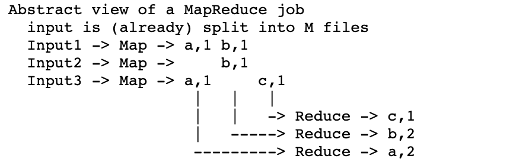

<h1>
 MIT6.824 lecture01 课程学习笔记
</h1>

## 内容和图片来源说明
- 课程和阅读材料来源：MIT6.824 Lecture01 PPT和other pdf

## 1. 概述

### 1.1 什么是分布式系统？
分布式系统的核心是一组协作计算机的集合，通过相互通信的方式以获得连贯的task。
>分布式系统架构的建立需要一台以上的计算机来完成task，除非是它本身需要被分散到其它的物理机上。

### 1.2 需要构建分布式系统的原因？
- 通过并行性（多CPU、多内存、多传动臂等）的方式来获得高性能。
- 增加相应的`容错性（tolerate faults）`。
- 通过分散部署物理设备，通过某种代码来实现某种安全目标。
- `security/isolated`：通过代码隔离，来限制某种错误，从而保证安全性。

### 1.3 分布式系统充满挑战的原因？
- 要解决并发编程带来的问题，以及复杂的交互。
- 部分固件或设备的损坏或者不可靠。
- 高性能，并不是机器越多，性能则会越好。
    > 而是通过设计使系统能够获得相应的性能。

### 1.4 分布式系统的架构抽象
- 存储：定义非常明确且有用的抽象（简单的抽象，所以人们比较了解如何构建和使用存储系统以及如何构建复制容错高性能的分布式存储的实现）。
- 通信：通信系统。
- 计算：类似Mapreduce的计算系统。

### 1.5 构建分布式系统的高级目标？
- `性能（performance）`角度：获得高扩展性加速。一般情况下，通过增加计算机资源来使得性能的各项指标（如吞吐量）都能提高N倍。
    > ⚠️注意点：该情况的影响因素很多（如经济成本），所以一般通过程序员重构软件来获得更好的性能。
- `容错性（fault tolerance）`:对于容错能力而言，主要表现在两个方面：
    - `可用性（availability）`：在知道某些系统设计的情况下，可知道某种特定类型的故障并非所有的故障，对于特定类型故障的出现，系统仍可继续运行，并告知。
        - `非易失性存储`【细节可关注：https://www.morganclaypool.com/doi/10.2200/S00891ED1V01Y201812DTM055】
        - 副本管理
    - `可恢复性（recoverability）`：出现问题后，等待修复后，系统将继续运行，不会影响准确性。
- `一致性（consistency）`：对于一致性而言，又分为两种
    - 强一致性：通信代价高。
    - 弱一致性：通过构造弱一致性充分利用，保证获得更高的性能。

## 2. MapReduce案例研究

### 2.1 MapReduce概述
最初在2004的论文由Google提出，用以进行海量数据的快速计算而设计。

论文参考地址：http://nil.lcs.mit.edu/6.824/2020/papers/mapreduce.pdf

MapReduce是一个可以不用关注细节的分布式系统框架，用户（不需要是分布式系统专家）只需要定义简单的map函数和reduce函数即可运行MapReduce，MapReduce框架会处理剩余事项。

### 2.2 MapReduce工作流程抽象概述
编写一个简单的MapReduce示例，来计算每个单词出现的次数。

则MR会对文件调用用户编写的Map函数，生成（Key字母，Value数量）键值对。MR框架会按Key相同的键值对收集起来，将各个值直接相加。

MR为每个`input文件`调用Map()，生成一组`键值数据`，任何`Map()`调用都是一个`task`，整个MapReduce计算称为`Job`。

MR会收集给定的K2的所有中间v2，并将每个`键+值`传递给`Reduce`调用，最终输出是来自Reduce()的（K2，v3）键值对。

### 2.3 Map函数和Reduce函数
- Map函数

    Map函数使用键值作为参数，形式为：`Map(k,v)`，在入参时，key作为输入文件名，通常被忽略，value作为输入文件的内容。

    对于Map函数而言，不需要知道分布式相关的信息，也不需要知道计算机的数量，以及不需要知道是否实际通过网络通信来移动数据。

- Reduce函数
    Reduce函数的入参事某个特定Key的所有实例（在Map输出的Key-value对中，出现了一次特定的Key即可算作一次实例）。

    对于Reduce函数也是使用Key和value作为参数，其中的value是一个数组（元素值是Map函数输出的Key的一个实例的value）。
    > 一般不关注value的内容，而是关注value数组的长度。

### 2.4 MapReduce的特性
- 可进行很好的扩展性：通过增加N台集群资源，则会提供Nx 倍的吞吐量。
- 隐藏了很多细节，用户需要定义map和reduce函数，其余的

### 2.5 MapReduce的限制点
MapReduce的灵活性不足，对用户的限制较大。
- 除了通过中间输出，没有交互或状态
- 没有迭代，没有多阶段流水线
- 没有实时或流处理。

## 3. 论文笔记

