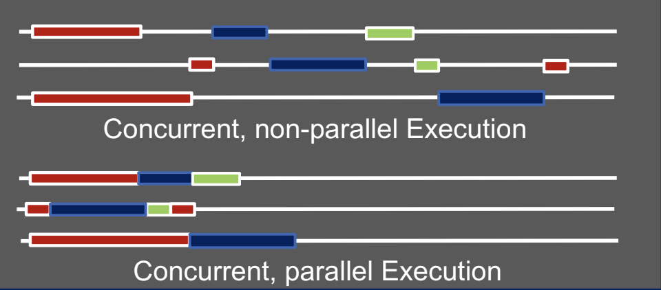

## lecture01 概述

## 1. 并发和并行
- 并发：多个任务在同一时间上的逻辑执行。非并行执行。
- 并行：多个任务在同一个时间上是实际执行的情况。

> 图来自课程slides截图

## 2. 并行计算 VS 分布式系统
分布式系统本质是就是分布式，即在不同的位置服务cleints。

`并行计算`是使用`分布式内存`（多个处理器使用各自的内存）从而获得更高的性能。
> 正真意义上来说，分布式内存不属于分布式系统。而且要求计算机安装在单个机房内。而分布式系统则可以安装在不同的区域。

## 3. HPC测量单位
- `Flop`: floating point operation, usually double precision unless noted
- `Flop/s`: floating point operations per second
- `Bytes`: size of data (a double precision floating point number is 8 bytes)

## 4. HPC应用领域
- 模拟科学工程
- 模拟气候影响
- 天体物理学
- 工业能效
- 高吞吐HPC用于材料设计
- 碳捕获
- 基因蛋白分析
- 高性能数据分析基因学
-  基因组数据分析
- AI
    - 机器学习
    - 深度学习
    - ...

## 5. 摩尔定律

## 6. Amdahl's Law
只支持应用程序的一部分是并行。

- s = fraction of work done sequentially (Amdahl fraction)
- 1-s is fraction parallelizable
- P = number of processors

$$Speedup(P) = Time(1) / Time(P) <=1/(s + (1-s/P)) <= 1/s $$
