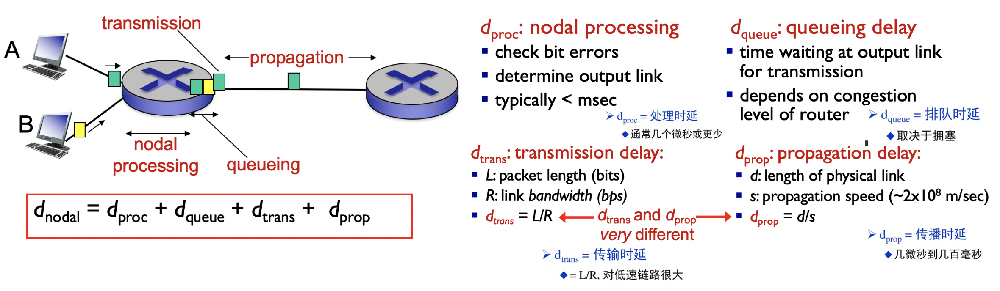
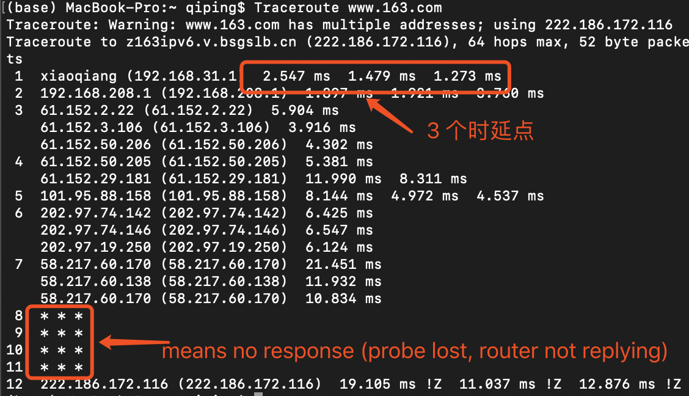
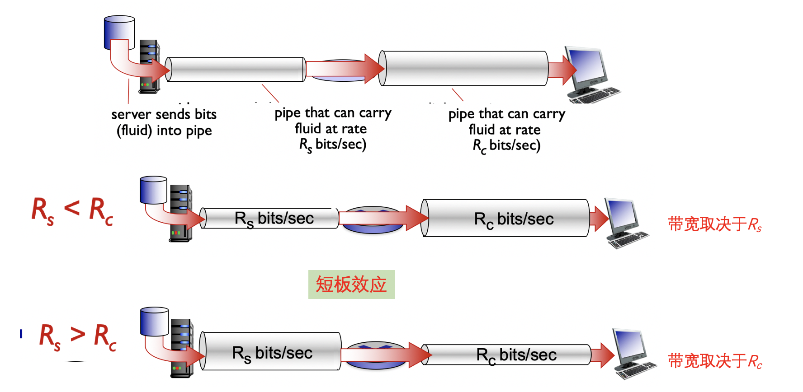

<h1 align="center">📔 Chapter01 计算机网络和因特网 学习笔记</h1>

- [1. 什么是因特网？](#1-什么是因特网)
  - [1.1 根据为分布式应用提供服务的网络基础设施来描述](#11-根据为分布式应用提供服务的网络基础设施来描述)
- [2. 网络边缘](#2-网络边缘)
  - [2.1 接入网](#21-接入网)
    - [2.1.1 家庭接入：DSL、电缆、FTTH、拨号和卫星](#211-家庭接入dsl电缆ftth拨号和卫星)
    - [2.1.2 企业（和家庭）接入：以太网和WiFi](#212-企业和家庭接入以太网和wifi)
    - [2.1.3 广域无线接入：3G和LTE](#213-广域无线接入3g和lte)
  - [2.2 物理媒体](#22-物理媒体)
- [3. 网络核心](#3-网络核心)
  - [3.1 分组交换（packet swiitching）](#31-分组交换packet-swiitching)
  - [3.2 电路交换（circuit switching）](#32-电路交换circuit-switching)
  - [3.3 分组交换与电路交换的对比](#33-分组交换与电路交换的对比)
  - [3.3 网络的网络](#33-网络的网络)
- [4. 分组交换网中的时延、丢包和吞吐量](#4-分组交换网中的时延丢包和吞吐量)
  - [4.1 处理时延和排队时延](#41-处理时延和排队时延)
  - [4.2 传输时延和传播时延](#42-传输时延和传播时延)
  - [4.3 传输时延和传播时延的比较](#43-传输时延和传播时延的比较)
  - [4.4 排队时延](#44-排队时延)
  - [4.5 实际的网络时延和路由](#45-实际的网络时延和路由)
  - [4.6 丢包（Packet Lost）](#46-丢包packet-lost)
  - [4.7 吞吐量（ThoughtPut）](#47-吞吐量thoughtput)
- [5. 协议层次及其服务模型](#5-协议层次及其服务模型)
  - [5.1 为什么需要分层？](#51-为什么需要分层)
  - [5.2 因特网协议栈和OSI参考模型](#52-因特网协议栈和osi参考模型)
  - [5.3 封装](#53-封装)
- [6. 网络安全](#6-网络安全)
- [7. 计算机网络发展史](#7-计算机网络发展史)
  - [7.1 早期的分组交换原理（1961 ～ 1972）](#71-早期的分组交换原理1961--1972)
  - [7.2 专有网络和网络互联（1972 ～ 1980）](#72-专有网络和网络互联1972--1980)
  - [7.3 新的协议和网络增加（1980 ～ 1990）](#73-新的协议和网络增加1980--1990)
  - [7.4 商业化时代爆发（20世纪90年代）](#74-商业化时代爆发20世纪90年代)
## 1. 什么是因特网？
**具体构成描述**：因特网是一个世界范围的计算机网络，即它是互联了遍及全世界的数以亿计的计算设备的网络。

**服务描述**：为应用程序提供服务的基础设施。

**主机（host）或端系统（end system）**：连入因特网中的格式各样的设备。主机和端系统是相等的术语。
- 常见端系统有：便携机、智能手机、平板电脑、电视、游戏机、Web相机、汽车、环境传感设备、数字相框、家用电器等。

端系统通过**通信链路（communication link）** 和 **分组交换机（packet switch）** 连接在一起。

- 通信链路由不同的**物理媒体（同轴电缆、铜线、光纤和无线电频谱）** 组成。不同的链路能够以不同的速率传输数据。
    - 链路的**传输速率以比特/秒度量（bit/s，或bps）**。

**分组（packet）**：当一台端系统向另一台端系统发送数据时，发送端系统将数据分段，并为每段加上首部字节。由此形成的信息报用计算机网络的术语说称为分组（packet）。

分组交换机最著名的两种类型：
- **路由器（router）**
- **链路层交换机（link-layer switch）**。
    - 链路层交换机通常用于接入网（access net）中，路由器一般处于网络核心。

从发送端系统到接收端系统，一个分组所经历的一系列通信链路和分组交换机成为通过该网络的路径

**Internet sercice provider ISP 因特网服务提供商**。端系统通过ISP接入因特网。

**协议（protocol）**：协议控制因特网中信息的接收和发送。一个协议定义了在两个或多个通信实体之间交换的报文格式和次序，以及报文发送/或接收的一条报文或其他事件所采用的动作。

两个著名的协议TCP/IP：

- TCP（Transmission Control protocol 传输控制协议）
- IP (Internet Protocol 网际协议)：定义了在路由器和端系统之间发送和接收的分组格式。

因特网的主要协议统称为TCP/IP。

**因特网标准（internet standard）** 由**因特网工程任务组（Internet Engineering Task Force, IETF）** 研发。

IETF的标准文档称为**请求评论（Request for Commment）**。RFC定义了TCP、IP、HTTP（Web）、SMTP（电子邮件）等协议。目前有将近6000个RFC。IEEE 802 LAN/MAN标准化委员会制定了以太网和无线WIFI的标准。

### 1.1 根据为分布式应用提供服务的网络基础设施来描述

**分布式应用程序（distributed application）**：涉及多台相互交换数据的端系统。如VoIP（IP上的语音），因特网广播，即时讯息，Web冲浪，远程注册等。因特网应用运行在端系统上，及他们并不运行在网络核心中的分组交换机中。

与因特网相连的端系统提供了一个**应用程序编程接口（Application Programming Interface，API）**，API规定了运行在一个端系统上的软件请求因特网基础设施向运行在另一个端系统上的特定目的地软件交付数据的方式。

因特网是一种基础设施，新应用程序正在其上不断地被发明和设置。

一个协议定义了在两个或多个通信实体之间交换的报文格式和次序，以及在**报文传输和/或接受或其他时间方面**所采取的动作。

## 2. 网络边缘

**端系统**是计算机网络从具体构成描述因特网中设备的用语，而主机是从服务去描述这些设备。实际上，这两个术语是通用的，即**主机 = 端系统**。

主机有时候分为两类：
- **客户（client）**：桌面PC、移动PC和只能手机
- **服务器（server）**：用于发布Web页面，流视频的主机，现在常常依托于大型数据中心。

### 2.1 接入网
**接入网（access network）**：将端系统连接到**边缘路由器（edge router）** 的物理链路。

#### 2.1.1 家庭接入：DSL、电缆、FTTH、拨号和卫星
宽带接入最流行的类型：
- **数字用户线（Digital Subscriber Line）**
    - 一种新型的调制解调器技术，类似于拨号调制解调器，也运行在现有的双绞线电话线上，通过限制用户和ISP调制解调器之间的距离，DSL能够以高得多的速率传输和接受数据。（使用频分多路复用技术），分为上行信道和下行信道，两个信道速率不一样。
- **电缆**

#### 2.1.2 企业（和家庭）接入：以太网和WiFi
- 局域网（LAN）：企业和大学一般都是使用局域网（LAN）连接到边缘路由器。
- 以太网
    - 共享以太网
    - 交换以太网

#### 2.1.3 广域无线接入：3G和LTE
将移动端系统与网络相连。

- **无线局域网（wireless LAN）**：无线用户与位于几十米半径内的基站（无线接入点）之间传输/接收分组。这些基站和有线的因特网相连接，因而为无线用户提供连接到有线网络的服务。
- **广域无线接入网（wide-area wireless access network）**：分组经用于蜂窝电话的相同无线基础设施进行发送，基站由电信提供商管理，为数万米半径内的用户提供无线接入服务。

### 2.2 物理媒体

物理媒体分为两类：
- **导引型媒体（guided media）**：电波沿着固体媒体前行，如光缆、双绞铜线和同轴电缆。
    - **双绞铜线**
        - 最普遍的引导型传输媒体。一直被用于电话网。
        -无屏蔽双绞线（UTP）常用在建筑物内的计算机网络中，即用于局域网（LAN）中。
        - 目前局域网中的双绞线数据传输速率在10Mbps到10Gbps之间，所能达到的数据传输速率取决于线的粗细以及传输距离
        - 双绞线实际上已经成为高速局域网联网的主要方式；因为现代的双绞线技术速率和传输距离都是很不错的。
     - **同轴电缆**
         - 由两个铜导体构成，但是它们是同心的，而非并行的。
         - 借助特殊的结构和绝缘层，同轴电缆可得到较高的数据传输速率。
         - 在电视系统中应用广泛
         - 同轴电缆可被用作引导性的共享媒体。
     - **光纤**
         - 可以引导光脉冲的媒体。
  
- **非导引型媒体（unguided media）**：电波在空气或外层空间中传播，如无线网局域网或数字卫星频道。
    -  **陆地无线电信道**
        -  无线电信道承载电磁频谱中的信号，不需要物理线路，提供与移动用户的连接以及长距离承载信号的方式。
        -  是一种有吸引力的媒体；
    -  **卫星无线电信道**
        -  通过卫星连接两个或多个在地球上的微波发射方（也被称为地面站），该卫星在一个频段上接收信号，在另一个频段上发送信号。
        -  种类有同步卫星和近地轨道卫星。

## 3. 网络核心

网络核心，即互联了因特网端系统的分组交换机和链路的网状网络。

**报文（message）**: 端系统彼此交换信息的术语。报文可以执行一种控制功能，也可以包含数据（例如：电子邮件，JPEG图像文件等）。

**分组（packet）**：从源端系统向目的端系统发送一个报文，源将长报文划分为较小的数据块，称之为分组。例子：打游戏丢包，其实就是所谓的数据块。

通过网络链路和交换机移动数据有两种基本方法：

### 3.1 分组交换（packet swiitching）
在源和目的之间，每个分组通过**通信链路**和**分组交换机（packet switch）** 。

交换器有两类：**路由器**和 **链路层交换机** 。
- #### 存储转发传输（store-and-forward transmission）

    交换机能够开始向输出链路传输该分组的第一个比特之前，必须接收到整个分组。

**重点**：N条速率均为R，长度为L的链路构成的路径（所以再源和目的地之间有N-1太路由器），端到端的时延是：$$d_端到端 = N\frac{L}{R}$$
- #### 排队时延和分组丢失

    - **输出缓存（output buffer）(也称为输出队列 output queue)**: 当分组需要经过的那条链路繁忙时（传输其他分组中），那么该分组可以在输出缓存上等待。用于存储路由器准备发往那条链路的分组。

    - **排队时延（queue delay）**: 在输出缓存等待的时延；除此之外，还有之前提到的存储转发时延。

    - **分组丢失（丢包）(packet lost)**：到达的分组可能发现缓存已经被其他等待的分组完全充满了，这种情况下就会出现丢包。

在因特网中，每个端系统具有一个称为IP地址的地址。源在分组的首部包含了目的地的IP地址。路由器会检查目的地址的一部分，并向相邻的路由器转发该分组。

**转发表（forwarding table）**: 用于将目的地址（或目的地址的一部分）映射成输出链路。

**路由选择协议 （routing protocal）**： 可以实现路由的特殊功能，例如：自动设置转发表来选择通往目的地的最短路径。

### 3.2 电路交换（circuit switching）

**电路交换（circuit switching）**网络必须在发送发和接受方之间的交换机需要为该连接维护为连接状态。该连接用电话的术语被称为一条**电路**。

电路交换的复用技术：指的是如何复用链路服务于多个连接，构建电路的技术。

主要有 **`频分复用（Frequency-Division Multiplexing, FDM）`** 和 **`时分复用（Time-Division Multiplexing, TDM）`** 。

简单来说，在不同频率上连接多个电路的称为FDM，而基于一定时间间隔为所有连接打开通路的被称为时分复用。

对于FDM，每条电路连续地得到部分宽带。链路的频谱由跨越链路创建的所有连接所共享。

对于TDM，每条电路在短时间间隔（即时隙）中周期性地得到所有带宽。

### 3.3 分组交换与电路交换的对比
- **分组交换**
    - 不适合实时服务。
    - 提供了更好的宽带共享
    - 更简单，更有效，使得成本更低。
    - 分组交换的性能优于电路交换的性能。
    - 按需分配链路使用，链路传输能力将在所有用户之间逐分组地被共享。
    
- **电路交换**
    - 不需要考虑需求，而预先分配传输链路的使用，使得已分配而并不需要的链路时间未被利用。

### 3.3 网络的网络

端系统（PC、智能手机、Web服务器、电子邮件服务器等）经过一个接入ISP与因特网相连。这种接入ISP提供了**有线或者是无线连接**。使用包括DSL、电缆、FTTH、WiFi和蜂窝等多种接入技术。

互联接入ISP的目标：是使所有端系统能够彼此发送分组。

- 区域ISP（regional ISP）
    区域中的接入ISP与之互联（例如一个城市）。区域ISP再与第一层ISP互联。区域ISP和第一层ISP可能是多对多的客户-提供商关系。

- 存在点（Popint of Presence, PoP）
    Pop存在于等级结构的所有层次。提供商网络中的一台或多肽路由器（在相同位置）的群组，其中客户ISP能够与提供商ISP进行对接。

- 多宿（multi-home）

    任何ISP（除了第一层ISP）可以与两个或者更多提供商ISP连接。

- 对等（peer）
    将相同等级结构层次的一对ISP连接到一起，使得所有的流量直接连接，而不通过上游中间的ISP传输。

    当两个ISP对等时，通常是不进行结算的，即任一个ISP不向其对等付费。

- 因特网交换点（Internet Exchange Point, IXP）

    IXP是一个汇合点，多个ISP能在这里对等。

- 内容提供商网络（content provider network）

    独立于公共互联网却跨越全球的网络。例如谷歌的服务器主机。

- 总结

    今天的因特网是一个网络的网络，结构复杂，由十多个第一层ISP和数十万个较低层ISP组成。

    ISP覆盖的区域不同。

## 4. 分组交换网中的时延、丢包和吞吐量

时延分为 **`节点处理时延（nodal processing delay）`**、**`排队时延（queuing delay）`**、**`传输时延（transmission delay）`** 和 **`传播时延（propagation delay）`**，这些时延加起来就是 **`节点总时延（total nodal delay）`**。

### 4.1 处理时延和排队时延

- 处理时延
    - 检查比特差错
    - 决定输出链路
    
- 排队时延
    - 等待输出链路传输的时间
    - 取决于路由器拥塞的等级

### 4.2 传输时延和传播时延
- 传输时延
    - R = 链路带宽（bps）
    - L = 分组长度（bits比特）
    - 发送比特进入链路的时间 = L / R

- 传播时延
    - d = 物理链路的长度
    - s = 在媒体中传播的速度（约2～3E8m/sec）
    - 传播时延 = d / s

**节点总时延 = 节点处理时延 + 排队时延 + 传输时延 + 传播时延**

### 4.3 传输时延和传播时延的比较

- 输出时延

    路由器将分组推出所需要的时间，是`分组长度`和`链路传输速率`的函数，与`两台路由器之间的距离无关`。

- 传播时延

    是一个比特从一台路由器向另一台路由器传播所需要的时间，是两台路由器之间`距离的函数` ，与`分组长度`或者是`链路传输速率`无关。

### 4.4 排队时延
平均排队时延与流量强度之间的关系

### 4.5 实际的网络时延和路由
Mac和Linux环境下，直接使用`Traceroute`

Windows环境下，使用`tracert`。

Traceroute原理是：

- 利用ICMP协议
- 发送探测分组，到达路由器之后，返回响应，测试时间，重复三次过程。

### 4.6 丢包（Packet Lost）

- 链路的队列缓冲区的资源容量有限，当达到一定的满队列时，分组就会丢失。
- 分组丢失的指标：丢包率
- 丢失后如何处理？
    - 重新传入或者直接放弃
- 主动丢弃：检查分组，发现分组已经出现了错误。

### 4.7 吞吐量（ThoughtPut）
**`吞吐量`**：在源端和目标端之间传输的速率（数据量 / 单位时间）。是计算机网络中不可缺少的性能测度。

- 和带宽的区别：单位相同，但链路带宽是链路的能力为设计值，吞吐量是实际测试的传输速率。
- **`瞬时吞吐量`**：在一个时间点的速率。
- **`平均吞吐量`**：在一个长时间内的平均值。

端到端链路制约了端到端的吞吐量，也就是所谓的瓶颈链路。

在因特网的实际场景下的例子

## 5. 协议层次及其服务模型

因特网是复杂的系统，但是包含了很多部分：

- 主机
- 路由器
- 链路级的媒体
- 应用程序
- 协议
- 硬件和软件

### 5.1 为什么需要分层？
处理复杂的系统

- 明确的结构使得能够标识复杂的系统
    - 分层的参考模型用于讨论
- 模块化易于维护和系统的更新。
    - 各个层服务实现的改变对于系统其他的部分透明。

### 5.2 因特网协议栈和OSI参考模型

### 5.3 封装

## 6. 网络安全

## 7. 计算机网络发展史

### 7.1 早期的分组交换原理（1961 ～ 1972）

- 1961年
    - Kleinrock 使用`排队论`，完美体现了分组交换处理突发性流量源的有效性。

- 1964年
    - Paul Baran研究分组交换在军事上的应用。

- 1967年
    - ARPAnet被美国高级研究计划署（Advanced Research Projects Agency
）提出。

- 1969年
    - 第一台分组交换机被安装在UCLA。

- 1972年
    - 由Robert Kahn首次进行公众演示。
    - 此时有 15 个结点
    - 网络控制协议（Network Control Protocol）：第一台主机对主机协议的机器。
    - 此时也出现了`第一个电子邮件程序`。

### 7.2 专有网络和网络互联（1972 ～ 1980）
ARPAnet是一个单一的、封闭的网络。

- 1970年
    - ALOHAnet在夏威夷问世，是一个微波网络。

- 1974年
    - Cerf and Kahn 在美国国防部高级研究计划署（DARPA）的支持下，共同完成了对网络互联的先驱性工作完成。

- 1979年
    - ARPAnet结点达到了 150 个。

### 7.3 新的协议和网络增加（1980 ～ 1990）
- 1982年
    - SMTP 邮箱协议被定义。

- 1983年
    - TCP/IP作为ARPAnet的新标准主机协议正式部署。
    - DNS（域名系统） 作为IP地址翻译的名字。

- 1985年
    - FTP协议定义的出现

- 1988年
    - TCP进行了扩展，实现了机遇主机的拥塞控制（congestion control）。

- 其他新的国际网络
    - CSnet, BITnet, NSFnet, Minitel
    - 连接到公共因特网的主机数量达到了100000台。

### 7.4 商业化时代爆发（20世纪90年代）

- 早期20世纪90年代
    - ARPAnet不复存在。

- 1991年
    - NSFNET解除了对NSFNET对于事业目的的限制。

- 20世纪90年代的事件
    - 1.万维网（WWW）应用程序的出现。
    - 2.Berners-Lee和他的同时研制了HTML、HTTP和Web服务器和浏览器的初始版本。
    - 3.1994年，Mosaic，也就是早期的网景公司（Netscape）。
    - 90年代后期，Web的商业化加速。

- 后期的发展
    - 出现了APP竞争对手，如即时讯息，P2P（对等）文件共享。
