<h1 align="center">📔 Chapter02 应用层 学习笔记</h1>

## 


## 1. 应用层协议原理

### 1.1 一些网络应用
- E-mail
- Web
- Text Massage
- Remote Login
- P2P file sharing（对等文件共享）
- multi-user network games
- 视频存储流（Youtube、Netflix、Hulu）
- IP视频会议（Skype）
- 社交网络（Facebook、Twitter）
- 实时视频会议
- 搜索


### 1.2 研发一个网络应用程序

- 核心：写出能够运行在不同的端系统和通过网络彼此通信的程序。
    - Web服务器软件通过浏览器软件进行通信。
    - P2P文件共享系统：参与文件共享的社区中的每台主机中都有一个程序。

- 不需要专门的软件作为网络核心设备。
    - 网络核心设备在应用层上并不起作用
    - 软件应用在端系统上的设计方法，促进了网络应用程序的迅速研发和部署。


### 1.3 网络应用程序的体系结构

术语：**`应用程序体系结构（Application Architecture）`** 。

应用程序体系结构由`应用程序研发者`设计。两大主流的体系结构

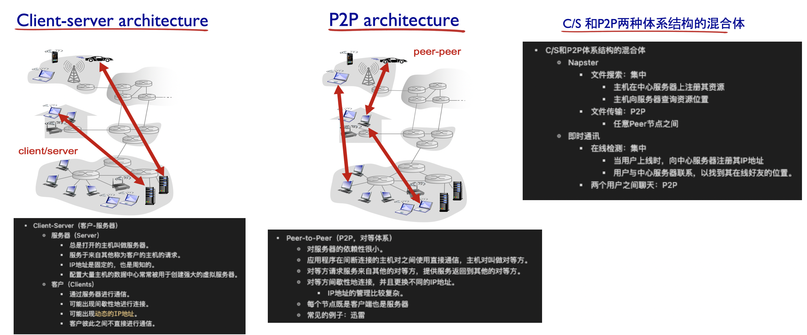

P2P体系结构最大的特性：自扩展性。P2P体系结构也有成本有效，因为它们通常不需要庞大的服务器基础设施和服务器带宽。

但P2P也有三大挑战
- ISP友好问题
- 由于高度分布和开放特性，所以安全性堪忧。
- 用户需要自己有网络带宽、存储和计算资源。


### 1.4 进程通信

**`进程（process）------>  OS角度`**：运行在主机（端系统）中的一个程序。

当进程运行在相同的端系统上时，所使用进程间通信机制相互通信。

进程间通信的规则：由 **`端系统（主机）`** 上的OS确定。

进程在两个不同的端系统（主机）之间，通过 **报文（message）** 而相互通信。

- 客户和服务器进程

将一个进程标识为`客户`，另一个进程标识为`服务器`，所以客户和服务器的定义如下：
- **`客户`**：发起通信方（浏览器）----> 进程通信初始化
- **`服务器`**：等待联系方（Web服务器）----> 进程等待被连接

另外，在应用层的P2P体系结构中，也有客户端和服务器端。

- 分布式进程通信需要解决的问题
    - 问题1:进程标识和寻址问题（服务用户）
    - 问题2:传输层-应用层提供服务如何（服务）
        - 位置：层间界面的SAP（TCP/IP：socket）
        - 形式：应用程序接口API（TCP/IP：Socket API）
    - 问题3：如何使用传输层提供的服务，实现应用进程之间的报文交换，实现应用（用户使用服务）
        - 定义应用层协议：
        - 编制程序，使用OS提供的API，调用网络基础设施提供通信服务传报文，实现应用时序等。


- Socket接口

    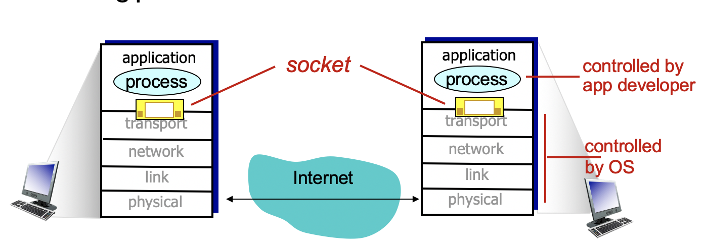

    进程通过**套接字（socket）** 的软件接口向网络`发送`报文和从网络`接收`报文。

    例子：进程类似于房子，套接字类似于一扇门

    发送进程需要推开套接字这个门，就通过运输设备将报文传送到其他的目的主机，接收来自传递给套接字的进程。

    - 应用程序接口（Application Programming Interface，API）：应用程序与网络之间的接口。

- 进程寻址过程

    为了接收报文，进程必须有一个`标识符`。

    该类标识符必须有两种信息：
    - 主机的IP地址
    - 端口号（port numbers）
        - 端口号的例子：HTTP服务器：80、邮箱服务器：25
        - 例子：192.168.245.12:80
    
    主机有`唯一的（unique）`32比特的IP地址标识。使用的传输层协议：TCP或者UDP。

    - 一个进程：用IP+port 标示端节点
    - 一对主机进程之间的通信由2个端节点构成。


### 1.5 调用应用程序需要传输层上的服务
主要从4个方面进行分类：

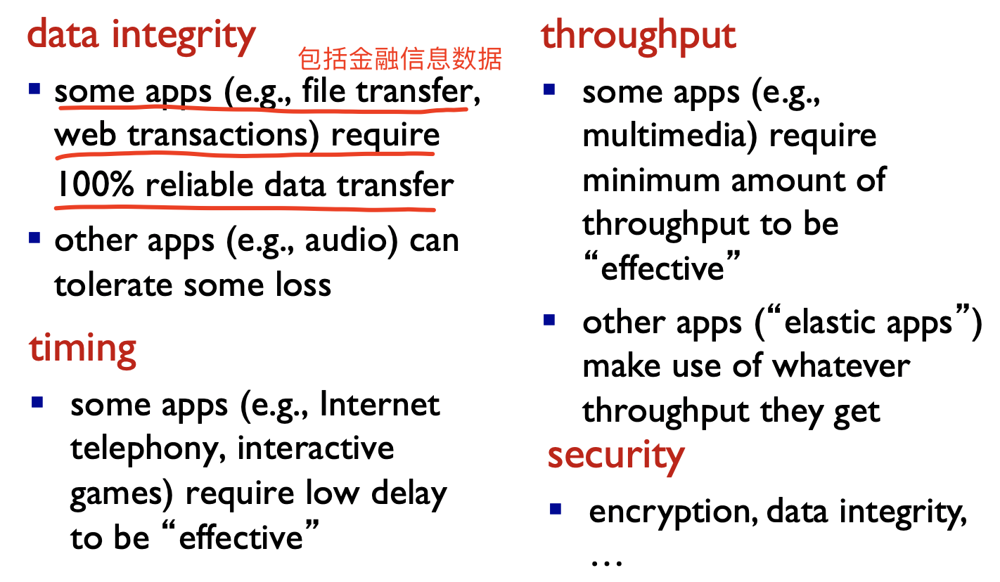

### 1.6 因特网提供的传输服务
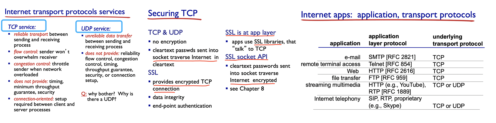

### 1.7 应用层协议
应用层协议定义了的内容如下：

- 运行在不同端系统上的应用进程如何相互交换报文
- 交换的报文类型：请求和应答报文
- 各种报文类型的语法：报文中的各个字段及其描述
- 字段的语义：即字段取值的含义
- 进程何时、如何发送及对报文进行响应的规则
- 应用协议仅仅是应用的一个组成部分。
    - Web应用：HTTP协议、Web客户端、Web服务器、HTML

主要有两种协议类型：

- 公开协议
    - 由RFC文档定义
    - 允许互操作
    - 如Web应用的HTTP、电子邮件的SMTP
- 专用（私有）协议
    - 协议不公开
    - 如Skype

## 2. Web和HTTP
在RFC中的定义，Web的应用层协议：超文本传输协议（HyperText Transfer Protocol，HTTP），也是Web的核心。
- HTTP 1.0：RFC 1945
- HTTP 2.0：RFC 2068

### 2.1 HTTP概述
- 一些基本术语：
    - Web Page：由一些对象组成。
    - 对象可以是HTML文件、JPEG图像、Java小程序、音视频文件等。
    - Web页的由包含若个对象的引用（链接）的HTML文件组成。
    - 通过URL对每个对象进行引用
        - 访问协议：用户名、口令字、端口等
    - URL地址有两部分组成：
        - 存放对象的服务器主机名
        - 对象的路径名
        - 格式：www.baidu.com/cat/cat.png

- HTTP由C/S模式实现
    - 客户：请求、接收和显示Web对象的浏览器
    - 服务器：对请求进行响应、发送对象的Web服务器

    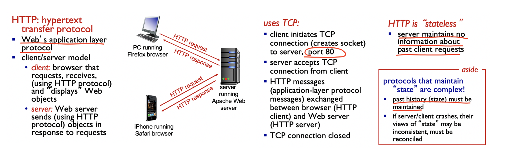

### 2.2 HTTP连接
HTTP的连接方式有两种：
- 非持续连接（非持久HTTP）
    - 每个TCP连接只传输一个请求/响应报文。
    - 下载多个对象需要多个TCP连接
    - HTTP/1.0 使用非持久连接
    - RTT（Round-Trip Time）：往返时间

    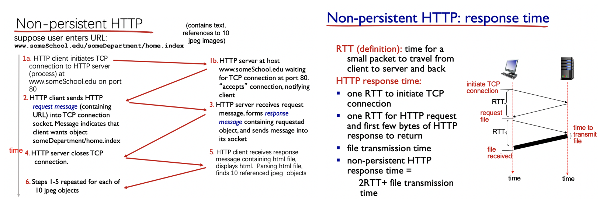

    - 缺点：
        - 必须为每个请求的对象建立和维护一个全新的连接。对于每个这样的连接，在客户和服务器中都要分配TCP的缓冲区和保持TCP变量，这会给Web服务器带来严重的负担。
        - 每个对象经受两倍RTT的交付时延。
            - 一个RTT用于创建TCP
            - 另一个RTT用于请求和接收一个对象）

- 持续连接（持久HTTP）
    - 多个对象可以在同一个（在客户端和服务器之间的）TCP连接上传输。
    - 服务器在发送响应后，仍保持TCP连接，客户端遇到遇到一个引用对象时，则可以直接发送该对象的请求。
    - HTTP/1.1 默认使用带流水线的持续连接。
    - 如果一条连接经过一定时间间隔仍未被使用，HTTP服务器则会直接关闭该连接。
    - 流水线方式的持久HTTP
        - 客户端只能在收到请一个响应后才能发出新的请求
        - 每个引用对象花费一个RTT。
    - 流水方式的持久HTTP
        - HTTP/1.1 的默认方式
        - 客户端遇到一个引用对象就立即产生一个请求
        - 所有引用对象只花费一个RTT是可能的。

### 2.3 HTTP报文格式
HTTP的报文有两种：
- 请求报文

    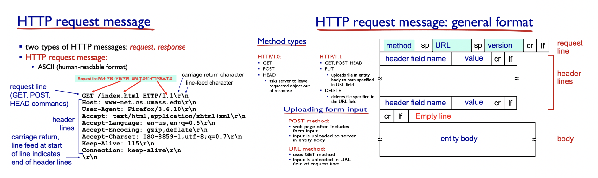

- 响应报文

    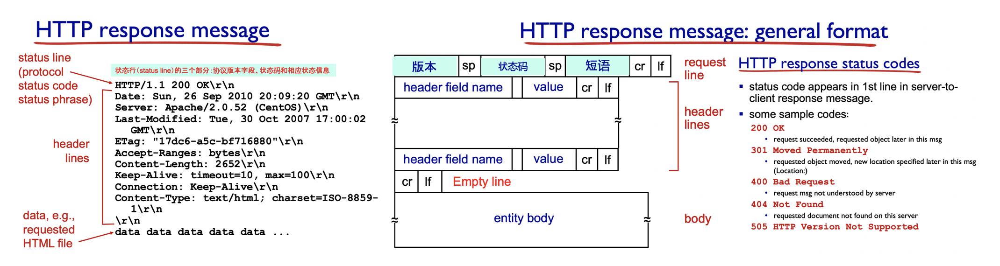

### 2.4 C/S的交互:cookie
在 RFC 6265 中，HTTP使用cookie，允许站点对进行跟踪。大多数的Web站点都使用cookie。

cookie技术有4个组件：
- 在HTTP响应报文中的一个cookie首部行
- 在HTTP请求报文中的一个cookie首部行
- 在用户端系统中保留有一个cookie文件，由用户的浏览器进行管理。
- 位于Web站点的一个后端数据库。

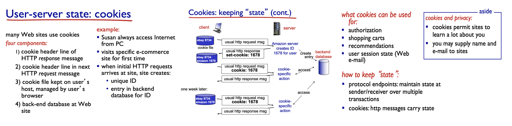

cookie可用于标识一个用户。用户首次访问一个站点时，可能需要提供一个用户标识（可能是名字）。因此cookie可以在无状态的HTTP之上建立一个用户会话层次。所以可以实现动态针对不同用户显示不同的内容。

### 2.5 Web缓存（代理服务器）
Web缓存有自己的磁盘存储空间，存储空间中保存最近请求过的对象的副本。

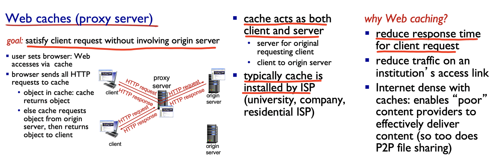

在因特网上部署Web缓存器有两个原因：
- Web缓存器可以大大减少对客户请求的响应时间，特别是当客户与初始服务器之间的瓶颈带宽远低于客户与Web缓存器之间的瓶颈带宽时也是如此。
- Web缓存器能大大减少一个机构的接入链路到因特网的通信量。

### 2.6 条件GET方法
HTTP协议有一种机制，允许缓存器证实它的对象是最新的，这种机制叫做条件GET方法。
- 请求报文使用GET方法
- 请求报文中包含一个 “If-Modified-Since”：首部行

则HTTP请求报文就是一个条件GET请求报文。

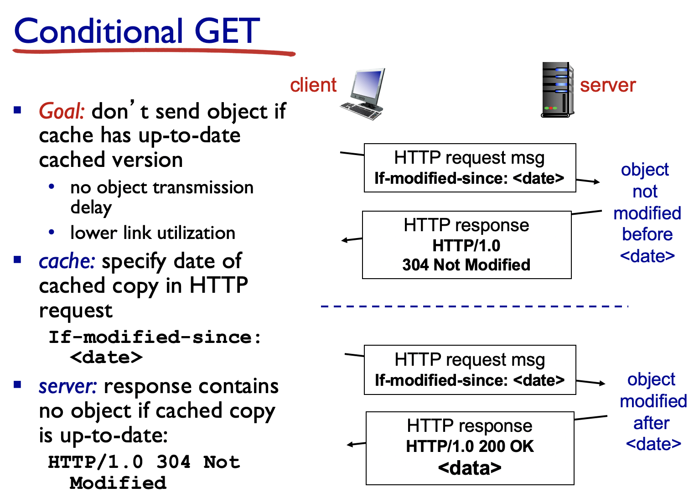

## 3. 文件传输协议：FTP

### 3.1 FTP概述
FTP协议在本地与远程文件之间的文件传输示意图：

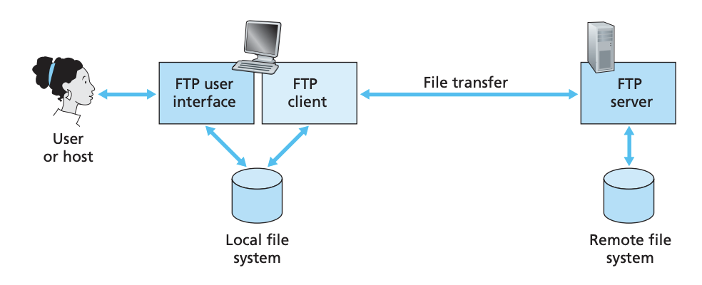

- 用户坐在一台主机（本地主机）前面，向一台远程主机传输（或接收来自远程主机的）文件。
- C/S模式
    - 客户端：发起传输的一方
    - 服务器：远程主机
- FTP：RFC 959
- FTP服务器：端口号为21

HTTP和FTP都是文件传输协议。
- 共同特点：都运行在TCP上。
- 不同点：FTP使用两个并行的TCP连接传输文件。
    - 控制连接：用于在两主机之间传输控制信息。
    - 数据连接：用于实际发送一个文件。

因此，FTP的控制信息是带外（out-of-band）传送的，HTTP可以说是带内（in-band）发送控制信息的

控制信息是持续的，而数据连接是非持续的，对会话中的每一次文件传输都需要建立一个新的数据连接，直到传输完毕后关闭会话。

### 3.2 FTP命令和回答
从客户到服务器的命令和从服务器到客户的回答，都是以 `7比特` ASCII格式在控制连接上传送的。
> 每个命令后跟回车换行符，都是由`4个大写字母ASCII字符`组成。

一些常见的命令：
- `USER username`：用于服务器传送用户标识
- `PASS password`：用于服务器发送用户口令
- `LIST`：用于请求服务器回送当前远程目录中的所有文件列表。
    - 通过数据传送方式，而不是在控制TCP连接上传送
- `RETR filename`：用于从远程主机的当前目录检索（即get）文件
    - 让远程主机发起数据连接，并经过数据连接发送所请求的文件
- `STOR filename`：用于从远程主机的当前目录存放（即put）文件

常见的响应和可能的报文
- `311 Username OK，Password required`：用户名OK，需要口令
- `125 Data connection already open;transfer starting`：数据连接已打开，开始传送
- `425 Can't open data connection`：无法打开数据连接
- `452 Error writing file`：写文件差错

## 4. 因特网中的电子邮件
电子邮件是一种异步通信媒介。

因特网电子邮件系统，主要有三个部分组成：
- 用户代理（user agent）
- 邮件服务器（mail server）
- 简单邮件传输协议（Simple Mail Transfer Protocol，SMTP）

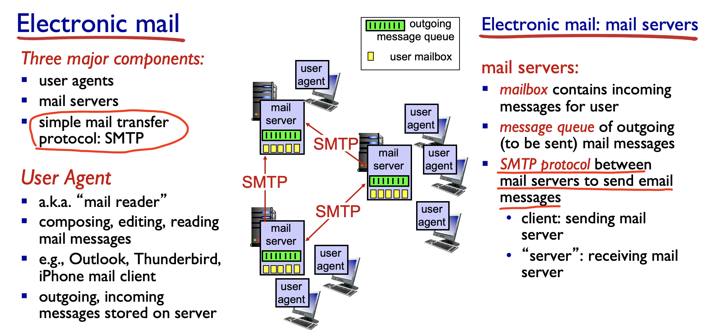

SMTP是因特网电子邮件中主要的应用层协议。

### 4.1 SMTP
SMTP一般不使用中间邮件服务器发送邮件。

- 使用TCP在客户端和服务器之间传送报文，端口为25.
- 直接传输
    - 使用TCP可靠数据传输服务，从发送方的邮件服务器向接收方的邮件服务器发送邮件。
- 传输的3个阶段
    - 握手
    - 传输报文
    - 关闭
- 命令/响应交互
    - 命令：ASCII文本
    - 响应：状态码和状态信息

- 报文必须为 7位 ASCII码。


### 4.2 与HTTP的比较
- 区别1
    - HTTP：拉（pull）协议
    - SMTP：推（push）协议
    - 二者都是ASCII形式的命令/响应交互、状态码
- 区别2
    - SMTP使用持续连接
    - SMTP要求报文（首部和主体）为7位ASCII编码
    - SMTP服务器使用CRLF，CRLF决定报文的尾部
- 区别3
    - 如何处理包含文本和图像的文档的区别。
    - HTTP：每个对象封装在各自的响应报文中。
    - SMTP：多个对象包含在一个报文中。

### 4.3 邮件报文格式

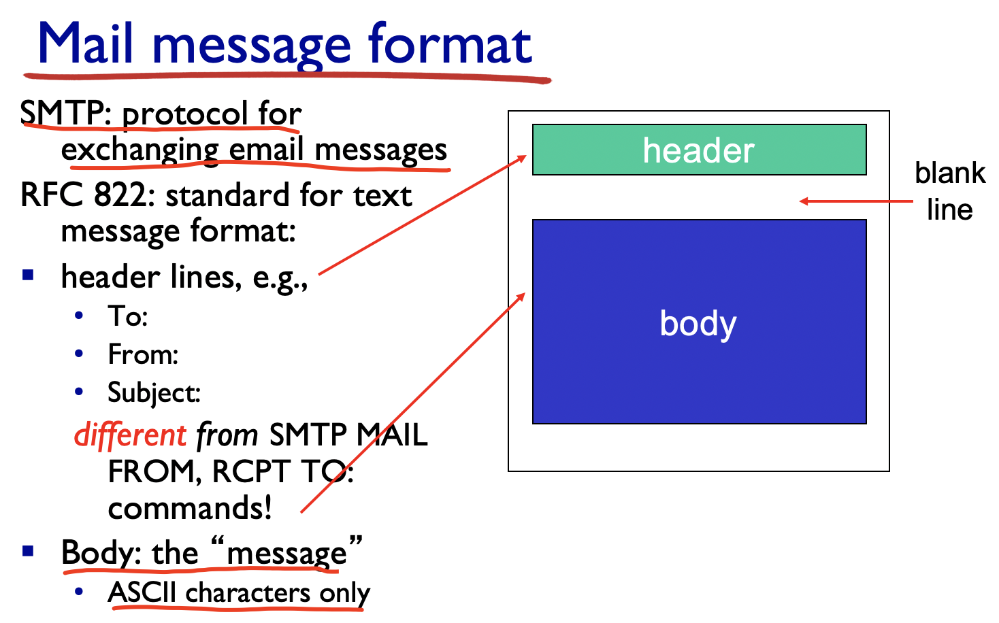

### 4.4 邮件访问协议
由于SMTP是推操作，但用户查看邮件则是拉操作，所以引入特殊的协议来处理问题。常见的邮件访问协议：
- 第三版的邮局协议（Post Office Protocol- Version，POP3）【RFC 1939】
    - 用户身份确认（代理 <------> 服务器）并下载
    - 按照3个阶段进行：
        - 特许（authorization）：用户代理发送（以明文形式）用户名和口令以鉴别用户。
            - 客户端命令：
                - user：声明用户名
                - pass：口令
            - 服务器响应
                - +OK
                - -ERR

        - 事务处理：用户代理取回报文或者其他操作（删除报文标记等）
            - list：报文号列表
            - retr：根据报文号检索报文
            - dele：删除
            - quit
        - 更新：发出quit命令后，目的：结束POP3会话。

- 因特网邮件访问协议（Internet Mail Access Protocol，IMAP）【RFC 1730】
    - 更多特性，更复杂
- HTTP：基于Web的电子邮件。
    - 用户代理即是普通的浏览器，用户和远程邮件之间的通信都是通过HTTP进行。

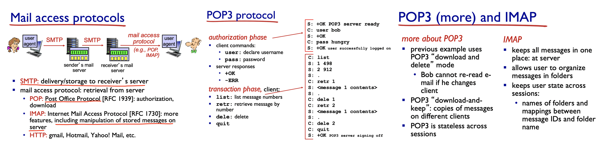

## 5. DNS：因特网的目录服务
- 识别主机的两种方式：
    - 主机名
    - IP地址

一个IP地址由 4个（32 bit）字节 组成，并有严格的层次结构。

### 5.1 DNS提供的服务
- DNS（Domain Name System）：域名系统
    - 分布式数据库：分层的DNS服务器实现
    - 应用层协议：主机能够查询分布式数据库的应用层协议。
    - DNS服务器通常是运行BIND软件的UNIX机器。
    - DNS协议运行在UDP上，端口号：53

DNS通常是由其他应用协议所使用的，包括HTTP、SMTP和FTP，将用户提供的主机名解析为IP地址。

- 🚩 🚩当浏览器中请求一个URL时，具体的操作如下：
    - 同一台用户在主机上运行着DNS应用的客户端
    - 浏览器从URL中抽取出主机名，然后将主机名传给DNS应用的客户端
    - DNS客户向DNS服务器发送一个包含主机名的请求
    - DNS客户会收到一个响应报文，其中包含对应主机名的IP地址。
    - 浏览器收到来自DNS的IP地址，能够向位于该IP地址80端口的HTTP服务器进程发起一个TCP连接。

- DNS提供的服务：
    - 主机名到IP地址的转换
    - 主机别名（host aliasing）
        - 复杂主机名的主机能拥有一个或者多个别名。
    - 邮件服务器别名（mail server aliasing）
        - 
    - 负载分配（load distribution）
        - DNS也用于在冗余的服务器之间负载分配。
- 域名的管理
    - 一个域管理其下的子域
        - 如：.cn 被划分为 edu.cn、.com.cn
    - 创建一个新的域，必须征得其所属域的同意。
- 域和物理网络无关
    - 域遵从组织界限，而不是物理网络
        - 一个域的主机不在一个网络
        - 一个网络的主机不一定在一个域
    - 域的划分是逻辑的，而不是物理的。


### 5.2 DNS工作过程概述
DNS的一种简单设计是在因特网上只使用一个DNS服务器，该服务器包含所有的映射。

- 集中式设计存在的问题
    - 单点故障（可靠性问题）
    - 通信容量（扩展性问题）
    - 远距离的集中式数据库（维护性问题）
    - 维护

- 三种常见的DNS服务器类型：

    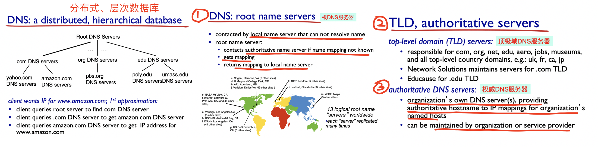

    根、TLD和权威DNS服务器都处在该DNS服务器的层次结构中。

- 本地DNS服务器（local DNS Server）
    - 严格来说不属于该服务器的层次结构。
    - 每个ISP（如一个大学、一个系、一个公司或者一个居民区的ISP）都有一台本地DNS服务器。
        - 也叫做默认名字服务器
    - 当主机发出DNS请求时，该请求被发往本地DNS服务器，起到代理作用，然后将该请求转发到DNS服务器层次结构中。

- DNS缓存
    - 为了改善时延性能并减少在因特网上到处传输的DNS报文数量，所以DNS广泛使用缓存技术。
    - 一旦主机收到DNS响应，则会直接将响应中包含的信息缓存在本地服务器中。
    - 主机和主机名与IP地址间的映射非永久，DNS服务器会在一段时间后丢弃缓存的信息。
        - 因缓存，本地DNS服务器可以立即返回主机名的IP地址，而不必查询其他任何DNS服务器。
        - 本地DNS服务器能缓存TLD服务器的IP地址，因而允许本地DNS绕过查询链中的根DNS服务器。

### 5.3 DNS记录和报文
共同实现DNS分布式数据库的所有DNS服务器存储了 **资源记录（Resource Record，RR）** ，RR根据主机名到IP地址的映射。每个DNS响应报文包含了一条或者多条资源记录。

- 资源记录包含的字段

    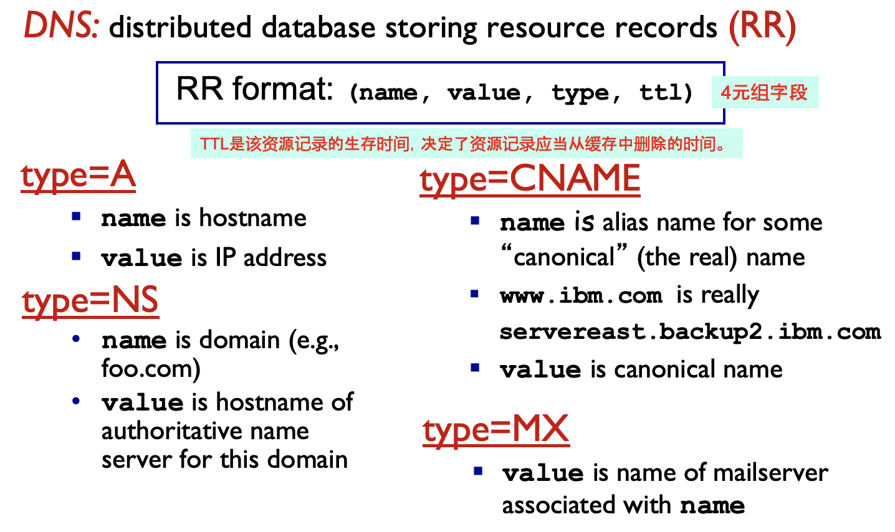

- DNS报文
    - DNS的查询和响应报文的格式相同。

    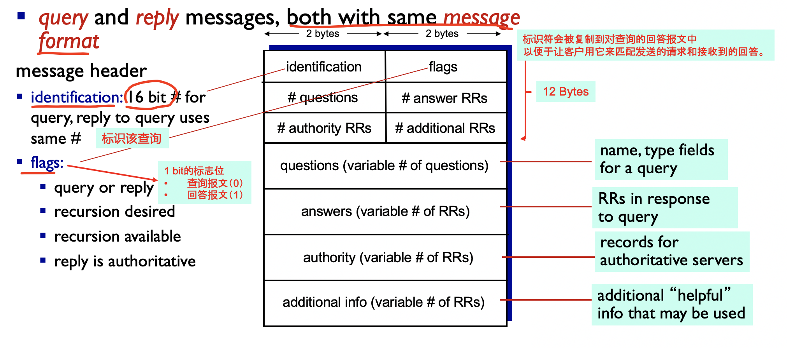

    - nslookup程序
        - 可以从正在工作的主机直接向某些DNS服务器发送一个DNS查询报文。
        - 后续实验后补充

- 在DNS数据库中插入记录
    - 注册登记机构（register）：商业实体
        - 验证域名的唯一性，将该域名输入DNS数据库，对提供的服务收取少量费用。

- DNS脆弱性
    - DNS是一个易受攻击的目标，主要攻击策略：
        - 分布式拒绝服务（DDoS）带宽洪泛攻击
        - 重定向攻击
        - 利用DNS基础设施对目标主机进行DDoS攻击

## 6. P2P应用
C/S架构依赖于总是打开的基础设施服务，而P2P依赖较小。

P2P成对间歇性连接的主机（称为对等方）彼此直接通信。

- P2P设计的应用
    - 从单一服务器向大量主机（称为对等方）分发一个大文件
    - 文件分发
    - 分布式数据库（分布式散列表的概念，Distributed Hash Table，DHT）

### 6.1 纯P2P架构
- 没有（或极少）一直运行的服务器
- 任意端系统都可以直接通信
- 利用peer的服务能力
- Peer节点间歇性上网，每次IP地址都有可能发生变化。
- 常见的例子：
    - 文件分发
    - 流媒体
    - VoIP（Skype）

### 6.2 文件分发系统
- P2P架构的扩展性
    - 分发时间（Distributed time）：所有N个对等方得到该文件的副本所需要的时间。

    

- BitTorrent
    - P2P文件共享协议的经典应用。
    - 所有的对等方都是服务器。
    - P2P文件共享要解决的两大问题
        - 如何定位所需资源
        - 如何处理对等方的加入和离开
    - 解决问题可能的方案
        - 集中
        - 分布式
        - 半分散

    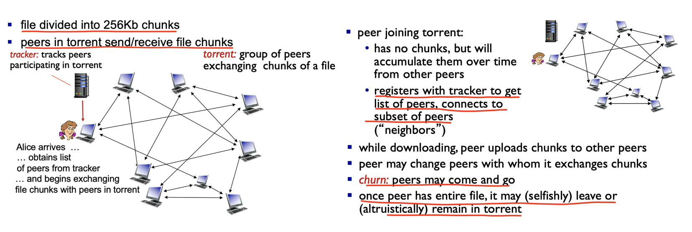

    - BitTorrent请求和发送文件块
        - 请求文件块
            - 在任何给定的时刻，每个对等方将具有来自该文件的块的子集，并且不同的对等方具有不同的子集。
            - 周期性地（经TCP连接）询问每个邻近对等方所具有的块列表。
            - 对还没有的块发出TCP请求。
            - 使用最稀缺优先（rarest first）技术：可以均衡每个块在洪流中的副本数量。
        - 发送文件块：使用tit-for-tat
            - 以最高速率提供数据的邻居，给出其优先权。
            - 疏通（unchoked）：每4个对等方。
            - 每30s随机选择另一个邻居并向其发送块。

### 6.3 分布式散列表
分布式散列表是一种简单的数据库。

允许任何对等方用一个特别的键来查询该分布式数据库。分布式数据库则定位拥有该相应（键，值）对的对等方，然后向查询的对等方返回（键，值）对。

任何对等方也允许在数据库中插入新键-值对。

- 哈希表
- DHT方案
- 环形DHT以及覆盖网络
- Peer波动

内容说明：《计算机网络：自顶向下方法》第6版有介绍，后续细读补充。

## 7. CDN

### 7.1 因特网视频
- 视频流量：占据互联网大部分的带宽
- 挑战
    - 规模性：如何服务更多用户？
    - 异构性：不同用户拥有不同的能力（有线或者无线接入）
- 解决方案：分布式的，应用层面的基础设施。

### 7.2 多媒体：视频

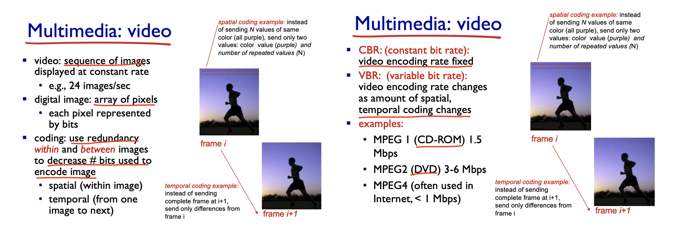

### 7.3 多媒体流化服务：DASH
- DASH：Dynamic, Adaptive Streaming Over HTTP（动态自适应流化HTTP）
    - 解析度不同，如：720、1840、4k等

- 服务器
    - 将每个视频分割成多个块
    - 每个块独立存储，编码于不同码率（8-10种）
    - 告示文件（manifest file）：提供不同的块的URL
- 客户端
    - 先获取告示文件
    - 周期性地测量服务器到客户端的带宽
    - 查询告示文件，在一个时刻请求一个块，HTTP头部指定字节范围。
        - 如果带宽足够，选择最大码率的视频块。
        - 会话中的不同时刻，可以切换请求不同的编码块（取决于当时的带宽）
- “智能”客户端：客户端自适应决定
    - 何时去请求块（避免缓存挨饿或者溢出）
    - 请求什么编码速率的视频块（当带宽够用时，请求高质量的视频块）
    - 哪里去请求块（可以向离自己最近的服务器发送URL、或者向高可用带宽的服务器发送请求）
    - 例子
        - 视频的清晰度

### 7.4 内容分发网络
Content Distribution Network（内容分发网络，CDN）

- 挑战：
    - 视频流公司服务器如何通过网络向百万计用户提供流化视频内容？
- 解决方案1：单个超大型的数据服务器中心
    - 存在问题：
        - 服务器到客户端路径上经过的通信链路过多，导致链路上的吞吐量过小，从而出现停滞时延。
        - 同一个视频的多次拷贝，导致带宽浪费。
        - 单个节点故障，会使通信链路崩溃，使得无法分发视频。
        - 可扩展性较差

- 解决方案2:CDN
    - 通过CDN，全网部署缓存节点。存储服务内容，就近为用户提供服务，提高用户体验。
    - Enter deep：将CDN服务深入到许多接入网
        - 更接近用户，数量多，离用户近，但是管理困难
    - Bring home：部署在少数（10个左右）关键位置。
        - 采用租赁线路将服务器簇连接起来。
    - 用户从CDN中请求内容，重定向到最近的拷贝，请求内容。

- CDN的类型
    - 专用CDN（private CDN）：内容提供商自有。
    - 第三方CDN（third- party CDN）：第三方公司提供。

## 8. Socket编程
Socket（套接字）编程

应用进程使用传输层提供的服务才能够交换报文，实现应用协议，实现应用。
- TCP/IP：应用进程使用Socket API访问传输服务。
- 地点：界面上的SAP（Socket）
- 方式：Socket API

- socket编程
    
    两种传输层服务的socket类型：
    - TCP：可靠的、字节流的服务
    - UDP：不可靠（UDP数据报）服务

目标：
- 学习如何构建能借助Socket进行通信的C/S应用程序。

### 8.1 TCP 套接字编程
**`Socket`**：分布式应用进程之间的门，传输协议提供的端到端服务接口。

**`套接字`**：应用进程与端到端传输协议（TCP或UDP）之间的门户。

**`TCP服务`**：从一个进程向另一个进程可靠地传输字节流。


- 服务器首先运行，等待连接建立
    - 服务器进程必须处于运行状态
        - 创建欢迎socket
        - 和本地端口捆绑
        - 在欢迎socket上阻塞式等待接收用户的连接。
- 客户端主动和服务器建立连接
    - 创建客户端本地套接字（隐式捆绑到本地port）
        - 指定服务器进程的IP地址和端口号，与服务器进程连接。
    - 当与客户端连接请求到来时
        - 服务器接受来自用户端的请求，解除阻塞式等待，返回一个新的socket（与欢迎socket不一样），与客户端通信。
            - 允许服务器与多个客户端通信
            - 使用源IP和源端口来区分不同的客户端。
- 连接API调用有效时，客户端P与服务器建立TCP连接。

TCP在客户端和服务器进程之间提供可靠的、字节流（管道）服务。

- 关键的结构体
    - 数据结构 socketaddr_in

    ```c
    // IP地址和port捆绑关系的数据结构（标识进程的端节点）
    struct socketaddr_in{
        short sin_family; // AF_INET
        u_short sin_port; // port
        struct in_addr sin_addr; // IP address, unsigned long
        char sin_zero[8]; // align
    };
    ```
    - 数据结构 hostent
    
    ```c
    // 域名和IP地址的数据结构
    struct hostent{
        char *h_name; // 主机名
        char **h_aliases; // 主机的别名
        int h_addrtype; // 主机的地址类型
        int h_length; // 地址的长度
        char **h_addr_list; // IP地址
        #define h_addr h_addr_list[0];
    }
    // 作为调用域名解析函数时的参数
    // 返回后，将IP地址拷贝到socketaddr_in 的IP地址部分。
    ```

- C/S TCP socket交互

    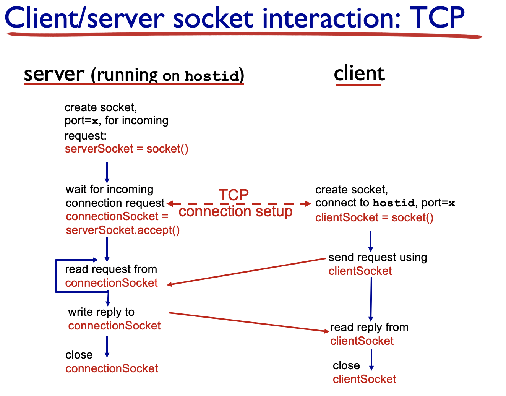

- TCP客户端C代码

    ```c
    // client.c
    void main(int argc,char *argv[])
    {
        struct socketaddr_in sad; // 服务器的IP地址
        int clientSocket; // socket解释器
        struct hostent *ptrh; // 主机列表入口指针
        char Sentence[128];
        char modifiedSentence[128];

        host = argv[1];
        port = atoi(argv[2]); // 转换为整型
        clientSocket = socket(PF_INET,SOCKET_STREAM,0); // 创建一个TCP socket给服务器
        memset((char *)&sadm,0,sizeof(sad));// 清除socketaddr结构
        sad.sin_family =AF_INET; //设置网络
        sad.sin_port = htons((u_short)port);
        ptrh = gethostbyname(host); // 转换host name 为IP地址
        memcpy(&sad.sin_addr,ptrh->h_addr,ptrh->h_length);// 将IP地址拷贝到sad.sin_addr
        connect(clientSocket.(struct socketaddr *)&sad,sizeof(sad)); // 创建client socket去连接 server
        // get input stream from user
        gets(Sentence);
        // send line to server
        n = write(clientSocket,Sentence,strlen(Sentence)+1);
        // read line from server
        n = read(clientSocket,modifiedSentence,sizeof(modifiedSentence));
        printf("FROM SERVER %s \n",modifiedSentence);
        close(clientSocket);
    }
    ```
- TCP服务端C代码
    
    ```c
    // server.c
    void main(int argc,char *argv[])
    {
        struct socketaddr_in sad;
        struct socketaddr_in cad;// 客户端
        int welcomeSocket,connecttionSocket;// socket描述器
        struct hostent *ptrh; // pointer to host table entry
        char clientSentence[128];
        char capitalizedSentence[128];
        port = atoi(argv[1]);
        welcomeSocket = socket(PF_INET,SOCKET_STREAM,0);
        memset((char *)&sad,sizeof(sad)); //清除socketaddr结构信息
        sad.sin_addr.s_addr = INADDR_ANY; // 设置本地IP地址
        sad.sin_port = htons((u_short)port); //设置端口号
        bind(welcomeSocket,(struct socketaddr *)&sad,sizeof(sad)); // 捆绑
        // 指定客户端队列的最大值
        listen(welcomeSocket,10); // 监听最大个数
        while(1){
            connectionSocket = accept(welcomeSocket,(struct socketaddr *)&cad,&alen); // 等待客户端的welcome socket的连接
            n = read(connectionSocket,clientSentence,sizeof(clientSentence));
            // capitalize Sentence and store the result in capitalizedSentence
            n = write(connectionSocket,capitalizedSentence,strlen(capitalizedSentence)+1); //   写最终的结果给到socket
            close(connectionSocket)// while循环结束，返回等待其他client的连接
        }
    }
    ```

### 8.2 UDP 套接字编程

UDP：在客户端和服务器之间没有连接。
- 没有握手
- 发送端在每个报文中明确指定目标的IP地址和端口号
- 服务器必须收到的分组中提取出发送端的IP地址和端口号。

UDP：传送的数据可能乱序，也可能会丢失。所以UDP提供不可靠的字节流传输服务。

- C/S 中UDP socket交互

    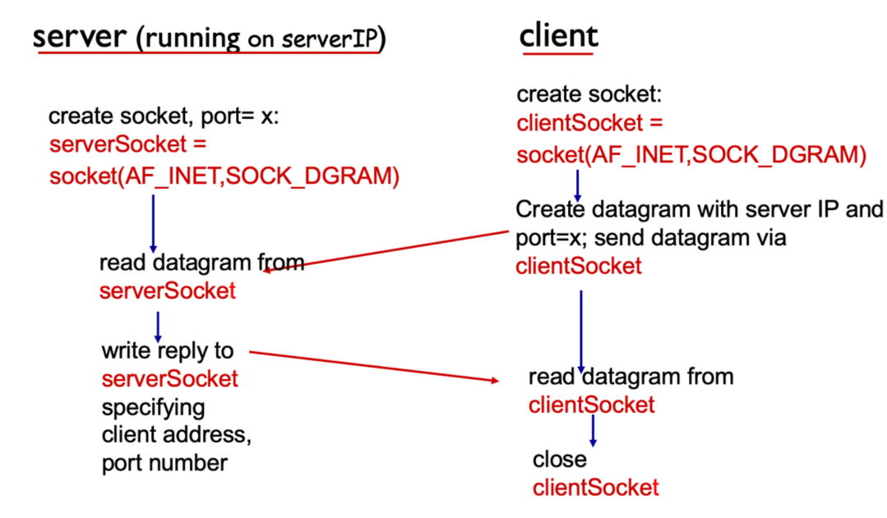

    - 客户端C代码
    ```c
    // client.c
    void main(int argc,char *argv[])
    {
    struct socketaddr_in sad;
    int clientSocket;
    struct hostent *ptrh;
    char Sentence[128];
    char modifiedSentence[128];

    host = argv[1];port = atoi(argv[2]);

    clientSocket = socket(PF_IINET,SOCKET_DGRAM,0); // 创建客户端，但是没有连接到服务器

    // determine the server address
    memset((char *)&sad,0,sizeof(sad)); // 清除
    sad.sin_family = AF_INET; // 设置网络
    sad.sin_port = htons((u_short)port);
    ptrh = gethostbyname(host);
    // 转换host名字为IP地址
    memcpy(&sad.sin_addr,ptrh->h_addr,ptrh->h_length);
    // get input stream from user
    gets(Sentence)
    // send line to server
    addr_len = sizeof(struct socketaddr);
    n = sendto(clientsocket,Sentence,strlen(Sentence)+1,
                (struct socketaddr *)&sad,addr_len);
    // read line from server
    n =recvfrom(clientSocket,modifiedSentence,sizeof(modifiedSentence),
                (struct socketaddr *)&sad,&addr_len);

    printf("FROM SERVER : %s \n",modifiedSentence);
    close(clientSocket); // 关闭连接
    }
    ```
    - 服务器端C代码
    ```c
    // server.c
        void main(int argc,char *argv[])
    {
        struct socketaddr_in sad;
        struct socketaddr_in cad;// 客户端
        int serversocket;// socket描述器
        struct hostent *ptrh; // pointer to host table entry
        char clientSentence[128];
        char capitalizedSentence[128];
        port = atoi(argv[1]);
        serversocket = socket(PF_INET,SOCKET_STREAM,0);
        // 创建 welcomeming socket at port，并捆绑本地地址
        memset((char *)&sad,sizeof(sad)); //清除socketaddr结构信息
        sad.sin_family = AF_INET;// 设置网络簇
        sad.sin_addr.s_addr = INADDR_ANY; // 设置本地IP地址
        sad.sin_port = htons((u_short)port); //设置端口号
        bind(serversocket,(struct socketaddr *)&sad,sizeof(sad)); // 捆绑
        // 指定客户端队列的最大值
        listen(welcomeSocket,10); // 监听最大个数
        while(1){
            // 接收来自client的报文信息
            n =recvfrom(serverSocket,clientSentence,sizeof(clientSentence),
                    (struct socketaddr *)&cad,&addr_len);
            // 大写的转换
            n = sendto(serverSocket,capitalizedSentence,strlen(capitalizedSentence)+1,
                    (struct socketaddr *)&cad,&addr_len);
            close(connectionSocket)// while循环结束，返回等待其他client的连接
        }
    }
    ```


