<h1 align="center">📔 CS144 Lecture01 课程学习笔记</h1>

## 1. 因特网和IP概述
内容目标：
- 了解Internet协议的功能及其工作方式
- 了解Internet协议地址及其分配方式。
- 学习internet如何根据Internet决定数据包应采用的路径地址。

## 2. 网络应用程序
互联网设计的主要贡献者之一：Dave Clark
### 2.1 Byte Steam Model
在计算机通信中，多种通信方式，常见的方式：**`可靠的双向字节流`**。

计算机A与B之间的通信，通过网络进行连接。当A将数据写入连接时，通过网络传输，而B此时可以读取到。如果B将数据写入并连接，将数据通过网络传输的方式到A上，同样也是可以读取到。

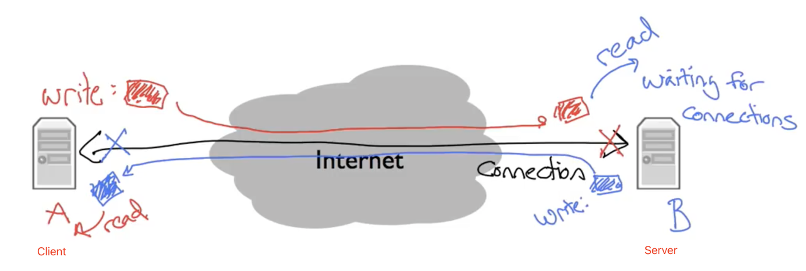

但是，如果server断开连接，而此时计算机A就会获取不到数据，从而提示ERROR。

### 2.2 Word Wide Web（HTTP）
万维网使用 **`HTTP（超文本传输协议）`** 的方式进行work。如果浏览器网址中显示：http://xx.xx.xx.xx时 ，表示该方式是使用了HTTP进行通信。

HTTP被设计为 以 文档为中心 的程序通信方式，使用ASICII文本，人类可读的文本方式
在HTTP中，Client 打开与Server之间的连接，Client使用常见的命令（GET，表示请求页面）向Server发送，此时的Server收到请求，检查用户GET请求的有效页（决定是否可以访问），并作出相应的响应以及与之关联的数字代码。例如常见的：200（可正常访问）、400（错误请求）。

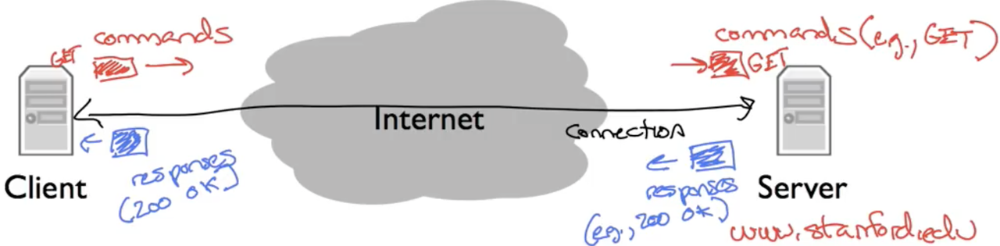

关于请求的方式：GET、PUT、DELETE和INFO等。

总结：

万维网基本模型：就是client通过写入连接来发送请求，server读取，处理请求之后并写入对连接的响应，然后client来再进行读取。

### 2.3 常见的网络应用程序通信方式
- 万维网
  - Client-Server模型，HTTP方式
  - client打开与Server的连接并请求文档，而server通过文档进行回应。
- Skype（对等方式）
- BitTorrent
  - 点对点模型

## 3. 四层网络模型
四层网络模型是早期的互联网先驱创建并用来描述层次结构。

每一层Internet模型的功能如下：

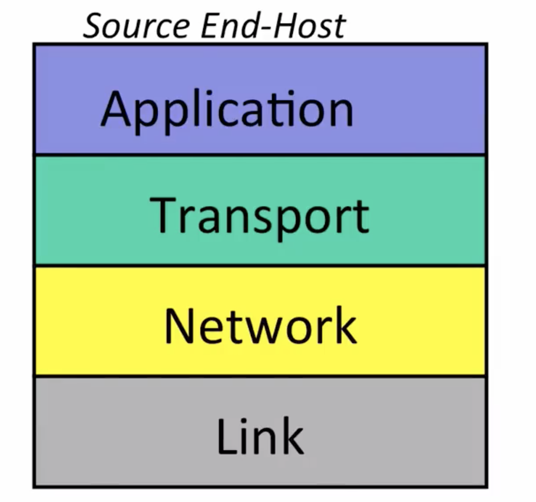

### 3.1 链接层（Link Layer）
在互联网中由终端主机、链接和路由器组成。

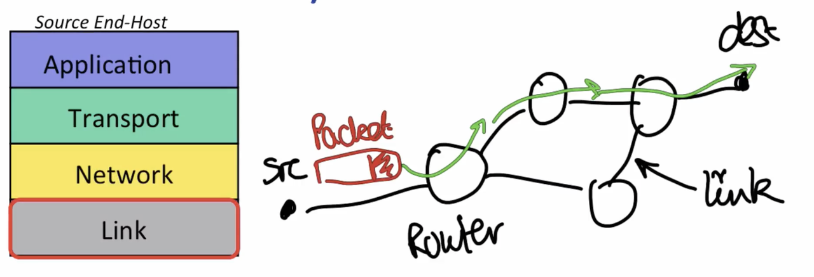

数据通过数据包（数据中包含了要传递的数据以及标头）形式在每个链接中跳转传递。

链路层：通过一次一个链路传送数据。
- 链接层的两个实例
  - 以太网
  - Wi-Fi

### 3.2 网络层
对于网络层的主要工作是：从源端通过Internet端到端传输数据包到目的地。

数据包是自包含数据集合制定的名称，外加一个描述（数据是什么？来源和去处）。常见的数据包图（带有标头和数据的数据包）：

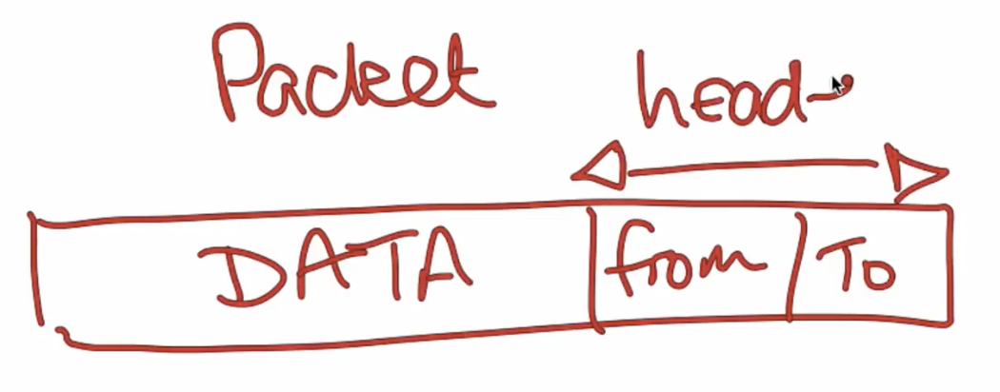

在网络层中的数据包为数据报。

网络将数据报交给下面的链路层，告知它使用第一个链接发送数据报，也可以表明链路层正在给网络层提供“服务”。

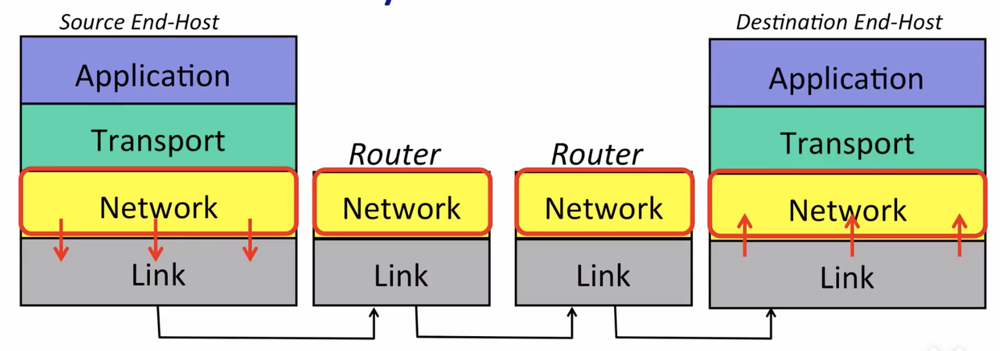

链路的另一端是路由器，路由器的链路层接受来自链路的数据报，并将其移交给网络路由器中的一层，路由器的网络层检查数据报的目标地址，然后将完成一次数据报传输到目的地。

⚠️注意：网络层无需关注链路层的方式即可完成数据报的传输。

- 模块化
    - 对于网络层和链路层之间的区分使得各个层次都专注于本职工作，无需关注其他的层的工作方式。
    - 单个网络层可以通过简单地将数据报交给发送方来完成与不同的链路层之间的通信。

- 网络层的特殊性
    - Internet Protocol （IP）网络协议
        - 尽可能传输数据报到另一端，但是无法保证。
        - IP数据包可能会丢失，无法按顺序传递和损坏。

### 3.3 传输层
常见的传输层是 **`TCP（Transmission Control Protocol，传输控制协议）`** 和 **`UDP（User Datagram Protocol，用户数据报协议）`** 。
- TCP确保Internet一端的应用程序发送的数据正确传递。
- UDP是捆绑应用程序数据，将其交给网络层以传递到另一端。~~⚠️UDP不提供任何传输保证。~~

### 3.4 应用层
应用程序通过双向可靠的字节在两个端点之间的流动。

每一层都与之对应的层通信，无需关注其他层如何获取数据

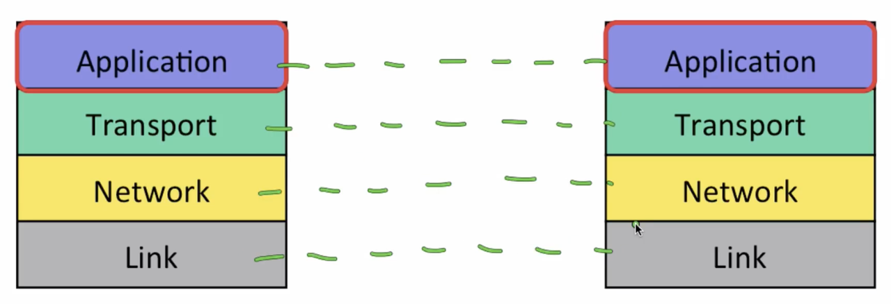

在应用层之间需要通过Internet完成一整个传输过程。

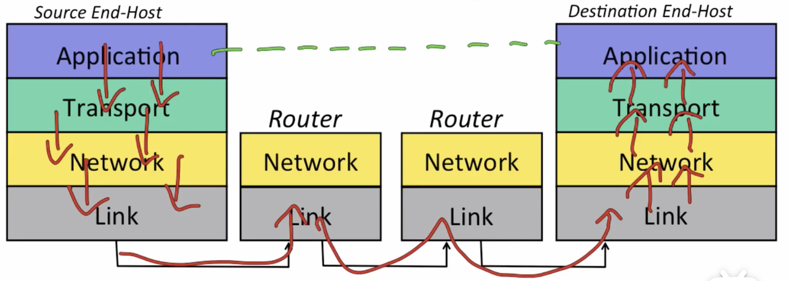

当应用程序发送数据时，数据的传输路径：`应用层 ——> 传输层 ——> 网络层 ——> 链路层`，然后数据被分成对应的数据包，每个数据包都具有正确的目的地址。然后数据又从链路层的路由器传输到上层，从而完成应用层之间的数据传输。

### 3.5 四层模型总结
- **应用层**：使用特定应用层中的两个应用程序之间的双向可靠字节流。例如：HTTP
- **传输层**：保证端到端正确、有序地传输数据。例如：拥塞控制
- **网络层**：端到端提供数据报。尽力而为的交付方式（无法完全保证）。必须使用Internet协议（IP）。
- **链路层**：通过终端主机和路由器之间或路由器之间的单个链接来传送数据。

对于在各个层中，都有各自常见的Internet协议，具体常见的协议如下：

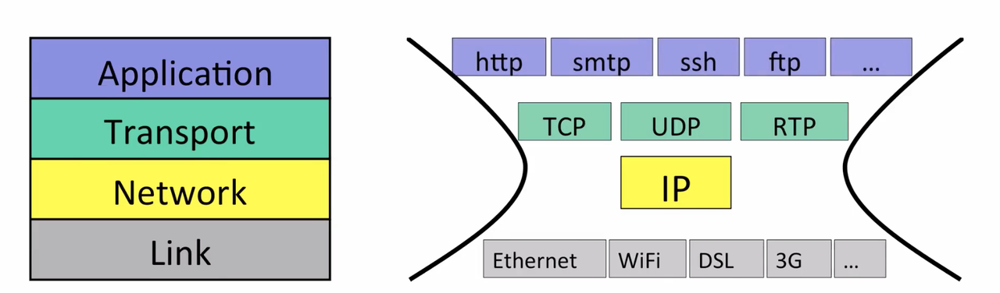

### 3.6 ISO 7层模型
在1980s年代，国际标准组织（ISO）创建了7层模型来表示任何类型的网络。由此也被称为7层开放系统互连或ISO模型。

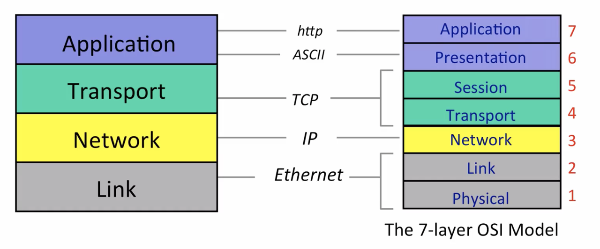

## 4. IP服务模型
模型中每一层都有各自的“服务”协议。

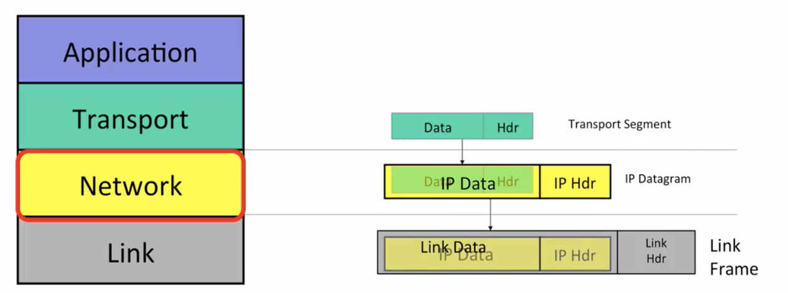

**IP数据报**：由 **`标头`** 和 **`数据`** 组成。

当传输层有需要发送的数据时，将传输段传递给网络层，传输段覆盖IP数据报，形成新的数据报，然后IP数据报通过第一台路由器的第一条链路传输到链路层，将其放入链接帧中，完成数据传输过程。
### 4.1 IP提供的基本服务

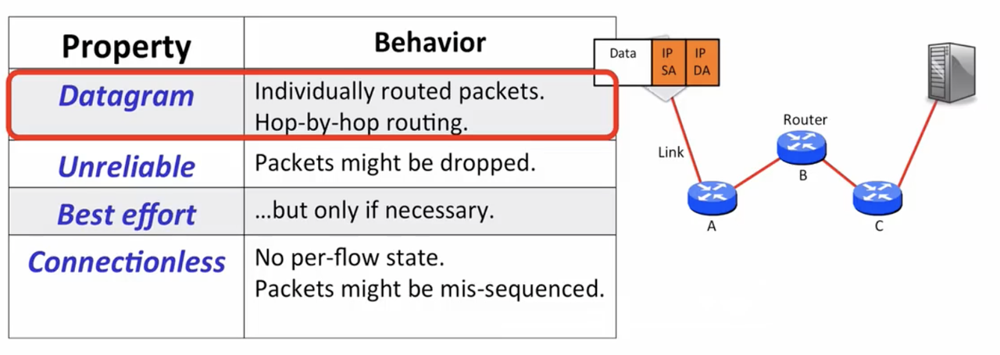

Internet上的每一次通信都必须使用IP服务。

#### 4.1.1 基本服务
- 简化并降低构建和维护成本。
  - 快速且低成本本地发送数据包。
- 端到端原则：尽可能在终端host中改进feature。
- 允许在顶部构建安装各种可靠（不可靠）的服务。
- 适用于任何链路层：IP对链路层的假设很少。
- 简单的IP快速且便宜，可以直接通过硬件来实现。
#### 4.1.2 更多服务
- 防止无限循环：IP会尝试组织数据包永远循环。
  - 由于IP路由器通过Internet逐条转发数据包，如果在路由器中转发表错误，导致数据包遵循相同的路径开始循环。⚠️注意：发生阶段不确定。
  - 解决措施：通过数据报头部中的生存时间（Time to Live,TTL）字段来阻止不断循环的数据包泛滥导致网络破坏。
- 数据包分段：大多数的链路层对数据包的大小有限制。
- IP使用 标头校验 来减少将数据报传递到错误地方的几率。
- 新的两个IP版本：
  - IPv4：目前使用最多的32位地址。
  - IPv6：由于IPv4地址即将用完，所以开始迁移到128位地址的IPv6。
- IP允许将新字段添加到数据报头中。
### 4.2 IPv4数据报及其各字段功能

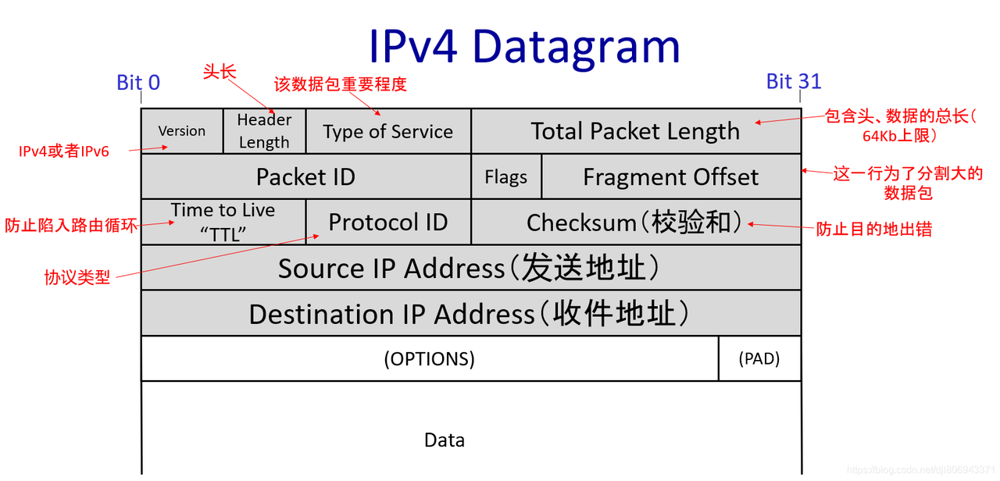

## 5. TCP 字节流

### 5.1 TCP传输层三次握手
在传输层中，几乎所有的网络都必须通过TCP进行，通过例子分析来解释「三次握手」

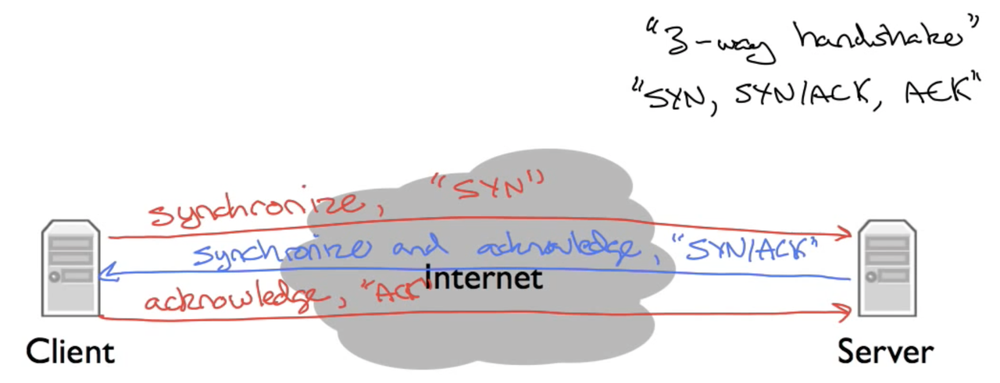

对于Server来说，负责侦听连接请求，打开connection，Client发出GET连接请求，服务器会对此作出Responds。在信息交换的过程中会有三条信息，也就是常说的三次握手。

- Step 1 当Client检测到同步信息时，对于Server来说叫做“SYN”；

- Step 2 当同步信息的Server响应同时也确认了Client的同步时的一个确认信息，叫做“SYN/ACK”；

- Step 3 当Client确认服务并作出响应时，同步，通常会调用一个ACK。

总结：对于三次握手，也被描述为：**`SYN（同步）`**、**`SYN（同步）`**、**`Acknowledge（确认）`**、**`Acknowledge（确认）`**、和**`sync Act（同步动作）`**。

### 5.2 网络层传输
**网络层** 主要负责`计算机传送数据包`，而**传输层**负责`交付数据应用程序`。

在网络层中，使用IP地址（网络层中为计算机传递数据包的地址）和一个TCP port来告诉计算机软件要将数据传送到哪个应用程序中。

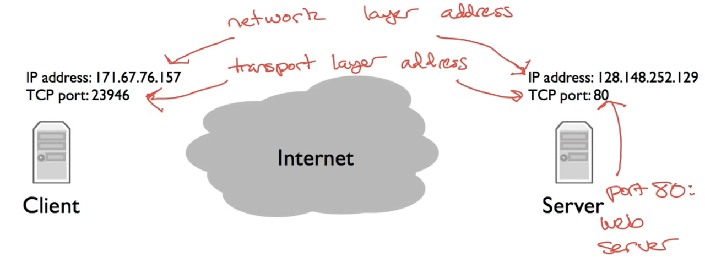

在Web Server中通常使用TCP Port 80上进行。

### 5.3 实践TCP三次握手

#### 5.3.1 使用Wireshark
工具Download：https://www.wireshark.org/#download

#### 5.3.2 使用traceroute

## 6. Internet Protocol设计原则

### 6.1 交换机原则

#### 6.1.1 交换机的定义
**数据包**：一个独立的数据单元，其中包含数据到达所需的信息及其目的地。

**数据包交换的思想**：将数据分解为离散、独立的大块数据。每一个数据块都带有足够的信息，然后将信息传递数据包到达目的地。

**数据包交换**：独立于每个到达的数据包，选择其传出链路。如果该链路空闲，直接发送，否则直接保存数据包以备后用。

#### 6.1.2 数据包交换工作示例
每个数据包中包含一个显式路由，制定沿途的每个数据包交换机的ID，有时称为“自路由”或者“源路由”，因为源指定了路线。

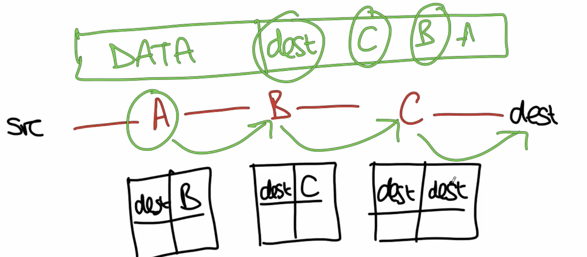

当源发送数据包时，将放入数据包A、B、C直至目的地。
#### 6.1.3 数据包转发
数据包序列称为流。
- 流：属于同一端到端通信的数据报的集合。例如：TCP连接
- 数据包交换不需要每个流的状态，每个数据包均独立。
- 交换机无需担心添加或删除流状态。
- 交换机无需存储流状态。
  - 原因：开关需快速，需要存储快的闪存，价格昂贵。所以交换机专注于快速转发数据包。
- 交换机无需担心故障。
#### 6.1.4 链接有效共享
- 数据流量的突发性
  - 对于发送和接收数据的速率和时间段不固定。
  - 共享Link容量（包括多用户之间共享）。
采取单一资源并以概率方式在多个用户之间共享的统计方式称为统计复用（Statistical Multiplexing）。
#### 6.1.5 总结
交换机的优点
- 简单：不需要了解数据包流。
- 有效：在链接层中有效地共享容量。
这是早期网络的构建方式，但现在也被接受。

### 6.2 分层（Layering）原则
一种广泛应用在外部网络的设计原则，常见的是在计算机系统中。

#### 6.2.1 分层的定义
一种把系统划分为多个独立功能的名称。

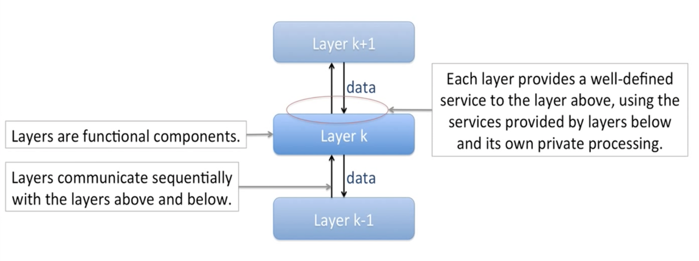

#### 6.2.2 计算机系统中的分层设计

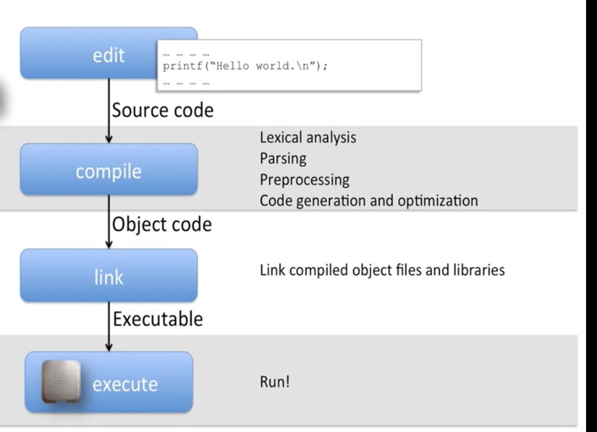

具体原则参考 编译原理 书中的内容。

在计算机系统中，分层原则解决了编写在硬件上执行的程序的总体问题。分为各个模块和组件，然后让每个模块或者是功能组件来为其提供特定的服务。

计算机系统中使用分层的主要原因：
- 模块化（Modularity）：将系统分解更小、更易管理的模块。
- 定义明确的服务：每层都为上层提供定义明确的服务。
- 重用（Reuse）：构建新模块时，调用其他模块来实现该层，从而节省重写时间。
- 专注点分离：每层都有其专注点，无需关注其他层。
  - 通信方式：上下移动
  - 好处：减少复杂交互。
- 持续改进
- P2P（Peer-to-peer）通信：也叫对等通信，在分层通信系统独有。

### 6.3 封装原则
封装是发生在 分层和数据包交换组合阶段。
数据包：将数据分解为离散的单位。
封装主要是采用协议层并将其组装成数据包的方式。

## 7. Byte Order（字节序）

### 7.1 计算机内存模型
在大多数计算机中，内存是按 字节（8位内存块）组成的。程序都有地址空间，地址都是从零开始。一台计算机最多有2到64个字节，即18个六十亿字节。

两种类型计算机
- 32位计算机：内存地址长度：32位
- 64位计算机：内存地址长度：64位

对于每个软件指令都可以访问内存中的每个字节，也可以成组访问。⚠️注意：一个指令加载来自8个连续字节存储单元的64位整数。

### 7.2 字节序列（Endianness）
内存中分配多字节值的方式称为字节顺序。并有两种选项：
- 小端法：最低有效字节位于最低地址。
- 大端法：最高有效字节位于最低地址。

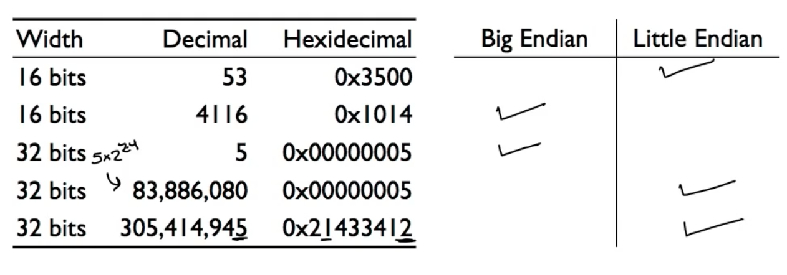

### 7.3 网络字节序列
对于不同的处理器有不同的字节序列。
- Intel 和AMD的x86处理器是低位字节序：小端法
- ARM处理器有效字节在前：大端法

在两台不同的通信中，不区分大端法和小端法。网络协议机构一般会选择其一使用。一般情况下，Internet规定的所有协议都使用大端格式。

如果需要大字节序列格式的数据包，对于处理器是小字节序列时，必须转换主机序列（一般使用函数：htons()、ntohs()、htonl()、ntohl()）。

## 8. Ipv4地址
Internet协议允许两台计算机之间通过不同的链接层通过构建地址来实现。
IP数据包具有源地址和目的地址。
路由器根据数据包的目的地址来决定通过哪个链路转发数据包。

### 8.1 Internet协议 Version 4
地址长度为32位。通常是以4个8bit。
网络掩码（Netmask）：如果与掩码匹配，则属于同一网段。是从最高有效位开始的连续字符串。
常见子网掩码：
- 255.255.255.0：第一个24 bits匹配（前3个8位组全为1，最后一个8位组为0）
- 255.255.252.0：第一个22 bits匹配（）
- 255.128.0.0：第一个9 bits
通过对两台计算机进行按位与运算来判断两台计算机是否处于同一个网络中使用网络掩码的地址。

### 8.2 地址结构
原

