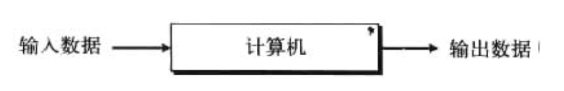
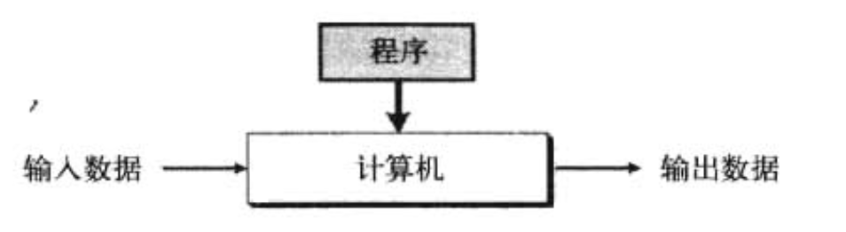
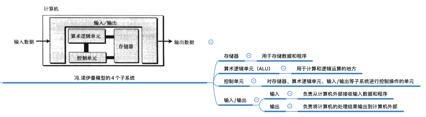

<h1>
 第一章 绪论 学习笔记
</h1>

## 01. 图灵模型
1937年图灵首次提出一个通用计算设备的设想。通过在人在计算过程中的行为的的基础上，将行为抽象到计算机的模型中。

### 1.1 数据处理器
将计算机定义为数据处理器，接收一个输入数据，数据处理器会处理后产生输出数据的黑盒。

可体现计算机的功能，但是定义太广泛。

存在的问题：
- 模型并未说明处理的类型和数。
- 通用性较差。

### 1.2 可编程数据处理器
基于图灵模型增加了程序输入到计算机中。

- 程序：告知计算机对数据处理的指令集合。
- 输出数据依赖 `输入数据` 和 `程序` 两个因素的结合作用：
    - 相同程序、不同的输入数据
    - 相同的输入数据、不同的程序
    - 相同的输入数据、相同的程序

### 1.3 通用图灵机
提供合适的程序可做任何运算。

## 02. 冯.诺伊曼模型
1944～1945年期间冯.诺伊曼提出。将数据和程序直接存在计算机中的存储器中。

### 2.1 4个子系统

### 2.2 存储的程序
现代计算机的存储单元主要存储 `程序` 和 `数据` 。

- 程序和数据有相同的格式
- 都存储在存储器中
- 以 `位模式（0或1序列）`存储

### 2.3 指令的顺序执行

- 指令的三个指令
    - 读入指令
    - 解释指令
    - 执行指令
- 指令是一条接着一条按顺序执行。
- 指令的顺指令是基于冯诺伊曼模型的计算机的初始条件。

## 03. 计算机组成
计算机的三大组成部分：硬件、数据和软件

- 硬件
    - 基于冯.诺伊曼模型。

- 数据
    - 存储数据
        - 冯诺伊曼模型没有定义如何存储在计算机中。
        - 不同类型的数据由 0和1序列 构成的二进制组成的数据进行存储在计算机内部中。
    - 组织数据
        - 计算机内部：一种形式（位模式）存储
        - 计算机外部：形似不同。
        - 数据被组织成许多小的单元，再由小单元构成大单元，从而有效将数据组织成不同的实体和格式。

- 软件
    - 必须存储程序
        - 存储器中必须存储数据和程序
    - 指令的序列
        - 程序必须是有序的指令集
        - 每一条指令操作一个或多个数据项
        - 每个程序可以是不同指令的不同组合
    - 算法
        - 按步骤解决问题的方法。
    - 语言
        - 机器语言
        - 计算机语言
    - 软件工程
        - 结构化程序的设计和编写
        - 用来描述某一任务的应用程序，以及程序设计中所要严格遵循原理和规则。
    - 操作系统
        - 因程序中一些指令对所有程序来说是公用的，所以出现OS来提供效率辅助提高。
        - 为程序访问计算机部件提供方便的一种管理程序。

## 04. 历史
分为三个阶段：

### 4.1 机械计算机器（1930年以前）
- 17世纪
    - Blaise Pascal发明了Pascsline，用来进行加减运算的计算机器。

- 20世纪
    - Niklaus Wirth 发明了结构化的程序设计语言 ----> Pascal语言

- 17世纪后期
    - Gottfried Leibnitz 发明了可进行加减乘除的复杂计算机机器，机器叫做莱布尼茨之轮。

- 19世纪初期
    - Joseph-Marie Jacquard发明提花织机（穿孔卡出现，类似存储程序），第一台利用和编程概念的机器。
- 1823年
    - Charles Babbage发明了差分引擎。
        - 可进行简单数学运算
        - 也可多项式方程
    - 也发明了分析引擎，四个组成部分：
        - 制造场：现在的算术/逻辑单元
        - 存储单元：存储器
        - 操作者：控制单元
        - 输出单元：输入/输出

- 1980年
    - Herman Hollerith设计并制造出具有编程能力的机器
        - 机器可自动阅读、计数和排序存储在穿孔卡上的数据。

### 4.2 电子计算机的诞生（1930 ～ 1950）
- 早期的电子计算机

    - 所有的计算机都是外部进行编程。

    - 1939年
        - 第一台用来完成特定任务的计算机（ABC）
            - 进行电子编码来实现其功能。
            - 用于实现解决一些线性方程的系统。
        - 同时期设计出通用的计算机
    - 20世纪30年代
        - Mark M1巨型计算机的出现
            - 使用了电子部件和机械部件
    - 图灵发明了 “巨人” 的计算机。
        - 破译德国Enigma密码而设计
    - 1946年完成设计
        - ENIAC（Electronic Numerical Integrator and Calculator，电子数字集成器和计算器）计算机
        - 第一台通用、完全电子的计算机。

- 基于冯.诺伊曼模型的计算机
    - 1950年
        - EDVAC：第一台基于冯氏思想的计算机
        - EDSAC：与EDVAC同类型

### 4.3 计算机的诞生（1950年至今）
1950年后的计算机差不多都基于冯.诺伊曼模型。

- 第一代计算机
    - 大约1950 ～ 1959年
        - 主要特征
            - 商用计算机（个人无法负担费用）
            - 体积庞大且使用真空管作为电子开关。

- 第二代计算机
    - 大约1959 ～ 1965年
        - 使用晶体管代替了真空管
        - 体积减小、节省开支
        - 中小企业可负担

- 第三代计算机
    - 大约1965 ～ 1975年
        - 集成电路（晶体管、导线以及其他部件做在一块单芯片上）的出现
        - 减少了成本和大小
        - 市场上出现小型计算机
        - 软件包的出现

- 第四代计算机
    - 大约1975 ～ 1985年
        - 微型计算机的出现
        - 计算机网络的出现
    - 1975年
        - 第一个桌面计算器

- 第五代计算机
    - 1985年
        - 掌上电脑和台式电脑的诞生
        - 第二代存储媒体（CD-ROM、DVD等）的改进
        - 多媒体的应用
        - 虚拟现实现象

## 05. 社会问题和道德问题

- 社会问题
    - 依赖：对计算机的依赖过强
    - 社会公正
    - 数字化分裂

- 道德问题
    - 隐私
    - 版权
    - 计算机犯罪
