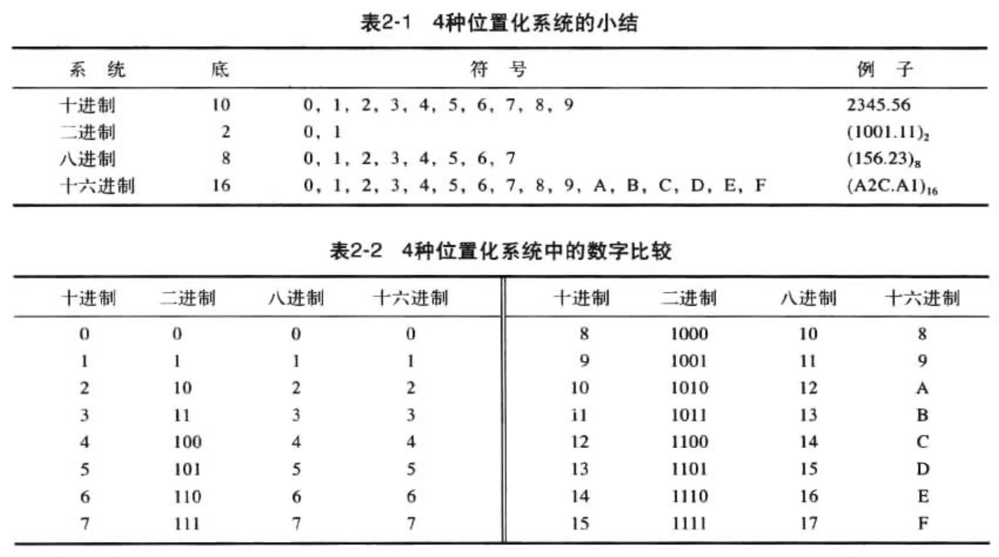
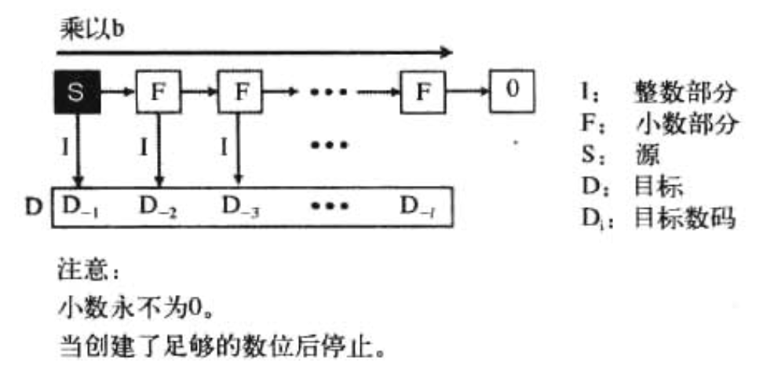

<h1>
 第二章 数字系统 学习笔记
</h1>

## 01. 引言
数字系统（或数码系统）定义了如何使用独特的符号来表示一个数字。

不同的系统中，数字有不同的表示方法。所以分为两类：
- 位置化系统
- 非位置化系统

## 02. 位置化数字系统
位置化数字系统中，符号所占据的位置决定了其表示的值。

- S是一套符号集
- b是底（或基数） = S符号集中的符号总数
- i表示位置
- b的幂可以从0～k-1
- $\pm$ 表示数字的正负

### 2.1 十进制（以10为底）
计算机存储正负数的方式不同。注意添加隐藏的符号（$\pm$）。

- 整数
    
    

- 实数
    - 带有小数部分的数字

    

### 2.2 二进制（以2为底）
二进制主要用于存储计算机数据。

- 整数

    
 
- 实数

    

### 2.3 十六进制（以16为底）
解决二进制符号存储过长的问题。

- 整数

    

### 2.4 八进制（以8为底）

- 整数

    

### 2.5 总结

### 2.6 进制转换

- 其他进制转换为十进制

    

- 十进制到其他进制

    - 主要需要处理两个部分：整数部分和小数部分

    - 转换整数部分

        

    - 转换小数部分

        

- 二进制转八进制
    - 二进制中的3位正好是八进制中的1位。

- 八进制转十六进制
    - 使用二进制作为转换中介
    - 八进制 To 十六进制
        - 将八进制转到二进制，将位数重排成4位一组，找到十六进制的对等值。
    - 十六进制 To 八进制
        - 将十六进制转到二进制，将位数重排成3位一组，找到八进制的对等值。