<h1>
 csapp chapter05 优化程序性能 学习笔记
</h1>

## 内容和图片来源说明
- 书籍《深入理解计算机系统》第3版 第 5 章
- PPT：CMU CS15-213 2015 及 课程笔记

## 1. 性能现状
程序的目标：保证它在所有情况下可以正常工作。

### 1.1 编写高效程序的两个方式
- 选择一组适当的算法和数据结构。
- 编写出编译器能够有效优化以转换成高效可执行代码的源代码。

### 1.2 让程序运行更快的方式
- 例如，可以先去掉程序中不必要的代码部分，让其不依赖于及目标机器。
- 编写出对编译器友好的代码，让编译器能够辅助优化代码。
- 针对特定的机器来对程序进行优化。
    > 针对特定及其优化有存在风险，机器型号（处理器）不同，则会存在相应的性能差异，但基本的优化思想适用于不同的机器优化。

### 1.4 优化性能的小Tips
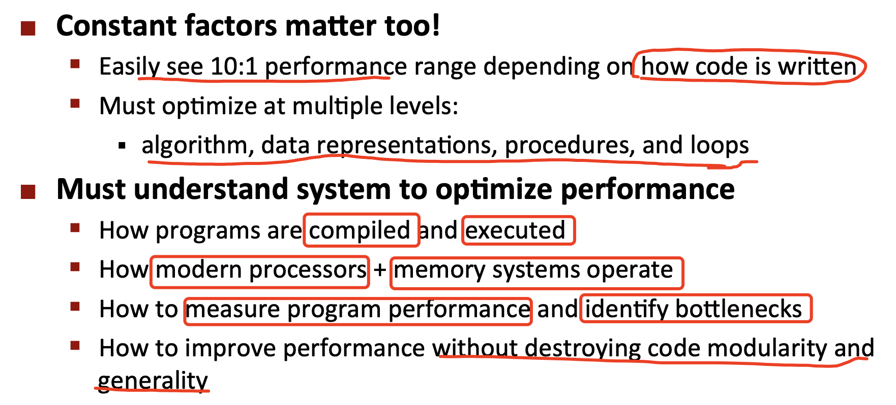

早期为了使得程序高效运行，会使用汇编编写，但不是绝对，除非在一些资源较小的机器上进行（例如嵌入式系统）。

## 2. 编译器的能力和局限性
gcc并不是最好的编译器，由于intel编译器收费，所以gcc对于大多数人来说已经足够使用。

### 2.1 编译器优化角度

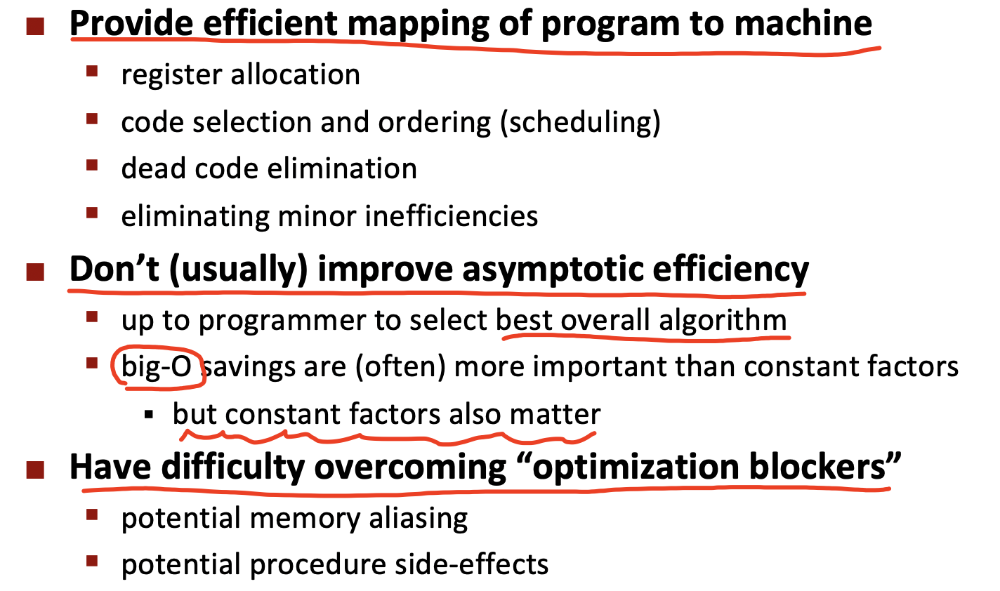

一般情况下，编译器的优化方案中总会有一个`备选方案`：**不优化**。
> 在优化过程中，编译器只对程序进行安全的优化，无法确定其影响性或范围较大时，则会选择作出暂时性的优化。

### 2.2 编译器的局限性
- 编译器很难理解使用的数字、也很难理解内存引用和过程调用的影响性。
- 大部分的分析优化都是只基于静态信息。
- 编译器只做确定的优化，如果发现编译器未达到预期的优化效果，则会选择回看代码重新分析。

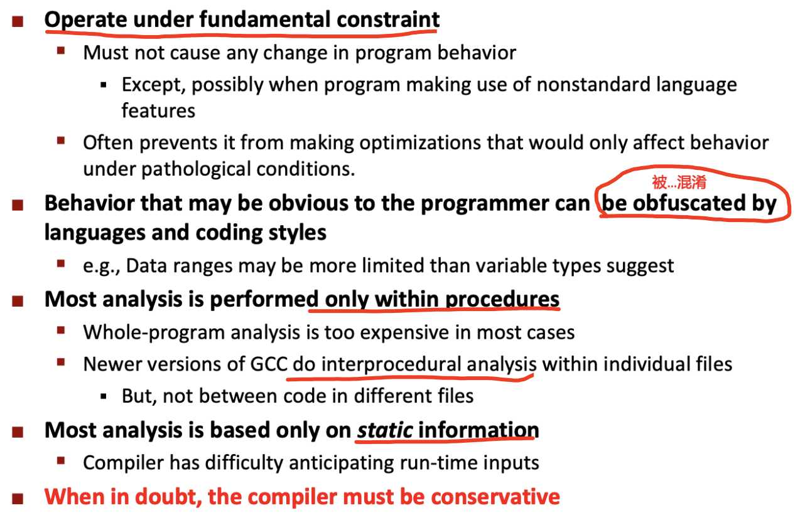

## 3. 通用优化方法
无论处理器或编译器如何，程序员和编译器均需作出优化。

### 3.1 表示程序性能
度量标准：***每元素的周期数（Cycle Per Element，CPE）***，作为一种表示程序性能并指导改进代码的方法。

CPE（Cycle Per Element）：处理每个元素占用的时钟周期。

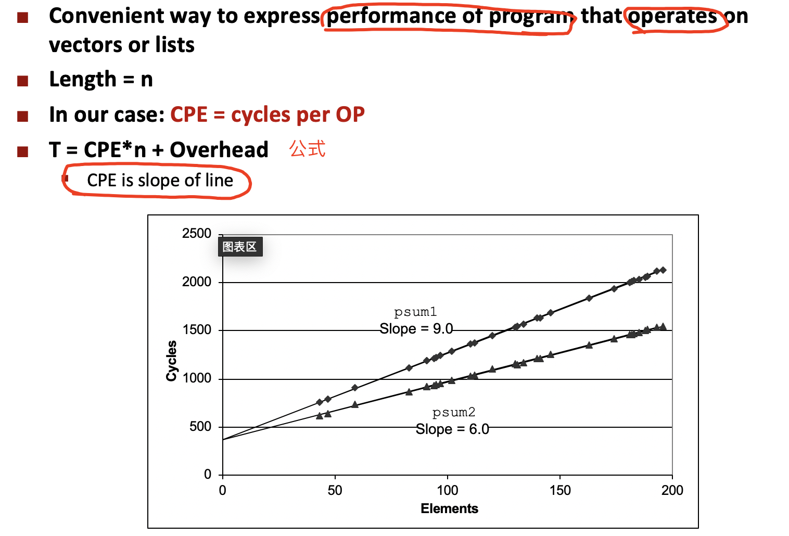

`每个时钟周期的时间（一般用纳秒ns表示）`是`时钟频率`的`倒数`。

注意：度量值表示执行了多少条指令，而不是时钟运行多快。

程序的性能受运算单元的延迟限制。

### 3.2 Code Motion
一种编译器优化技术，可以使用gcc的命令行选项 `-Og` 来设置优化的级别。一般情况下，使用 `-O1` 级别优化效果较好。

思想：将执行多次但计算结果不改变的计算移动到代码的前面，从而杜绝再次求值。

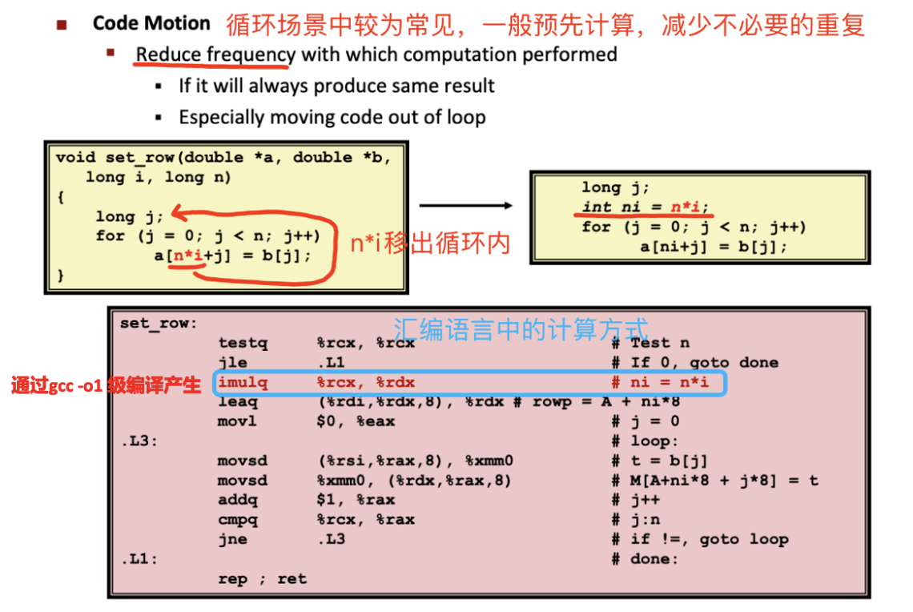

### 3.3 Reduction in Strength
gcc通过移位和加法运算来实现一个操作数为常数乘法或除法。

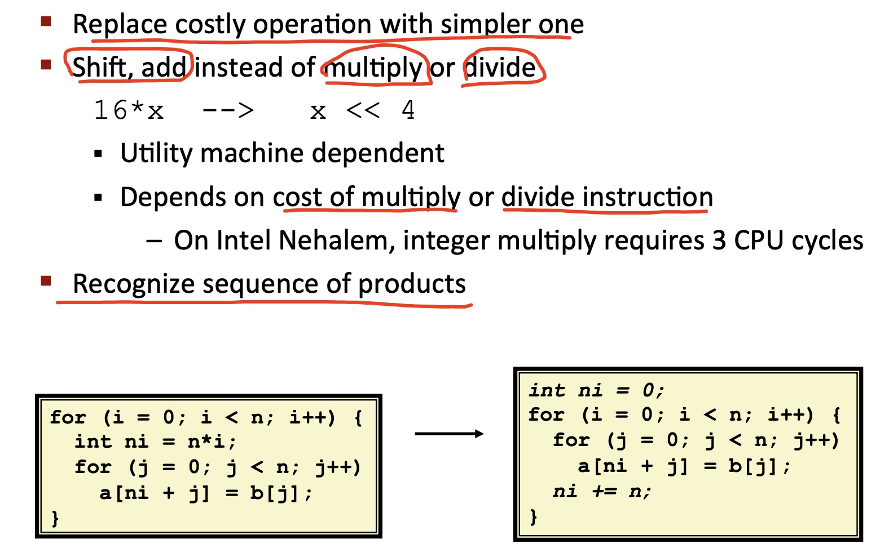

减少频繁的内存读取，写入。

### 3.4 share common subexpression

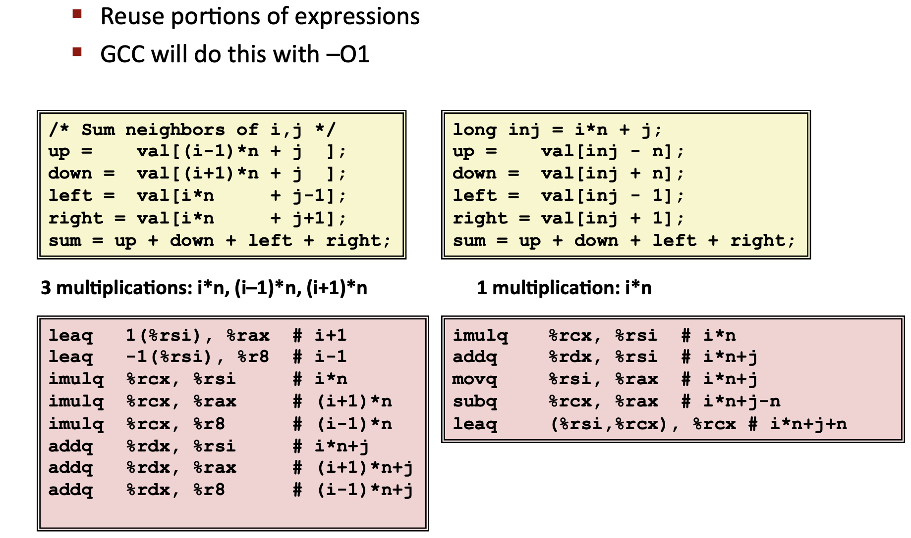

### 3.5 利用指令级并行
通过`流水线技术`的方式，来执行复杂操作的所有功能单元的流水线都是满负荷，使得达到操作的吞吐量界限。

⚠️注意：***浮点乘法和加法不可进行结合律，会出现四舍五入或溢出被截断***。

`SIMD（Single-In-struction Multiple-Data，单指令多数据）`。
> SIMD执行模型通过单条指令对整个`向量数据（保存在向量寄存器中）`进行操作。

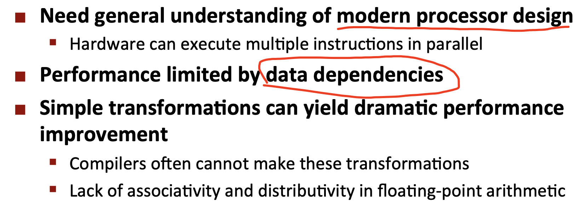

## 4. 优化拦路虎
在优化过程中，有些部分的内容是常见阻碍性能的提高，如过多过程调用、内存引用较多、低效率的循环等。

### 4.1 过程调用

大量的过程调用会产生开销。

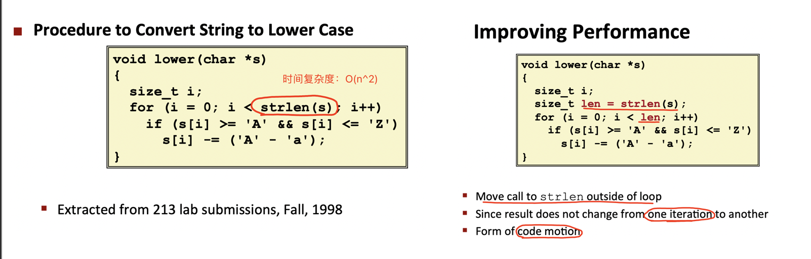

编译器将过程调用视为黑盒。

### 4.2 内存引用
引用（内存别名）

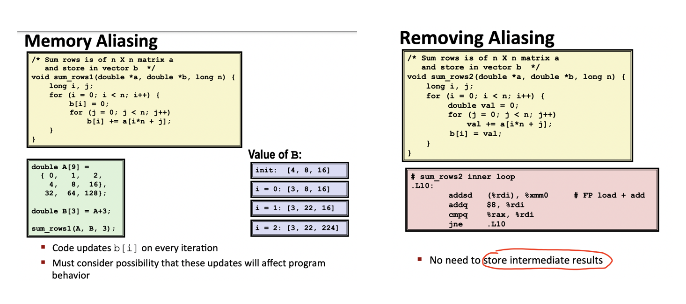

内存的一个位置可能被程序中的不同部分引用。编译器在使用该位置的值时，必须每次都读取最新值。因为被别的引用修改。

对内存的读写实际上会限制程序的性能，改写之后并不会有明显性能提升。所以可以围绕几个方面来辅助性能的提高：
- 两个不同的内存引用指定单个位置。
- C语言中常见
    - 因为允许使用地址运算
    - 直接访问存储结构
- 养成定义局部变量的习惯
    - 循环内累积
    - 告知编译器不check引用。

不进行反复读取和写入相同的内存位置，只需将其用临时位置进行保存即可。

## 5. 现代处理器
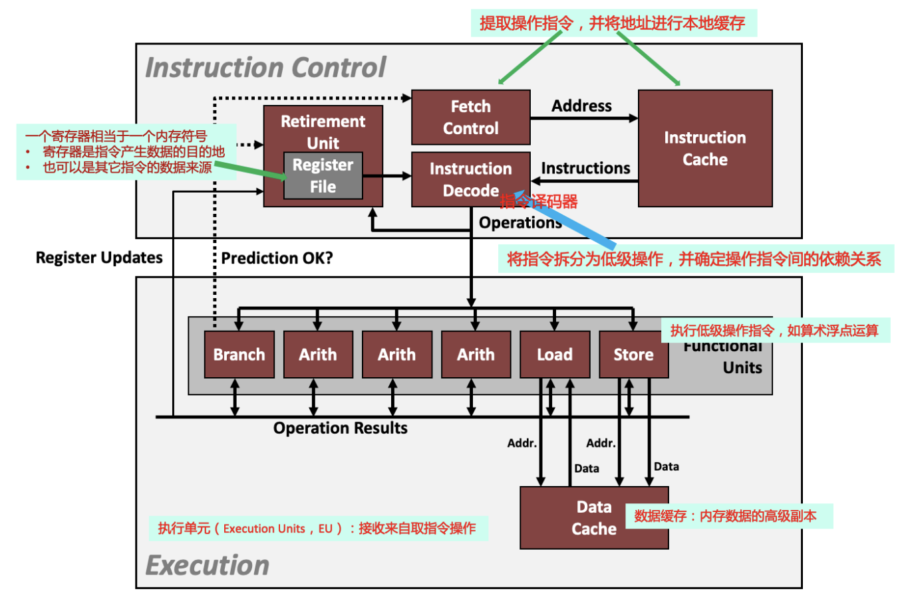

现代CPU设计采用`超标量（superscalar）乱序执行`的技术，使得程序运行速度比一次只执行一条指令快。

在指令控制单元ICU中，`retirement unit`记录正在执行的处理，并确保它遵守机器级程序的顺序语义。

- 读写内存：由加载和存储单元实现的。

**设计思想**：把程序的操作拆分、重组，使得基本单元尽可能繁忙、执行代码的不同片段。

### 5.1 超标量处理器
可`同时进行`多项操作指令的CPU称为`超标量指令处理器`。
> 一个时钟周期内执行多条指令。

可以在一个周期内发出和执行多条指令。指令是从顺序指令流中检索，且通常是`动态调度`的。

- 优点
> 无需编程工作，超标量处理器其实利用大多数程序具有的指令级并行性。

- 大多数现代CPU都是超标量的。
> 从intel Pentium（1993）开始。

### 5.2 流水线技术
功能单元的设计使用了 `流水线技术`。

基本思想：将计算分解为一系列不同阶段进行。也就是指程序执行时多条指令重叠进行操作的一种并行处理实现技术。

关于流水线技术的详细内容：请学习`CMU ECE 18-447`课程。也可关注 「computer  Architecture」中对CMU18-447课程的学习笔记。

### 5.3 Haswell CPU
一共 8个功能单元。流水线技术可以成倍缩小计算时间。

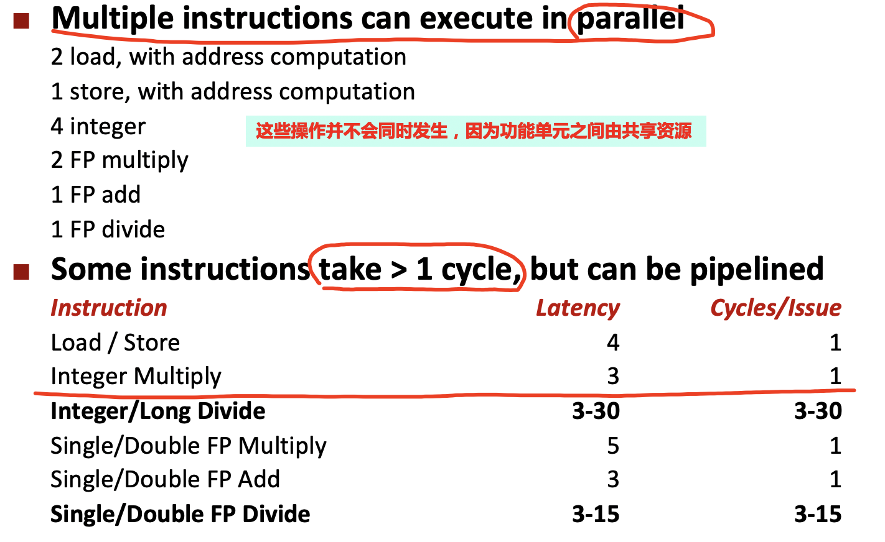

功能单元中具有代表性的特性：

- `延迟（latency）`：执行实际运算所需要的时钟周期总数。
- `Cycle/issue`：两次运算之间间隔的最小周期数。
- `容量（capacity）`：同时能够执行某个运算的功能单元的数量。

### 5.4 Branches
`指令控制单元（ICU）`必须在`执行单元（EU）`之前很好地工作以生成足够的操作来保持 `EU` 处于繁忙状态。在预测位置开始执行指令，不能实际修改寄存器或内存数据。

当遇到条件分支时，无法可靠地确定从哪个分支继续获取操作指令，无非是两种情况的分支结果：

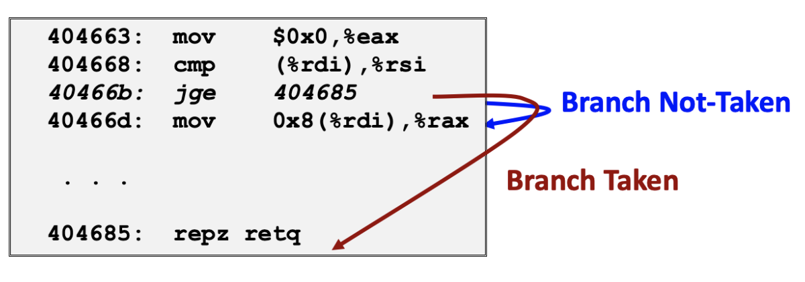

- `Branch Taken`: Transfer control to branch target
- `Branch Not-Taken`: Continue with next instruction in sequence

branch prediction（分支预测）技术：处理器猜测是否会选择分支，同时预测分支的目标地址。

## 6. 超越延迟界限方法：`循环展开`
通过循环展开的方式，使得程序的并行性更好，从而让性能达到最好。

`循环展开`：实际上是一种`程序变换`，通过增加每次迭代计算的元素的数量，减少循环的迭代次数。

从两个方便改善性能：
- 减少不直接有助于程序结果的操作的数量。
- 提供方法，可进行变换代码，减少整个计算中关键路径上的操作数量。

后续例子中的信息说明

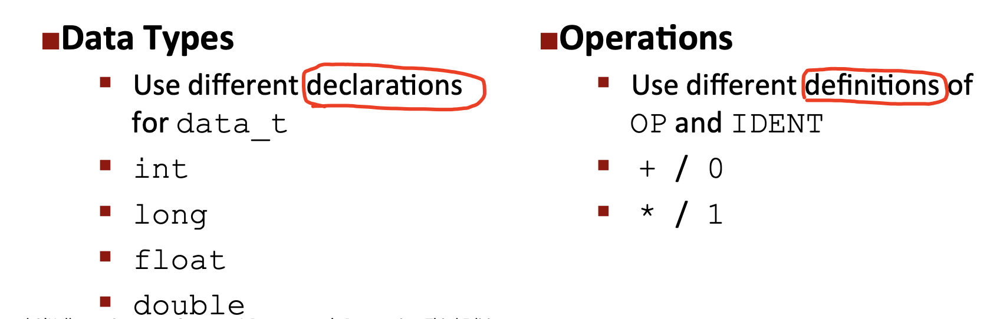

### 6.1 Loop Unrolling (2x1)
在未使用指令集并行的情况下，顺序执行的过程中，每一次OP都需要上一次OP的计算结果，这也是机器延迟的限制（该限制是基于一个OP从开始到结束需要的时间）。

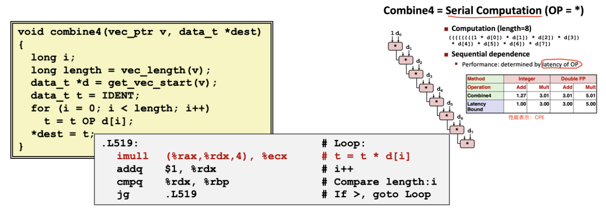

### 6.2 Loop Unrolling with `Reassociation` (2x1a)
`重新结合变化（reassociation transformation）`：括号改变了向量元素与累积值acc的合并顺序，也就是`“2x1a”`的循环展开形式。总的来说，就是括号改变了计算方式。
> 可增加并行执行的OP数量。

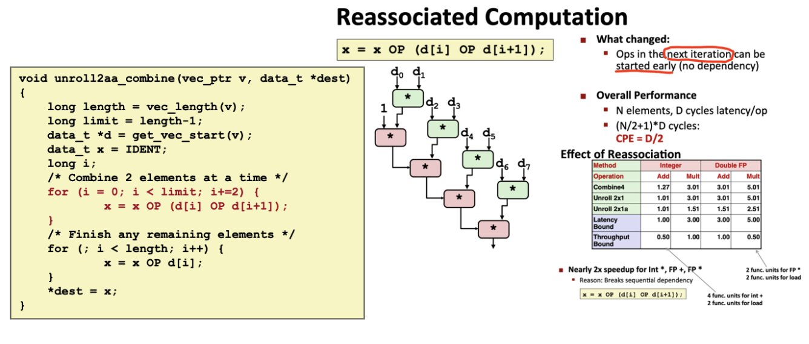

对于加法来说，性能提升不明显，但是对于乘法而言，得到明显优化。但存在的浮点运算的限制点如下：

- 整数运算：二进制补码的加法和乘法运算满足交换律和结合律（整数的加法和乘法可使用此类型转换）。
- 浮点数运算：不满足结合律，如果移动括号进行转换，可能会出现四舍五入或者溢出的情况。
> 精度丢失，会导致计算结果不同。所以一般情况下，不会去改变辅导书的结合性，对于浮点数运算的优化比整型保守很多。

### 6.3 Loop Unrolling with Separate Accumulators (2x2)
通过累加器的方式使得并行性更好，从而提高性能。

主要思想：类似求1到100的和，一般会用奇数和偶数各自求和，最后再相加。

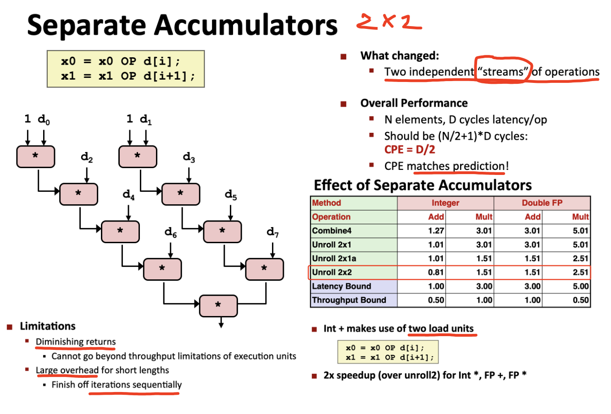

⚠️注意：整数结合律依然是无影响，但是浮点数依然是会存在四舍五入或溢出的情况。

一般来说，只要选择最佳的参数组合，可使得运行速度接近处理器的吞吐量界限。
### 6.4 Programming with AVX2
在早期x86 CPU机器上，计算浮点代码时，需要一个称为 `%xmm 寄存器`。新CPU中，又继续增加一个称为 `%ymm寄存器`。
> `%ymm寄存器大小 = 2 * %xmm寄存器大小`

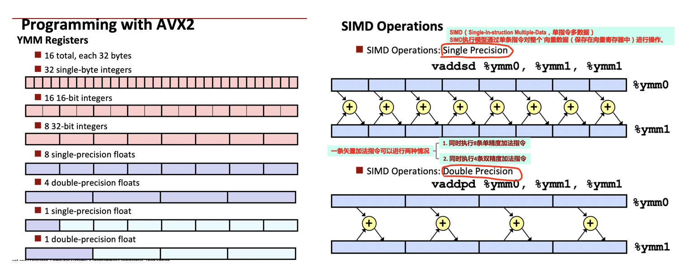

