<h1>
 csapp chapter06 存储器层次结构 学习笔记
</h1>

## 内容和图片来源说明
- 书籍《深入理解计算机系统》第3版 第 06 章
- PPT：CMU CS15-213 2015 及 课程笔记

## 1. 存储技术和趋势（storage technologies and trends）
存储系统为CPU存放指令和数据。在简单模型中，`存储器系统`被抽象成一个`线性的字节数组`。

存储器系统是一个具有不同容量、成本和访问时间的`存储设备`的层次结构。

### 1.1 随机访问存储器
RAM的主要特性：一般被封装在芯片中，多个芯片的组合成为主存。最基本的存储单位称为`单元（cell）`，一个cell存储一个bit。

`随机访问存储器（Random- Access Memory，RAM）`根据存储单元的设计方式分为两类：
- **SRAM（Static RAM，静态RAM）**：作为高速缓存存储器，既可在CPU芯片上，也可在片下。
- **DRAM（Dynamic RAM，动态RAM）**：作为主存以及图形系统的帧缓冲区。
> SRAM比DRAM快，也贵很多。

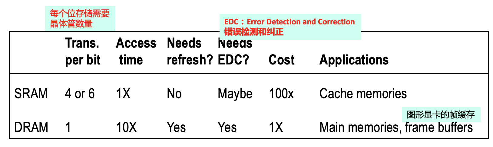

#### 1.1.1 传统DRAM
> 主要细节研读 《csapp》书籍第6章 6.1 小节

早期DRAM芯片中的`单元（位）`被分成`d个超单元`，每个超单元都由w个DRAM单元组成。一个 `d*w` 的DRAM共存储`dw`位信息。

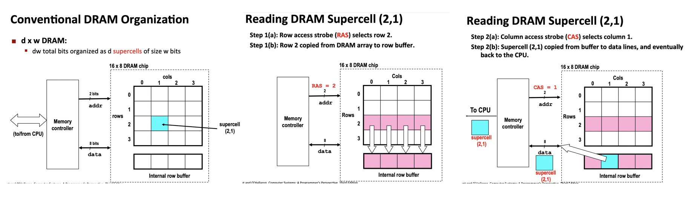

早期电路设计者将DRAM组织成二维阵列而不是线性数组的原因：
- 优点：降低芯片上地址引脚的数量。
- 缺点：必须分成两步发送地址，增加了访问时间。

#### 1.1.2 内存模块
> 主要细节研读 《csapp》书籍第6章 6.1 小节

DRAM芯片封装在`内存模块`中，插在`主板`的`扩展槽位`上。

#### 1.1.3 增强DRAM
> 主要细节研读 《csapp》书籍第6章 6.1 小节

在传统的DRAM上优化并提高访问基本DRAM单元的速度。类型如下：
- `快页模式DRAM（Fast Page Mode DRAM，FPM DRAM）`：改进了允许对同一行连续地访问可以直接从行缓冲区得到服务。
- `扩展数据输出DRAM（Extended Data Out DRAM，EDO DRAM）`：FPM DRAM的增强形式。
    - `同步DRAM（Synchronous DRAM，SDRAM）`：与驱动内存控制器相同的外部时钟信号的上升沿来替代类似的控制信号。
    - `双倍数据速率同步（Double Data- Rate Synchronous DRAM，DDR SDRAM）`：使用两个时钟沿作为控制信号，使得DRAM速度翻倍。不同类型的DDR可提高有效带宽的很小的预取缓冲区的大小来划分：DDR（2位）、DDR2（4位）、DDR（8位）。
    - `视频RAM（Video RAM，VRAM）`：用在图形系统的帧缓冲区。

#### 1.1.4 非易失性存储器
SRAM和DRAM都是易失性存储器，意味着如果断电，则会丢失其所保存的信息。

非易失性存储器：即使断电也会使得保存不受到影响。通用名称：`只读存储器（ROM）`。

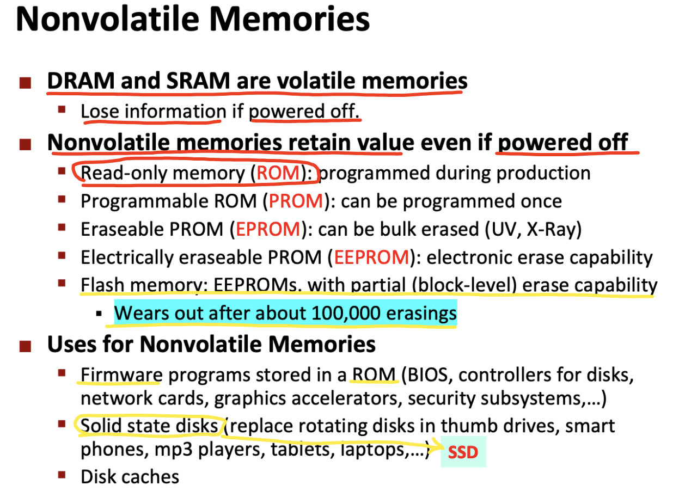

存储在`ROM设备`中的程序通常称为`固件（Firmware）`。
> 非易失性存储器可在`固件`和`软件`中使用。

### 1.2 访问主存
**总线（Bus）**：一组并行的导线，能携带地址、数据和控制信号。取决于总线的设计，设备之间可进行共享总线。

`控制器`由存储在`ROM`中的`指令`和`数据`组成。

`数据流`通过`总线的共享电子电路`在`CPU`和`DRAM主存`之间传输。简易的总线系统抽象图如下：

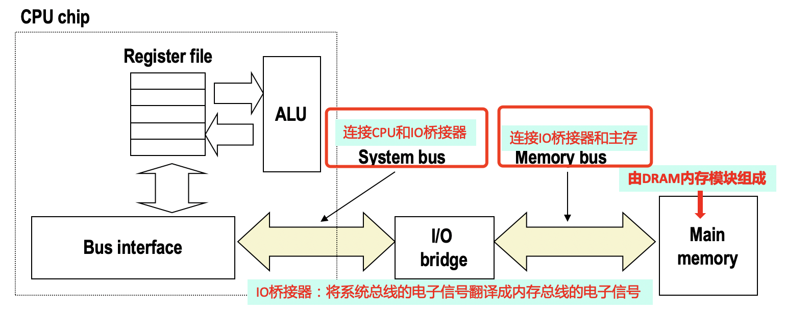

**总线事务（Bus Transaction）**：每次`CPU`和`主存`之间的数据传送之间进行的操作步骤。

#### 1.2.1 读事务（read transaction）
`读事务（read transaction）`：从主存传送数据到CPU。

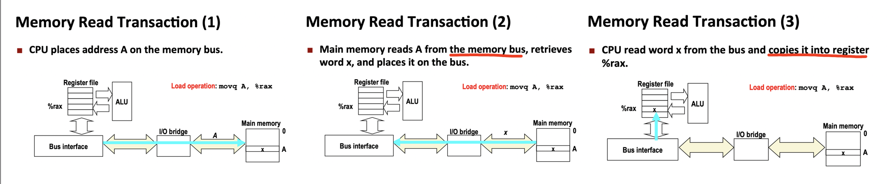

#### 1.2.2 写事务（write transaction）
`写事务（write transaction）`：从CPU传送数据到主存。

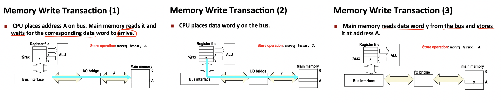

### 1.3 磁盘存储
磁盘是目前保存大量数据中广为应用的存储设备。

#### 1.3.1 磁盘构造
可认为磁盘由盘片组成。

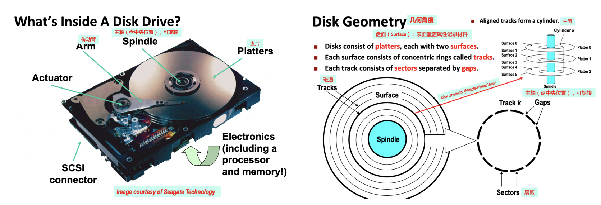

每个盘片的表面都有磁性记录材料（编码1和0的二进制位）。一个盘片有两个表面（上面和下面）。

`读/写头`：可感知编码位的磁场变化。

每个磁道包含很多个扇区（扇区存储着数据），一个扇区存储521个字节。

空隙（gap）不保存数据。

柱面（圆柱形）：轨道的集合组成。

#### 1.3.2 磁盘容量
一个磁盘上可以记录的`最大位数`称为其`最大容量（简称容量）`。决定磁盘容量的技术因素：
- **记录密度**：决定单独一个扇区可存储多少比特或至少一个磁道的一部分。
- **磁道密度**：指可将相邻的磁道放置得多近。

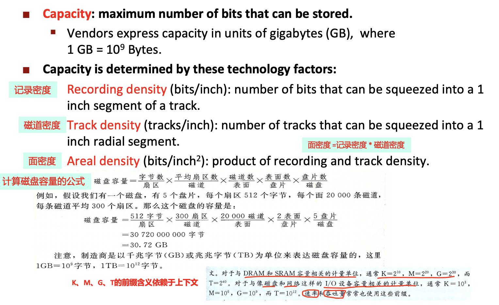

`面密度`决定整个`磁盘的存储容量`。

#### 1.3.3 磁盘操作
磁盘用读/写头（read/write head）来读写存储在`磁性表面的位`，而`读写头`连接到一个`传动臂`一端。

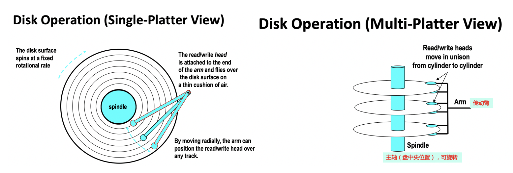

磁盘总是密封包装，如果遇到磁道有阻碍，读/写头会停下来，撞到盘面。这就是所谓的`读写头冲撞`。

#### 1.3.4 磁盘访问
**磁盘是以扇区大小的块来读写数据**。

对扇区的访问时间主要有三个部分：`寻道时间（seek time）`、`旋转延迟（rotational latency）`、`传送时间（transfer time）`。

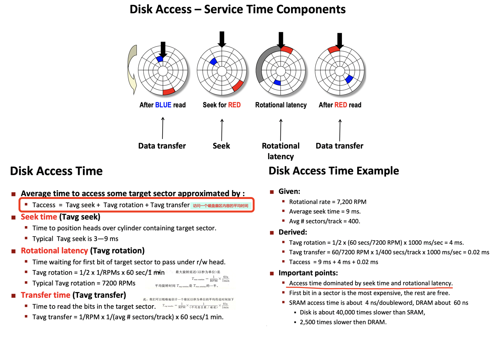

- **寻道时间**：移动读/写头所需的时间。`寻道时间依赖于读/写头以前的位置和冲动臂在盘面上移动的速度`。
    > 为了读取某个目标扇区的内容，`传动臂`首先将`读/写头`定位到包含`目标扇区的磁道`上。
- **旋转延迟**：`驱动器`等待目标扇区的`第一个位`旋转到读/写头下的时间。
    > 平均情况下是磁盘旋转一周所花费时间的一半。

- 传送时间：目标扇区的第一个位到达读写头时，驱动器开始读写内容。
    > 一个扇区的传送时间依赖于旋转速度和每条磁道的扇区数量。

**三个时间决定读取一个扇区需要的时间**。

#### 1.3.5 逻辑磁盘块
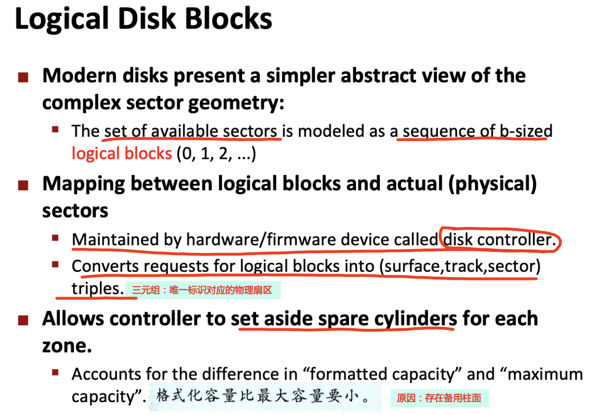

#### 1.3.6 连接I/O设备
I/O设备（图形卡、监视器、鼠标、键盘等）都是通过`I/O总线`来进行`CPU`和`主存`之间的连接。

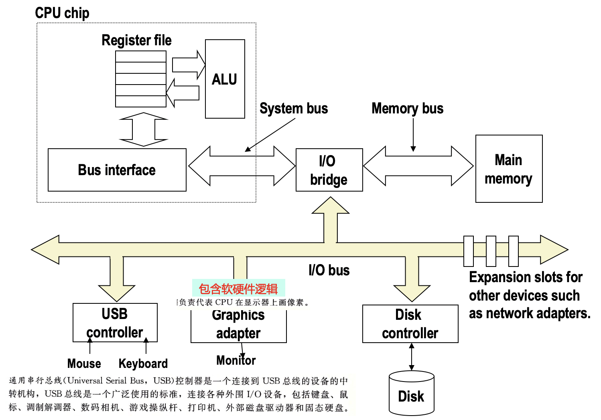

#### 1.3.7 读取磁盘扇区
基本思想：

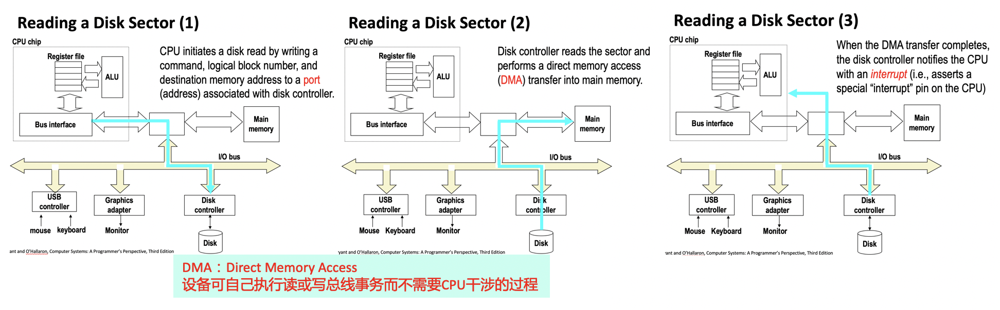

### 1.4 固态硬盘（SSD）
`固态硬盘（Solid State Disk，SSD）`是一种基于`闪存`的`存储技术`。

#### 1.4.1 SSD设计思想
SSD封装插到`I/O总线`上标准`硬盘插槽`（通常是`USB`或`SATA`）中。

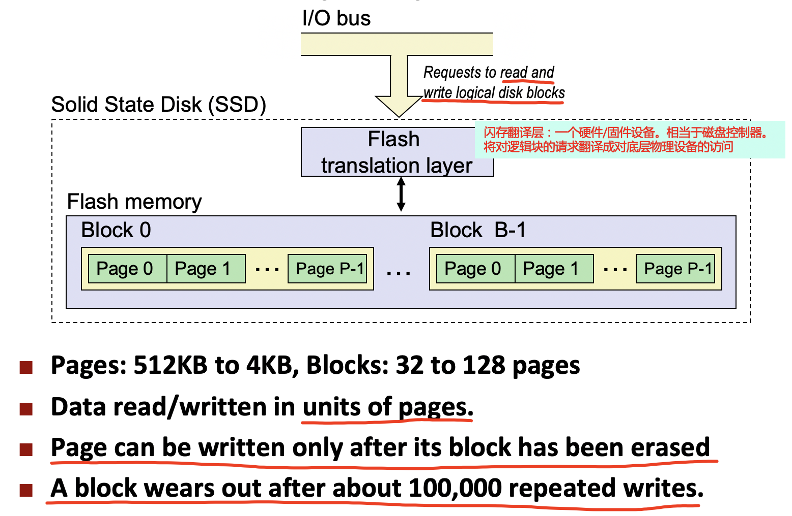

一个闪存由B个块序列组成，每个块由P页组成。

#### 1.4.2 SSD性能特性
读SSD比写要快。随机读和写的性能差别由底层闪存基本属性决定。

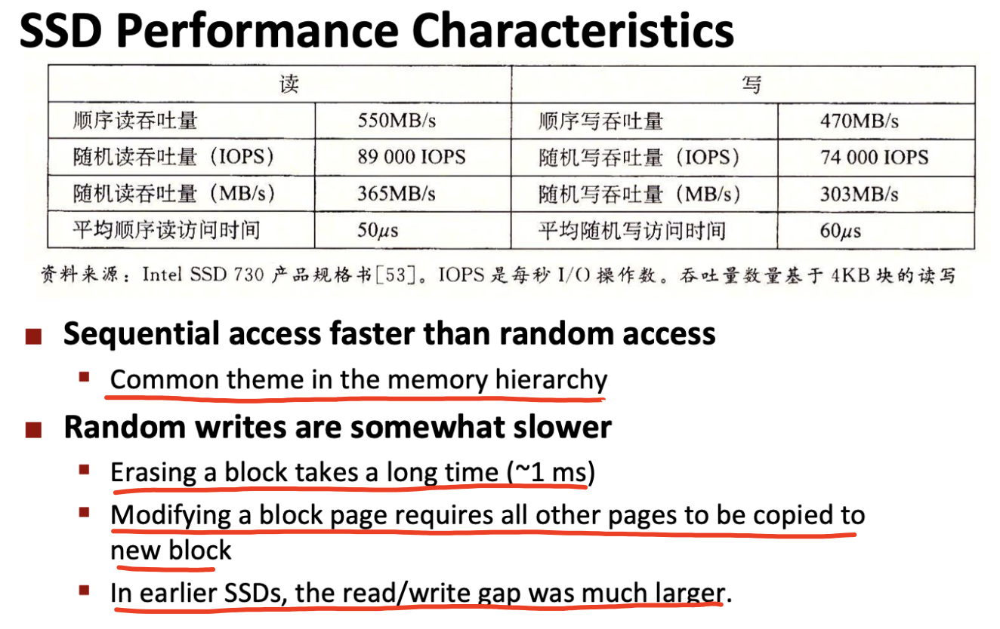

随机写慢的原因
- 擦除块需要相对较长的时间，1ms级，比访问页所需时间要高一个数量级。
- 如果写操作试图修改一个包含已有数据的页p，必须将带有数据的页复制给一个新块，然后才能进行对页的写。

#### 1.4.3 SSD的优缺点
- 优点：随机访问时间比旋转磁盘要快，能耗更低，且更结实（SSD由`半导体存储器`构成，没有移动的部件）。
- 缺点：SSD容易磨损（反复写之后，会造成闪存块磨损），价格昂贵。

#### 1.4.4 SSD的应用
- MP3设备、智能机、笔记本
- 最早应用出现在台式机和服务器上。

### 1.5 存储技术趋势
- 不同的存储技术有不同的价格和性能折中。
    > - SRAM比DRAM快一点，而DRAM比磁盘要快很多。
    > - 快速存储总比慢速存储价格贵很多。
- 不同存储技术的价格和性能属性以截然不同的速率变化着。
- DRAM和磁盘的性能滞后于CPU的性能。

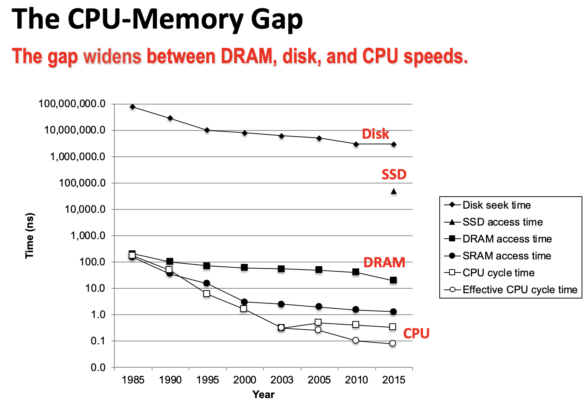

从图中得出，随着`多核处理器`的出现，CPU性能大幅度提升，现代计算机使用基于`SDRAM`的`高速缓存`，弥补 `CPU处理器` 和 `内存` 差距的关键是计算机程序的基本属性，称为`局部性（Locality）`。

## 2. 局部性
局部性：倾向于引用邻近于其他最近`引用过的数据项`或最近`引用过的数据项本身`。

局部性的两种形式
- 时间局部性
- 空间局部性

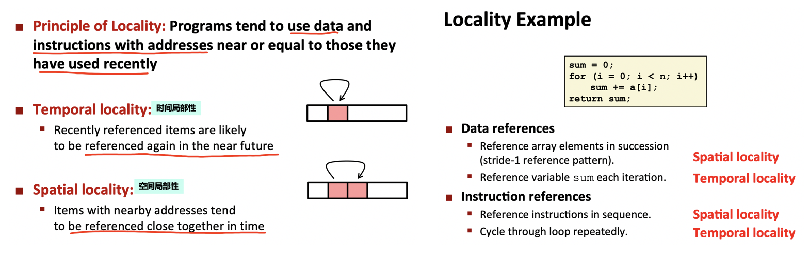

有良好局部性的程序比局部性差的程序运行得更快。

### 2.1 局部性定性评估
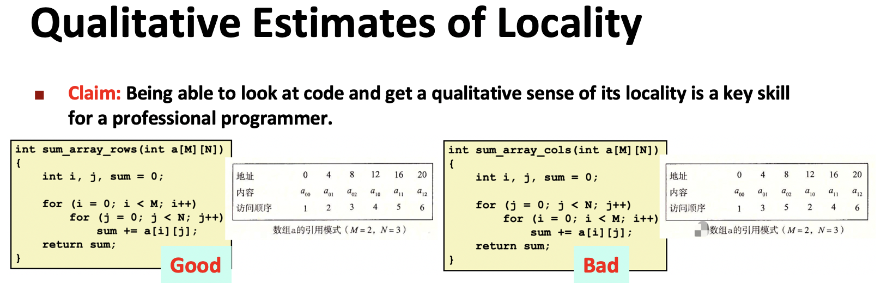

### 2.2 量化评估程序中局部性的一些简单原则
- 重复引用相同变量的程序有良好的时间局部性。
- 对于具有步长为k的引用模式的程序，步长越小，空间局部性越好。
    > 在内存中以`大步长跳跃`的程序空间局部性差。
- 对于取指令来说，循环有好的时间和空间局部性。
    > 循环体越小，循环迭代次数越多，局部性越好。

## 3. 存储器层次结构
存储技术和计算机软件的一些基本和持久的特性：

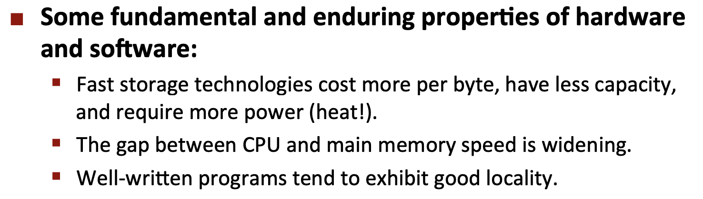

软硬件基本属性之间的相互补充为所有现代计算机系统提供了组织存储器系统的方法，称为`存储器层次结构`。存储器层次结构图如下：

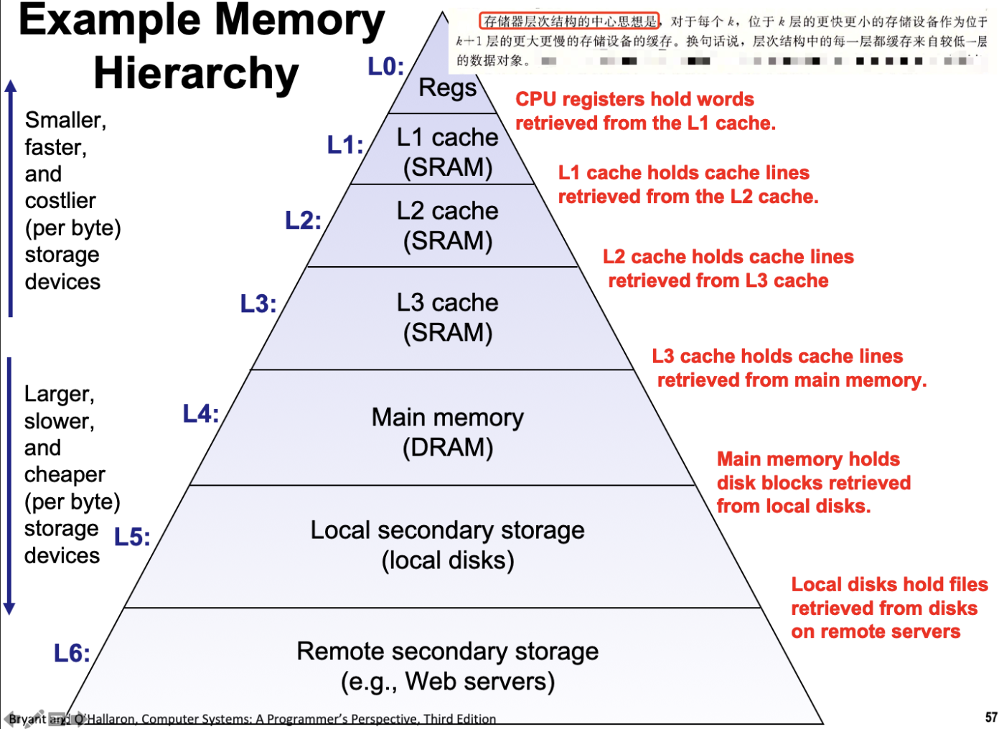

在存储器层次结构中的每一层都包含从下一个较低级别层次所检索的数据，

内存层次结构创建了一个大型存储池，其成本与靠近底部的廉价存储一样多，但以靠近顶部的快速存储的速度向程序提供数据。

越处于顶部的存储设备容量越小，越昂贵，速度也越快，处于底部设备则相反。
### 3.1 存储器层次结构中的缓存
使用高速缓冲的过程为`缓存（caching）`。

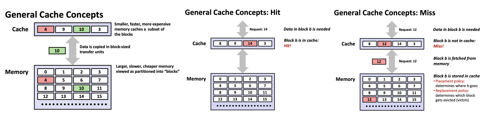

### 3.2 缓存不命中的类型
由于高速缓存中没有任何的数据，缓存为空，没有存储任何块，当要读取数据时就需要从下一级获取块，将其放入缓存直至被慢慢填满。

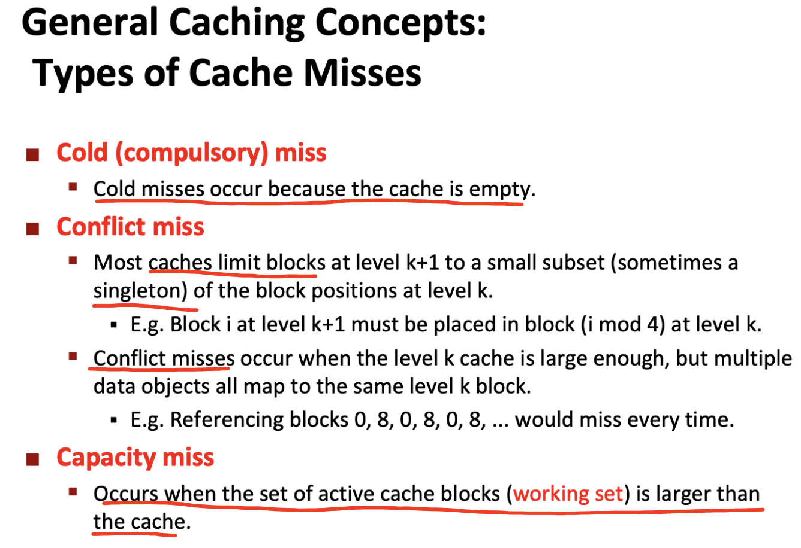

将数据项加载到空的缓存中，称为`缓存的热身`。热身也就增加了缓存命中的可能性。

**容量不命中的原因**：高速缓存的大小有限，不可超过缓存大小。

### 3.3 计算机系统中的缓存类型
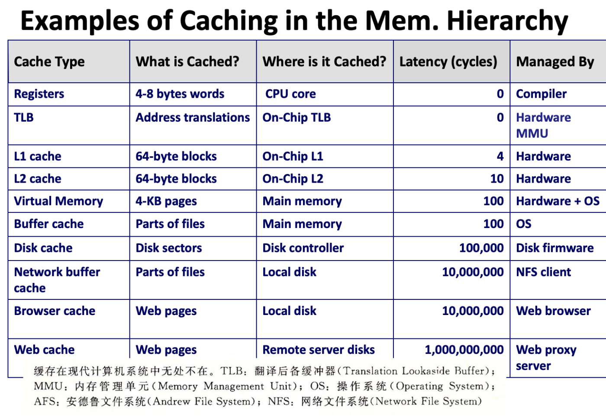

***缓存管理***：当有请求从层次结构中的较低层读取内容时，必须有一个过程来决定如何处理如何将其放入缓存中的某个位置。

## 4. 高速缓存存储器
`高速缓存（Caches）`：一种更小、速度更快的存储设备，作为更大、更慢设备中数据对象的缓冲区域。早期计算机系统的存储器层次结构图如下：
- CPU寄存器
- DRAM主存储器
- 磁盘存储

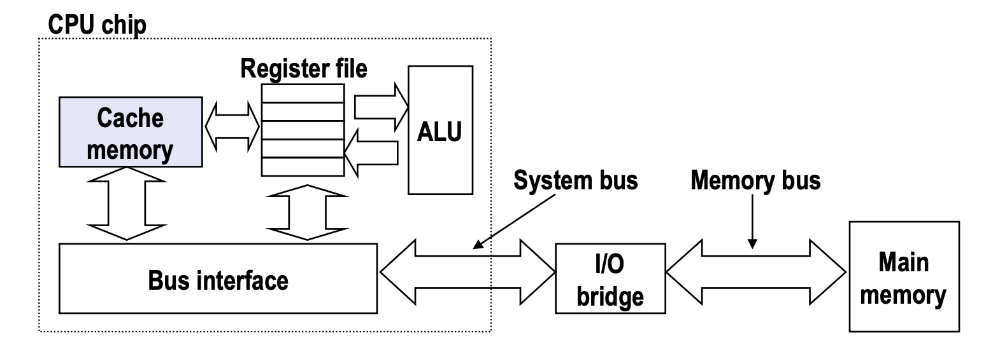

高速缓存存储器在CPU芯片中，完全由硬件管理，硬件逻辑需要知道如何查找缓存中的块，并确定是否包含特定块。因此，必须以严谨且简单的方式去组织高速缓存存储器。
> 使用快速SRAM存储器来实现。处于寄存器组附近缓存的实质是存储主存储器中经常访问的块。

### 4.1 通用组织结构
高速缓存是一个高速缓存组的数组。每个组包含一个或多个行，每个行包含一个有效位，一些标记位以及一个数据块。
> 地址的划分由缓存的组织决定。
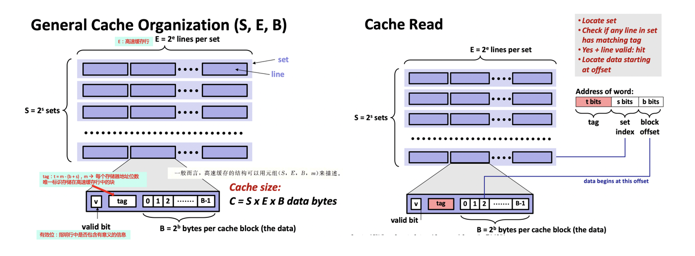

### 4.2 直接映射高速缓存
根据每个组的高速缓存行数E，高速缓存被分成不同的类。每个组只有一行`（E=1）`的高速缓存称为`直接映射高速缓存`。

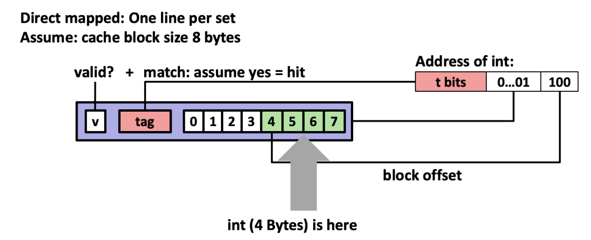

### 4.3 E组相联高速缓存
E=1时，会造成冲突不命中的问题。
- 当 `1 < E < C/B` 的高速缓存称为`E路组相联高速缓存`。每个组中包含多个行。
- 当 `E = C/B` 时，称为`全相联高速缓冲`。每个组中包含所有行。

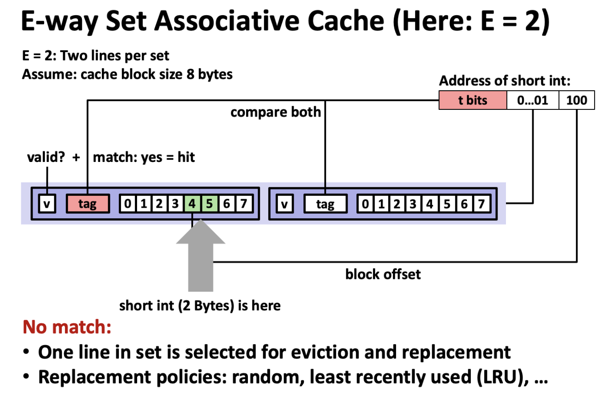
### 4.4 高速缓存中关于写的问题

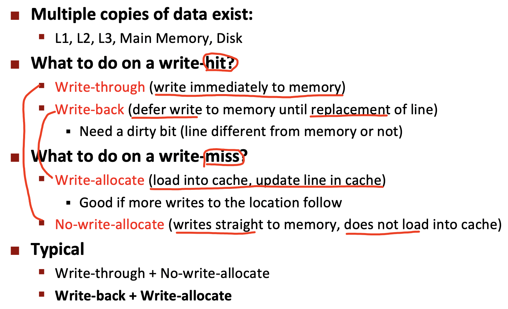

### 4.5 Cache层次结构的实例解剖：Intel Core i7
高速缓存既可保存数据，也保存指令。

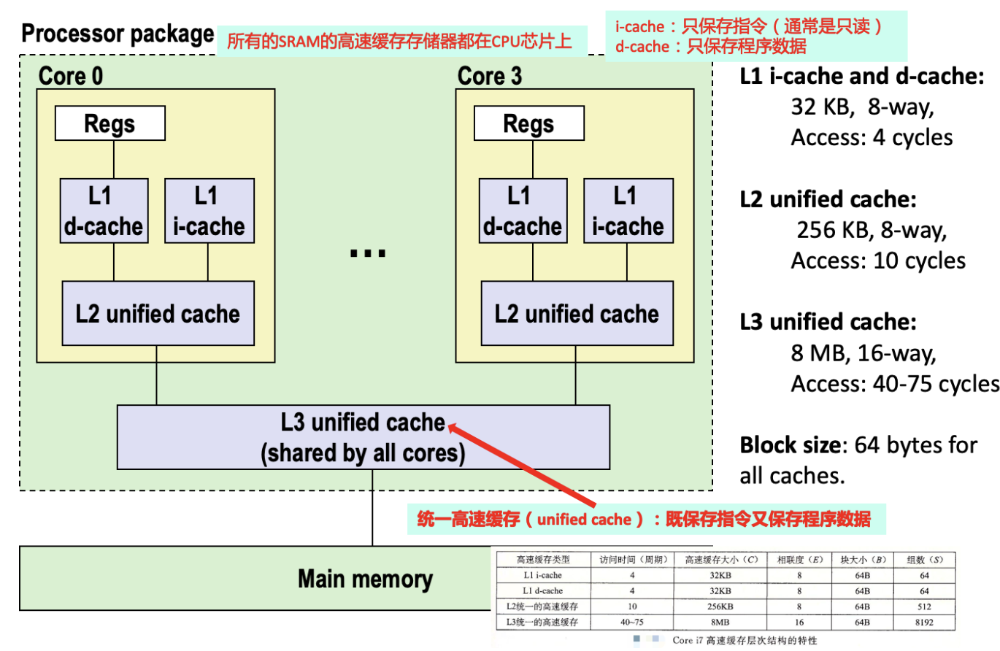

### 4.6 缓存参数的性能指标
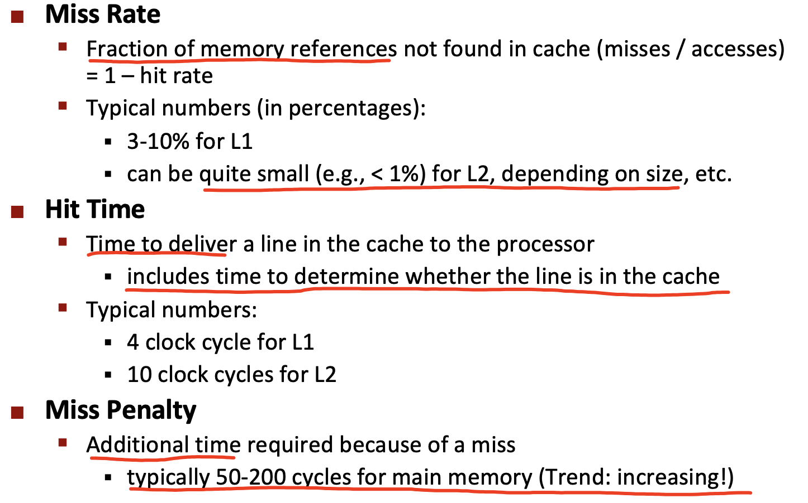
### 4.7 编写缓存友好的代码
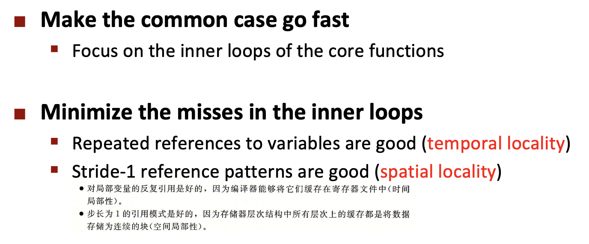

如果有较高的不命中率对运行时间会造成很大影响。因此，多注意程序中的局部性，试着编写局部性的程序。

### 4.8 高速缓存对程序性能的影响
#### 4.8.1 存储器山
**存储器山（memory mountain）**：一个读带宽的`时间`和`空间`局部性的`二维数组`。

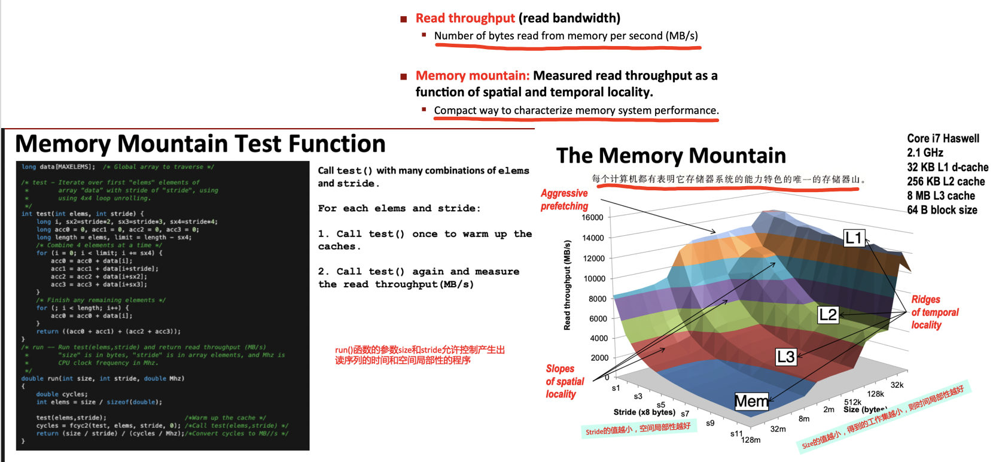

### 4.8.2 `重新排列循环`以提高`空间局部性`
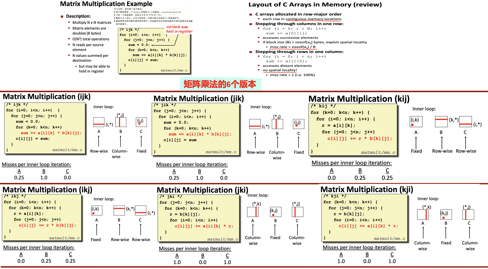

最后的循环分析结果如下：

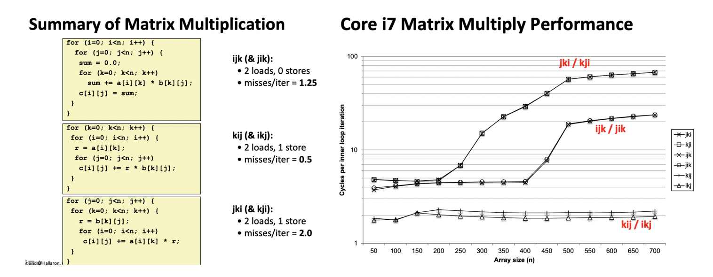

### 4.8.3 利用`分块`来提高`时间局部性`
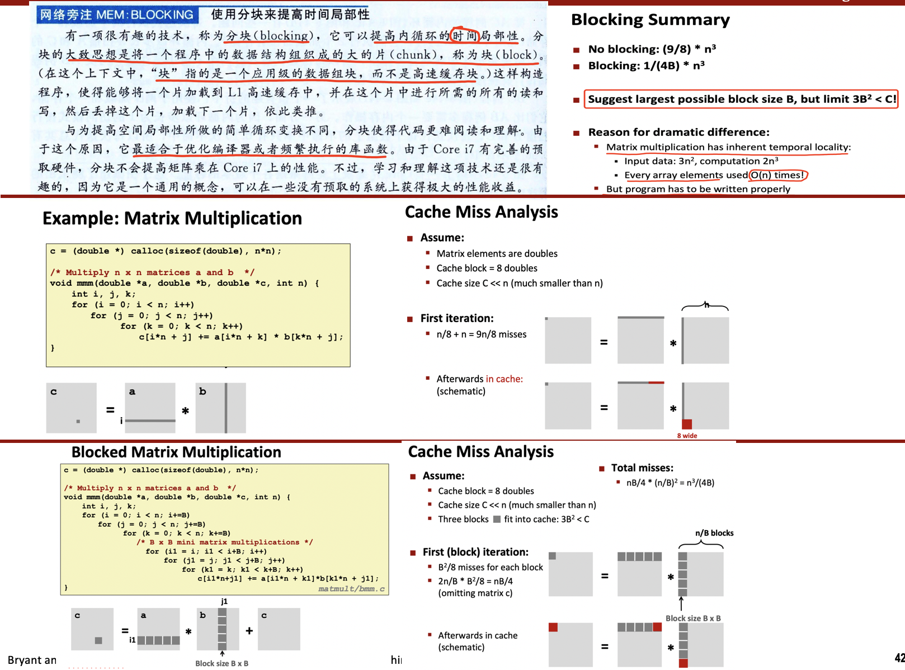

## 5. 总结
- 多关注内循环，其中会产生大量计算和内存访问。
- 尝试使用步长为1进行顺序读取存储在内存中的数据对象，使得程序中的空间局部性最大。
- 一旦从内存中读取数据对象，尽可能使用它来最大化时间局部性。

