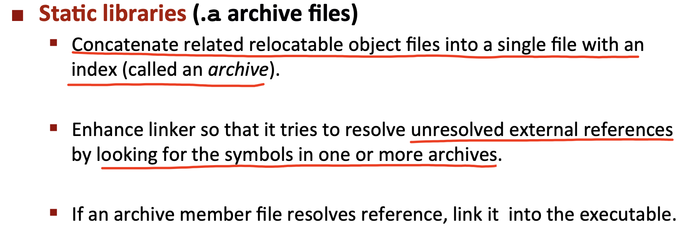

<h1>
 csapp chapter07 链接 学习笔记
</h1>

## 内容和图片来源说明
- 书籍《深入理解计算机系统》第3版 第 07 章
- PPT：CMU CS15-213 2015 及 Lecture13 课程笔记

## 1. 链接概述
`链接（linking）`是将各种代码和数据片段`收集并组合成为一个单一文件`的过程，这个文件可被加载（复制）到内存并执行。

链接可执行的阶段
- 可执行于`编译时`：在源代码被翻译成机器代码时，
- 可执行于`加载时`：在程序被加载器加载到内存并执行时
- 可执行于`运行时`：应用程序来执行。

在早期的计算机系统中，链接是手动执行。在现代系统中，链接是由链接器的程序自动执行。

链接器使得`分离编译`成为可能，将一个大型的应用程序，通过分拆模块，独立进行修改和编译。

## 2. 为什么要学习链接的知识？
- 理解链接器可`帮助构造大型程序`。
    - 可规避缺少模块、库或者版本不兼容带来的问题。

- 理解链接器可帮助`避免一些危险的编程错误`。
    - Linux链接器解析符号引用时所做的决定后可以不动声色地影响你程序准确性。

- 理解链接将帮助你`理解语言的作用域规则是如何实现`的。
- 理解链接可帮助理解其它的系统概念。
    - 例如在OS中的`加载和运行程序、虚拟内存、分页、内存映射`等。
- 理解链接可帮助`更好地利用共享库`。
    - 通过利用共享库的链接，来进行对封装过的二进制程序进行升级操作。

## 3. 静态链接的例子

## 4. 使用链接器的好处？
对于一个包含所有代码的大文件，采用分离编译的方式，具体的好处如下：
- 代码模块化
- 时间和空间效率上的优化

## 5. 静态链接
类似Linux LD程序的静态链接器以一组可重定位目标文件和命令行参数作为输入，生成一个完全链接的、可加载和运行的可执行目标文件作为输出。

### 5.1 链接器的两个任务
在构造可执行文件中，链接器需完成的两个主要任务：
- 符号解析（symbol resolution）
- 重定位（relocation）

### 5.2 链接器的一些基本事实
目标文件是纯粹是字节块的集合。这些块中，有些包含程序代码，有些包含程序数据，而其他的则包含引导链接器和加载器的数据结构。

链接器将这些块连接起来，确定被连接块的运行时位置，并且修改代码和数据块中你的各种位置。

## 6. 目标文件
目标文件有三种标准`二进制`格式：
- 可重定位目标文件（`.o`）
- 可执行目标文件（`a.out`）
- 共享目标文件（`.so`）

技术角度分析
- `一个目标模块`就是`一个字节序列`
- 一个目标文件：是一个以文件形式存放在磁盘中的目标模块。

由于系统的不同，所以各个系统的目标文件格式也随之不同，但基本的概念相似。
- `Unix`系统：`a.out`格式
- `Windows`系统：`PE`格式（Portable Executable，可移植可执行）
- `Mac OS`系统：`Mach-O`格式
- 现代`x86-64 Linux`和`Unix`系统：使用`ELF（Executable and Linkable Format）`格式

### 6.1 可重定位目标文件的格式信息
`ELF头（EFL header）`以一个`16字节`的`序列`开始，序列描述了生成该文件的系统的`字的大小`和`字节顺序`。

## 8. 符号和符号表
每个可重定位目标模块m都有一个符号表。包含了m定义和引用的符号的信息。在链接器的上下文中，有三种不同的符号：

符号表是由`汇编器`构造，使用`编译器`输出到汇编语言 `.s 文件`中的符号。`.symlab节`中包含`ELF符号表`。

在C中使用`static属性`隐藏模块`内部的变量`和`函数`声明，类似在java和C++中使用`public`和`private`声明一样。

## 9. 符号解析
将链接器`符号引用`与它`输入的可重定位目标文件的符号表`中的一个`确定的符号定义关联`起来。
> 如果解析失败，就会出现常见的错误：`undefined reference to ... `。

编译器只允许每个模块中每个局部符号有一个定义。静态局部变量也会有本地链接器符号，编译器还要确保其拥有唯一的名字。

### 9.1 解析多重定义的全局符号
在Linux中采用编译器、汇编器和链接器之间的协作来处理定义相同名字的全局符号。

对于链接器而言，输入是一组可重定位目标模块。每个模块定义一组符号，分为两种情况：
- 局部：只对定义该符号的模块可见
- 全局：对其它外部模块也可见

在编译时，编译器向汇编器输出每个全局符号，分为两种
- 强符号
- 弱符号

解析规则

由于链接器具有的奇怪的`强弱符号规则`，所以尽量避免使用全局变量，尽可能使用`static属性`来保护你的变量和函数。这也是一种良好的编程习惯。

- Use `static` if you can
- `Initialize` if you define a global variable
- Use `extern` if you reference an external global variable

## 10. 重定位
合并输入模块，并为每个符号`分配运行时地址`，并修改对目标的引用。重定位由2个步骤：
- `重定位节和符号定义`
    > 链接器将所有相同类型的节合并为同一类型的新的聚合节。完成后，程序中的每条指令和全局变量都有唯一的运行时内存地址了。

    

- `重定位节中的符号引用`
    > 链接器修改代码节和数据节中对每个符号的引用，使得他们指向正确的运行时地址。

    

## 11. 可执行目标文件
链接器将多个目标文件合并成一个可执行目标文件。此二进制执行文件可以加载代码和数据、可直接加载到内存中而无需进一步修改。

可执行目标文件的格式类似于可重定位目标文件的格式。

所有的数据可直接加载到内存中，将这些字节复制到内存中，也就形成了所谓的`只读代码段`。

### 11.1 加载器如何工作？

小结内容：加载器将可执行文件的内容映射到一个单独的静态库中，并运行这个程序。链接器还可能生成部分链接的可执行目标文件，这样的文件中有对定义在共享库中的例程和数据的未解析的引用。在加载时，加载器将部分链接的可执行文件映射到内存，然后调用动态链接器，它通过加载共享库和重定位程序中的引用来完成链接任务。

## 12. 共享库
对于常用的函数模块，则通过`分块封装成库API`来提供给程序员使用。就目前而言，链接器给出的两种方案：
- 将所有的功能模块放在一个C源文件中。
    - 缺点：使用时需要将很大的目标文件链接到所要使用的程序中。空间和时间效率低下。
- 将每个功能模块放在单独的C源文件中。
    - 优点：将适当需要的二进制文件明确链接到要使用的程序中。效率也会更高。
    - 缺点：但对使用者会带来一定的负担。需要知道函数的位置，并将其放入makefile中。

### 12.1 传统方案：静态库（`.a archive files`）
Unix开发者早期提出的方案。静态库的概念主要是解决系统每个可执行文件的副本造成内存资源的浪费。

创建一堆的 `.o文件`的集合（每个 `.o 文件`中都包含了一个函数），使用一个名为 `archive 或AR`的程序来获取`.o文件`，将其放在一个叫做`存档的大文件`中。链接器在使用的时候将其需要的.o文件链接到代码文件中即可。

> 总结：`存档`就是链接的 `.o文件`集合。

#### 12.1.1 创建静态库及对应的常用静态库

#### 12.1.2 静态库链接的例子

#### 12.1.3 链接器在使用静态库时发生的内容

### 12.2 现代方案：动态库（`.so file`）
`共享库（shared library，也称为共享目标）`是致力于`解决静态库缺陷`的现代解决方案。

静态库的缺点：使用`printf`的每个程序都必须有`printf的副本`。`共享动态库`则提供只有一个类似printf的共享成员的实例机制来解决静态库存在的缺点。

`共享动态库`是一个目标模块，在运行或加载时，可加载到任意的内存地址，并和一个在内存中的程序链接起来，这个过程叫`动态链接`。

#### 12.2.1 动态库的使用

#### 12.2.2 动态库的链接过程

### 12.3 链接的总结

被编译为`位置无关代码的共享库`可加载到任何地方，也可在运行时被多个进程共享。为了加载、链接和访问共享库的函数和数据，应用程序也可在运行时使用动态链接器。

## 13. 库打桩（library interpositioning）机制
Linux链接器提供了`库打桩`技术，目标：允许截获对共享函数的调用，取而代之执行自己的代码。使用打桩机制，可追踪对某个特殊库函数的调用次数，验证和追踪它的输入和输出值，或者将其替换成一个完全不同的实现。

### 13.1 库打桩的基本思想
给定一个需要打桩的目标函数，创建一个包装函数，原型与目标函数完全一样。可以欺骗系统调用函数而不是目标函数。包装函数通常是会执行自己的逻辑，然后调用目标函数，再将目标函数的返回值传递给调用者。
> 用自定义的函数来替换系统调用函数，从而达到和系统调用函数一样的效果。

打桩可发生在`编译时`、`链接时`、或当程序被加载或执行的`运行时`。示例：

- 编译时：需要能够访问程序的源代码
- 链接时：需要能够访问程序的可重定位对象文件
- 加载或运行时：基于动态链接器的`LD_PRELOAD环境变量`而进行打桩，因此只需要能够访问可执行目标文件。

### 13.2 打桩机制的应用场景

### 13.3 编译时打桩

### 13.4 链接时打桩

### 13.5 运行时打桩

## 14. 处理目标文件的工具

