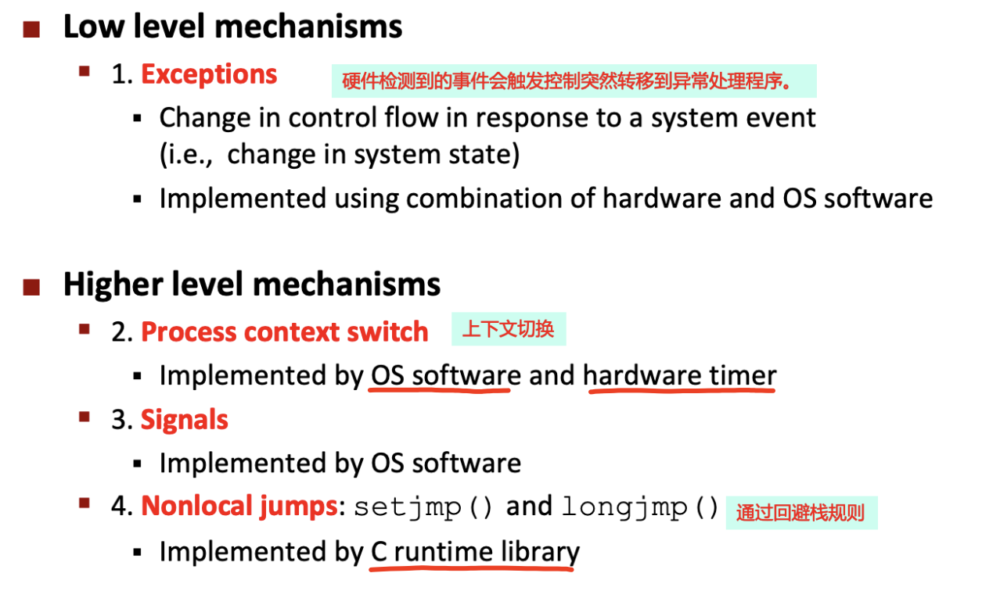
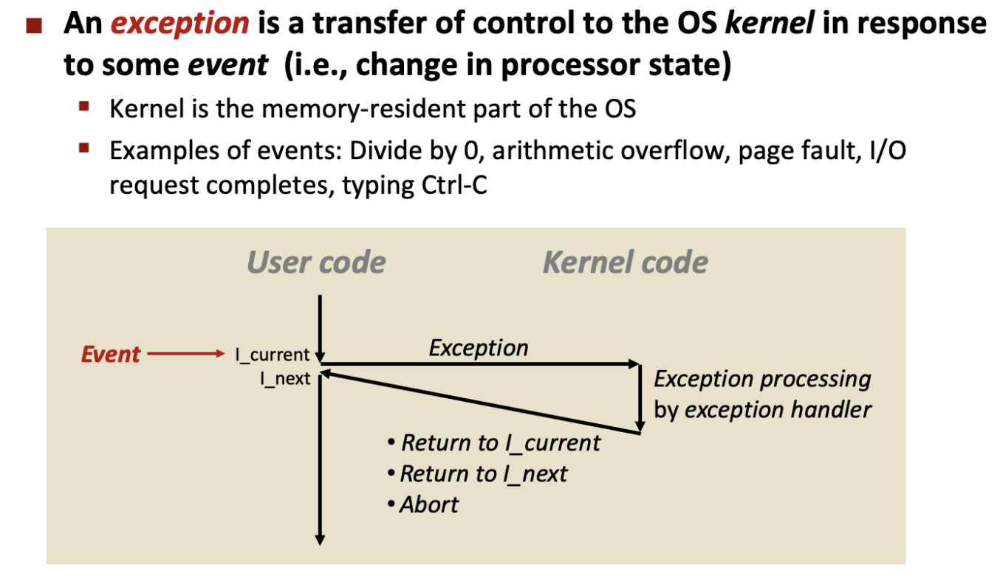
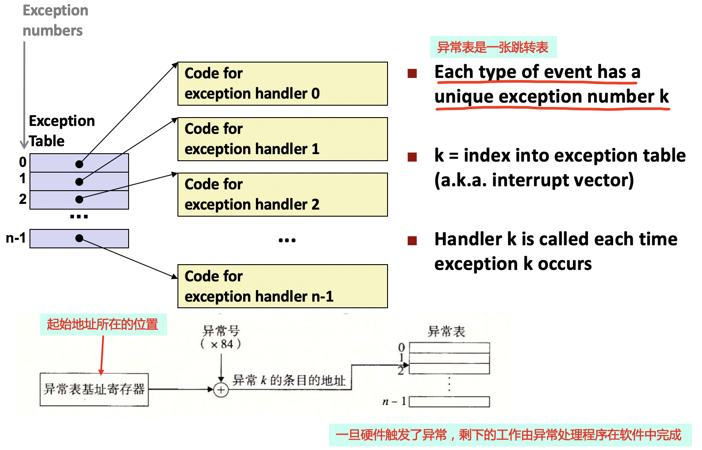
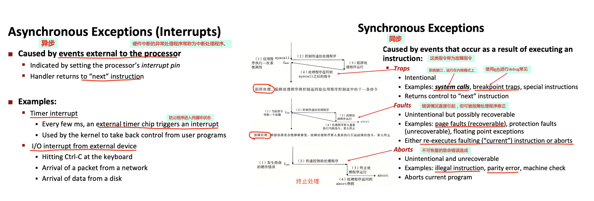
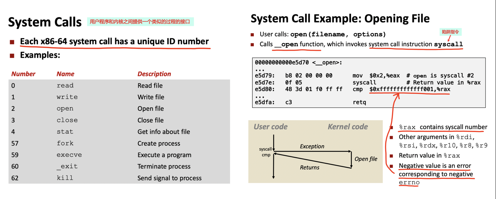
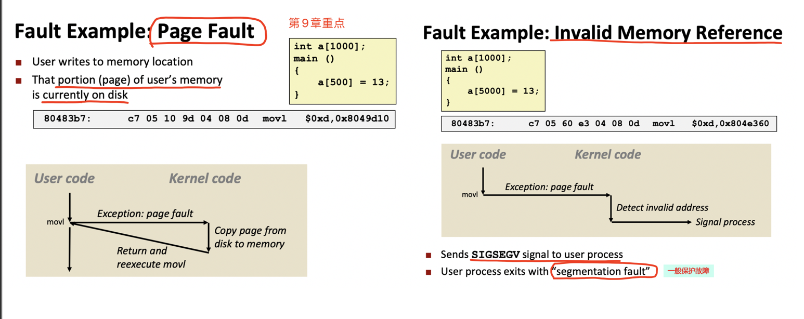
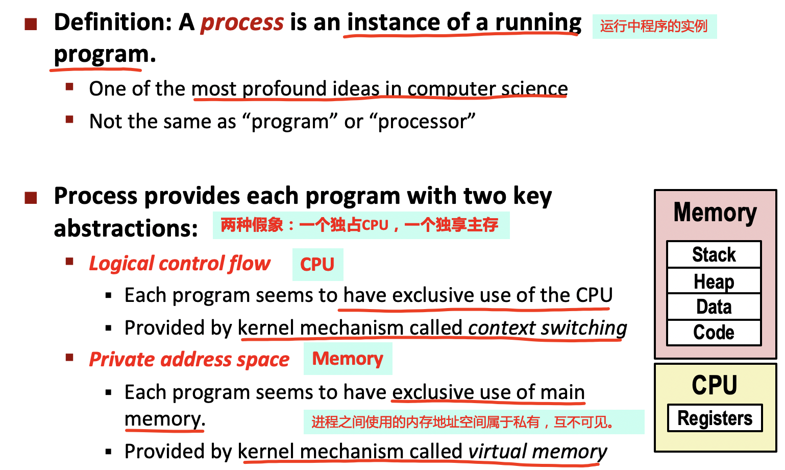

<h1>
 csapp chapter08 异常控制流 学习笔记
</h1>

## 内容和图片来源说明
- 书籍《深入理解计算机系统》第3版 第 08 章
- PPT：CMU CS15-213 2015 及 Lecture14 和 Lecture15 课程笔记

## 00. 概述
控制指令序列叫做处理器的 **`控制流（Flow of control或control flow）`** 。一些必要的机制，使得程序能够对由程序变量表示的内部程序状态中的变化作出反应，如跳转、调用、和返回等程序指令。
- 物理控制流：硬件正在执行的实际指令序列。

**`异常控制流（Exceptional Control Flow，ECF）`**：现代系统中通过使控制流发生突变而对这些情况做出的反应。异常控制流发生在计算机系统中的各个层次。

## 01. 异常

异常是控制流中的一种突变，用来响应处理器状态中的某些变化。由硬件和OS来协同完成。

异常：将控制权转移到了OS内核中，内核是OS中始终常驻在内存中的一部分。

### 1.1 异常处理
系统中可能的每种类型的异常都有一个 **`唯一的非负整数的异常编号`**，由不同的人来分配：
- 处理器的设计者：主要有`被零除`、`缺页`、`内存访问违例`、`断点`以及`算术运算溢出`。
- OS内核的设计者：包括`系统调用`和`外部IO设备的信号`。

### 1.2 异常的类型
异常分为4类：`中断（interrupt）`、`陷阱（trap）`、`故障（fault）`和`终止（abort）`。

### 1.3 Linux/x86-64系统中的异常

- 系统调用

    

- 缺页异常

    

## 02. 进程
异常是允许OS内核提供进程概念的基本构造块。

### 2.1 进程概述
对于系统来说，每个程序都运行在某个进程的上下文中。

上下文是由程序正确运行所需的状态组成的。

 
## 03. 系统调用错误

