<h1><center> csapp Lecture17 Lecture18 虚拟内存 学习笔记</center></h1>

## 00. 内容和图片来源说明
- 书籍《深入理解计算机系统》第3版 第 09 章
- PPT：CMU CS15-213 2015 及 Lecture17 Lecture18 课程笔记

## 01. 虚拟内存的概念
现代系统，**`虚拟内存（Virtual Memory，VA）`** 是主存的一个抽象概念。

虚拟内存是硬件异常、硬件地址翻译、主存、磁盘文件和内核软件的完美交互。为每个进程提供一致且私有地址空间。

### 1.1 虚拟内存提供的三个功能
- 将主存看成是一个存储在磁盘上的地址空间的高速缓存,在主存中只保存活动区域,并根据需要在磁盘和主存之间来回传送数据,通过这种方式,从而高效使用主存。
- 为每个进程提供一致的地址空间,从而简化内存管理。
- 保护每个进程的地址空间不被其他进程破坏。

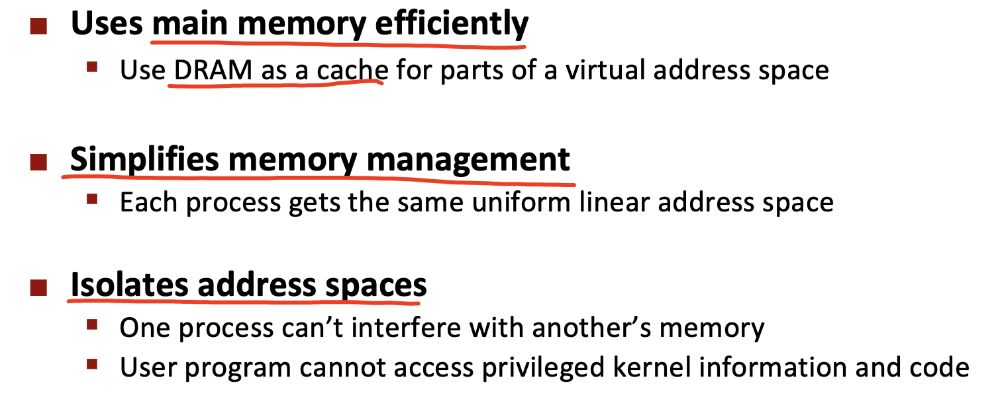

### 1.2 虚拟内存的基本思想
主存中每字节都有一个选自虚拟地址空间的虚拟地址和一个选自物理地址空间的物理地址。

## 02. 物理和虚拟寻址
虚拟内存是计算机科学中重要的概念。把内存理解成一个连续的物理字节数组，然后通过地址的偏移来访问。

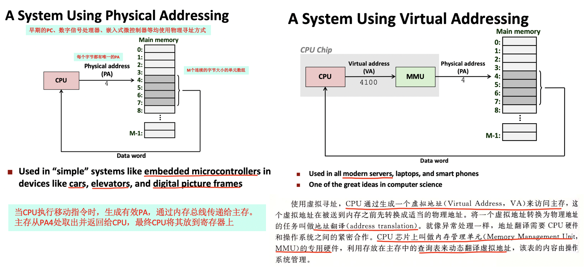

## 03. 地址空间
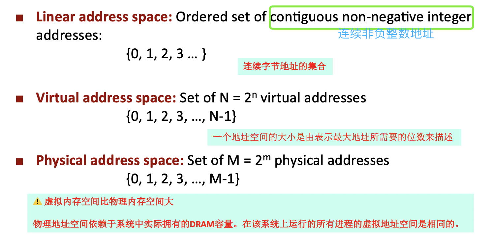

## 04. 虚拟内存作为缓存的工具
虚拟内存被组织为一个存放在磁盘上的N个连续字节大小的单元组成的数组。

每个字节都有唯一的虚拟地址，作为数组的索引。磁盘上数组的内容被缓存到主存中。

### 4.1 概念
**虚拟页（Virtual Page，VP）**：VM系统通过将虚拟内存分割为大小固定的块。
> 每个虚拟页的大小为 $P= 2^p$ 字节。

物理内存被分割为`物理页（Physical Page，PP）`。大小也为P字节（物理页也称为`页帧`）。

在任意时刻，虚拟页的集合分为三个不相交的子集：
- `未分配的`：未分配，且不缓存，也不在磁盘上。
- `缓存的`：已分配并缓存在主存上
- `未缓存的`：已分配但未缓存

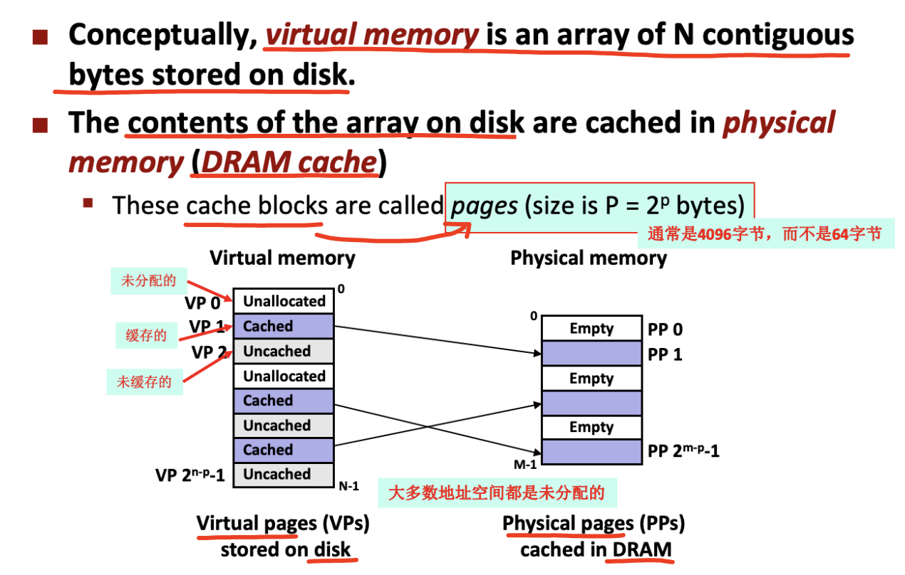

### 4.2 DRAM缓存结构
DRAM缓存结构的设计动机：DRAM因不命中就需要从磁盘读取数据，从而造成开销巨大，且代价比较昂贵。因此，需要尽量减少开销和代价成本。

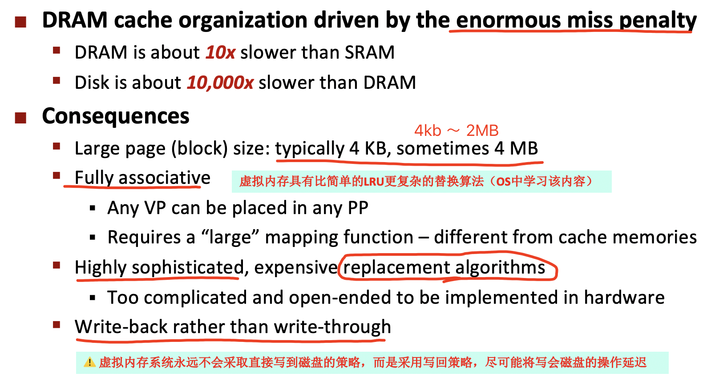

### 4.3 页表（Page Table）
页表：存放在`物理内存`中的数据结构。由内核维护，是每个进程上下文的一部分（每个进程都有自己的页表）。
> 页表将`虚拟页`映射到`物理页`。

`页表`就是一个`页表条目（Page Table Entry，PTE）`的数组。虚拟地址空间中的每个页在页表中一个固定偏移量处都有一个PTE。

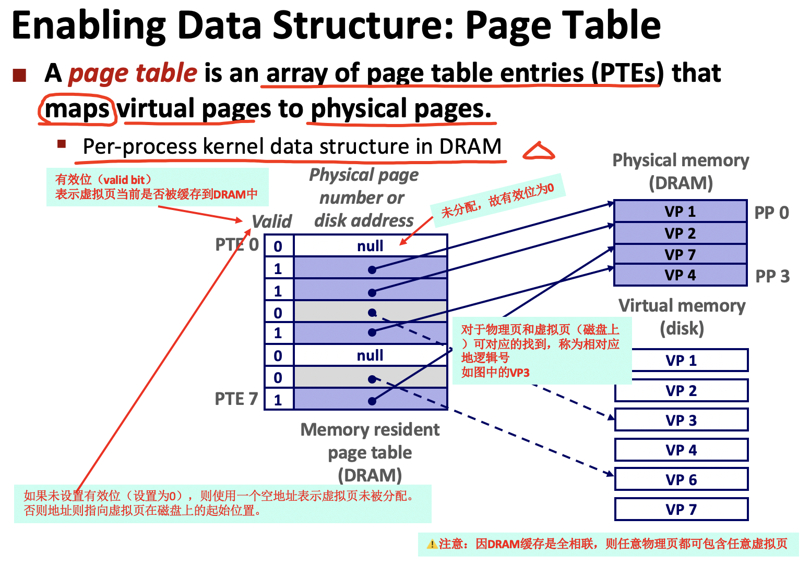

### 4.4 页命中
当页表中存在对虚拟地址空间中的字的引用时，会发生page命中。字被缓存在DRAM中的page中。

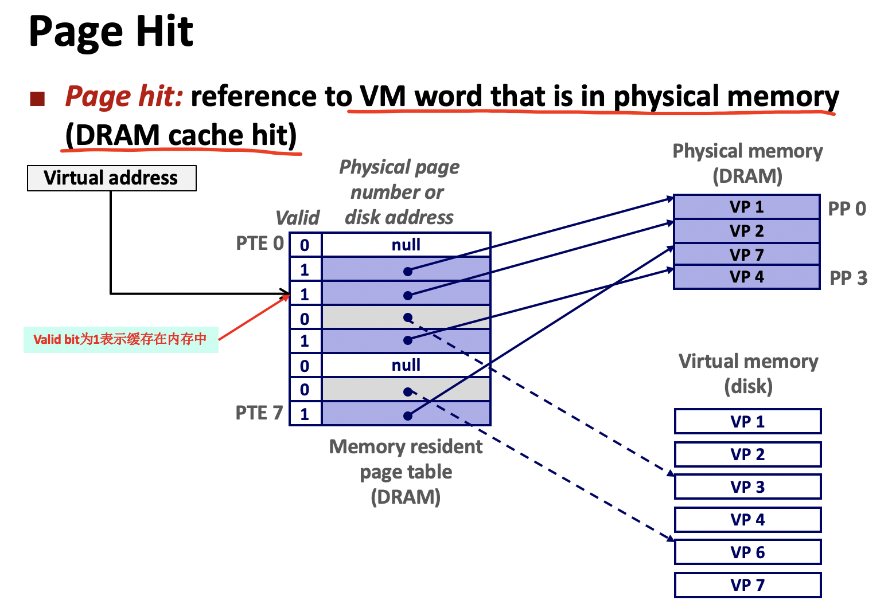

当CPU执行一条指令时，会生成一个虚拟地址。MMU在页表中查询。

### 4.5 未命中（又称为缺页）
DRAM缓存不命中称为`缺页（page fault）（也称为未命中）`。未命中是对未在物理内存中缓存的字的引用。

由于VP3在DRAM中未缓存，而是存储在磁盘上，硬件触发了缺页异常，使得`内核中的缺页异常处理程序`，该程序会选择一个`牺牲页`（图中VP4，如果VP4被修复，则内核将其复制回磁盘。），程序会将数据从磁盘中VP3的副本拷贝到页中，并更新PTE。当异常处理程序返回时，它会重新启动导致缺页的指令，该指令会把导致缺页的虚拟地址重发到地址翻译硬件。

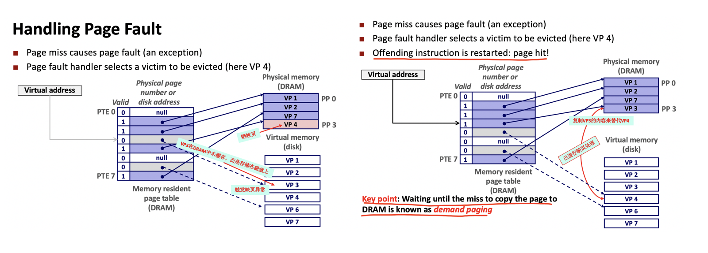

在磁盘和内存之间传送页的活动称为`交换（swapping）`或`页调度（paging）`。

页从磁盘换`入（或者页调入）`DRAM和从`DRAM换出（或者页调出）磁盘`，等待当有`不命中`发生时，才换入页的策略称为`按需页调度（demand paging）`。

### 4.6 分配页
假设需要分配一大块虚拟地址空间，则调用`malloc()`函数，如果一个`页表尚未分配`，则`内核`或者`malloc函数`会则必须通过调用一个名为 `sbrk()`的函数来分配内存。
> sbrk不是系统调用，而是一个C库函数。

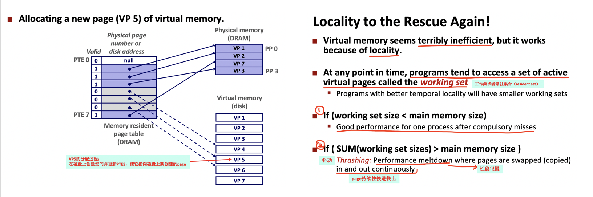

Linux内核中的`sbrk()`函数的功能：**实现虚拟内存到内存的映射**。

## 05. 虚拟内存作为内存管理的工具
虚拟内存极大地简化了内核对内存管理，也提供了自然保护内存的方法。

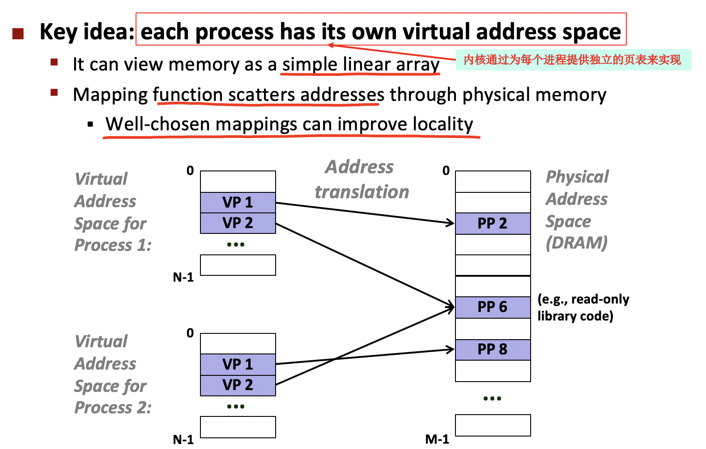

虚拟地址空间中`连续的page`可以映射到DRAM中的物理地址空间的`任何位置（分散在任何位置）`。
> 小总结：在虚拟地址空间page连续，但在物理实际地址空间是分散的。

### 5.1 VM的功能
VM简化了链接和加载、代码和数据共享，以及应用程序的内存分配。

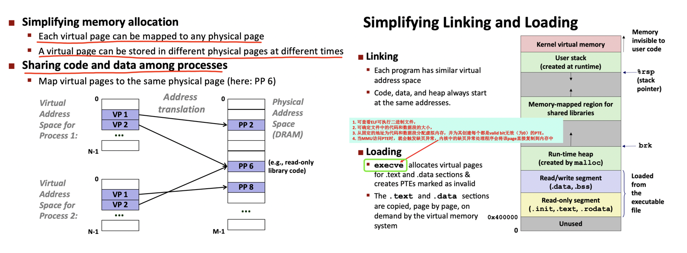

***同一个虚拟地址page可以映射为多个物理地址page，多个虚拟地址page可映射到同一个共享物理page上。***

## 06. 虚拟内存作为内存保护的工具
现代计算机为OS提供的保护方式
- 不允许用户进程修改它的只读代码段。
- 不允许它读或修改内核中的代码和数据结构。
- 不允许它读或写其他进程的私有内存。
- 不允许修改任何与其他进程共享的虚拟page（除共享者显式设置可允许系统调用）

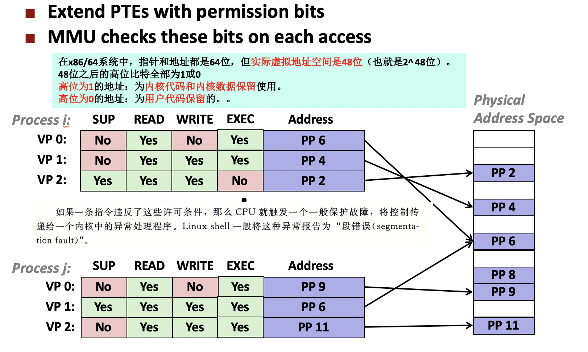

通过`给PTE设置一些权限位`的方式，来实现用户代码是否可以访问某些虚拟page或者是否必须由内核访问（管理员模式）。MMU会进行检查权限位，如果是0则抛出异常，并交给内核来处理。

## 07. 地址翻译

### 7.1 MMU如何利用页表实现映射？
MMU利用VPU来选择适当的PTE，然后将PTE中PPN和虚拟地址中的VPO串联起来，即可得到相应的物理地址。
> 因物理和虚拟page都是P字节，所以PPO和VPO是相同的。

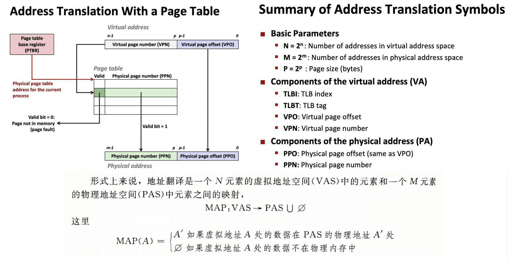

### 7.2 page命中和缺页时，CPU的执行步骤
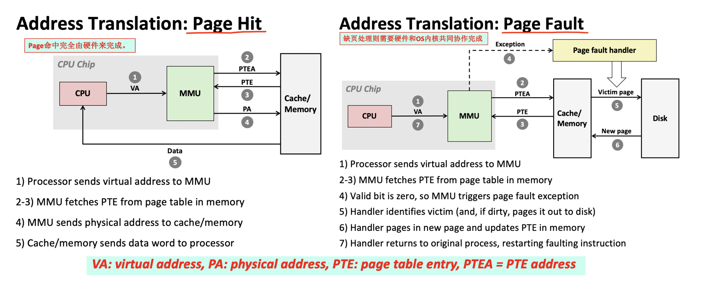

### 7.3 高速缓存和虚拟内存
高速缓存是使用物理寻址的方式。对于高速缓存和虚拟内存结合的思路：地址翻译发生在高速缓存`查找之前`。

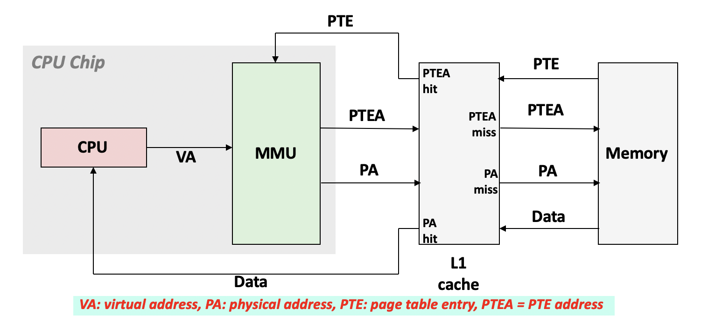

### 7.4 利用TLB加速地址翻译
每次CPU产生一个虚拟地址，MMU必须查阅一个PTE，以便于将虚拟地址翻译为物理地址。所以MMU通过缓存PTE来加速翻译过程。

从内存里读取一次数据，周期是几十到几百。如果PTE缓存在L1中，则是1～2个周期。为了消除开销，则使用TLB，使得访问速度非常快。

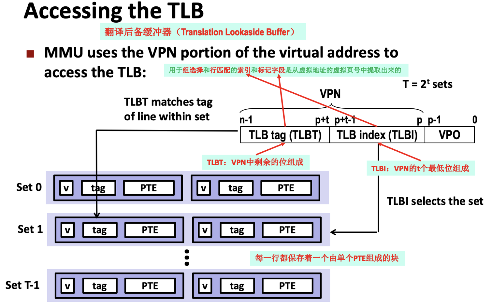

**`翻译后备缓冲器（Translation Lookaside Buffer，TLB）`**：在MMU内的一个小的，且是虚拟寻址的硬件缓存。
> 缓存的内容：PTEs

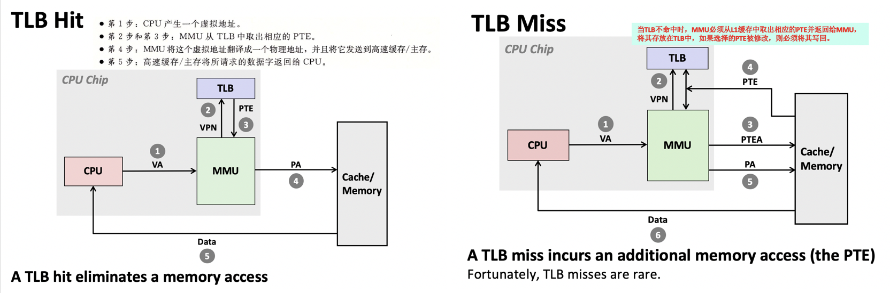

所有的地址翻译都是在芯片上的MMU中执行，所以非常快。

### 7.5 多级页表
如果想要存储很大的页表（如512G、1T等），则使用`层次结构的页表`。

#### 7.5.1 二级页表
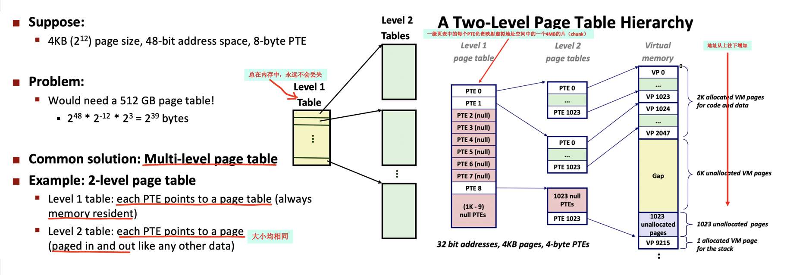

多级页表的结构方式从两个方面减少内存要求：
- 如果一级页表中的一个PTE为空，则对应的二级页表也不会存在。这是一种很大的节约，因为一个典型程序，4GB的虚拟地址空间大部分都是未分配的。
- 只有一级页表才需要总是在主存中；虚拟内存系统可在需要时创建、page调入或调出二级页表，这减少了主存的压力。只有最经常使用的二级页表才需要存在主存中。

#### 7.5.2 k级页表的地址翻译
虚拟地址被划分为 `k个VPN（每个大小相同）` 和 `1个VPO`组成。

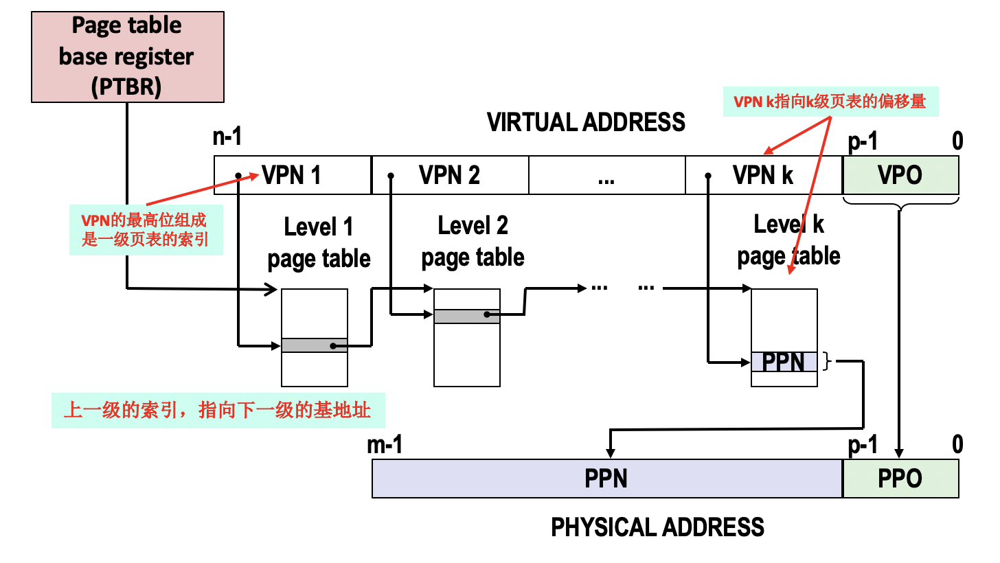

## 08. 端到端的地址翻译
将虚拟内存运行到一个TLB和L1 Cache的小系统中。
```c
// 该部分知识点听得迷迷糊糊，云里雾里的，所以不进行更新，等待完全理解后更新
```

## 09. 案例研究：Intel Core i7/Linux内存系统

### 9.1 Core i7的内存系统

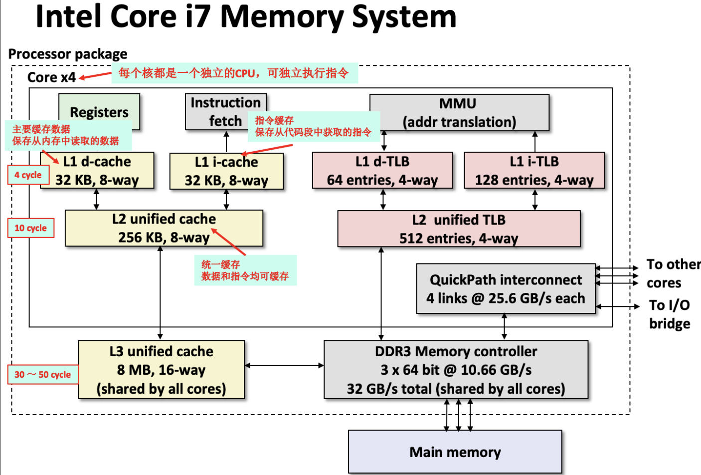

### 9.2 端到端地址翻译

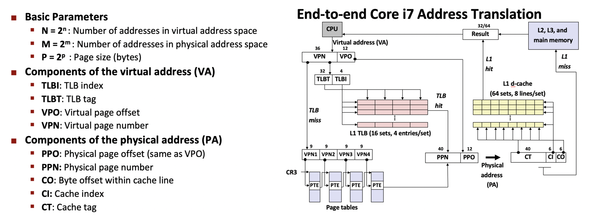

### 9.3 Core i7中1～3级和4级PTE
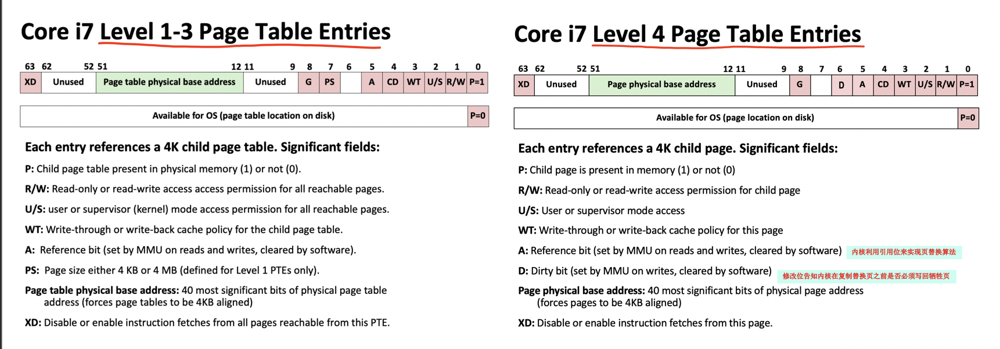

### 9.4 Core i7页表翻译
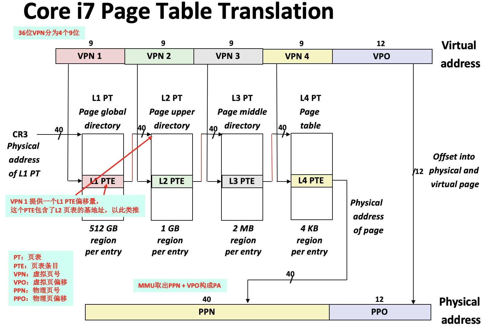

### 9.5 加速L1访问的技巧
限制L1 缓存大小的原因：MMU地址翻译分为两个步骤
- MMU将虚拟地址翻译成物理地址
- 将物理地址传递给L1高速缓存。

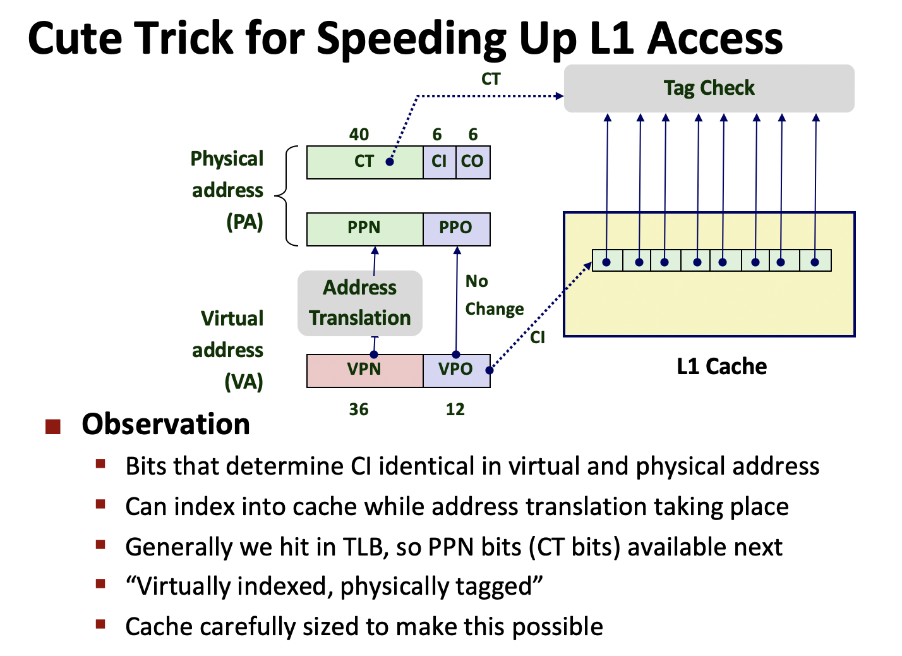

当CPU需要翻译一个虚拟地址时，发送VPN到MMU，发送VPO到L1高速缓存。当MMU想TLB请求一个PTE时，L1高速缓存利用VPO查找相应的CI和CO以及相匹配的CT，
当MMU从TLB中获得PPN时，缓存同时可与Tag进行匹配，若匹配成功，直接返回地址内容。
> 类似并行的方式执行，将两个步骤合二为一，从而提高访问的速度。

## 10. Linux虚拟内存系统
由于虚拟内存的工作方式原因，所以基本上每个进程的虚拟空间都是类似的。

### 10.1 Linux虚拟地址空间
在intel体系结构中，虚拟地址是48位，如果48位的地址的最高位是0，则剩下的16位设置也是0。如果48位的地址最高位是1，则剩下的16位也是设置是1.最高位和48位地址保持一致，使得内核所在的虚拟地址空间的最高16位全部为1。

Linux内核在虚拟内存上的读写，也就是对物理内存的读写。

Linux将虚拟内存组织称为一些`区域（段）的集合`。一些区域（area）就是已经存在着的（已分配的）虚拟内存的连续片（chunk），这些页则以某种方式相关联。例如代码段、数据段、堆、共享库段以及用户栈都是不同的区域。

task_stuct中的一个条目指向mm_struct，描述虚拟内存的当前状态。

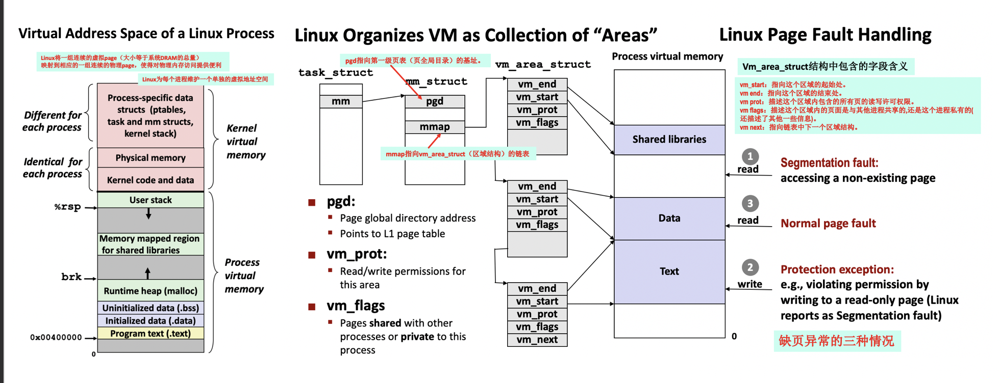

在MMU翻译某个地址时，如果地址对应的页表不在内存中，则会出现缺页异常。图中1、2、3为缺页处理的三种情况：
- 在访问内存时，发现未创建页表，内核也不会在虚拟内存中创建分配page。所以访问一个不存在的page，从而触发 segmentation fault。内核可以识别，因内核可以编译area_struct链表，会发现地址不在area_struct定义的区域之内。

- 指令尝试对一个虚拟地址的只读page进行写操作。如果访问不合法，缺页处理程序会触发一个保护异常，从而终止进程。MMU会进行页表权限位检查，然后发现对一个只读页进行写操作，直接会抛出异常。

- 合法缺页异常（会触发保护异常），会选择一个牺牲page，如果被修改过，则直接将其交换出去，换入新的page并更新页表。

## 11. 内存映射
将一组连续的虚拟page映射到任意一个文件中的任意位置的表示法称为 **`虚拟映射（memory mapping）`** 。Linux提供mmap的系统调用，允许应用程序表示自己做内存映射处理操作。

内存映射可以帮助理解执行fork和exec系统调用时系统在做的事。

### 11.1 内存映射概述
**`内存映射`**：虚拟内存`区域初始化`与`磁盘上的对象`相`关联`的过程。

映射区域支持文件：
- 磁盘上的普通文件（如可执行目标文件）：初始page字节来自文件的一部分。
- 匿名文件（如，什么都没有）：由内核创建（包含全是二进制0，大小也是任意的），匿名文件并不是真实存在，只是一个trick。将分配一个充满0的物理page（请求全0page），一旦page被修改，它需要同步到文件（这里是同步到内核维护的专门的交换文件）中。

### 11.2 共享对象
利用内存映射可以实现进程间共享对象，因为进程可以映射虚拟内存的区域到同一个对象。

因为共享对象有一个唯一的名字，所以内核可以检查是否有其他进程映射到那个对象。通过每个独立虚拟地址空间的进程可以访问一些连续片（chunk）⚠️（物理page不一定连续），使其可达到对同一个物理地址区域访问的目的。

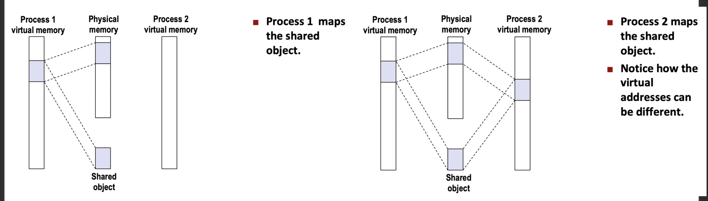

### 11.3 私有写时复制对象
私有写时复制对象（Private Copy-on-write (COW) Objects）：

```c
// 知识点听懂，看书也有一点没完全看懂，等待后续完全看懂再更新
```

### 11.4 `fork()` 函数
如果要fork一个进程，需要拷贝一个一模一样完整的地址空间、页表、用户数据结构和内存。所有的虚拟地址空间都会被拷贝，从而映射到不同的物理地址空间上。从而造成开销很大（开销会随着使用内存的大小的增长而增长，几乎无限制）。所以COW技术提供高效的解决方案。

当fork函数被当前进程调用时，内核为新进程创建各种数据结构，并为其分配唯一的PID。

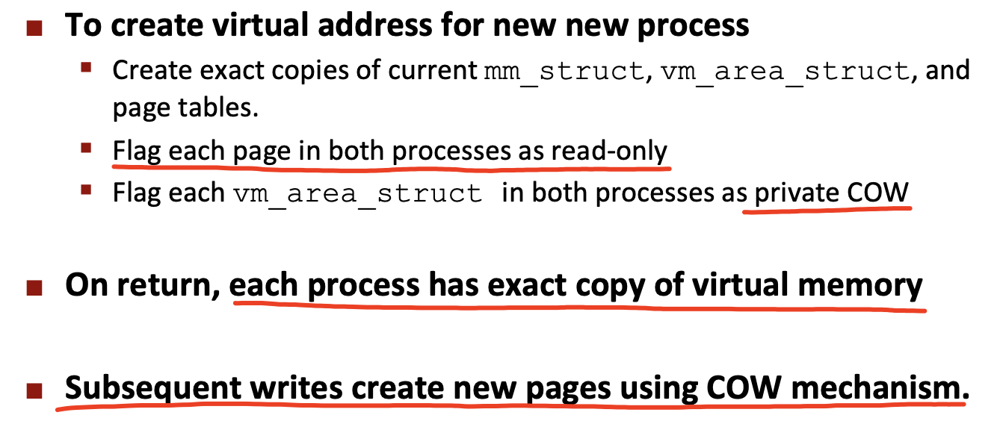

### 11.5 `execve()` 函数
execve函数在当前进程中加载并执行一个新函数，会删除当前进程的所有area_struct结构，不创建进程，而是在当前进程中，在一个新的虚拟地址空间上来运行一个程序。

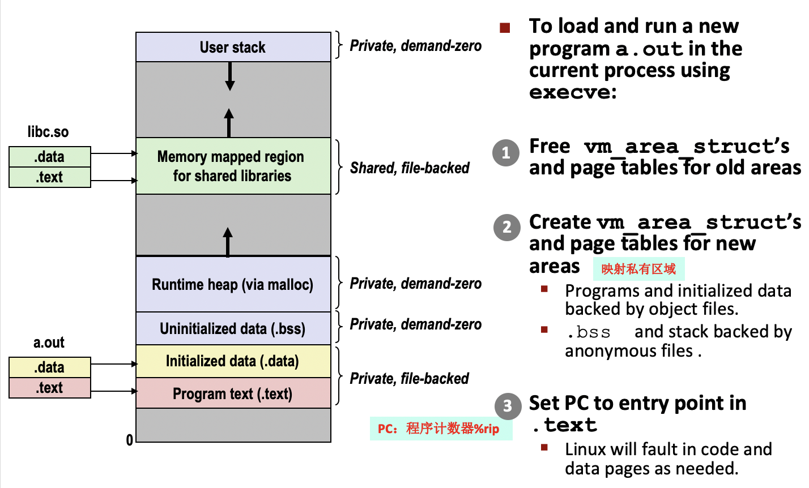

### 11.6 用户级内存映射
Linux进程可使用`mmap函数`来创建新的虚拟内存区域，并将对象映射到区域中。仅仅只是内存映射，当读到未存在的page时，内核会触发缺页异常，会自动换入对应的page，poge的初始值就是磁盘上文件的某个部分内容。

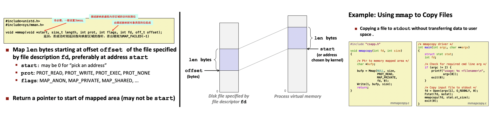

munmap函数删除虚拟内存的区域：

```c
#include <unistd.h>
#include <sys/mman.h>

int munmap(void *start, size_t length);/*从虚拟地址的start开始删除*/
/*返回：若成功则为0，若出错则-1*/
```

