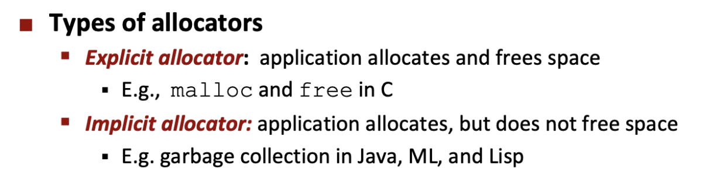
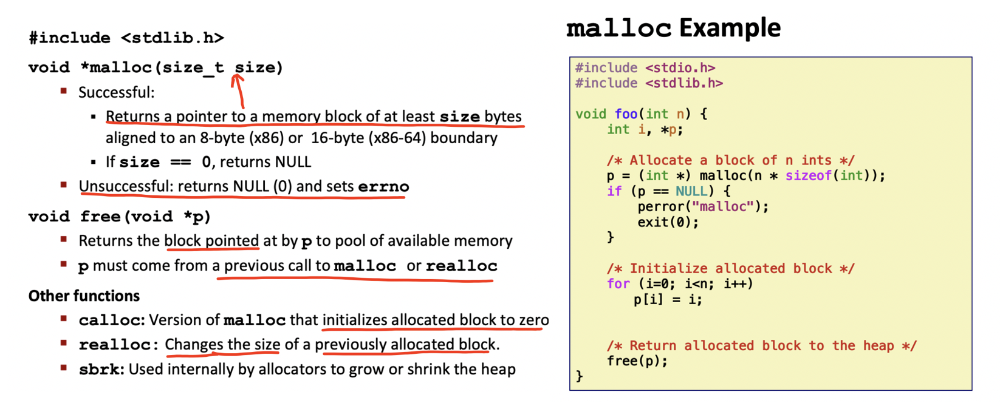
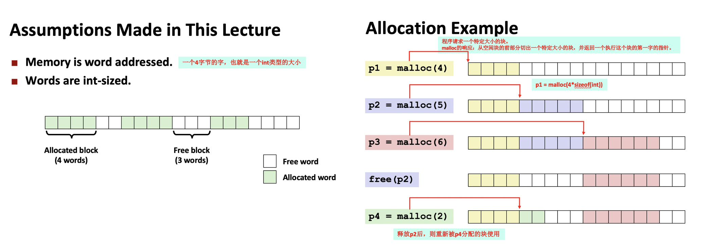
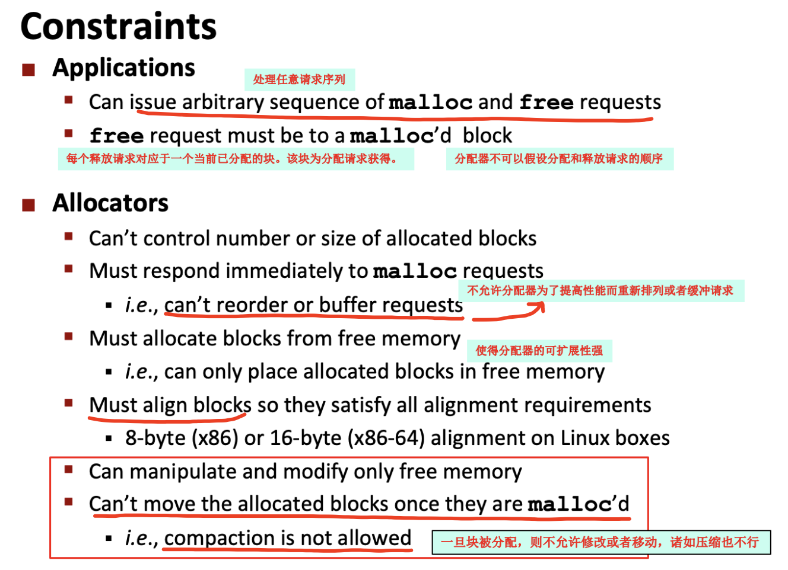
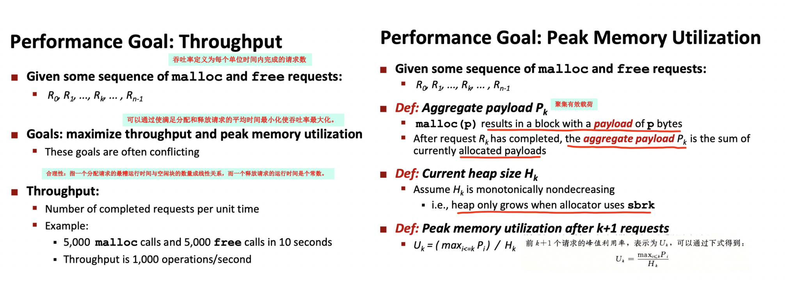
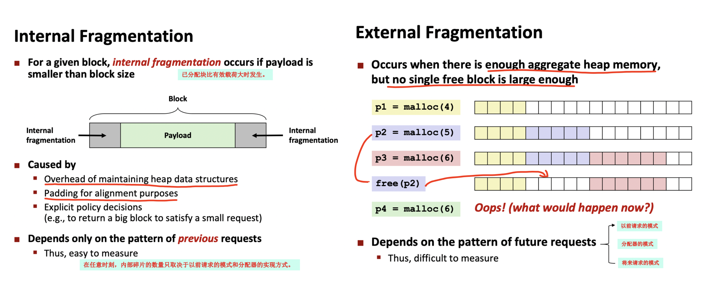

<h1>
 csapp Lecture19 Lecture20 动态内存分配 学习笔记
</h1>

## 00. 内容和图片来源说明
- 书籍《深入理解计算机系统》第3版 第 09 章
- PPT：CMU CS15-213 2015 及 Lecture19 Lecture20 课程笔记

## 01. 概述
C语言程序通过 **`动态内存分配（Dynamic Memory Allocation，DMA）`** 来提高程序的可移植性。

### DMA的基本思想
应用程序使用它来构造、分配以及释放虚拟存储器片。这个虚拟内存区域由动态内存分配器来维护,也就是所谓的**堆（heap）**。

分配器将堆视为一组不同大小的块（block）的集合。块可以被分配或者释放。分配器有两种基本分风格：

## 02. malloc 和 free 函数
在C语言中的分配器由C语言标准库终一组叫`malloc包`的函数提供。

### 2.1 malloc和free的实现
例子：主要表示malloc和free如何管理一个C程序的16字的堆。

## 03. 分配器的要求和目标
显式分配器必须在一些严格的约束条件下工作。

### 3.1 分配器的要求

### 3.2 分配器的目标
在分配器一些限制要求的情况下，实现吞吐率最大化和内存使用最大化是互相冲突的。

## 04. 碎片（fragmentation）
碎片是造成堆利用率很低的主要原因。主要有两种形式：
- 内部碎片（internal fragmentation）：

- 外部碎片（external fragmentation）

## 05. 具体实现
因分配器从不重复使用任何块，内存利用率很低，所以一个实际分配器要在吞吐率和利用率之间把握好平衡。则在具体实现的过程中需要考虑的诸多问题。

