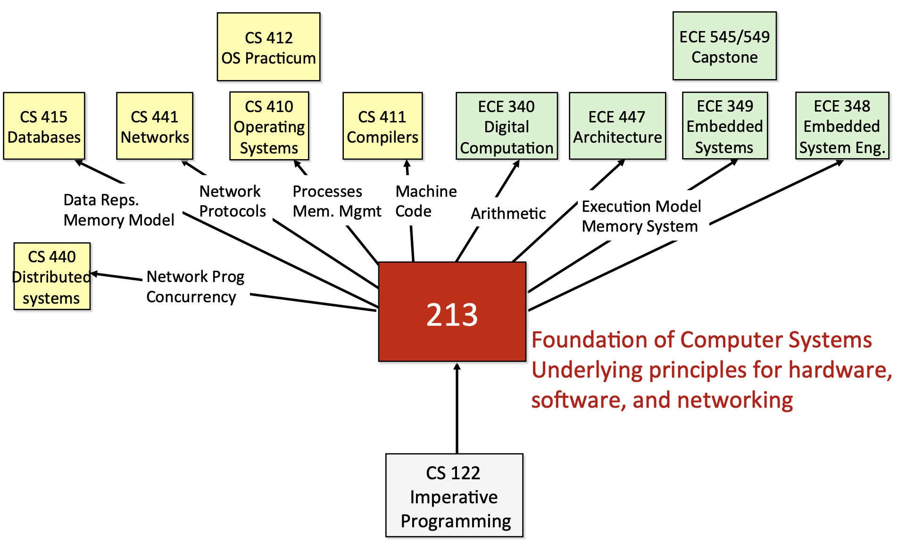

<h1>
 CS 15-213 课程和书籍 学习笔记
</h1>

## 参考资源
课程主页：https://www.cs.cmu.edu/afs/cs/academic/class/15213-f15/www/schedule.html

B占Up主视频：https://www.bilibili.com/video/BV1XW411A7fB

书籍页面：http://csapp.cs.cmu.edu/3e/home.html

通过B站大佬对CMU课程的翻译，方便看懂，再结合CSAPP书籍来对知识点进行巩固。【个人早期购买英文版，电子版使用中文版，两个版本结合协助理解一些抽象的翻译】

## 先修内容
> - 由于课程个人认为偏向于计算机基础能力的集合，有一点`串联知识点`的意思存在。
> - 所以该部分不是课程推荐，属于自己使用中的后续理解。

- 编程语言（C/C++最佳 ---- 指针和内存管理）
- 《现代操作系统》
- 《计算机组成与设计:软件/硬件接口》
- 《汇编语言》王爽 -----> 见 「[笔记地址]()」
- 软件工程

## 环境
- CPU架构: x64
- 操作系统: GNU/Linux
- 编译器: GCC/G++
- 编程语言: C语言/C++

## 课程相关性

## 个人说明
- 使用方式：`书籍 + PPT 组合`。

- 由于课程老师说明，不要随意公开课程相关的Homework和project相关的解答。

- 所以所有相关CMU、Stanford、MIT、Berkeley等学校的课程Homework（Project）解答均不在Repo中体现。