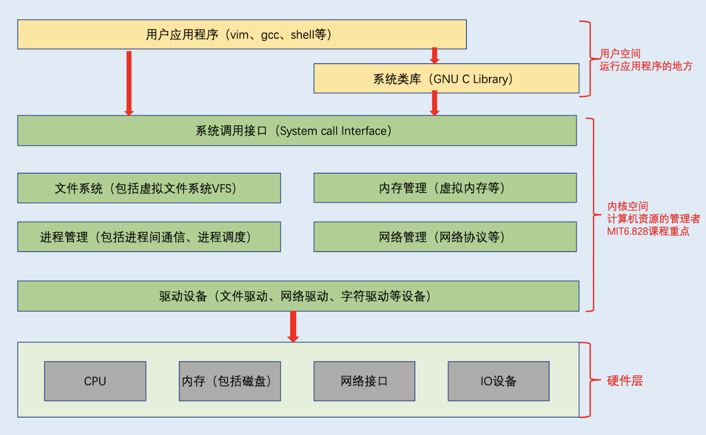

<h1 align="center">📔 Lecture01 课程笔记</h1>

## 1. OS概述
### 1.1 OS的目标
- 对硬件的抽象
- 应用程序复用硬件基础
- 具有隔离性
    - 不同活动不能互相干涉。
- 在应用程序之间允许共享性
    - 由访问控制系统来进行决定。

### 1.2 OS提供的服务
- 进程管理（包括进程之间的通信，进程的调度等）
- 内存分配
- 文件内容
- 系统安全

### 1.3 OS设计？实现的难点？
- 环境差异：不同的硬件和调试器
- 处理要高效，但抽象（通过系统调用来使用）。
- 功能要足够强大，但也是多个模块之间的组合。
- 功能之间的交互，例如文件的读取。
- 行为之间交互，例如CPU、优先级以及内存分配器的使用。
- 开放问题：安全、性能以及开发新硬件
## 2. 计算机结构图


课程的主要关注点：系统调用和内核结构。

## 3. 课程概述
课程主要使用xv6（简单的类unix操作系统）来实现一些系统程序的调用。xv6主要是用运行在RISCV处理器上，所以建议直接使用RISCV类型的设备。

### 先修内容
- MIT6.004（课程类似国内 《计算机组成原理》课程）
- C语言
- 基本的Linux命令
- shell脚本语法

如果RISCV微处理器设备的局限性，也可以使用QEMU未处理的仿真。

## 4. 环境准备

### 4.1 配置qemu环境
参考链接：https://pdos.csail.mit.edu/6.S081/2020/tools.html

```sh
# 系统版本
centos8 4.18.0-305.12.1.el8_4.x86_64 x86_64 GNU/Linux
# gcc 版本
gcc (GCC) 8.5.0

# gdb 版本
GNU gdb (GDB) 8.2-16.el8

# Binutils 版本
binutils-2.30-108.el8_5.1.x86_64
```sh
- 下载RISC-V GNU编译工具链
```sh
git clone --recursive https://github.com/riscv/riscv-gnu-toolchain
```

- 在编译工具之前，确保依赖正常安装。
```sh

```

### 4. 使用shellinabox 
参考资料：https://github.com/shellinabox/shellinabox

- 准备需要的依赖
```sh
yum install git openssl-devel pam-devel zlib-devel autoconf automake libtool
```
在安装一些centos依赖时会出现。

- git clone文件并进行编译
```sh
 git clone https://github.com/shellinabox/shellinabox.git && cd shellinabox
 autoreconf -i
 ./configure && make
```
在编译过程中会出现错误：
```sh
configure.ac:18: error: possibly undefined macro: AM_CONFIG_HEADER
configure.ac:21: error: possibly undefined macro: AM_PROG_CC_C_O
configure.ac:24: error: possibly undefined macro: AC_PROG_LIBTOOL
```

直接安装依赖即可。
```sh
yum install -yq libsysfs libtool
```

