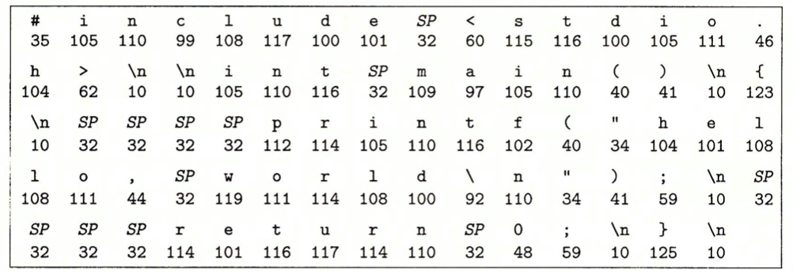
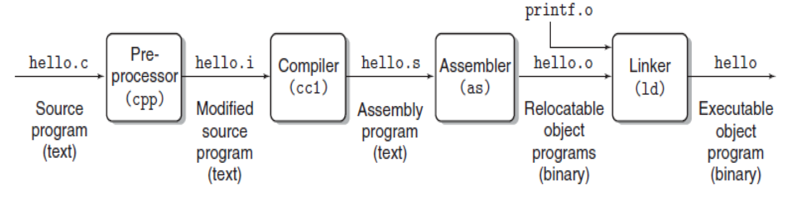
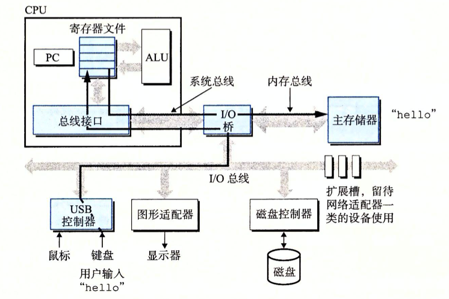
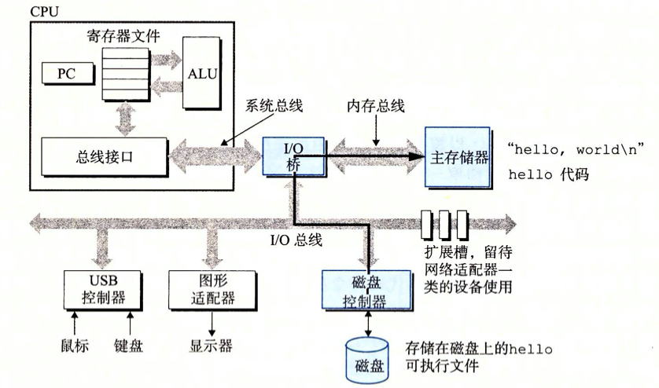
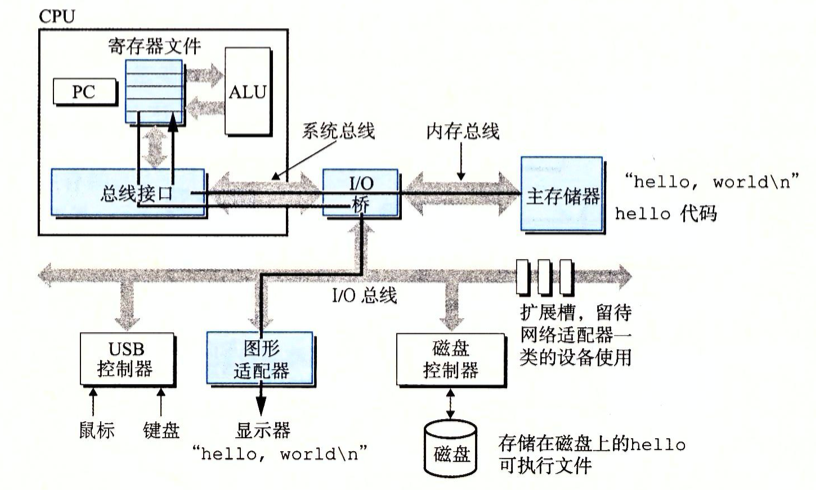

<h1><center> csapp chapter01 计算机系统漫游 学习笔记</center></h1>

计算机系统是由 `硬件` 和 `系统软件` 组成的，两者共同工作来运行应用程序。

## 信息就是`位 + 上下文`
源程序实际上就是一个由 `0` 和 `1` 组成的位（称为比特）序列，8个位被组成为一组，称为字节。

每个字节表示程序中的某些文本字符。

现代大部分的计算机系统都使用 `ASCII标准` 来表示文本字符。实际上就是一个唯一的单字节大小的整数值来表示每个字符。

具体的ASCII码表 参考【[Link]()】

一个程序hello.c

```
#include<stdio.h>

int main()
{
    printf("hello,world\n");
    return 0;
 }
```
对于hello.c程序，如果使用ASCII文件表示如下：



以上程序的表示方法说明了一个基本思想：系统中的所有信息 —— —— 包括磁盘文件、内存中的程序、内存中存放的用户数据以及网络上传送的数据，都是由`一串比特`表示的。

**区分不同数据对象的唯一方法：读取到某个数据对象时的上下文。**

## 程序的翻译

#### 编译系统的构成


>对于 GCC的编译方式请参考 「[gcc_g++_cmd_note](../../../tools/gcc_g++_cmd_note.md)」

这四个阶段的程序（预处理器、编译器、汇编器和链接器）一起构成。

- 预处理器阶段
    - 预处理器(cpp) 根据以`字节#`开头的命令，修改原始的C程序。
- 编译阶段
    - 编译器(ccl)将文本文件hello.i翻译成文本文件hello.s，它包含一个汇编语言程序。
```
main:
    subq    $8,%rsp
    mov1    $.LCO,%edi
    call    $puts
    mov1    $0,%eax
    addq    $8,%rsp
    ret
```

- 汇编阶段
    - 汇编器(as) 将hello.s 翻译成机器语言指令，并把指令打包成叫做可重定位目标程序（relocatable object program）的格式。
    - hello.o文件是一个二进制文件，包含了17个字节是main函数的指令编码。
- 链接阶段
    - 调用了printf函数，它是C编译器都提供标准C库中的一个函数。

## GNU项目和C语言起源

**一、GNU项目**
GCC是GNU（GNU是GNU's Not Unix的缩写）项目之一。

GNU项目1984年Richard Stallman发起的慈善项目。

开发出了一个完整的类Unix的系统，其源代码能够不受限制地被修改和传播。

GNU项目是除了内核外，依赖Unix操作系统的所有主要部件的环境。

GNU环境包括：`EMACS编辑器、GCC编辑器、GDB编译器、汇编器、链接器、处理二进制文件的工具以及其他的一些部件`。

**二、C语言起源**
C语言是贝尔实验室的Dennis Ritchie 于1969年 ～ 1973年期间被创建。

The American National Standards Institute (ANSI)在1989年颁布了ANSI C的标准。

C的标准库定义了`C语言`和`一系列函数库`。

C语言成功的原因：

- C语言与Unix操作系统关系密切。
    - 最开始用于Unix系统的开发。
    - 大部分Unix内核，以及所有支撑工具和函数库都是用C语言编写的。
   
- C语言小而简单
    
- C语言是为实践目的而设计的。

## 系统的硬件组成


#### 一、总线
贯穿整个系统的一组电子管道，称作**总线**。

携带信息字节并负责在各个部件间传递。

通常总线被设计成传送定长的字节块，也就是**字（word）。

字中的字节数（即字长）是一个基本的系统参数，各个系统中都不相同。

#### 二、I/O设备

I/O（输入/输出）设备是系统与外部世界的联系通道。

每个I/O设备都通过一个控制器或适配器与I/O总线相连。

控制器和适配器之间的区别主要在于它们的封装方式。都是在`I/O总线`和`I/O设备`之间传递信息。

**控制器**：I/O设备本身或者系统的主印制电路板（通常称作主板）上的芯片组。

**适配器**：是一块插在主板插槽上的卡。

#### 三、主存
主存是一个临时存储设备，在处理器执行程序时，用来存放程序和程序处理的数据。

两个角度看问题

- 物理角度
    - 主存是一组动态随机存取存储器（DRAM）芯片组成的。
- 逻辑角度
    - 存储器是一个线性的字节数组，每个字节都有其`唯一的地址`（数组索引），地址是从`零`开始。

#### 四、处理器
中央处理单元（CPU），简称处理器，是解释（或执行）存储在主存中指令的引擎。

处理器的核心：一个大小为一个字的存储设备（或寄存器），称为程序计数器（PC）。

在任何时候，PC都指向主存中的某条机器语言指令（即含有该条指令的地址）。

从系统通电开始，直到系统断电，处理器一直不断地执行程序计数器指向的指令，再更新程序计数器，使其指向下一条指令。

对于指令进行简单的操作，但是这些操作都是围绕着`主存、寄存器文件（register file）和算术/逻辑单元（ALU）`进行。

- 寄存器文件：一个小的存储设备，由一些单个字长的寄存器组成，每个寄存器都有唯一的名字。
- ALU计算新的数据和地址值。

## 运行hello程序解析
初始时，shell程序执行它的指令，等待输入一个命令。当键盘上输入字符串“./hello”后，shell程序将字符逐一读入寄存器，再把它存放到内存中。



利用直接存储器存取（DMA）技术，数据可以不通过处理器而直接从磁盘到达主存。步骤如下：



一旦目标文件hello中的代码和书就被加载到主存中，处理器就开始执行hello程序的main程序中的机器语言指令。

这些指令将“hello，world\n”字符串中的字节从主存复制寄存器文件，再从寄存器文件中复制到显示设备，最终显示屏幕上。



## Amdahl定律

发明者：Gene Amdahl

主要思想：当我们对系统的某个部分加速时，其对系统整体性能的影响取决于该部分的重要性和加速程度。


