<h1><center> csapp chapter03 程序的机器级表示 学习笔记</center></h1>

## 内容和图片来源说明
- 书籍《深入理解计算机系统》第3版
- PPT：CMU CS15-213 2015 及 课程笔记

## 1. Intel x86处理器历史和体系结构
 Intel处理器俗称x86。

 ### 1.1 Intel x86的概述
 Intel x86 主导 laptop/desktop/server市场。

 革命性设计：8086（1978年）是第一个单芯片、16位微处理器之一。

 Intel 采用 `复杂指令集（Complex Instruction set computer, SISC）`架构,有许多不同格式的不同指令集，但是在Linux中也是小部分使用。
 > 但是性能难以匹敌`精简指令集计算（Reduced Instruction Set Computer，RISC）`。


 ### 1.2 Intel x86 Evolution:Milestones

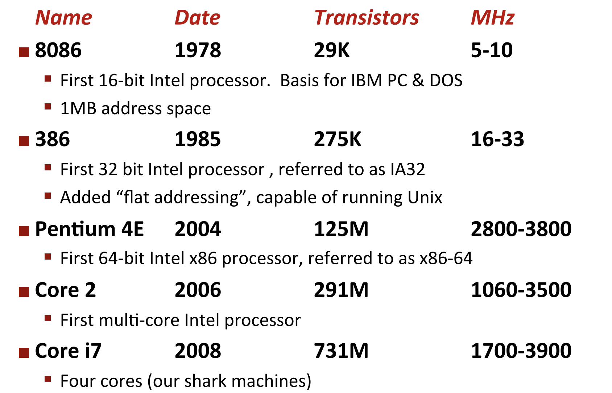

### 1.3 x86处理器升级革命

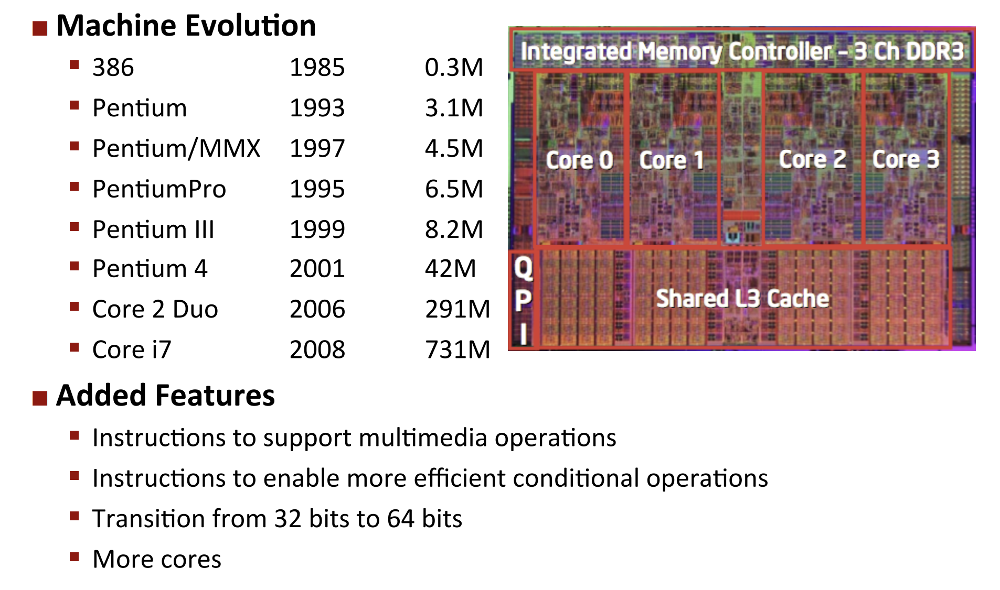

### 1.4 x86克隆版：AMD

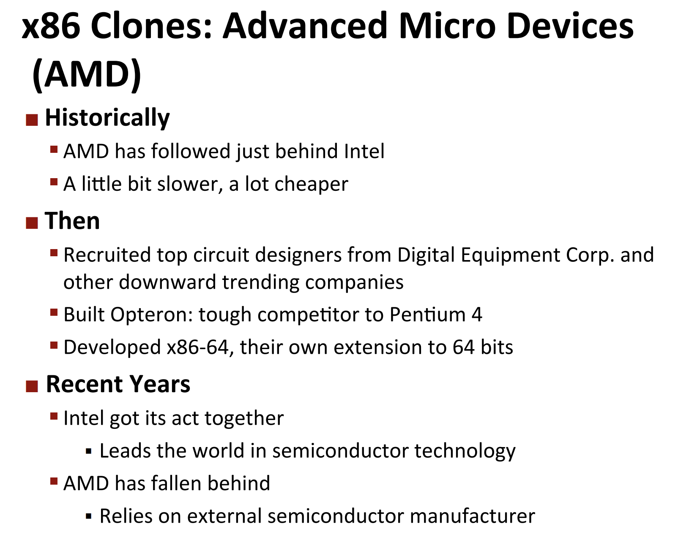

### 1.5 x86/64的历史

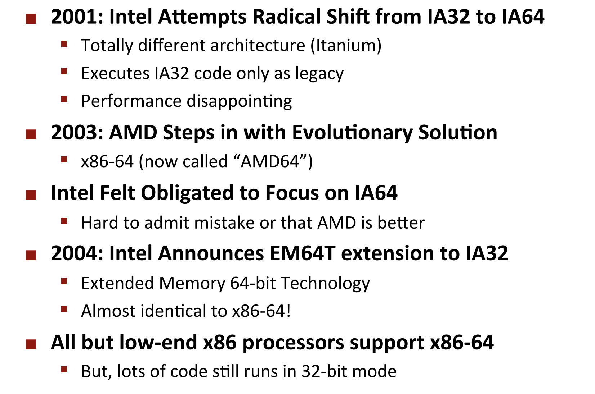

### 1.6 ARM处理器
ARM（Acorn RiSC Machine的缩写），主要设计目标是：低成本、高性能、低功耗的特性。

基于RISC架构而设计。

主要应用在移动通信设备，以及小型物联网设备上。


## 2. 程序编码

### 2.1 一些定义术语
架构：也叫`ISA（instruction set architecture，指令集架构）`，对于处理器设计部分，需要理解或写汇编/机器码。

微结构：指令集架构的底层实现。例如设计缓存大小和core频率。

代码形式：
- 机器码：处理器执行的字节级程序。
- 汇编代码：机器码的文本表示。

ISA的例子
- Intel：x86、IA32、Itanium、x86/64
- ARM：被用在移动设备。

### 2.2 汇编/机器码视图

机器级编程的两种抽象：

- ISA定义机器级程序的格式和行为，定义了`处理器状态，指令的格式，以及每条指令对状态的影响`。
- 机器级程序使用的内存地址为`虚拟地址`。

与传统的二进制机器代码，汇编语言接近于机器码。
> 汇编语言是用可读性更好的文本格式表示。

机器码与原始的C语言代码差异不大，程序员视角可见的处理器状态：

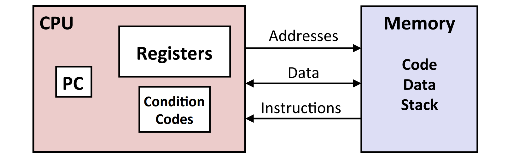
- `程序计数器（Program Counter，PC）`：给出要执行的下一条指令在内存中的地址。在x86/64中用 `%rip` 表示。
- `整数寄存器文件`：存储地址或整数数据。
- `状态寄存器`：保存最近执行的算术或逻辑指令的状态信息（条件码寄存器）。
- `内存`：字节地址序列数组存储、code和用户数据以及栈（栈主要为了支持处理）。

程序内存包含：程序的可执行机器代码，操作系统需要的一些信息，用来管理过程调用和返回的运行时栈，以及用户分配的内存块。


### 2.3 汇编语言基础

更多细节访问 「[汇编语言](./../../assembly)」

一条机器指令只执行一个基本的操作。

一般在C/C++中使用 GCC/G++将对应的代码编译出目标代码。

#### 2.3.1 将C代码编译成目标代码
对于一个C程序而言，通常包含一个或多个文件的大型程序，使用一些库代码将其编译执行。

**编译过程**：将代码中的内容转换为机器代码。

以编译器和链接器共同生成代码合并，最终生成对应的可执行二进制文件。

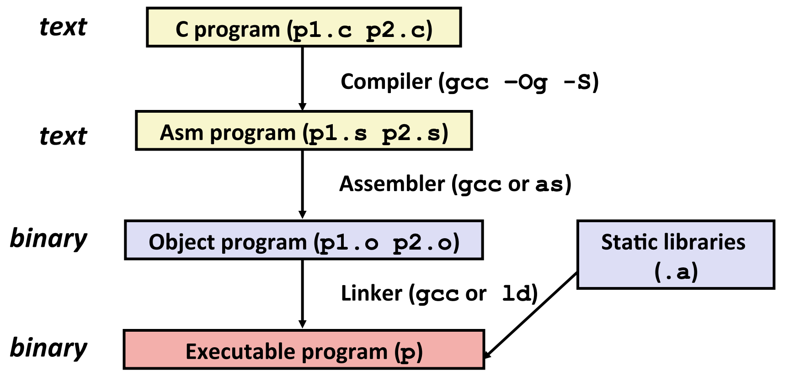


将C代码转换成汇编语言的例子：

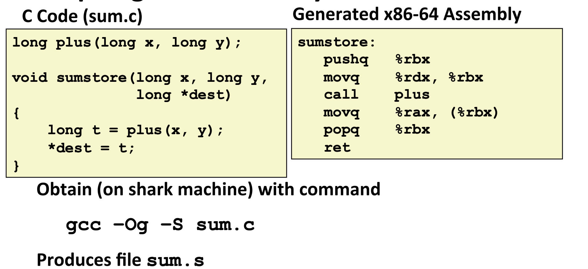
> 注意：由于不同的机器系统平台，则会有不同的编译器版本，相对应编译出的二进制可执行文件。

#### 2.3.2 汇编特点：数据类型
- 1、2、4、8字节的整型数据
    - 数值
    - 地址（无类型指针）
    > ***不进行有符号和无符号类型存储方式的区分***。`地址`或者是`指针`，在计算机中都以`数字形式`存储。

- 4、8、10字节的浮点数
- 代码：字节序列指令连续编码
- 没有类似数组或结构等的聚合类型
    - 只是用内存连续分配字节空间

#### 2.3.3 汇编特点：操作符
主要对内存数据或寄存器执行算术操作。
- 数据在内存和寄存器之间传输。
    > 从内存加载数据到寄存器，存储寄存器数据到内存上。

- 传输控制
    > 无条件跳转或者到到某个流程，常见的例子是条件分支语句。

#### 2.3.4 目标代码
在目标代码中，
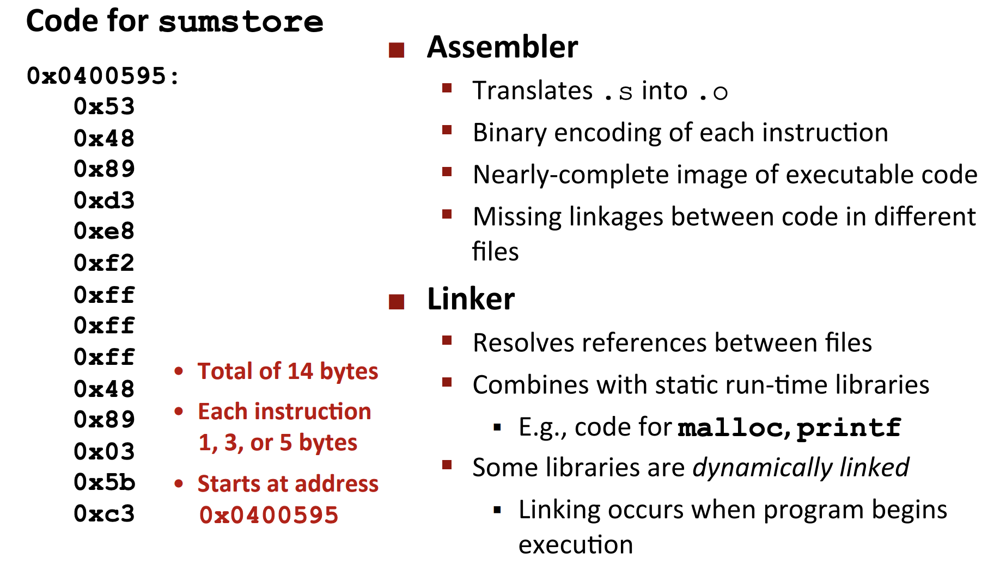

#### 2.3.5 机器指令

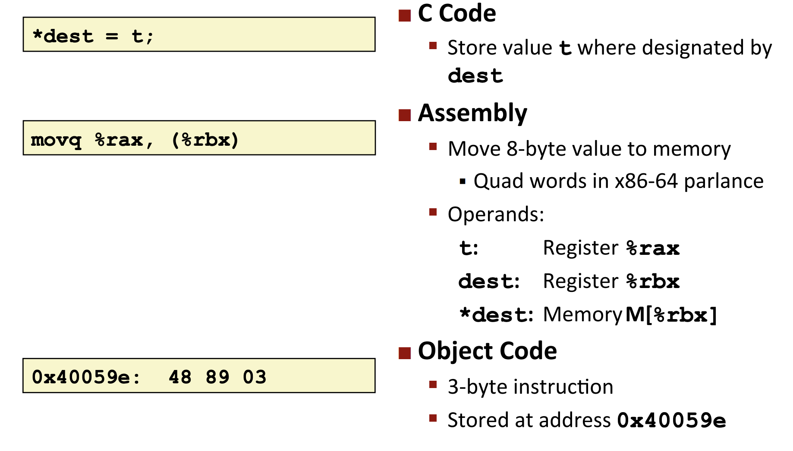

#### 2.3.6 反汇编目标代码
`反汇编` 是一种`回退`的方式。是一种可以用作任何`逆向工程`的工具。

一般在Windows中使用的方式是`objdump` 方式，针对debug是一个不错的工具。

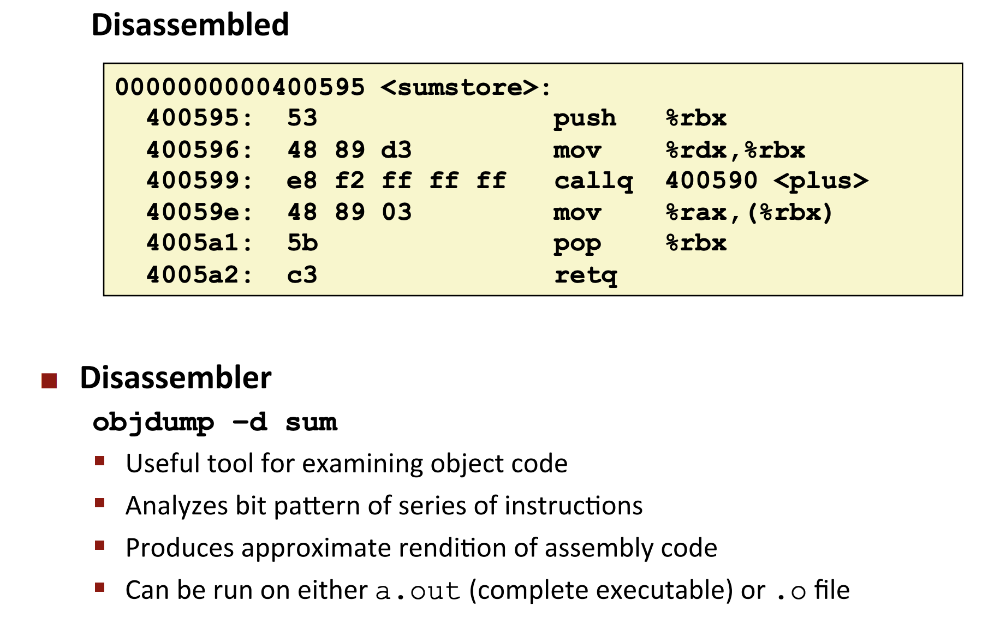

在Linux中使用`GDB`的方式来进行Debug，也是一个不错的debug工具。检查地址为`十六进制格式`的14个字节。

***<u>什么情况可进行反汇编？</u>***

- 任何可解释为可执行文件的代码。
- 反汇编检查字节并重构汇编源代码。

反汇编注意点：
- x86-64的指令长度从`1到15个字节不等`。常用的指令以及操作数较少的指令所需的字节数少，而那些不太常用或操作数较多的指令所需字节数较多

- 设计指令格式的方式是，从某个给定位置开始，可以将字节唯一地解码成机器指令。

- 反汇编器只是基于`机器代码`文件中的`字节序列`来确定`汇编代码`。不需要访问该程序的源代码或汇编代码。

- `反汇编器`使用的`指令命名规则`与`GCC`生成的`汇编代码`使用的有些细微的差别。

#### 2.3.7 汇编格式的说明
- 所有以 `“.”` 开头的行都是指导`汇编器`和`连接器`工作的伪指令。一般可忽略。
-  没有关于指令的用途以及源代码之间关系的解释说明。

#### 2.3.8 数据格式
Intel用术语 `字（word）` 表示16位数据类型。因此，称32位数为双字，称64位数为四字。

C语言数据类型在x86/64中的大小如下：

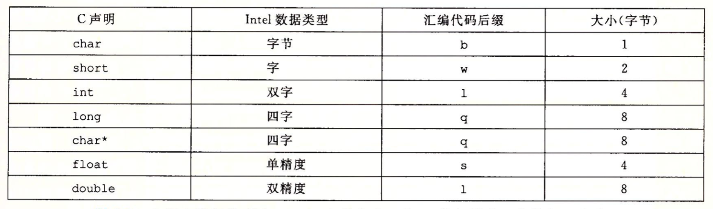

浮点数的两种形式：`单精度（4字节）值（C语言中的数据类型float）` 和 `双精度（8字节）值（C语言中的数据类型double）`。

⚠️注意：汇编代码也会使用后缀 “l” 来表示4字节整数和8字节双精度浮点数。

## 3. 访问信息

### 3.1 整数寄存器
一个 x86/64 的中央处理单元（CPU）包含一组16个存储64位值的通用目的寄存器。这些寄存器用来存储整数数据和指针。

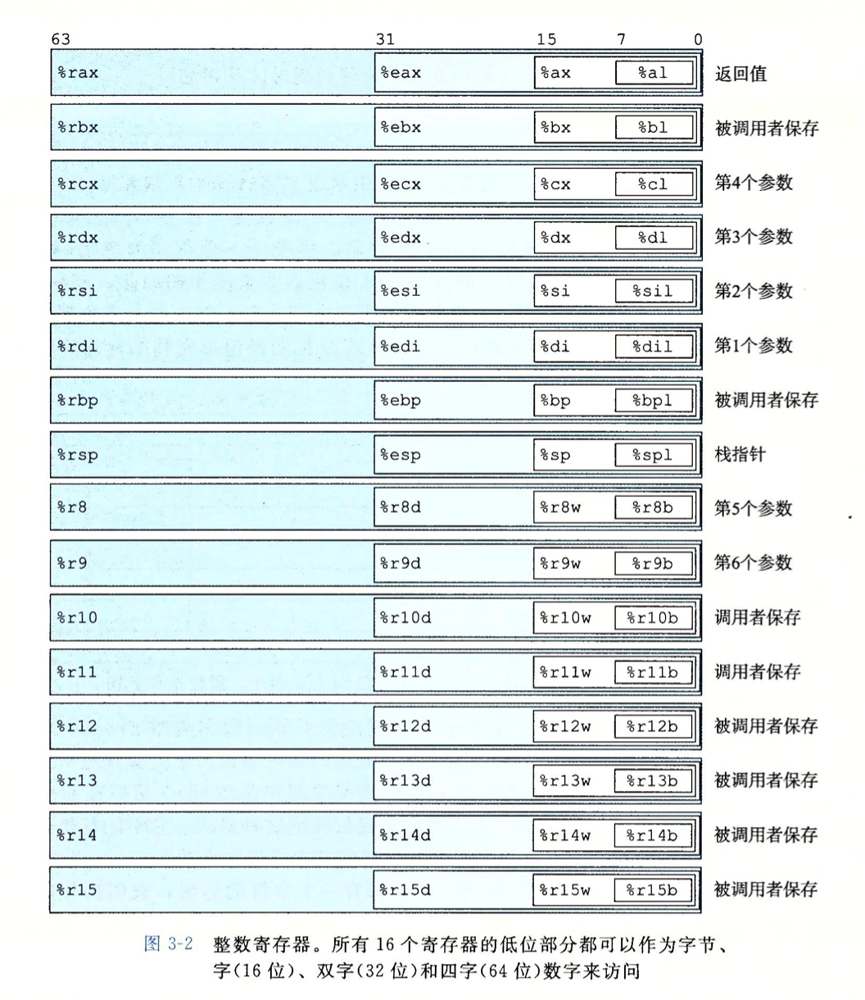

### 3.2 操作数指示符
一般操作数分为3种数据类型：
- `立即数`：用来表示`常数值`。书写格式：在 `$` 后面跟一个C表示的整数。比如，$0x1f 。不同的指令允许的立即数值范围不同，汇编器会自动选择最紧凑的方式进行数值编码。
- `寄存器`：表示`某个寄存器的内容`。16个寄存器的低位1字节、2字节、4字节或8字节中的一个作为操作数，这些字节数分别对应于8位、16位、32位或64位。
- `存储器（内存引用）`：根据计算出来的`地址（通常称为有效地址）访问某个内存位置`。寄存器给定地址处的8个连续字节的内存。

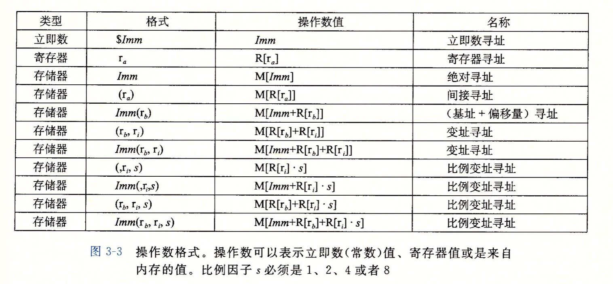

### 3.3 数据传送指令
频繁使用的指令：将数据从一个位置复制到另一个位置的指令。

MOV类由四条指令组成：`movb（1字节）`、`movw（2字节）`、`movl（4字节）` 和 `movq（8字节）`。
> 不同的后缀代表操作的数据大小不同。


指令的格式：
```
指令 源操作数 目的操作数
```
> -  `源操作数`：指定的值是一个`立即数`，存储在`寄存器或者内存`中。
> -  `目的操作数`：指定一个`位置`，是一个`寄存器`或者`内存地址`。
> - `cltq`指令没有操作数。

```
movl $0x4050,%eax         Immediate--Register,  4 bytes
movw %bp,%sp              Register--Register,   2 bytes
movb (%rdi. %rcx),%al     Memory--Register      1 bytes
movb $-17,(%rsp)          Immediate--Memory     1 bytes
movq %rax,-12(%rpb)       Register--Memory,     8 bytes
```

***不能用单条指令进行内存与内存之间传输***。
> 将一个值从一个内存位置复制到另一个内存位置需要两条指令（第一条指令将源值加载到寄存器中，第二条将寄存器值写入目的位置）。

MOVQ操作数的组合情况

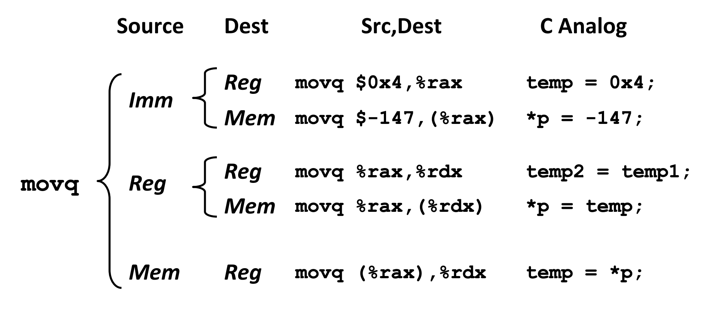

小Tips：访问寄存器比访问内存要快得多。

### 3.4 压入和弹出栈数据
栈：一种`数据结构`，可添加或删除值，要遵循`“后进先出”`的原则。

栈的细节内容 👉 👉 👉 「[数据结构与算法 栈]()」

汇编语言中的指令如下：

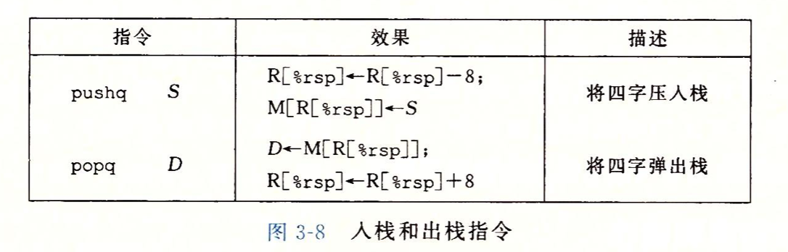

`pushq指令`的功能是把数据压入到栈上。`pushq %rbp`等价于以下两条指令：

```
subq $8,%rsp             Decrement stack pointer
movq %rbp,(%rsp)         Store %rbp on stack
```

`popq指令`是弹出数据。`popq %rax`等价于下面两条指令：

```
mova (%rsp), %rax        Read %rax from stack 
addq $8,%rsp             Increment stack pointer
```

由于`栈和程序代码以及其他形式的程序数据`都放在同一内存中，所以程序可以用`标准的寻址方法`访问栈内的`任意位置`。

### 3.5 内存寻址模式

#### 3.5.1 简单内存寻址模式

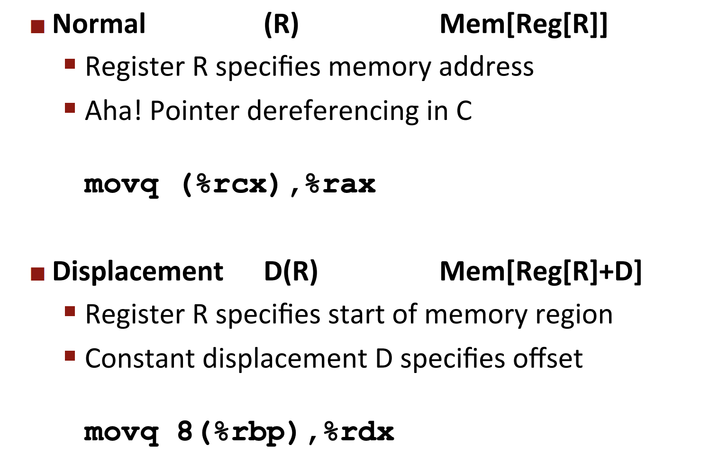

#### 3.5.2 完整内存寻址模式

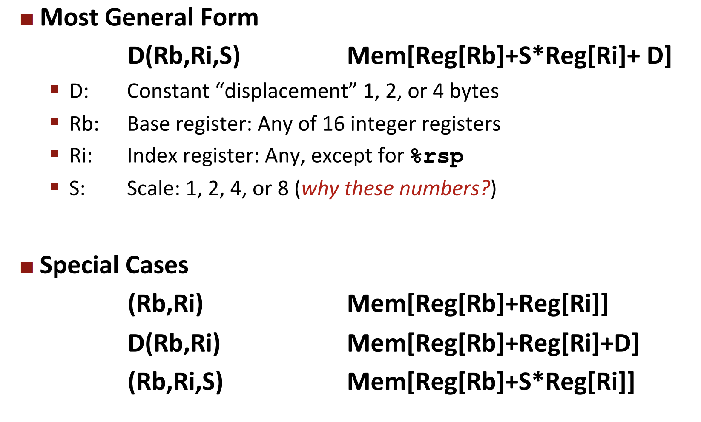

## 4. 算术和逻辑操作
X86/64中的一些整数和逻辑操作大致被分为四组：
- `加载有效地址`
- `一元操作`
- `二元操作`
- `移位`

### 4.1 加载有效地址
`加载有效地址（load effective address）`指令leaq指令实际上是movq指令的变形。

指令形式：从内存读取数据到寄存器。实际上未引用内存。

很大程度上， `leaq指令` 是利用C的 `&操作符`来计算地址。因便捷算术运算方式而C编译器喜欢使用。

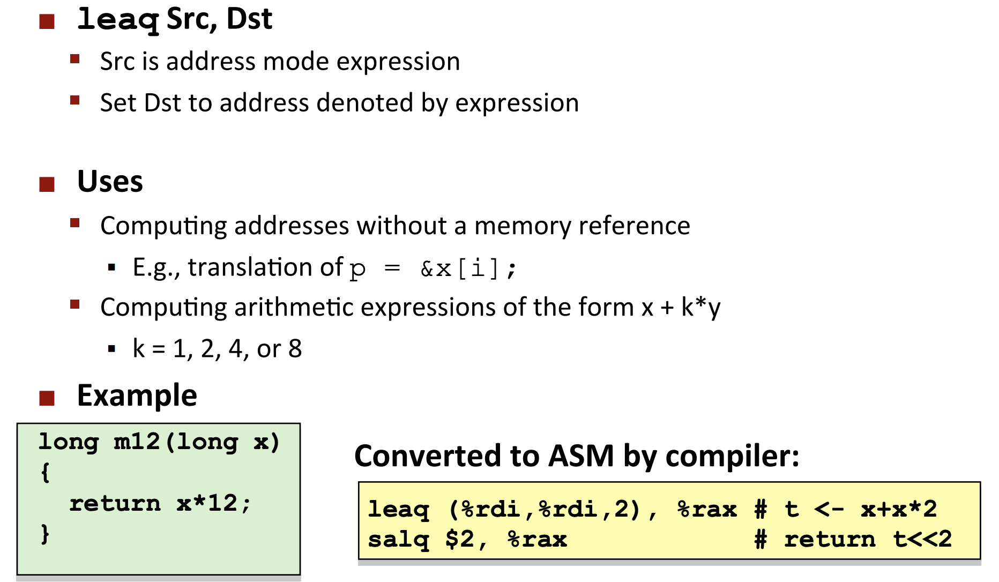

**leaq指令与有效地址计算无关。目的操作数必须是一个寄存器**。

### 4.2 一元和二元操作
`一元操作`只有一个`操作数（同源同目的）`，`操作数`既可是`寄存器`，也可使`内存位置`。
> C语言中的`自增（++）`和`自减（--）`运算。

```
incq    Dest    Dest =Dest + 1
decq    Dest    Dest =Dest - 1
negq    Dest    Dest = - Dest
notq    Dest    Dest = ~ Dest
```

`二元操作`中的第二个操作数是`同源同目的`。主要指令如下：
> C语言中的赋值运算。

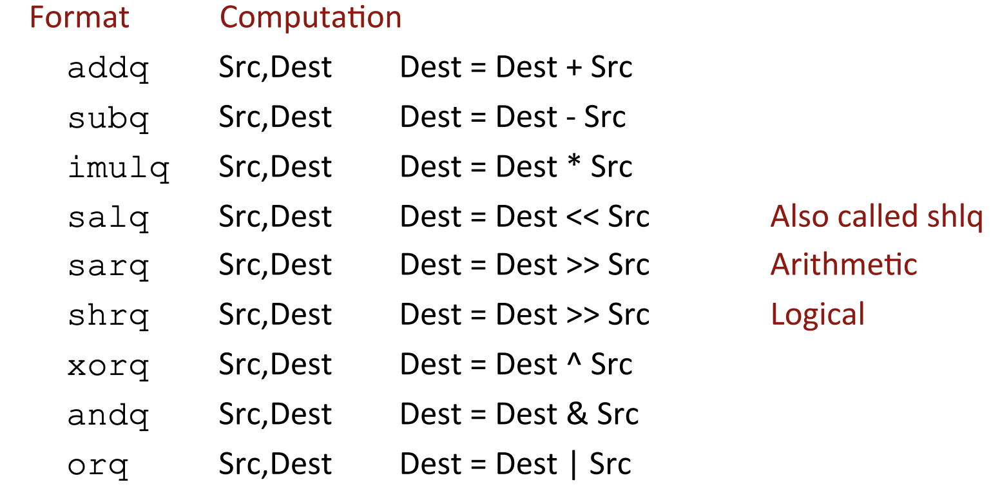

说明：
- `移位操作`：先给出`移位量（立即数）`，第二项给出`要移位的数`。
- `左移指令`：`SAL`和`SHL`，两个效果一样（都是右边填充0）。
- 右移指令
    - `SAR`：执行`算术移位`（填上`符号位`）
    - `SHR`：执行`逻辑移位`（填上`0`）

### 4.3 例子

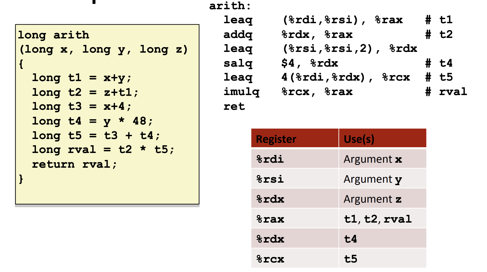

## 5. 控制
直线代码：指令一条接着一条顺序地执行。

控制语句的汇编实现
- 条件语句：条件码、条件分支和条件移动
- while、do-while、for循环
- switch语句：jump stable

### 5.1 条件码
`条件码`：描述了最近的算术或逻辑操作的属性。可以检测这些寄存器来执行条件分支指令。

常用的条件码：
- `CF`：进位标志。最近的操作使最高位产生了进位。可用来检查`无符号`操作的溢出。
- `ZF`：零标志。最近的操作得出的结果为0。
- `SF`：符号标志。运算结果`最高有效位为1`（说明结果为负值），SF会置为1。
- `OF`：溢出标志。`有符号数`运算溢出的位 ---- 正溢出或负溢出。

#### 5.1.1 隐式设置
算术操作的一些隐式设置

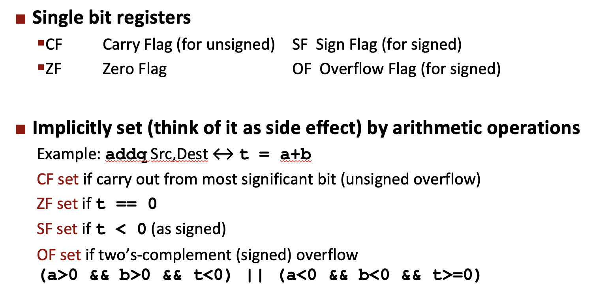

`leaq指令`不会改变任何条件码，只是用来进行`地址计算`。

#### 5.1.2 显式设置（两种：`CMP指令`和`TEST指令`）
对于CMP指令来说，只设置条件码而不更新目的寄存器外，CMP和SUB行为一致。

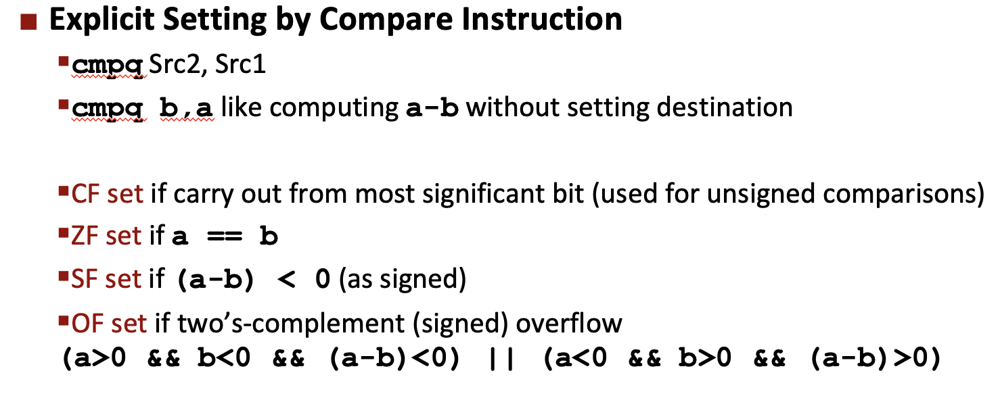

`TEST指令`与 `AND指令`一样，只设置条件码而不改变目的寄存器的值。
> 检查两个操作数一样。

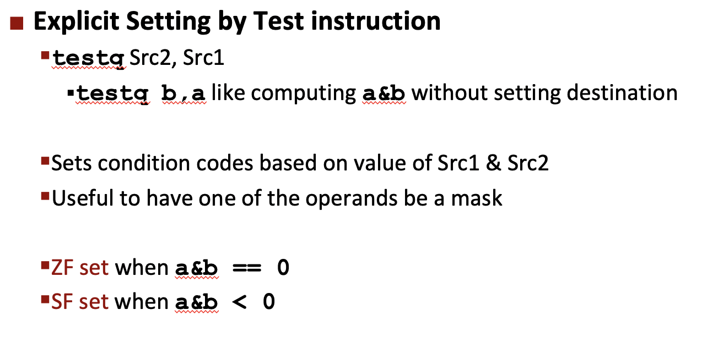

`TEST指令`的唯一目的：`设置条件标志`。

### 5.2 访问条件码
条件码不会直接读取。常用的3中使用方法：
- 根据条件码的`某种组合`，将一个`低位单字节`设置为0或1。使用`SET指令`。
- 可以条件跳转到程序的某个其他的部分。
- 有条件地传送数据。

### 5.3 `跳转(jmp)指令`

`跳转（jump）指令`会导致执行切换到程序中一个全新的位置。

`跳转的目的地`通常使用一个`标号`指明。

- 直接跳转：跳转目标（`用标号`）是作为`指令的一部分编码`。
- 间接跳转：跳转目标（`*后跟操作数指示符`）是从`寄存器或内存位置中读出`的。

### 5.4 条件分支

#### 5.4.1 `条件控制`方式实现
将条件表达式和语句从C语言翻译成机器代码，常用方式：`有条件` 和 `无条件跳转`。

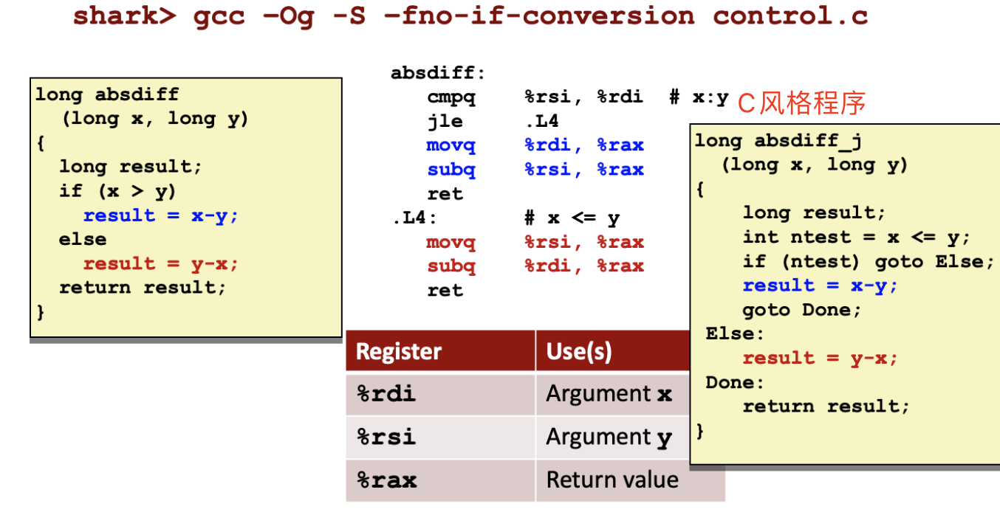

C语言中的if-else语句的通用形式：

```c
if (test_expr) //test_expr是整数表达式（取值为1或非0）
    then-statement
else
    else-statement
```
> 分支语句执行其一。

汇编语言形式如下：

```c
    t = test_expr;
    if (!t)
        goto false;
    then-statement
    goto done;
false:
    else-statement
done:
```
> 汇编器位then-statement和else-statement 产生各自的代码块。会插入条件和无条件分支，从而保证能执行正确的代码块。

#### 5.4.2 `条件传送`方式实现
实现条件操作的传统方法是`通过控制的条件转移`。
> 条件满足则执行，不满足条件时，则另走其它路径。

替代策略是使用`数据的条件转移`。
> 计算一个条件操作的两种结果，然后再根据条件是否满足而选择其一。


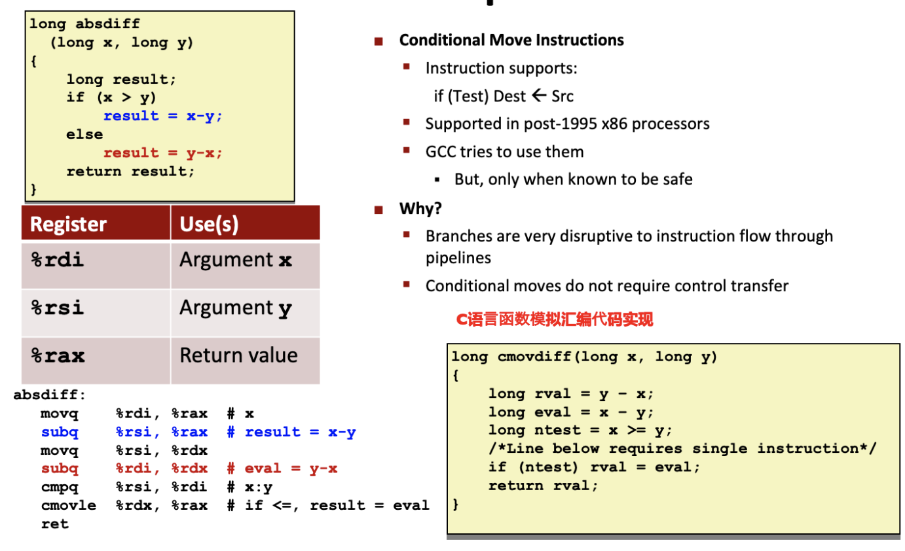


编译出来使用`条件传送的代码`所需的时间是`大约8个时钟周期`。***控制流不依赖数据***，使得处理器更容易保持`流水线`是满的。
> **流水线**：处理器完成一条指令时就开始执行下一条指令的一小部分（`指令连续重叠的步骤`）。

#### 5.4.3 条件传送存在的隐患
条件传送不一定总是会提高代码的效率。

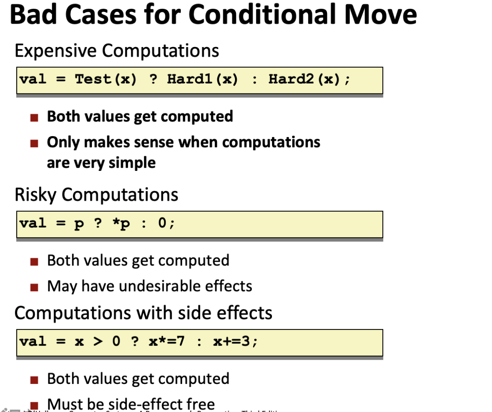

### 5.5 循环
C语言提供的循环结构：
- do-while循环
- while循环
- for循环

汇编中没有相应的指令存在，可以用`条件测试`和`跳转指令`的组合来实现。

#### 5.5.1 do-while循环
至少会执行body一次。当while中的测试为真，则继续执行body。

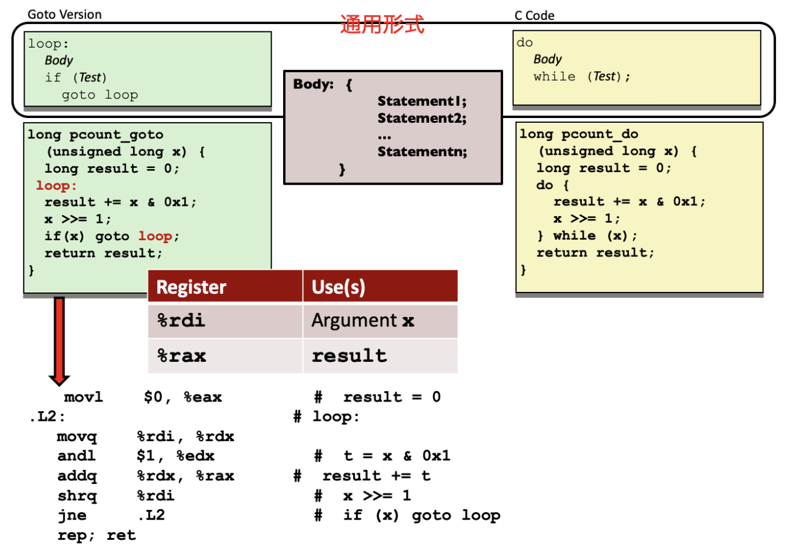


#### 5.5.2 while循环

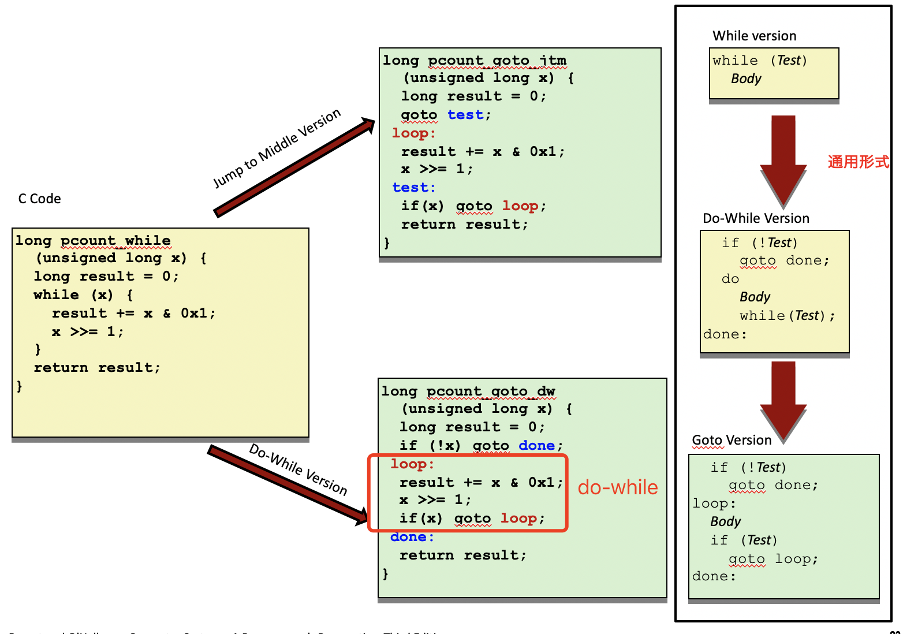

#### 5.5.3 for循环

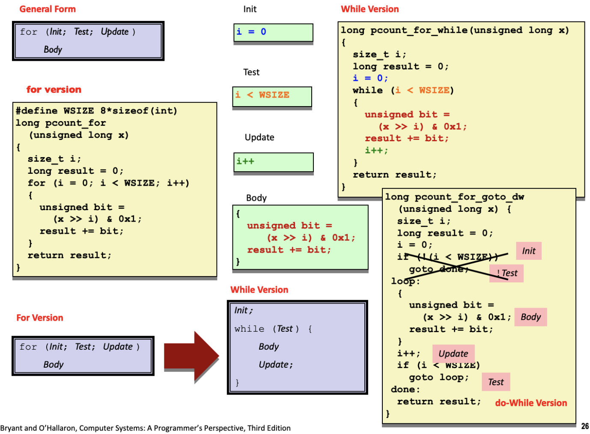


### 5.6 switch语句
`switch（开关）语句`可以根据一个`整数索引值`进行`多重分支`。可提高C代码的可读性。通过使用跳转表（数据结构----数组）的方式让实现更加高效。

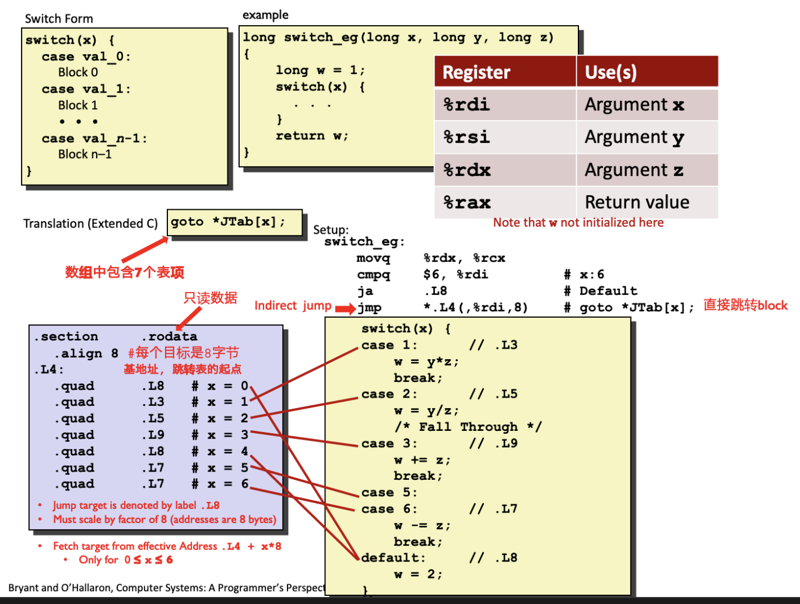

执行switch语句的关键步骤：`通过跳转表来访问代码的位置`。

C代码中，将跳转表声明为一个有7个元素的数组，`每个元素`都是一个`指向代码位置的指针`。

## 6. 过程
过程：软件中的一种抽象。提供封装代码的方法，用一组指定的参数和可选的返回值实现相应的功能。

过程的形式：`函数、方法、子例程、处理函数`等。

过程调用过程的动作中包含的机制：

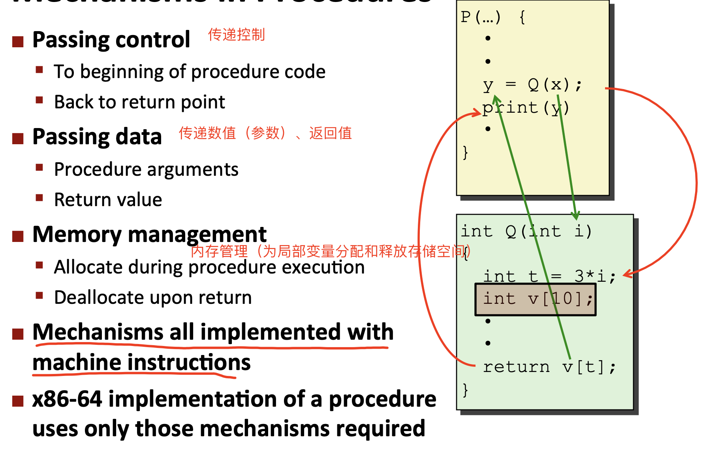

### 6.1 `栈（stack）`结构
栈（stack）：一种数据结构。***内存管理原则：后进先出***。

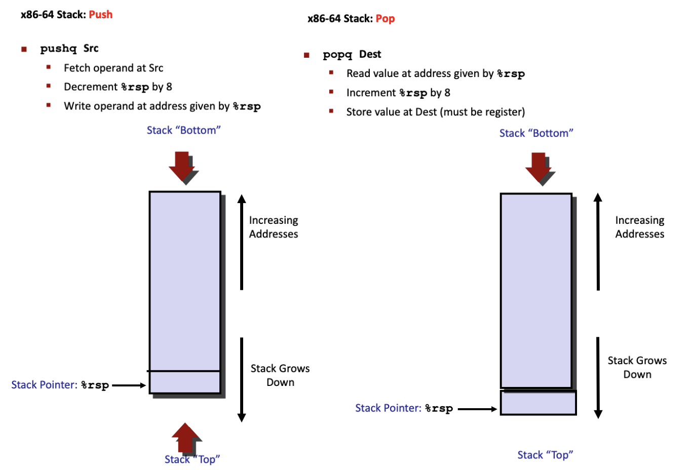

更多相关细节查看 **「[数据结构 ----> 栈]()」**

### 6.2 传递控制

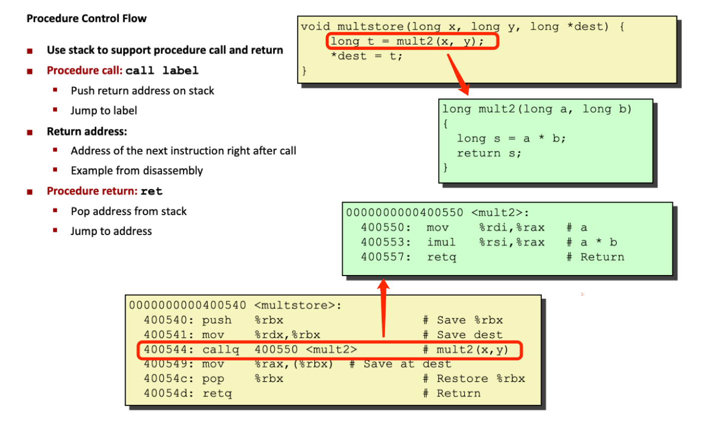

汇编代码中的详细传递过程：

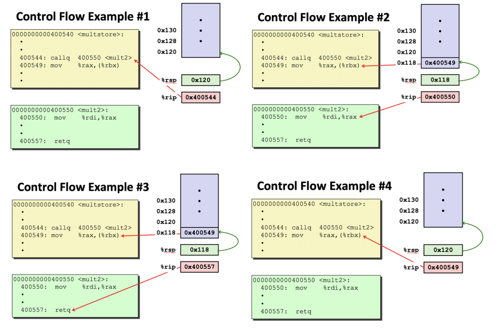

说明：
- call指令有一个目标：指明被调用过程`起始的指令地址`。
- `调用指令`与`jmp指令`跳转一样。包含`直接方式`和`间接方式`。
    - 直接调用：一个`标号`
    - 间接调用： `*` 后面一个`操作数指示符`。
- ret指令返回到此次调用后面的指令。
- `%rip（指令指针）`寄存器，在`IA32`中叫`%eip`。包含当前正在执行指令的地址。

### 6.3 传送数据

x86/64中，可通过寄存器最多传递`6个整型（整数和指针）参数`（不包括浮点数参数），多于6个的参数存放在调用栈上。

寄存器使用的名字取决于要`传递的数据类型的大小`。


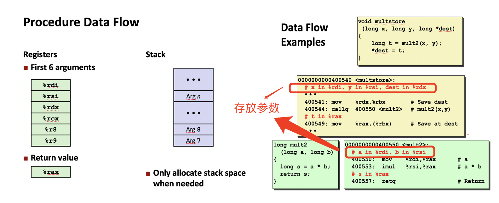

> `%rax寄存器`：存储函数的返回值。

### 6.4 局部数据管理
局部数据有时必须存放在内存中。常见的情况：
- 寄存器不足够存放所有的本地数据。
- 对一个局部变量使用`地址运算符（&）`，则必须能为其产生一个地址。
- 某些局部变量是`数组`或`结构`，则必须通过`数组`或`结构引用`被访问到。

当x86/64过程中需要的存储空间超出寄存器能够存放的大小，则在栈上开辟内存进行分配空间，这部分叫做过程的栈帧（stack Frame）。在运行时栈的通用结构如下：

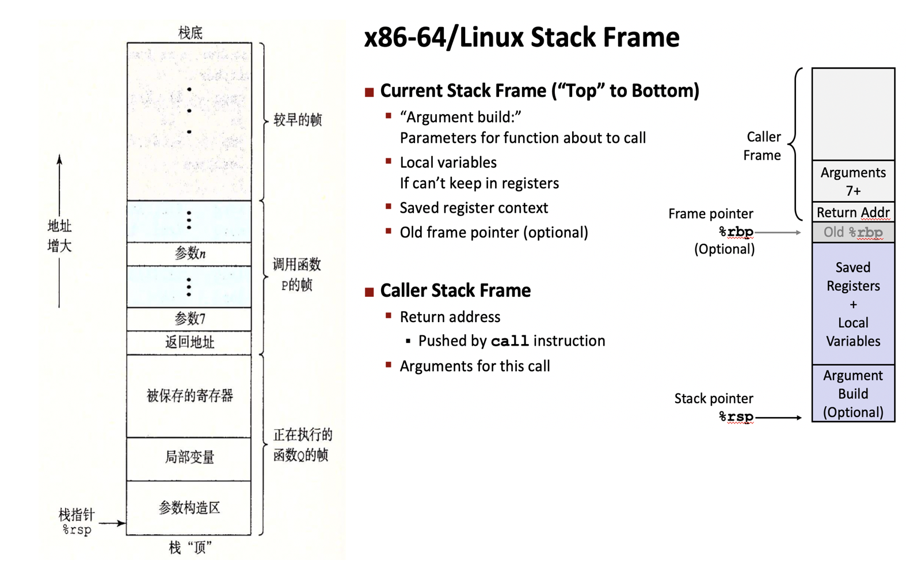

> 栈用来传递`参数、存储返回信息、保存寄存器、局部变量的存储`。

栈的规则
- State for given procedure needed for limited time
    - From when called to when return
- Callee returns before caller does

在栈帧中进行内存分配：声明单个过程实例化。

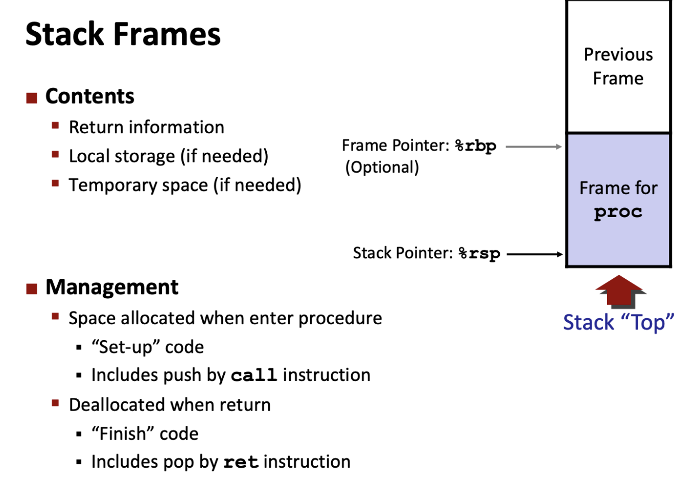

在每次的函数调用（call之后，ret之前），都会产生局部变量（在栈中分配一个帧Frames）。
> ⚠️注意：在过程调用时进行空间分配，在返回结束时进行回收。

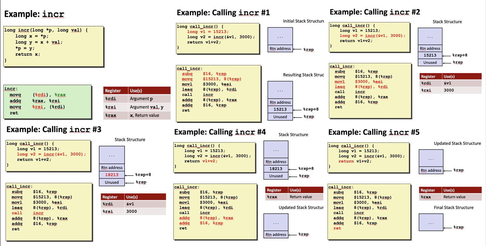


### 6.6 寄存器存储约定
寄存器组是唯一被所有过程共享的资源。

在给定时刻只有一个过程是活动的。但需确保当一个`过程（调用者）`调用另一个`过程（被调用者）`时，***被调用者不会覆盖调用者后续会使用的寄存器值***。

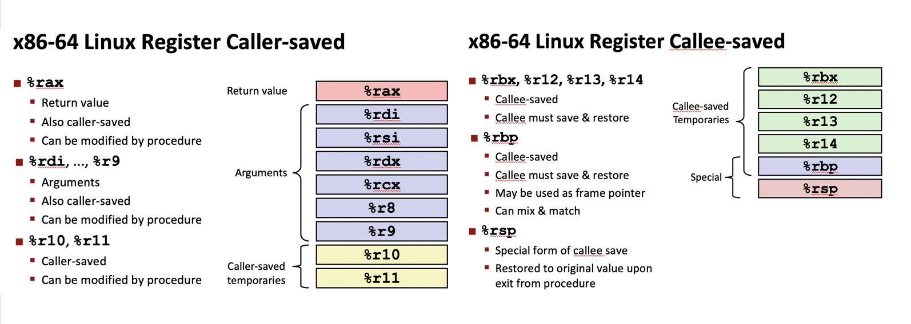

- `Caller-saved（调用者保存寄存器）`：调用者在调用前会在其帧中保存临时值。
- `Callee-saved（被调用者保存寄存器）`：callee在使用之前将临时值保存在帧中，被调用者在返回调用者之前恢复它。

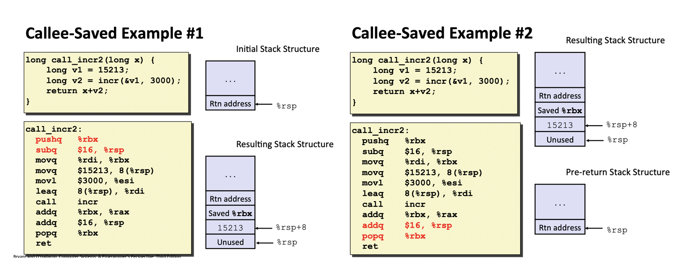

### 6.7 递归过程
特殊的寄存器和栈的惯例使得x86/64过程能够递归地调用使用自身。
> 每一次的调用在栈中都有自己的私有空间。

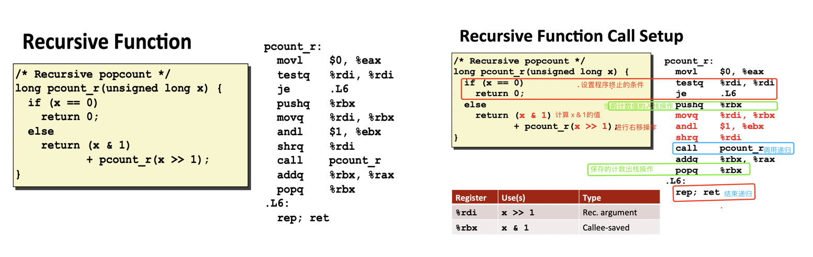

**关于递归的观察总结**：

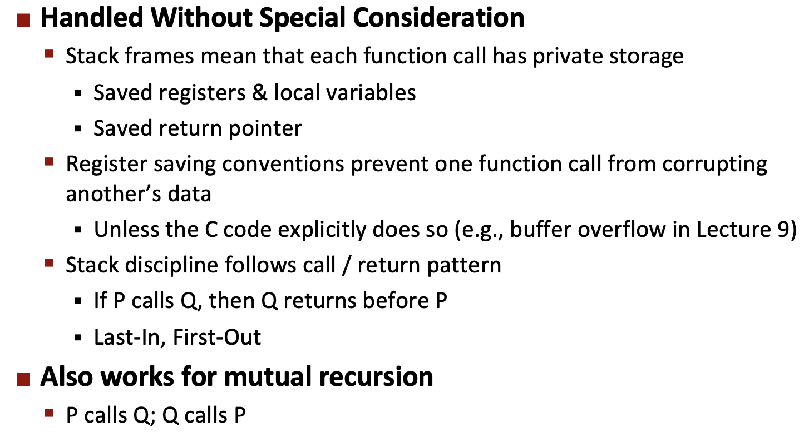

### 6.8 x86/64过程的总结
- 重点
    - 栈使得过程调用/返回准确的数据结构。
- 递归（或相互递归）由正常的调用处理机制。
    - 可以安全将值存储在`本地栈帧`和`被调用者保存寄存器`中。
    - 将函数的`参数`放在`栈顶`中
    - `返回值`放在`%rax`中。
- ***指针是值的地址***。
    - 在栈上或全局

## 7. Machine-Level Programming IV: Data

C语言中，***数组是将标量数据聚集成更大数据类型的方式***。

### 7.1 数组
一维数组：

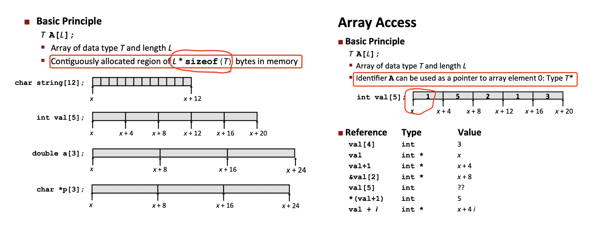

例子分析：


多维数组

### 7.2 数据结构


