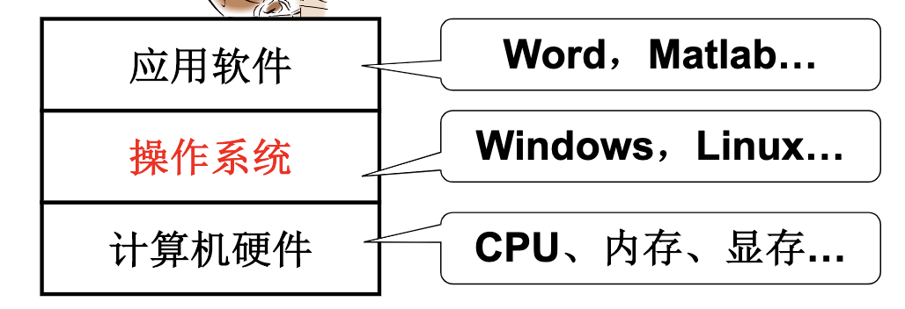
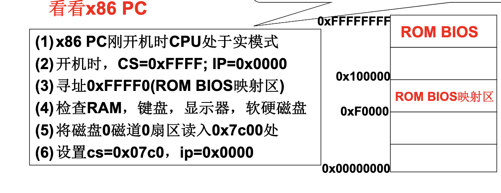

<h1 align="center">📔 HIT OS Chapter01 学习笔记</h1>

## 1. 什么是操作系统？
是计算机硬件和应用之间的一层软件。
- 方便高效使用硬件。

只包含计算机硬件的计算机一般称为`裸机`。



一般情况下，OS管理的硬件有：`CPU管理、内存管理、终端管理、磁盘管理、文件管理、网络管理、电源管理、多核管理`。

## 2. 冯诺依曼存储思想
1946年提出。

存储的主要思想：降程序和数据存放到计算机`内部存储器`中，计算机在程序的控制下一步一步进行处理。

计算机由5大部件组成：`输入设备、输出设备、存储器、运算器、控制器`。

## 3. 计算机开机过程中发生什么？
在计算模型中，主要关注 `指针IP` 及其指向的内容。
- 计算机打开电源时，IP= ？
- 由硬件设计者来决定。

在X86/64位 PC机时发生的内容如下：



> - `实模式`和`保护模式`对应，实模式的寻址CS:IP（CS左移4位+IP），和保护模式不一样。
> - cs 为代码段寄存器，IP为指令指针寄存器（偏移）。
> - 固化在ROM里的叫做BIOS（Basic input output system，基本输入输出系统）
> - (4) 主要检查外围设备是否可用。
> - (5) 读入1个扇区，即512个字节的内容。0磁道0扇区叫OS的引导扇区。

## 4. 引导扇区
引导扇区就是从磁盘引导扇区读入的那512个字节。
- 引导扇区就是 ***`启动设备的第一个扇区`***。
    - 开机时按住Del键可进入启动设备设置界面，可以设置光盘启动。
- 启动设备信息被设置在CMOS中。
    - CMOS：互补金属氧化物半导体（64-128B）。用来存储实时时钟和硬件配置信息。

> 硬盘的第一个扇区上存放着开机后执行的第一段可以控制的程序。

### 引导扇区代码：bootsect.s
引导扇区的代码是`汇编语言`。使用汇编而不是使用C语言的原因：避免C语言转换成汇编和机器语言时，因为内存地址而导致不可预知的问题。

```c
BOOTSEG = 0x07c0
INITSEG = 0x9000
SETUPSEG = 0x9020
```

```C
.globl begtext,begdata,begbss,endtext,enddata,endbss
.text //文本段
begtext:
.data //数据段
begdata:
.bss //未初始化数据段
begbss:
entry start //关键字entry告诉链接器“程序入口”
start:
    mov ax, #BOOTSEG mov ds, ax
    mov ax, #INITSEG mov es, ax
    mov cx, #256
    sub si, si sub di,di
    rep movw
    jmpi go, INITSEG
```
> `.text` 等是 `伪操作符`，告诉编译器产生 `文本段`，.text用于标识文本段的开始位置。此处的.text、.data、.bss这3个段重叠，不分段。

`通用寄存器`又叫`数据寄存器`，用于存放数据。主要是四个寄存器：`ax、bx、cx、dx`。

```C
go: mov ax,cs //cs=0x9000
mov ds,ax mov es,ax mov ss,ax mov sp,#0xff00
load_setup: //载入setup模块
mov dx,#0x0000 mov cx,#0x0002 mov bx,#0x0200
mov ax,#0x0200+SETUPLEN int 0x13 //BIOS中断
jnc ok_load_setup
mov dx,#0x0000
mov ax,#0x0000 //复位
int 0x13
j load_setup //重读
```


