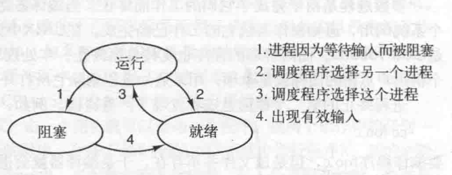
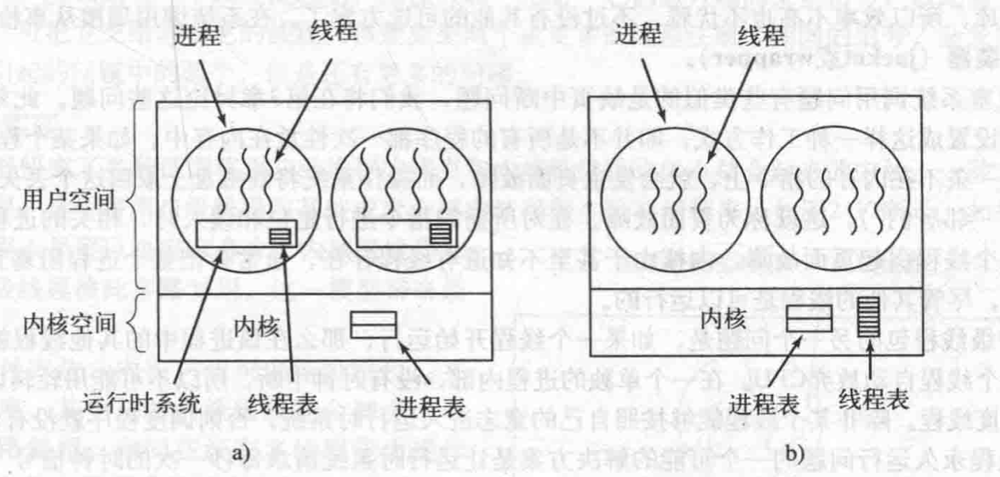
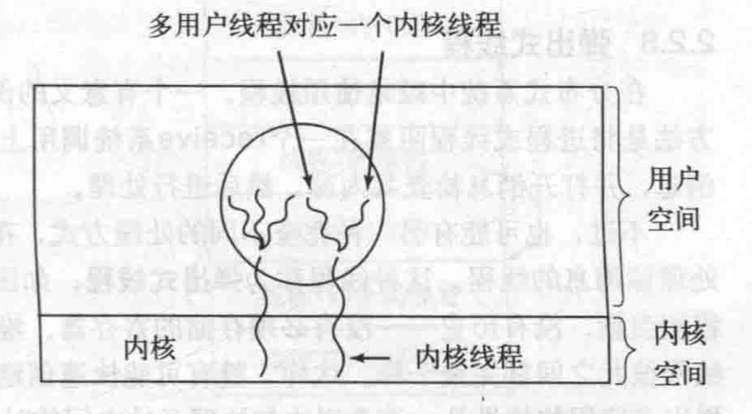

<h1><center> 第 2 章 进程与线程 学习笔记</center></h1>

👉 「[习题自解](./习题自解.md)」

## 1. 进程
### 1.1 进程概念
**程序**：为了完成特定功能的一系列`指令的有序集合`。
**进程（Process）**：一个具有一定独立功能的程序在数据集合上的一次动态执行过程。包括：**程序计数器、寄存器和变量的当前值**。

**伪并行**：在多道程序设计系统中，CPU中一个进程快速切换到另一个进程，使得进程各自运行几十或几百毫秒。在某个瞬间，CPU只能运行一个进程，但在1秒内，可能运行多个进程，并出现伪并行的错觉。

进程使得一个CPU变换成多个虚拟的CPU，让每个进程都有自己的虚拟CPU，实际上真正的CPU在进程之间来回切换。所以每个进程的执行及其运算速度是不确定的。当同一进程再次运行时，其运算速度通常不可再现。

一个进程是某种类型的活动，有`程序、输入、输出及状态`。

注意：一个程序运行两次则算作两个进程。

### 1.2 进程创建
#### 1.2.1 导致进程创建的主要事件
- 系统初始化
- 正在运行的程序执行了创建进程的系统调用
- 用户请求创建一个新进程
- 一个批处理作业的初始化
#### 1.2.2 进程分类
进程可分为**前台进程**和**后台进程（守护进程）**：
- **前台进程**:用户交互并完成指定指令工作的进程。
- **后台进程**:特殊功能指令的进程。
对于后台进程而言，在Linux（Unix）中可以使用`ps` 来查看，在Windows中使用`任务管理器`。
#### 1.2.3 linux中创建进程
在Linux和unix中，只有一个系统调用`fork()`来创建新进程。系统调用会创建一个与调用进程相同的副本。`调用fork`后，*`父进程和子进程拥有相同的内存映像`*，同样的环境字符串和同样打开文件。

通常子进程继续执行`execvue`或类似的系统调用，以修改其内存映像并允许一个新的程序。

#### 1.2.4 Windows中创建进程
在Windows中，大约有100个其他的函数用于处理进程的管理、同步及相关的失误。例如：
CreateProcess既可以处理进程的创建，也负责吧正确的程序装入新的进程。
 
### 1.3. 进程终止

进程终止引起的条件

- 正常退出（自愿）。
- 出错退出（自愿）。
- 严重错误（非自愿）。
- 被其他进程杀死（非自愿）。

### 1.4. 进程的状态

对于进程来说，都是独立实体，有其自己的程序计数器和内部状态。

进程之间相互作用，一个进程输出结果可以作为另一个进程的输入。

进程的三个状态：



- 运行态（此时进程实际占用CPU）
- 就绪态（可运行，但因其他进程正在运行而暂时停止——> 暂无CPU分配）
- 阻塞态（非外部事件，一般进程不能运行——>CPU空闲也不可运行）

### 1.5. 进程的实现

**进程表（Process table）**：OS维护着一张表格（一个结构数组）。

每个进程占用一个进程表项（也叫**进程控制块**）。具体包含的信息如下：

- 程序计数器、堆栈指针、内存分配状况、所打开文件的状态、账号和调度信息以及进程由运行态转换到就绪态或阻塞态时必须保存的信息。

**中断向量（interrupt vector）**：靠近内存底部的固定区域。包含中断服务程序的入口地址。

#### 1.5.1 中断发生后OS最底层的工作步骤

- 硬件压入堆栈程序计数器等。

- 硬件从中断向量装入新的程序计数器。

- 汇编语言过程保存寄存器值。

- 汇编语言过程设置新的堆栈。

- C中断服务例程运行（典型读入和缓冲输入）

- 调度程序决定下一个运行的进程。

- C过程返回至汇编代码。

- 汇编语言过程开始运行新的当前进程。

一个进程在执行过程中可能被中断数千次，且每次中断后，被中断的进程都返回到与中断发生前完全相同的状态。

##  2. 线程

### 2.1. 线程概述

线程是轻量级的进程。

进程拥有一个执行的线程，线程包含信息如下：

- **程序计数器**：记录接下来要执行哪一条指令。
- **寄存器**：保存线程当前的工作变量。
- **堆栈**：记录执行历史，其中。

**有限状态机（finite-state machine）**：每个计算都有一个被保存的状态，存在一个会发生且使得相关状态发生改变的事件集合。

**多线程**：描述在同一个进程中允许多个线程的情况。

### 2.2. 需要多线程的原因

-  并行实体（线程）拥有 `共享` 同一个地址空间和所有的可用数据的能力。
- 线程比进程更快创建或撤销。
- 如果在大量的计算和I/O处理，拥有多个线程可加快应用程序执行的速度。

### 2.3. 多线程的一种解决方案

主要通过三个构造的方式进行：

- 输入线程：把数据读入到输入缓冲区中。
- 处理线程：从输入缓冲区中取出数据。
- 处理数据：把结果放到输出到缓冲区中，输出线程把结果写到磁盘上。

### 2.4. 进程和线程的属性

- 进程的属性
  - *地址空间、全局变量、打开文件、子进程、即将发生的定时器、信号与信号处理程序、账户信息*。
- 线程的属性
  - *程序计数器、寄存器、堆栈、状态*。

### 2.5. 线程实现的思想

共享一组资源的多个线程的执行能力，以便于线程为完成某一任务而共同工作。

线程可以处于若干种状态的任何一个：`运行、阻塞、就绪或终止`。*线程状态之间的转换和进程状态之间的转换一致*。

### 1.5. 线程需要堆栈的原因

在栈帧种存放相应过程的局部变量以及过程调用完成之后使用的返回地址。

## 3. POSIX线程

### 3.1. POSIX线程概述

IEEE标准1003.1c定义了线程的标准，可提供实现可移植性强的线程程序。

定义的线程包叫做 `pthread`。大部分UNIX系统支持该标准。

所有Pthread线程都有某些特性。

每一个都含有一个**标识符**、**一组寄存器（包括程序计数器）**和**一组存储在结构中的属性**。属性包括`堆栈大小`、`调度参数`以及`使用线程需要的其他项目`。

### 3.2. `pthread`中包含的函数调用

|      线程调用函数      | 功能描述                                                     |
| :--------------------: | ------------------------------------------------------------ |
|   `pthread_ctreate`    | `创建`一个新进程，新创建的线程的线程标识符会作为函数值返回。<br />有一点类似fork系统调用。PI D是为了标识在其他调用中引用的线程。 |
|     `pthread_exit`     | `终止`调用的线程并释放它的栈。                               |
|     `pthread_join`     | `等待`一个特定的线程退出                                     |
|    `pthread_yield`     | `释放CPU`来运行另一个线程                                    |
|  `pthread_attr_init`   | `创建并初始化`一个线程的属性结构。通过修改域值来修改属性结构中的初始化值。 |
| `pthread_attr_destroy` | `删除`一个线程的属性结构，释放所占内存。⚠️注意：不会影响调用它的栈，线程会继续存在。 |

## 4. 线程实现

实现线程的两个方式：**内核中** 和 **用户空间**。



当一个线程阻塞时，**内核级线程** 和 **用户级线程** 的区别：

- **内核级线程**：内核根据其选择，可以运行同一个进程中的另一个线程（若有一个就绪进程）或者运行另一个进程中的线程。
- **用户级线程**：运行时系统始终运行自己进程中的线程，直到内核剥夺其CPU（或没有可运行线程）为止。

### 4.1 在内核中实现线程

对于内核支持和管理线程的情况下，不需要运行时系统。

在内核中有用来记录系统中所有线程的线程表，每个进程中没有线程表。

✅优点

- 内核线程需要新的、非阻塞系统调用。

⭕缺点

- 在内核中进行系统调用（创建或撤销线程）的开销较大。一般使用线程回收。

### 4.2. 在用户空间中实现线程

用户空间中实现线程的思想：将整个线程包放在用户空间中，内核对线程包一无所知。`从内核角度叫单线程进程`。

在用户空间管理线程时，每个进程需要有其专用的线程表（thread table），用来跟踪该进程中的线程。

✅优点

- 用户线程包可以不支持线程的OS上实现。
- 不需要陷入内核，不需要上下文切换，也不需要对内存高速缓存进行刷新。使得进程调度快捷。
- 允许每个进程有自己定制的调度算法。
- 用户线程具有较好的可扩展性（）。

⭕缺点

- 如何实现阻塞系统调用。
- 会发生**页面故障问题**：如果一个线程引起页面故障，内核不知线程存在，会把整个进程阻塞知道I/O完成为止。
- 如果一个线程开始运行，则在该进程中的其他线程不能运行，除非第一个线程自动放弃使用CPU。

⬇️示例

```c++
/**
 * Source ：现代操作系统 4rd 书中源码
 * Description : 用户空间中实现线程的例子
 */
#include<stdlib.h>
#include<stdio.h>
#include<pthread.h>

#define NUMBER_OF_THREADS 10

void *print_hello_world(void *tid)
{
    printf("hello world ,this thread is %d \n",tid);
    pthread_exit(NULL);
}

int main(void)
{
    pthread_t threads[NUMBER_OF_THREADS];
    int status,i;

    for(i=0;i<NUMBER_OF_THREADS;i++)
    {
        printf("main here,the thread is %d \n");
        status = pthread_create(&threads[i],NULL,print_hello_world,(void*)i);

        if(status!=0){
            printf("pthread create fail,the error code is %d \n",status);
            exit(-1);
        }
    }
    exit(NULL);
}
```

### 4.3. 混合实现线程

使用内核级线程，将用户级线程与某些或者全部内核线程多路复用。

内核只识别内核级线程，并对其进行调度，其中一些内核级线程会被多个用户级线程多路复用。



✅优点

灵活度比较高。

