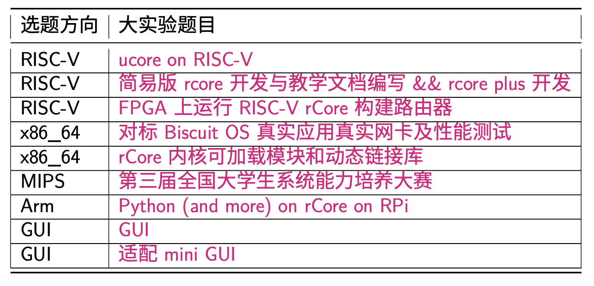
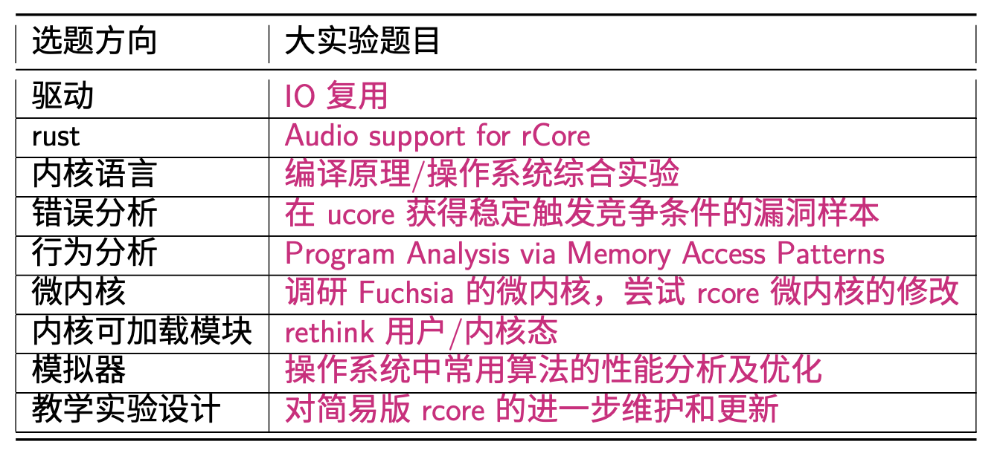

## 实验项目

### Lab1:Bootloader/Interrupt/Debug
启动操作系统的 bootloader，了解操作系统启动前的状态和要做的事，了解运行操作系统的硬件支持，操作系统如何加载到内存中，理解两类中断–“外设中断”，“异常”等。
- 编译运行直接与硬件交互的系统程序 
- 启动 bootloader 的过程
- 实现中断处理机制
- 输出字符的方法
- 调试系统程序的方法

### Lab2:物理内存管理
理解分页模式，了解操作系统如何管理连续空间的物理内存。
- 理解内存地址的转换和保护
- 实现页表的建立和使用方法
- 实现物理内存的管理方法
- 了解常用的减少碎片的方法

### Lab3:虚拟内存管理
了解页表机制和换出(swap)机制，以及中断-“故障中断”、缺页故障处理等，基于页的内存替换算法。
- 理解换页的软硬件协同机制
- 实现虚拟内存的 Page Fault 异常处理
- 实现页替换算法

### Lab4:内核模式线程管理
了解如果利用 CPU 来高效地完成各种工作的设计与实现基础，如何创建相对与用户进程更加简单的内核态线程，如何对内核线程进行动态管理等。
- 建立内核线程的关键信息
- 实现内核线程的管理方法

### Lab5:用户模式进程管理
了解用户态进程创建、执行、切换和结束的动态管理过程，了解在用户态通过系统调用得到内核态的内核服务的过程。
- 建立用户进程的关键信息
- 实现用户进程管理
- 分析进程和内存管理的关系
- 实现系统调用的处理过程

### Lab6:调度
理解操作系统的调度过程和调度算法。
- 熟悉系统调度器框架，以及内置的 Round-Robin 调度算法
- 基于调度器框架实现一个调度器算法

### Lab7:同步互斥
了解进程间如何进行信息交换和共享，并了解同步互斥的具体实现以及对系统性能的影响，研究死锁产生的原因，以及如何避免死锁。
- 熟悉同步互斥的实现机制
- 理解基本的 spinlock、semphpore、condition variable 的实现
- 实现基于各种同步机制的同步问题。

### Lab8:文件系统
了解文件系统的具体实现，与进程管理等的关系，了解缓存对操作系统 IO 访问的性能改进，了解虚拟文件系统(VFS)、buffer cache 和 disk driver 之间的关系。
- 掌握基本的文件系统系统调用的实现方法
- 了解一个基于 inode 方式的 SFS 文件系统的设计与实现
- 了解文件系统抽象层-VFS 的设计与实现

### LabX：大实验
前提:已经完成基本实验

尝试完成一些有一定挑战性且有趣的 OS 实验。
-重新设计 zircon 操作系统
- 在一个 OS(如 Linux) 实现一个 Hypervisor 
- OS 直接支持运行被隔离的应用程序
- 支持动态更新的 OS 
- 驱动程序运行在用户态的 OS 
- 支持标签化 CPU 的 OS 
- 一个可验证正确性的 OS 
- 运行在抽象计算机上可动态调试的 OS
两个选题方向：
#### LabX01

#### LabX02

题目：
- 独立式可执行程序
- 最小化内核
- 中断
- 内存管理
- 内存虚拟化
- 内核线程
- 线程调度
- 进程
- 文件系统
- 同步互斥
