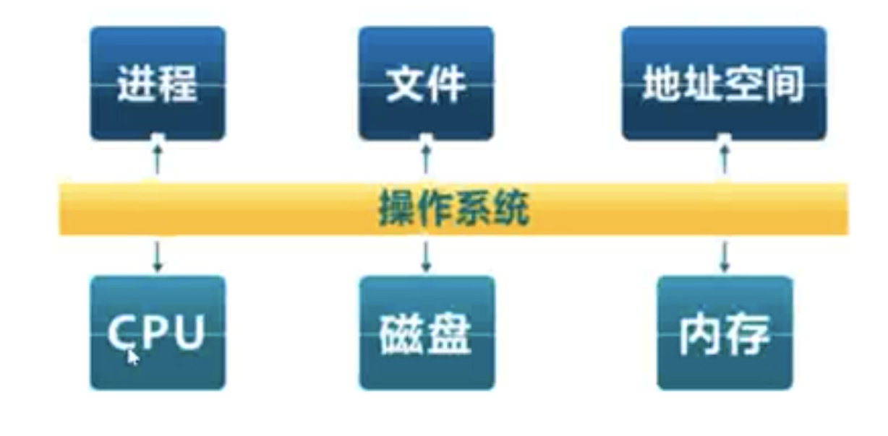
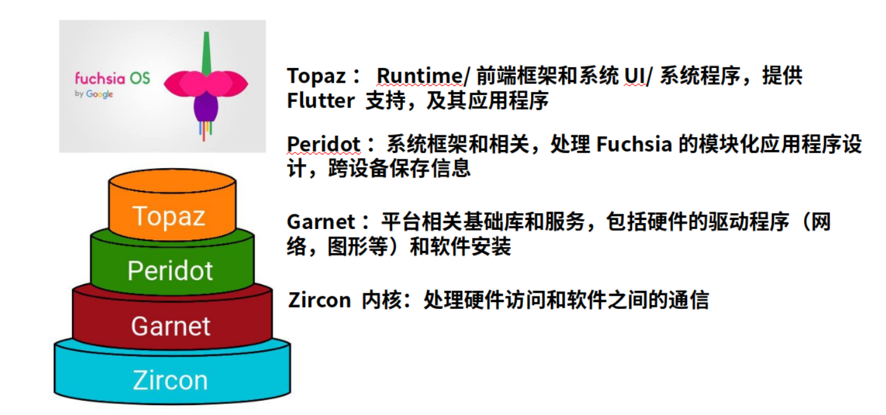
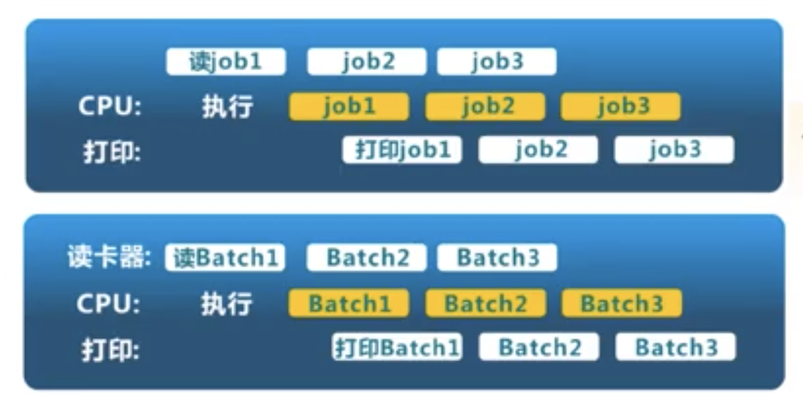
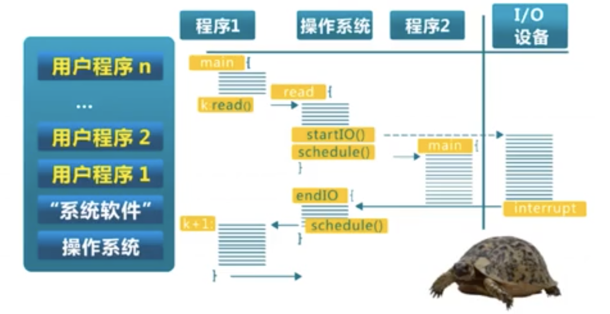
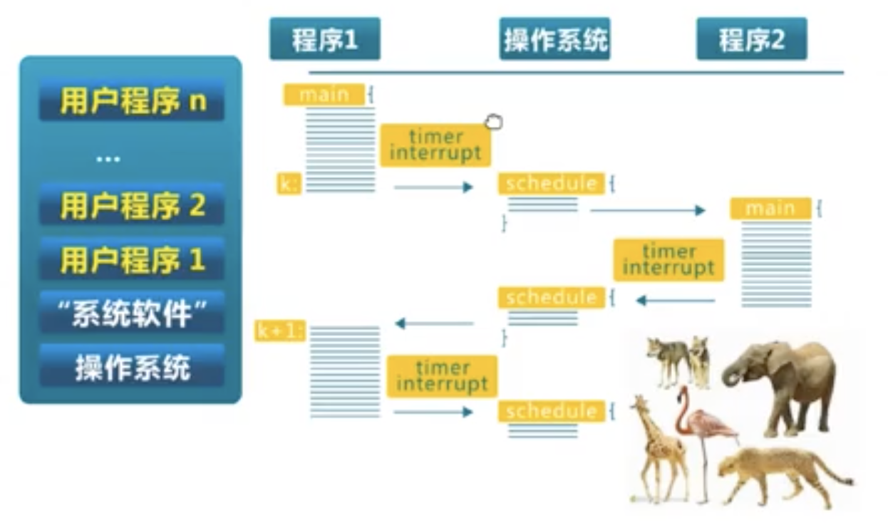
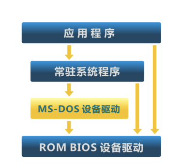
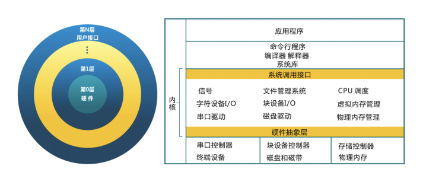
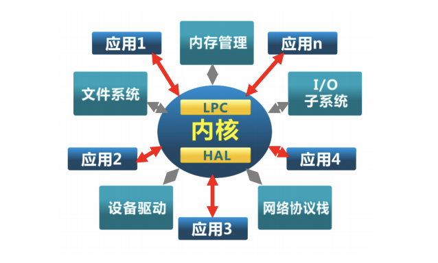
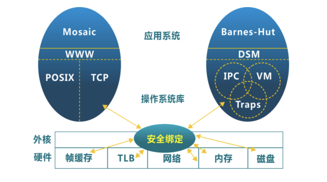
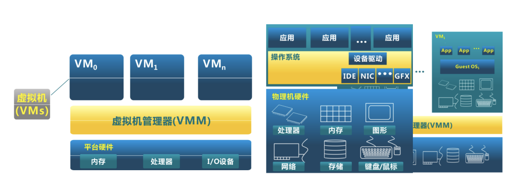

## 第01讲 操作系统概述

### 1.操作系统的定义

目前没有公认的精确定义。

操作系统是管理硬件资源、控制程序运行、改善人机洁面和为应用软件提供支持的一种系统软件。【计算机百科全书】

- OS是一个控制程序
    - 一个系统软件
    - 控制程序执行过程，防止错误。
    - 执行用户程序，给程序提供服务。
    - 方便用户使用计算机系统。
- OS是一个资源管理程序
    - 应用程序与硬件之间的中间层
    - 管理各种软硬件资源
    - 提供访问软硬件资源的高效手段
    - 解决问题冲突，确保公平使用。

### 2. OS软件的分类
- shell --- 命令行接口
- GUI   --- 图形用户接口
- Kernel --- OS的内部

### 3. OS内核抽象和特征

OS的抽象图如下：

OS内核特征
- **并发**：计算机系统中同时存在多个运行程序。
- **共享**：程序间“同时”访问互斥共享各种资源。
- **虚拟**：每个程序“独占”一个完整的计算机。
- **异步**：服务的完成时间不确定、也可能失败。

### 4. OS软件的地位
计算机科学研究的基石之一。
- 计算机系统的基本组成部分和核心支撑软件。
- 贯穿程序语言、运行时系统、应用、体系结构
- 联系计算机科学和计算机系统的典范。
- 大量专业工作和OS技术相关。

### 5. OS具有的挑战性
#### 5.1 抓住OS的关键问题
- OS很庞大
    - Windows XP有4500w行
- OS管理并发
    - 并发导致有趣的编程挑战。
- OS代码管理原始硬件
    - CPU、内存、磁盘
    - 时间依赖行为、非法行为、硬件故障。
- OS代码必须是高效、低耗能、安全可靠
    - 要及时给应用提供合理资源。
    - OS出错，意味着机器出错。
    - OS必须比用户程序拥有更高的稳定性。
#### 5.2 学习OS需具备系统思维
- OS并不仅仅是琐碎的调度算法
    - 磁盘调度算法大多已被硬件实现
    - 进程调度是个小话题
- 并发性是OS的一小部分内容
    - 内核里不存在管程和哲学家问题。
    - 内核锁机制需要考虑应用和硬件
- 权衡资源
    - 时间与空间 ---> 性能的可预测性和公平性
- 软硬协同
    - 如何让中断、异常、上下文切换真正有效？
    - TLB是如何工作的？这对页表意味着什么？

### 6. OS实例
#### 6.1 Multics OS
MULTICS（MULTIplexed Information and Computing System）是1964年由MIT、Bell实验室以及美国通用电气公司共同参与研发的，是一套安装在大型主机上多人多任务的OS。

MULTICS以 Compatible Time-Sharing System（CTSS）作为基础，建置在美国通用电力公司的大型机GE-645。目的是连接1000台终端机，支持300位用户同时上线。

此时使用的技术：PL/I、分层文件目录、分时调度、二维虚拟内存。

#### 6.2 UNIX家族

#### 6.3 Linux家族

#### 6.4 Mac OS 家族

#### 6.5 Windows家族

#### 6.6 Android OS

#### 6.7 Fuchsia OS
AIoT OS的代表之一。

### 7. OS的发展历史
#### 7.1 单用户系统（1945 - 1955）
- `手动连线/纸带`传输进行程序输入
- 机器成本远大于人力成本
- OS = `装载器（Loader）`+ `程序库（Libraries）`
- 问题：昂贵组件的利用率低。

#### 7.2 批处理系统（1955 - 1965）
- `磁带/磁盘`传输进行程序输入
- 机器成本大于人力成本
- OS = `装载器（Loader）`+ `程序控制器（Sequencer）`+ `输出处理器（output processor）`
- 问题：相比单用户系统的利用率有所提高。

流程图参考：

#### 7.3 多道程序系统（1955 - 1980）
- 多个程序驻留在内存中
- 多个程序`轮流`使用CPU
- OS = `装载器` + `程序调度` + `内存管理` + `输出管理`
- 优点：利用率进一步得到提高。

流程图参考：

#### 7.4 分时系统（1980 - ）
- 多个程序驻留在内存中
- 多个程序`分时`使用CPU
- OS = `装载器` + `程序调度` + `内存管理` + `中断处理` + ......
- 优点：利用率继续提高。

流程图参考：

#### 7.5 个人电脑（1981 - ）
- 单用户
- CPU的利用率不是主要关注点
- 重点是用户界面和多媒体功能
- OS = `装载器` + `程序调度` + `内存管理` + `中断处理` + ......
- 演变：走向大众、老的服务和功能不存在，安全问题增多。

代表：mac os、iPad os、ios

#### 7.6 分布式系统（1990 - ）
- 分布式`多用户`
- 分布式系统利用率成为关注点
- 重点：`网络/存储/计算`的效率
- OS = `分布式（装载器 + 程序/OS调度 + 内存管理）`
- 演变：走向大众和网络，新的挑战（不可靠/不确定性）

#### 7.7 AIoT系统(2000 - )
- 分布式`多设备`
- 分布式系统利用率/可用性是关注点
- 重点：`网络/存储/计算`的效率
- OS = `分布式（程序/OS调度 + 内存管理 + 安全/更新）`
- 演变：走向设备和网络，新的挑战（不可靠/大数据）

### 8. OS结构

|结构类型|简单结构|单体分层结构|微内核结构|外核结构Exokernel|虚拟机结构VMM|
|:--|:--|:--|:--|:--|:--|
|说明|- MS-DOS：在最小的空间，设计用于提供大部分功能（1981 - 1994） - 没有拆分为模块 - 主要是汇编编写 - 没有安全保护|- 将单体OS（Monolithic OS）划分为多层 - 每层建立在低层之上 - 最底层（level 0）是硬件驱动 - 最高层（level N）是用户界面 - 每一层仅使用更低一层的功能和服务|- 尽可能把内核功能移到用户空间 - 用户模块间的通信使用消息传递 - 好处：灵活/安全 - 缺点：性能|- 让内核分配机器的物理内存资源给多个应用程序，并让每个程序决定如何处理资源。 - 程序能链接到OS库（libOS）实现OS抽象  - 保护与控制分离|- 虚拟机管理器将单独的机器接口转换成很多的虚拟机，每个虚拟机都是一个原始计算机系统的有效副本，并能完成所有的处理器指令|
|结构图||||||
|个人阅读补充||||||

